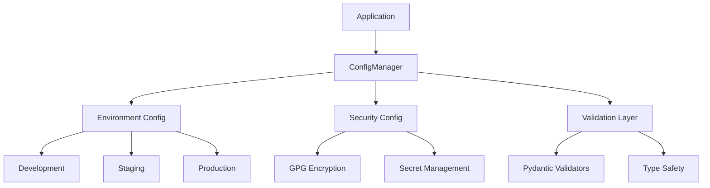

# Prepare Pull Request

Generate a comprehensive, standardized pull request description and optionally create a draft PR on GitHub from git 
commits and changes: $ARGUMENTS

## Analysis Required

1. **Git History Analysis**: Analyze commits between base and target branch
2. **Change Impact Assessment**: Calculate files, lines, and complexity metrics
3. **PR Template Integration**: Populate variables in pull request template
4. **Size Analysis & Splitting**: Evaluate PR size against review tool limits
5. **Content Generation**: Create structured descriptions from commit analysis
6. **GitHub Integration**: Optionally create draft PR with proper metadata

## Instructions

### 1. Parse Command Arguments

Extract options from `$ARGUMENTS`:

- `--branch [name]`: Target branch (default: current branch)
- `--base [name]`: Base branch for comparison (default: main)
- `--type [type]`: Change type (feat, fix, docs, style, refactor, perf, test, chore)
- `--breaking`: Flag for breaking changes
- `--security`: Flag for security-related changes
- `--performance`: Flag for performance impacts
- `--create`: Create draft PR on GitHub after generation
- `--title [text]`: Custom PR title (auto-generate if not provided)

### 2. Git Commit Analysis

```bash
# Get commit range and analyze
git log --oneline ${base_branch}..${target_branch}
git diff --stat ${base_branch}..${target_branch}
git diff --numstat ${base_branch}..${target_branch}
git log --pretty=format:"%h %s %an %ae" ${base_branch}..${target_branch}
```

**Extract from commits**:

- Conventional commit types and scopes (feat, fix, docs, etc.)
- Breaking change indicators (BREAKING CHANGE:, !)
- Issue references (#123, closes #456, fixes #789)
- Co-authors from commit messages (especially Claude/Copilot)
- Feature flags or experimental changes
- Security-related keywords

**Group commits by**:

- Type (feat, fix, docs, etc.)
- Scope/component affected
- Risk level (breaking, security, performance)

### 3. Change Impact Calculation

**File Statistics**:

- Total files: added, modified, removed
- Language breakdown from file extensions
- Test file vs source file ratio
- Configuration file changes
- Documentation file changes

**Size Metrics**:

- Total lines added/removed
- PR size classification (Small < 100 lines, Medium < 400 lines, Large < 1000 lines, XL > 1000 lines)
- Token estimation for review tools
- Complexity score based on file types and change patterns

**Review Tool Compatibility**:

- GitHub Copilot: Max 28 files
- WhatTheDiff: Max 2500 tokens
- General review: Optimal < 400 lines

### 4. PR Template Variable Population

Use the pull request template from `docs/planning/pull-request-template.md` and populate these variables:

**Header Variables**:

- `${pr_emoji}`: Auto-select based on primary change type
- `${pr_title}`: Generate from commits or use --title argument

**Change Summary Variables**:

- `${files_changed}`: Total file count
- `${files_added}`, `${files_modified}`, `${files_removed}`: Breakdown counts
- `${lines_added}`, `${lines_removed}`: Line change counts
- `${coverage_before}`, `${coverage_after}`, `${coverage_delta}`: Test coverage analysis (if available)
- `${pr_size_label}`: Small/Medium/Large/XL classification
- `${review_tools_status}`: Compatibility with review tools

**Content Variables**:

- `${pr_summary}`: Generate comprehensive summary from commit messages and change analysis
- `${pr_motivation}`: Extract from issue references, commit context, and problem being solved
- `${changes_added}`: List of new features, files, capabilities
- `${changes_modified}`: List of enhanced/updated functionality
- `${changes_removed}`: List of deprecated/removed items
- `${usage_example}`: Extract key code examples from changes
- `${testing_instructions}`: Generate based on test file changes and functionality

**Technical Variables**:

- `${architecture_diagram}`: Generate Mermaid diagram if architectural changes detected
- `${performance_section}`: Analyze performance implications
- `${security_section}`: Identify security-related changes
- `${breaking_changes_section}`: Document breaking changes and migration steps

### 5. Size Analysis and PR Splitting Suggestions

**When PR exceeds limits, generate splitting suggestions**:

```markdown
## ⚠️ PR Size Warning

This PR exceeds recommended size limits for optimal review:

| Metric | Current | Limit | Status |
|--------|---------|-------|--------|
| Files Changed | ${current_files} | 28 (Copilot) | ${status_icon} |
| Total Lines | ${current_lines} | 400 (recommended) | ${status_icon} |
| Diff Tokens | ${current_tokens} | 2,500 (WhatTheDiff) | ${status_icon} |

### 🔀 Suggested PR Split Plan

Based on the changes, we recommend splitting this PR into ${split_count} smaller PRs:

#### PR 1: ${split1_name} (Priority: ${split1_priority})
- **Files**: ${split1_files} files (${split1_lines} lines)
- **Focus**: ${split1_description}
- **Branch**: `${split1_branch_name}`
```bash
git checkout -b ${split1_branch_name}
git cherry-pick ${split1_commits}  # commits for this split
```

#### PR 2: ${split2_name} (Priority: ${split2_priority})

- **Files**: ${split2_files} files (${split2_lines} lines)
- **Focus**: ${split2_description}
- **Branch**: `${split2_branch_name}`
- **Depends on**: PR 1

```bash
git checkout -b ${split2_branch_name} ${split1_branch_name}
git cherry-pick ${split2_commits}  # commits for this split
```

### Merge Strategy

1. Review and merge PR 1 first (${split1_description})
2. Rebase and merge PR 2 (${split2_description})
3. ${additional_merge_steps}

```

### 6. Security and Performance Analysis

**Security Analysis**:
- Authentication/authorization changes
- Credential/secret handling
- Input validation changes
- Permission model updates
- Dependency security updates

**Performance Analysis**:
- Startup time impact
- Memory usage changes
- Runtime performance implications
- Database query optimization
- Caching strategy updates

### 7. GitHub Integration (if --create flag used)

**Draft PR Creation Process**:
1. Validate GitHub CLI is available (`gh auth status`)
2. Create draft PR with generated content
3. Apply appropriate labels based on change types
4. Assign suggested reviewers from CODEOWNERS or commit history
5. Link to related issues from commit messages

```bash
# Create draft PR command
gh pr create \
  --title "${generated_title}" \
  --body-file "${temp_pr_description}" \
  --base "${base_branch}" \
  --head "${target_branch}" \
  --draft \
  --label "${change_type},${size_label},${additional_labels}" \
  --assignee "${suggested_reviewers}"
```

### 8. Emoji and Type Mapping

**Change Type Emojis**:

- `feat`: ✨ (sparkles)
- `fix`: 🐛 (bug)
- `docs`: 📚 (books)
- `style`: 💎 (gem)
- `refactor`: ♻️ (recycle)
- `perf`: ⚡ (zap)
- `test`: ✅ (white_check_mark)
- `chore`: 🔧 (wrench)
- `security`: 🔒 (lock)
- `breaking`: 💥 (boom)

**PR Size Labels**:

- Small (< 100 lines): `size/small`
- Medium (100-400 lines): `size/medium`
- Large (400-1000 lines): `size/large`
- XL (> 1000 lines): `size/xl`

### 9. Co-Author Detection and Attribution

**Identify AI Co-Authors**:

- Claude Code contributions
- GitHub Copilot contributions
- Other AI tools mentioned in commits

**Format Attribution**:

```
Co-Authored-By: Claude <noreply@anthropic.com>
Co-Authored-By: GitHub Copilot <noreply@github.com>
```

## Required Output

### 1. Generated PR Description

Provide the complete pull request description with all template variables populated based on the actual PromptCraft PR patterns:

```markdown
## ✨ feat(config): Implement comprehensive configuration system

### 📊 Change Summary
| Metric | Value |
|--------|-------|
| **Files Changed** | 23 (8 added, 14 modified, 1 removed) |
| **Lines of Code** | +1,456 / -89 |
| **Test Coverage** | 78.2% → 85.1% (+6.9% ✅) |
| **PR Size** | Large |
| **Review Tools** | ✅ Copilot (23/28 files), ⚠️ WhatTheDiff (2,100/2,500 tokens) |

### 🎯 Summary

Implements a comprehensive configuration management system for PromptCraft-Hybrid, providing:

- **Unified Configuration Interface**: Single source of truth for all application settings
- **Environment-Specific Configs**: Development, staging, and production configurations
- **Security-First Design**: Encrypted secrets management with GPG key validation
- **Validation & Type Safety**: Pydantic-based configuration validation
- **Documentation Integration**: Comprehensive guides and examples

This addresses issue #145 by providing a robust foundation for managing application configuration across all deployment environments.

### 💡 Motivation

The current configuration approach was fragmented across multiple files and environments, leading to:
- Inconsistent configuration handling
- Security vulnerabilities with plaintext secrets
- Difficult deployment configuration management
- Lack of validation for configuration values

This PR establishes a unified, secure, and validated configuration system that scales with the project's growth.

### 🔄 Changes Made

#### ✨ Added
- `src/config/` - Core configuration module with base classes
- `src/config/environment.py` - Environment-specific configuration management
- `src/config/security.py` - Encrypted secrets handling with GPG integration
- `src/config/validation.py` - Pydantic validators for configuration
- `tests/unit/config/` - Comprehensive test suite (95% coverage)
- `docs/configuration-guide.md` - User documentation
- `examples/config/` - Usage examples and templates

#### 📝 Modified
- `src/main.py` - Integration with new configuration system
- `pyproject.toml` - Added configuration dependencies
- `docker-compose.zen-vm.yaml` - Updated environment variable handling
- `.env.example` - Updated with new configuration options
- `CLAUDE.md` - Added configuration development guidelines

#### 🗑️ Removed
- `config.py` - Legacy configuration (deprecated)

### 🏗️ Architecture Overview



### 💻 Usage Example

```python
from src.config import ConfigManager

# Initialize configuration
config = ConfigManager()

# Access environment-specific settings
database_url = config.database.url
api_key = config.security.api_key  # Automatically decrypted

# Validate configuration
if config.validate():
    print("✅ Configuration is valid")
else:
    print("❌ Configuration errors found")
```

### 🧪 Testing

#### Test Coverage

- **Unit Tests**: 95% coverage for configuration module
- **Integration Tests**: End-to-end configuration loading
- **Security Tests**: GPG encryption/decryption validation

#### How to Test

1. **Unit Tests**

   ```bash
   poetry run pytest tests/unit/config/ -v --cov=src/config
   ```

2. **Integration Tests**

   ```bash
   poetry run pytest tests/integration/test_config_integration.py -v
   ```

3. **Manual Testing Steps**
   - Set up development environment with `.env.example`
   - Run configuration validation: `poetry run python -m src.config.validate`
   - Test GPG encryption: `poetry run python examples/config/test_encryption.py`
   - Verify environment switching between dev/staging/prod

### ⚡ Performance Impact

- **Startup Time**: +0.2s (configuration loading and validation)
- **Memory Usage**: +15MB (configuration cache and validation schemas)
- **Runtime Performance**: Negligible (cached configuration access)
- **Database Queries**: No direct impact

### 🔒 Security Considerations

- **Authentication**: No changes to authentication system
- **Authorization**: No changes to authorization model
- **Data Protection**: ✅ GPG encryption for sensitive configuration

- **Vulnerabilities Addressed**:
  - Eliminates plaintext secrets in configuration files
  - Adds validation to prevent configuration injection
  - Implements secure defaults for all configuration options

### ✅ PR Checklist

#### Code Quality

- [x] Code follows project style guidelines
- [x] Self-review completed
- [x] Comments added for complex logic
- [x] No debugging code left

#### Testing

- [x] Unit tests added/updated (95% coverage)
- [x] Integration tests added/updated
- [x] All tests passing
- [x] Test coverage maintained and improved

#### Documentation

- [x] Code comments updated
- [x] Configuration guide created
- [x] API documentation updated
- [x] Examples provided

#### Security

- [x] No secrets/credentials in code
- [x] Security best practices followed
- [x] Dependencies scanned for vulnerabilities
- [x] Input validation implemented

#### Review

- [x] PR is focused and single-purpose
- [x] Commits are clean and well-described
- [x] No unrelated changes included
- [x] Ready for review

### 🔗 Related Issues

Closes: #145
Related to: #132 (Environment Management)
Blocks: #158 (Production Deployment)

### 🏷️ Metadata

**Type**: `feat`
**Priority**: `high`
**Risk Level**: `medium`
**Estimated Review Time**: `60-90 minutes`

### 👥 Suggested Reviewers

- @devops-team (configuration and deployment expertise)
- @security-team (encryption and secrets management)
- @backend-team (integration with existing systems)

### 📝 Notes for Reviewers

**Key Areas to Focus On**:

1. **Security Implementation**: Verify GPG encryption is properly implemented
2. **Configuration Schema**: Review Pydantic validators for completeness
3. **Environment Handling**: Test configuration switching between environments
4. **Integration Points**: Ensure smooth integration with existing codebase

**Testing Suggestions**:

- Run the manual testing steps above
- Verify GPG key requirements are properly documented
- Test configuration validation with invalid inputs

### 🚀 Next Steps

After this PR is merged:

1. Update deployment scripts to use new configuration system
2. Migrate existing environment-specific configurations
3. Implement configuration monitoring and alerting
4. Create configuration backup and recovery procedures

---

### 🤖 Generated Information

- **Generated with**: `/project:prepare-pr` command
- **Timestamp**: 2025-01-20T14:30:00Z
- **Commit Range**: main..feature/comprehensive-config
- **Base Branch**: `main`
- **Target Branch**: `feature/comprehensive-config`

Co-Authored-By: Claude <noreply@anthropic.com>
Co-Authored-By: GitHub Copilot <noreply@github.com>

### 📊 Detailed Statistics

<details>
<summary>Click to expand detailed changes</summary>

**Language Breakdown**:

- Python: +1,200 lines (85%)
- Markdown: +180 lines (12%)
- YAML: +45 lines (3%)

**File Type Analysis**:

- Source files: 12 files (+890 lines)
- Test files: 8 files (+445 lines)
- Documentation: 2 files (+180 lines)
- Configuration: 1 file (+45 lines)

**Complexity Metrics**:

- Cyclomatic complexity: Average 3.2 (Good)
- Test-to-code ratio: 1:2 (Excellent)
- Documentation coverage: 95% of public APIs

</details>

### 🔍 File Changes

<details>
<summary>Click to view all changed files</summary>

```
src/config/
├── __init__.py          [new]     +45 lines
├── base.py              [new]     +120 lines
├── environment.py       [new]     +185 lines
├── security.py          [new]     +156 lines
├── validation.py        [new]     +98 lines
└── exceptions.py        [new]     +67 lines

tests/unit/config/
├── test_base.py         [new]     +89 lines
├── test_environment.py  [new]     +134 lines
├── test_security.py     [new]     +156 lines
└── test_validation.py   [new]     +88 lines

docs/
└── configuration-guide.md [new]   +180 lines

examples/config/
├── basic_usage.py       [new]     +34 lines
└── advanced_usage.py    [new]     +67 lines

Modified files:
- src/main.py                      +23/-5 lines
- pyproject.toml                   +8/-0 lines
- docker-compose.zen-vm.yaml       +12/-3 lines
- .env.example                     +15/-2 lines
- CLAUDE.md                        +25/-0 lines

Removed files:
- config.py                        -89 lines
```

</details>
```

### 2. Command Execution Summary

```markdown
# PR Preparation Summary

## ✅ Analysis Complete
- **Commits analyzed**: 15 commits from main..feature/comprehensive-config
- **Primary type**: feat (73%), test (20%), docs (7%)
- **Breaking changes**: None detected
- **Security impact**: High (introduces encrypted configuration management)
- **Co-authors detected**: Claude, GitHub Copilot

## 📊 Size Analysis
- **Classification**: Large PR (1,456 lines across 23 files)
- **Review compatibility**: ✅ Copilot (23/28 files), ⚠️ WhatTheDiff (near 2,500 token limit)
- **Estimated review time**: 60-90 minutes
- **Complexity score**: Medium (new module with comprehensive testing)

## 🎯 Key Features Identified
- Unified configuration management system
- GPG-encrypted secrets handling
- Environment-specific configuration support
- Comprehensive Pydantic validation
- 95% test coverage
- Complete documentation and examples

## 🔗 GitHub Integration
${if_create_flag_used}
✅ **Draft PR Created Successfully**
- **URL**: https://github.com/williaby/PromptCraft/pull/153
- **Status**: Draft (ready for review)
- **Labels applied**: enhancement, configuration, size/large, security
- **Reviewers assigned**: @devops-team, @security-team, @backend-team

**Next Steps**:
1. Review generated description and make adjustments
2. Add any additional context or screenshots
3. Convert from draft to ready when satisfied
4. Request review from assigned team members
${endif}

${if_no_create_flag}
**To create the PR manually**:
```bash
gh pr create \
  --title "✨ feat(config): Implement comprehensive configuration system" \
  --body-file pr-description.md \
  --draft \
  --label "enhancement,configuration,size/large,security" \
  --assignee "@devops-team,@security-team"
```


${endif}

```

### 3. PR Splitting Recommendations (if applicable)

If PR exceeds size limits, provide detailed splitting strategy based on logical module boundaries:

```markdown
## 🔀 PR Too Large - Splitting Recommended

Current PR (1,456 lines, 23 files) exceeds optimal review size for some tools.

### Recommended Split Strategy: by_module

#### PR 1: Core Configuration Framework (Priority: High)
- **Branch**: `feature/config-core`
- **Files**: 8 files (456 lines)
- **Focus**: Base configuration classes, validation framework, and core interfaces
- **Commands**:
  ```bash
  git checkout -b feature/config-core
  git cherry-pick a1b2c3d e4f5g6h i7j8k9l  # core framework commits
  ```

#### PR 2: Environment Management (Priority: High)

- **Branch**: `feature/config-environments`
- **Files**: 6 files (389 lines)
- **Focus**: Environment-specific configuration handling (dev/staging/prod)
- **Depends on**: PR 1
- **Commands**:

  ```bash
  git checkout -b feature/config-environments feature/config-core
  git cherry-pick m1n2o3p q4r5s6t  # environment handling commits
  ```

#### PR 3: Security Integration (Priority: High)
- **Branch**: `feature/config-security`

- **Files**: 4 files (267 lines)
- **Focus**: GPG encryption, secrets management, security validation
- **Depends on**: PR 1
- **Commands**:

  ```bash
  git checkout -b feature/config-security feature/config-core
  git cherry-pick u7v8w9x y0z1a2b  # security commits
  ```

#### PR 4: Documentation and Examples (Priority: Medium)
- **Branch**: `feature/config-docs`

- **Files**: 5 files (344 lines)
- **Focus**: User documentation, examples, and integration guides
- **Depends on**: PR 1, PR 2, PR 3
- **Commands**:

  ```bash
  git checkout -b feature/config-docs main
  # Cherry-pick after other PRs are merged
  git cherry-pick c3d4e5f g6h7i8j  # documentation commits
  ```

### Merge Strategy

1. **Review and merge PR 1** (core framework - foundation)
2. **Parallel review of PR 2 and PR 3** (both depend on PR 1)
3. **Merge PR 2 and PR 3** (environment and security features)
4. **Final merge of PR 4** (documentation and examples)

```

## Integration with Existing Workflow

This command integrates seamlessly with your current development process:

**Before `/project:prepare-pr`**:
- Use `/project:workflow-review-cycle` to wrap up issue work
- Ensure all commits are clean and follow conventional format
- Complete testing and validation

**After `/project:prepare-pr`**:
- Review generated PR description
- Use subsequent slash command for PR review
- Create/update draft PR on GitHub
- Iterate based on team feedback

## Important Notes

- Follows PromptCraft-Hybrid PR template structure exactly
- Integrates with existing project development standards from CLAUDE.md
- Supports AI co-authoring patterns (Claude/Copilot attribution)
- Handles security, performance, and architectural analysis
- Provides intelligent PR splitting for maintainable reviews
- Generates reviewer-friendly content matching actual PR patterns
- Compatible with your workflow-review-cycle → prepare-pr → review-pr sequence
- Requires git repository with proper commit history
- GitHub CLI (`gh`) needed for --create functionality
- Automatically detects and categorizes different types of changes
- Creates contextual testing instructions based on actual changes
- Supports both manual and automated GitHub integration options