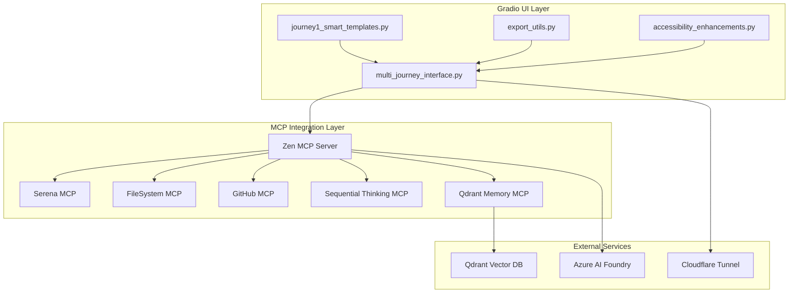

# Gradio UI Integration Deployment Guide

## Overview

This guide provides step-by-step instructions for deploying and integrating the validated Gradio UI implementation
(`multi_journey_interface.py`) with the Phase 1 PromptCraft-Hybrid infrastructure. The deployment includes integration
with Zen MCP Server, external services, and comprehensive validation procedures.

## Prerequisites

### System Requirements

- **Operating System**: Ubuntu 20.04+ or compatible Linux distribution
- **Python**: 3.11+ (managed via Poetry)
- **Node.js**: 18.x LTS (for Zen MCP Server)
- **Docker**: 25.x+ (for containerized services)
- **Memory**: Minimum 8GB RAM, recommended 16GB+
- **Storage**: Minimum 50GB available space

### Security Requirements

- **GPG Key**: Required for encrypted environment variable handling
- **SSH Key**: Required for signed commits and secure authentication
- **Network Access**: Access to external services (Qdrant, Azure AI)

### Validation Commands

```bash
# Validate system prerequisites
python --version  # Should show Python 3.11+
node --version    # Should show Node 18.x
docker --version  # Should show Docker 25.x+

# Validate security keys
gpg --list-secret-keys    # Must show available GPG keys
ssh-add -l               # Must show SSH keys loaded
git config --get user.signingkey  # Must show signing key configured
```

## Deployment Architecture

### Phase 1 Integration Points



## Deployment Steps

### Step 1: Environment Setup

#### 1.1 Clone and Setup Repository

```bash
# Clone the repository
git clone <repository-url>
cd PromptCraft

# Checkout the correct branch
git checkout feature/phase-1-issue-5-gradio-integration-revision

# Install dependencies
poetry install --sync

# Install pre-commit hooks
poetry run pre-commit install
```

#### 1.2 Environment Configuration

```bash
# Create environment-specific configuration
cp .env.example .env.dev

# Edit configuration file
nano .env.dev
```

**Required Environment Variables**:

```bash
# Core Application Settings
PROMPTCRAFT_APP_NAME="PromptCraft-Hybrid"
PROMPTCRAFT_VERSION="1.0.0"
PROMPTCRAFT_ENVIRONMENT="dev"
PROMPTCRAFT_DEBUG="true"
PROMPTCRAFT_API_HOST="0.0.0.0"
PROMPTCRAFT_API_PORT="8000"

# Gradio UI Configuration
PROMPTCRAFT_UI_HOST="0.0.0.0"
PROMPTCRAFT_UI_PORT="7860"
PROMPTCRAFT_UI_TITLE="PromptCraft-Hybrid AI Workbench"

# MCP Server Configuration
PROMPTCRAFT_ZEN_MCP_HOST="localhost"
PROMPTCRAFT_ZEN_MCP_PORT="3000"
PROMPTCRAFT_MCP_TIMEOUT="30"

# External Service Configuration
PROMPTCRAFT_QDRANT_HOST="qdrant"
PROMPTCRAFT_QDRANT_PORT="6333"
PROMPTCRAFT_AZURE_OPENAI_ENDPOINT="https://your-instance.openai.azure.com/"
PROMPTCRAFT_AZURE_OPENAI_API_KEY="your-api-key"

# Security Configuration
PROMPTCRAFT_SECRET_KEY="your-secret-key"
PROMPTCRAFT_API_KEY="your-api-key"

# GitHub Integration
PROMPTCRAFT_GITHUB_TOKEN="ghp_your-github-token"

# Rate Limiting Configuration
PROMPTCRAFT_RATE_LIMIT_ENABLED="true"
PROMPTCRAFT_RATE_LIMIT_PER_MINUTE="30"
PROMPTCRAFT_RATE_LIMIT_PER_HOUR="200"
PROMPTCRAFT_RATE_LIMIT_UPLOADS_PER_HOUR="50"
```

#### 1.3 Encrypt Environment Variables

```bash
# Encrypt environment variables for security
poetry run python src/utils/encryption.py encrypt .env.dev

# Verify encrypted file created
ls -la .env.dev.gpg
```

### Step 2: MCP Server Deployment

#### 2.1 Deploy Zen MCP Server

```bash
# Create MCP server directory
mkdir -p mcp-servers/zen

# Configure Zen MCP Server
cat > mcp-servers/zen/config.yaml << EOF
server:
  port: 3000
  host: "0.0.0.0"
  logLevel: "INFO"

mcpServers:
  serena:
    host: "serena-mcp"
    port: 8000
    capabilities: ["code_analysis", "symbol_lookup"]

  filesystem:
    host: "filesystem-mcp"
    port: 8001
    capabilities: ["file_read", "file_write"]

  github:
    host: "github-mcp"
    port: 8002
    capabilities: ["repo_analysis", "commit_history"]

  sequentialThinking:
    host: "sequential-thinking-mcp"
    port: 8003
    capabilities: ["reasoning", "step_by_step"]

  qdrantMemory:
    host: "qdrant-memory-mcp"
    port: 8004
    capabilities: ["vector_search", "knowledge_retrieval"]

orchestration:
  defaultStrategy: "parallel_with_fallback"
  maxConcurrentMCPs: 4
  retryAttempts: 3
EOF
```

#### 2.2 Deploy Docker Compose Stack

```bash
# Create docker-compose configuration
cat > docker-compose.phase1-ui.yml << EOF
version: '3.8'

services:
  zen-mcp:
    build:
      context: ./mcp-servers/zen
    container_name: zen-mcp
    ports:
      - "3000:3000"
    volumes:
      - ./mcp-servers/zen/config.yaml:/app/config.yaml
    environment:
      - ZEN_SERVER_PORT=3000
      - ZEN_LOG_LEVEL=INFO
    networks:
      - promptcraft
    restart: unless-stopped

  qdrant:
    image: qdrant/qdrant:v1.9.1
    container_name: qdrant
    ports:
      - "6333:6333"
    volumes:
      - qdrant_data:/qdrant/storage
    networks:
      - promptcraft
    restart: unless-stopped

  gradio-ui:
    build:
      context: .
      dockerfile: docker/Dockerfile.gradio
    container_name: gradio-ui
    ports:
      - "7860:7860"
    environment:
      - PROMPTCRAFT_ZEN_MCP_HOST=zen-mcp
      - PROMPTCRAFT_QDRANT_HOST=qdrant
    volumes:
      - ./src:/app/src
      - ./knowledge:/app/knowledge
    networks:
      - promptcraft
    depends_on:
      - zen-mcp
      - qdrant
    restart: unless-stopped

networks:
  promptcraft:
    driver: bridge

volumes:
  qdrant_data:
    driver: local
EOF

# Deploy services
docker-compose -f docker-compose.phase1-ui.yml up -d
```

### Step 3: Gradio UI Deployment

#### 3.1 Create Gradio Application Runner

```bash
# Create deployment script
cat > scripts/deploy_gradio_ui.py << 'EOF'
#!/usr/bin/env python3
"""
Gradio UI deployment script for Phase 1 Issue 5.

This script launches the validated multi_journey_interface.py with proper
configuration and integration with the MCP infrastructure.
"""

import os
import sys
from pathlib import Path

# Add project root to Python path
project_root = Path(__file__).parent.parent
sys.path.insert(0, str(project_root))

from src.config.settings import ApplicationSettings
from src.ui.multi_journey_interface import MultiJourneyInterface

def main():
    """Main deployment function."""
    print("🚀 Starting PromptCraft-Hybrid Gradio UI")
    print("=" * 50)

    # Load configuration
    try:
        settings = ApplicationSettings()
        print(f"✅ Configuration loaded for environment: {settings.environment}")
    except Exception as e:
        print(f"❌ Configuration error: {e}")
        return 1

    # Initialize multi-journey interface
    try:
        interface = MultiJourneyInterface()
        print("✅ MultiJourneyInterface initialized")
    except Exception as e:
        print(f"❌ Interface initialization error: {e}")
        return 1

    # Create and launch interface
    try:
        gradio_app = interface.create_interface()
        print("✅ Gradio interface created")

        # Launch with configuration
        gradio_app.launch(
            server_name=os.getenv("PROMPTCRAFT_UI_HOST", "0.0.0.0"),
            server_port=int(os.getenv("PROMPTCRAFT_UI_PORT", "7860")),
            share=False,
            show_tips=False,
            show_error=True,
            quiet=False,
            favicon_path=None,  # Add custom favicon if available
            app_kwargs={
                "title": os.getenv("PROMPTCRAFT_UI_TITLE", "PromptCraft-Hybrid"),
                "description": "AI-powered prompt enhancement workbench"
            }
        )

    except Exception as e:
        print(f"❌ Launch error: {e}")
        return 1

    return 0

if __name__ == "__main__":
    sys.exit(main())
EOF

# Make script executable
chmod +x scripts/deploy_gradio_ui.py
```

#### 3.2 Create Systemd Service (Optional)

```bash
# Create systemd service for production deployment
sudo tee /etc/systemd/system/promptcraft-ui.service << EOF
[Unit]
Description=PromptCraft-Hybrid Gradio UI
After=network.target
Wants=network.target

[Service]
Type=simple
User=$USER
Group=$USER
WorkingDirectory=$PWD
Environment=PATH=$PWD/.venv/bin:/usr/local/bin:/usr/bin:/bin
ExecStart=$PWD/.venv/bin/python scripts/deploy_gradio_ui.py
Restart=always
RestartSec=10
StandardOutput=journal
StandardError=journal

[Install]
WantedBy=multi-user.target
EOF

# Enable and start service
sudo systemctl daemon-reload
sudo systemctl enable promptcraft-ui.service
sudo systemctl start promptcraft-ui.service
```

### Step 4: Validation and Testing

#### 4.1 Pre-Deployment Validation

```bash
# Run comprehensive validation
poetry run python scripts/validate_gradio_integration.py

# Expected output: All validations should pass (100%)
```

#### 4.2 Integration Testing

```bash
# Run integration test suite
poetry run pytest tests/integration/test_gradio_ui_integration.py -v

# Run performance tests
poetry run pytest tests/performance/test_ui_load_performance.py -v --tb=short

# Run MCP connectivity tests
poetry run pytest tests/integration/test_mcp_connectivity.py -v
```

#### 4.3 User Acceptance Testing

```bash
# Follow user acceptance test procedures
# See: docs/validation/phase-1-issue-5-user-acceptance-tests.md

# Quick manual validation
curl -f http://localhost:7860/  # UI should respond
curl -f http://localhost:3000/health  # MCP server should respond
curl -f http://localhost:6333/  # Qdrant should respond
```

### Step 5: Production Configuration

#### 5.1 Cloudflare Tunnel Setup (Optional)

```bash
# Install cloudflared
curl -L https://github.com/cloudflare/cloudflared/releases/latest/download/cloudflared-linux-amd64.deb -o cloudflared.deb
sudo dpkg -i cloudflared.deb

# Create tunnel configuration
mkdir -p ~/.cloudflared
cat > ~/.cloudflared/config.yml << EOF
tunnel: your-tunnel-id
credentials-file: ~/.cloudflared/your-tunnel-credentials.json

ingress:
  - hostname: promptcraft.yourdomain.com
    service: http://localhost:7860
  - service: http_status:404
EOF

# Start tunnel
cloudflared tunnel run
```

#### 5.2 Nginx Reverse Proxy (Alternative)

```bash
# Install nginx
sudo apt update && sudo apt install nginx

# Create nginx configuration
sudo tee /etc/nginx/sites-available/promptcraft << EOF
server {
    listen 80;
    server_name promptcraft.yourdomain.com;

    location / {
        proxy_pass http://localhost:7860;
        proxy_set_header Host \$host;
        proxy_set_header X-Real-IP \$remote_addr;
        proxy_set_header X-Forwarded-For \$proxy_add_x_forwarded_for;
        proxy_set_header X-Forwarded-Proto \$scheme;

        # WebSocket support for Gradio
        proxy_http_version 1.1;
        proxy_set_header Upgrade \$http_upgrade;
        proxy_set_header Connection "upgrade";
    }
}
EOF

# Enable site
sudo ln -s /etc/nginx/sites-available/promptcraft /etc/nginx/sites-enabled/
sudo nginx -t && sudo systemctl restart nginx
```

## Configuration Management

### Environment-Specific Configurations

#### Development Environment

```bash
# .env.dev
PROMPTCRAFT_DEBUG="true"
PROMPTCRAFT_LOG_LEVEL="DEBUG"
PROMPTCRAFT_RATE_LIMIT_PER_MINUTE="100"  # More permissive for development
```

#### Staging Environment

```bash
# .env.staging
PROMPTCRAFT_DEBUG="false"
PROMPTCRAFT_LOG_LEVEL="INFO"
PROMPTCRAFT_RATE_LIMIT_PER_MINUTE="60"  # Moderate limits for testing
```

#### Production Environment

```bash
# .env.prod
PROMPTCRAFT_DEBUG="false"
PROMPTCRAFT_LOG_LEVEL="WARNING"
PROMPTCRAFT_RATE_LIMIT_PER_MINUTE="30"  # Strict limits for production
PROMPTCRAFT_SECURE_HEADERS="true"
```

### Security Configuration

```bash
# Additional security settings for production
export PROMPTCRAFT_SECURE_COOKIES="true"
export PROMPTCRAFT_CSRF_PROTECTION="true"
export PROMPTCRAFT_CONTENT_SECURITY_POLICY="default-src 'self'"
```

## Monitoring and Logging

### Health Check Endpoints

```python
# Available health check endpoints
GET /health              # Overall system health
GET /health/ui           # Gradio UI health
GET /health/mcp          # MCP server connectivity
GET /health/external     # External service status
```

### Log Configuration

```bash
# Configure structured logging
mkdir -p /var/log/promptcraft

# Log rotation configuration
sudo tee /etc/logrotate.d/promptcraft << EOF
/var/log/promptcraft/*.log {
    daily
    missingok
    rotate 30
    compress
    delaycompress
    notifempty
    create 644 $USER $USER
}
EOF
```

### Monitoring Commands

```bash
# Check service status
systemctl status promptcraft-ui.service

# View logs
journalctl -u promptcraft-ui.service -f

# Check resource usage
htop
docker stats

# Check network connectivity
netstat -tlnp | grep -E "(7860|3000|6333)"
```

## Troubleshooting

### Common Issues and Solutions

#### Issue 1: Gradio UI Won't Start

**Symptoms**: Service fails to start, connection refused on port 7860

**Diagnosis**:

```bash
# Check port availability
sudo lsof -i :7860

# Check service logs
journalctl -u promptcraft-ui.service --no-pager -l

# Verify configuration
poetry run python -c "from src.config.settings import ApplicationSettings; print(ApplicationSettings())"
```

**Solutions**:

1. Ensure port 7860 is available
2. Check environment variables are set correctly
3. Verify all dependencies are installed
4. Check file permissions

#### Issue 2: MCP Server Connection Failed

**Symptoms**: UI loads but queries fail with MCP connection errors

**Diagnosis**:

```bash
# Check MCP server status
curl -f http://localhost:3000/health

# Check Docker containers
docker ps | grep mcp

# Check network connectivity
docker network inspect promptcraft_promptcraft
```

**Solutions**:

1. Restart MCP server containers
2. Verify network configuration
3. Check MCP server logs
4. Validate service discovery

#### Issue 3: Performance Issues

**Symptoms**: Slow response times, high resource usage

**Diagnosis**:

```bash
# Check system resources
top
df -h
free -m

# Check response times
time curl -X POST http://localhost:7860/api/v1/query -d '{"query":"test"}'

# Profile application
poetry run python -m cProfile scripts/deploy_gradio_ui.py
```

**Solutions**:

1. Increase system resources
2. Optimize query processing
3. Enable caching
4. Scale horizontally

#### Issue 4: Rate Limiting Too Strict

**Symptoms**: Legitimate users getting rate limited

**Diagnosis**:

```bash
# Check rate limiting logs
grep "rate.limit" /var/log/promptcraft/app.log

# Review rate limiting configuration
grep -r "RATE_LIMIT" .env*
```

**Solutions**:

1. Adjust rate limiting thresholds
2. Implement user-based rate limiting
3. Add rate limiting bypass for trusted IPs
4. Implement exponential backoff

### Debug Mode Activation

```bash
# Enable debug mode temporarily
export PROMPTCRAFT_DEBUG="true"
export PROMPTCRAFT_LOG_LEVEL="DEBUG"

# Restart service
sudo systemctl restart promptcraft-ui.service

# View detailed logs
journalctl -u promptcraft-ui.service -f --no-pager
```

## Backup and Recovery

### Backup Procedures

```bash
# Backup configuration
tar -czf promptcraft-config-$(date +%Y%m%d).tar.gz \
    .env* \
    docker-compose*.yml \
    mcp-servers/ \
    knowledge/

# Backup Qdrant data
docker exec qdrant tar -czf /tmp/qdrant-backup-$(date +%Y%m%d).tar.gz /qdrant/storage
docker cp qdrant:/tmp/qdrant-backup-$(date +%Y%m%d).tar.gz ./backups/
```

### Recovery Procedures

```bash
# Restore configuration
tar -xzf promptcraft-config-YYYYMMDD.tar.gz

# Restore Qdrant data
docker cp ./backups/qdrant-backup-YYYYMMDD.tar.gz qdrant:/tmp/
docker exec qdrant tar -xzf /tmp/qdrant-backup-YYYYMMDD.tar.gz -C /

# Restart services
docker-compose -f docker-compose.phase1-ui.yml restart
```

## Performance Optimization

### Recommended Optimizations

1. **Enable Response Caching**

   ```python
   # Add to configuration
   PROMPTCRAFT_CACHE_ENABLED="true"
   PROMPTCRAFT_CACHE_TTL="300"  # 5 minutes
   ```

2. **Optimize Resource Allocation**

   ```yaml
   # In docker-compose.yml
   deploy:
     resources:
       limits:
         cpus: '2.0'
         memory: 4G
       reservations:
         cpus: '1.0'
         memory: 2G
   ```

3. **Enable Compression**

   ```bash
   # Nginx compression
   gzip on;
   gzip_types text/plain application/json;
   ```

## Success Metrics

### Key Performance Indicators

- **Response Time**: <5 seconds for 95% of queries
- **Uptime**: >99.5% availability
- **Concurrent Users**: Support for 10+ simultaneous users
- **Error Rate**: <1% of requests result in errors
- **Resource Usage**: <80% of allocated CPU and memory

### Monitoring Dashboard

```bash
# Sample monitoring commands
watch -n 5 'curl -s http://localhost:7860/health | jq'
watch -n 10 'docker stats --no-stream'
watch -n 30 'systemctl status promptcraft-ui.service'
```

## Conclusion

This deployment guide provides comprehensive instructions for successfully integrating the validated Gradio UI
implementation with the Phase 1 infrastructure. Following these procedures ensures a stable, secure, and performant
deployment that meets all acceptance criteria specified in the implementation plan.

For ongoing maintenance and monitoring, refer to the troubleshooting section and establish regular backup
procedures. The deployment is designed to be scalable and ready for Phase 2 enhancements.
