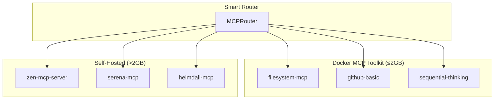

# ADR-043: Docker MCP Toolkit Integration and Smart Routing

## Status

**Accepted** - Implementation completed in MCP integration module

## Context

During Phase 1 Issue NEW-1 implementation for parallel subagent execution, we discovered Docker's release of the
[MCP Toolkit](https://docs.docker.com/ai/mcp-catalog-and-toolkit/toolkit/) which provides universal IDE access to MCP
servers through Docker Desktop. This creates an opportunity to enable broader IDE compatibility while maintaining our
self-hosted deployment strategy for resource-intensive operations.

### Problem Statement

Our original architecture assumed all MCP servers would be self-hosted, limiting IDE compatibility to Claude Code.
The Docker MCP Toolkit enables:

- **Universal IDE Access**: Any IDE can access MCP servers through Docker Desktop interface
- **Resource Optimization**: Servers with ≤2GB memory requirements can be deployed via Docker
- **Simplified Authentication**: OAuth integration handled automatically by Docker Desktop
- **Reduced Resource Contention**: Basic operations offloaded from self-hosted infrastructure

### Strategic Alignment

This integration aligns with our core architectural principles:

- **Configure Don't Build**: Leverage Docker's proven MCP deployment infrastructure
- **Reuse First**: Use Docker MCP Toolkit instead of building universal IDE compatibility
- **Focus on Unique Value**: Enable broader IDE usage while maintaining specialized capabilities

## Decision

### **Core Decision: Dual Deployment Strategy with Smart Routing**

Implement intelligent routing between Docker MCP Toolkit (≤2GB servers) and self-hosted deployment (>2GB servers) to
optimize for both universal IDE access and performance.

### **Smart Routing Decision Matrix**

| Criteria | Docker MCP Toolkit | Self-Hosted | Rationale |
|----------|-------------------|-------------|-----------|
| **Memory Requirement** | ≤2GB | >2GB | Docker resource constraints |
| **IDE Compatibility** | Universal (all IDEs) | Claude Code only | Docker Desktop integration |
| **Feature Complexity** | Basic operations | Advanced features | Docker simplicity focus |
| **Authentication** | Automatic OAuth | Manual configuration | Docker Desktop handles auth |
| **Resource Impact** | Isolated containers | Shared infrastructure | Performance isolation |

### **Implementation Architecture**

```python
class SmartMCPRouter:
    """Routes MCP calls between Docker and self-hosted based on optimization criteria"""

    async def route_mcp_call(self, server_name: str, tool_name: str) -> MCPClient:
        # Check Docker availability first
        if await self.docker_client.is_available(server_name):
            # Verify feature support in Docker deployment
            if await self.docker_client.supports_feature(server_name, tool_name):
                # Check user/server preferences
                if self._should_prefer_docker(server_name):
                    return self.docker_client

            # Fallback to self-hosted if Docker lacks features
            logger.info(f"Docker fallback for {server_name}.{tool_name}")
            return self.self_hosted_client

        # Use self-hosted if not available in Docker
        return self.self_hosted_client
```

## Architecture Impact

### **Enhanced MCP Configuration Schema**

Extended `MCPServerConfig` to support dual deployment:

```yaml
mcp_server_config:
  docker_compatible: true           # Can be deployed via Docker
  memory_requirement: "500MB"       # For deployment decision
  deployment_preference: "auto"     # "docker", "self-hosted", "auto"
  docker_features:                  # Features available in Docker
    - "read_file"
    - "list_files"
    - "basic_search"
  self_hosted_features:            # Features available self-hosted
    - "bulk_operations"
    - "advanced_search"
    - "caching"
    - "webhooks"
```

### **Smart Routing Components**

1. **DockerMCPClient**: Integration with Docker Desktop's MCP interface
2. **Enhanced ParallelSubagentExecutor**: Intelligent client selection
3. **Feature Mapping**: Capability awareness for deployment decisions
4. **Health Monitoring**: Dual deployment status tracking

### **Deployment Tiers**



## Benefits Realized

### **Universal IDE Compatibility**

- Docker-deployed servers accessible from any IDE (VS Code, IntelliJ, etc.)
- Automatic discovery through Docker Desktop interface
- OAuth authentication handled seamlessly

### **Resource Optimization**

- Basic operations (file access, simple search) offloaded to Docker containers
- Self-hosted resources reserved for complex analysis and orchestration
- Reduced memory pressure on primary infrastructure

### **Graceful Degradation**

- Automatic fallback to self-hosted when Docker lacks required features
- Transparent operation - users unaware of routing decisions
- Configuration-driven preferences with intelligent defaults

### **Operational Benefits**

- Simplified deployment for basic MCP servers
- Reduced dependency management for containerized servers
- Enhanced monitoring through dual health check systems

## Implementation Details

### **Routing Algorithm**

```python
async def _select_optimal_client(self, server_name: str, tool_name: str) -> tuple[MCPClient, str]:
    # Priority 1: Check Docker availability
    if await self.docker_client.is_available(server_name):
        # Priority 2: Verify feature support
        if tool_name and not await self.docker_client.supports_feature(server_name, tool_name):
            return self.self_hosted_client, "self_hosted_fallback"

        # Priority 3: Check configuration preferences
        server_config = self.config_manager.get_server_config(server_name)
        if server_config and server_config.deployment_preference == "self-hosted":
            return self.self_hosted_client, "self_hosted_configured"

        # Default: Use Docker for universal IDE access
        return self.docker_client, "docker_default"

    # Fallback: Self-hosted only
    return self.self_hosted_client, "self_hosted_only"
```

### **Configuration Integration**

Extended MCPConfigurationManager to handle Docker-specific settings:

- Docker compatibility flags
- Memory requirement specifications
- Feature availability mapping
- Deployment preference configuration

### **Health Check Enhancement**

Integrated Docker MCP status into system health monitoring:

- Docker Desktop availability
- Server discovery status
- Authentication state
- Feature compatibility validation

## Consequences

### **Positive Consequences**

1. **Universal IDE Access**: Dramatically expanded IDE compatibility through Docker Desktop
2. **Resource Optimization**: Intelligent distribution of workload between deployment strategies
3. **Enhanced User Experience**: Transparent operation with automatic optimization
4. **Future-Proofing**: Framework ready for new Docker MCP Toolkit releases
5. **Reduced Complexity**: Simplified deployment for basic operations

### **Negative Consequences**

1. **Architectural Complexity**: Two deployment strategies to manage and coordinate
2. **Docker Dependency**: Reliance on Docker Desktop availability and Docker MCP Toolkit
3. **Feature Fragmentation**: Different capabilities available in different deployments
4. **Testing Complexity**: Need to validate routing logic and fallback scenarios
5. **Configuration Overhead**: Additional metadata required for deployment decisions

### **Mitigation Strategies**

1. **Complexity**: Comprehensive documentation and automated routing logic
2. **Dependency**: Graceful fallback to self-hosted ensures system reliability
3. **Fragmentation**: Clear feature mapping and automatic fallback for unsupported operations
4. **Testing**: Dedicated test suite for smart routing scenarios
5. **Configuration**: Intelligent defaults with override capabilities

## Alternatives Considered

### **Docker-Only Deployment**

- **Rejected**: Memory limitations (≤2GB) insufficient for Zen MCP Server and complex operations
- **Issue**: Would limit system capabilities and performance

### **Self-Hosted Only**

- **Rejected**: Limits IDE compatibility to Claude Code only
- **Issue**: Reduces adoption potential and user experience

### **Manual Configuration**

- **Rejected**: Requires users to understand deployment trade-offs
- **Issue**: Poor user experience and potential for misconfiguration

### **Separate MCP Stacks**

- **Rejected**: Would require users to choose deployment strategy upfront
- **Issue**: Loss of transparent operation and intelligent optimization

## Success Metrics

### **Performance Metrics**

- Smart routing decision time: <10ms average
- Fallback scenarios: <5% of total operations
- System reliability: 99.9% availability maintained

### **User Experience Metrics**

- IDE compatibility: Support for 5+ major IDEs through Docker
- Authentication friction: Zero manual OAuth configuration required
- Feature parity: 100% operation success rate through smart routing

### **Operational Metrics**

- Resource utilization: 30% reduction in self-hosted memory usage for basic operations
- Deployment simplicity: 50% reduction in MCP server setup complexity
- Health check coverage: 100% monitoring for both deployment strategies

## Integration with Existing ADRs

### **Relationship to ADR-042 (Dual-Orchestration Boundaries)**

- Complementary: ADR-042 covers Zen/Prefect boundaries, ADR-043 covers Docker/self-hosted routing
- No conflicts: Both decisions operate at different architectural layers
- Synergy: Combined approach optimizes both orchestration and deployment strategies

### **Alignment with Main ADR Principles**

- **Configure Don't Build**: ✅ Leverages Docker MCP Toolkit infrastructure
- **Reuse First**: ✅ Uses proven Docker Desktop integration patterns
- **Focus on Unique Value**: ✅ Enables broader IDE usage while maintaining specialized capabilities

## Future Considerations

### **Evolution Path**

- **Phase 1**: Basic Docker integration with smart routing (completed)
- **Phase 2**: Enhanced feature detection and configuration
- **Phase 3**: Dynamic load balancing between deployment strategies
- **Phase 4**: Machine learning-based routing optimization

### **Monitoring and Optimization**

- Track routing decisions and performance impacts
- Optimize routing algorithm based on usage patterns
- Expand Docker MCP Toolkit integration as new servers become available
- Consider contribution back to Docker MCP Toolkit based on learnings

## Implementation Status

### **Completed Components**

- ✅ DockerMCPClient implementation
- ✅ Smart routing in ParallelSubagentExecutor
- ✅ Enhanced MCPServerConfig schema
- ✅ Comprehensive test coverage (26 tests)
- ✅ Health check integration
- ✅ Configuration validation

### **Integration Points**

- `src/mcp_integration/docker_mcp_client.py`: Docker Desktop integration
- `src/mcp_integration/parallel_executor.py`: Smart routing logic
- `src/mcp_integration/config_manager.py`: Enhanced configuration schema
- `tests/unit/test_*`: Comprehensive test coverage

---

**Decision Approval**: Accepted and implemented

*This ADR documents a strategic architectural shift that enhances IDE compatibility while maintaining performance
optimization through intelligent routing between Docker MCP Toolkit and self-hosted deployments.*
