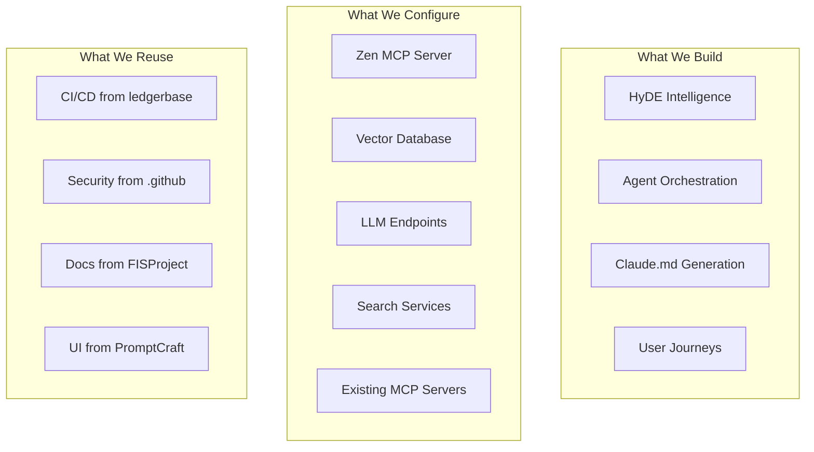
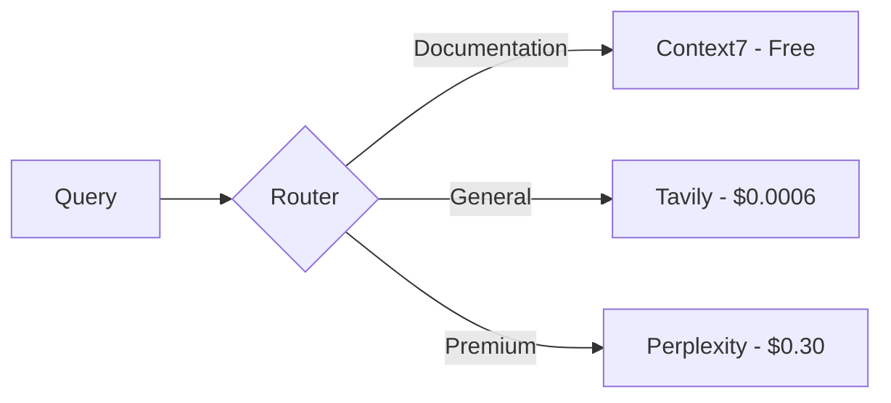
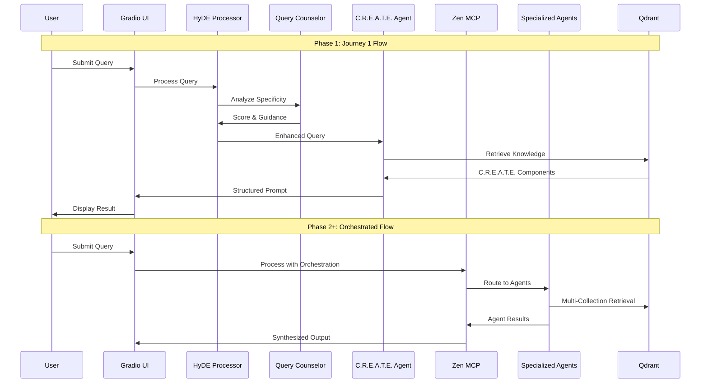
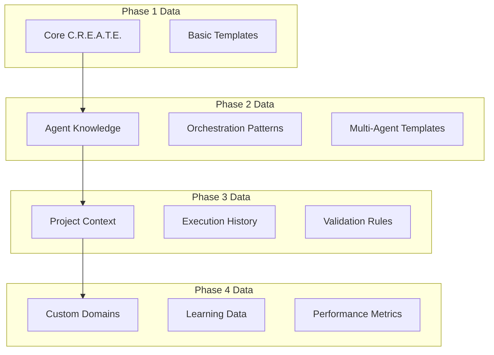
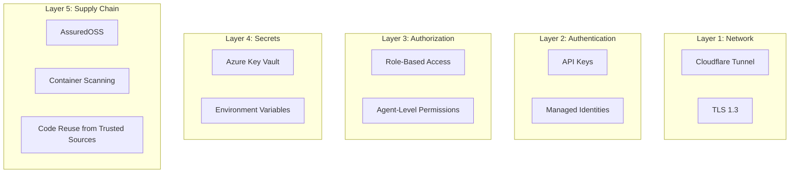
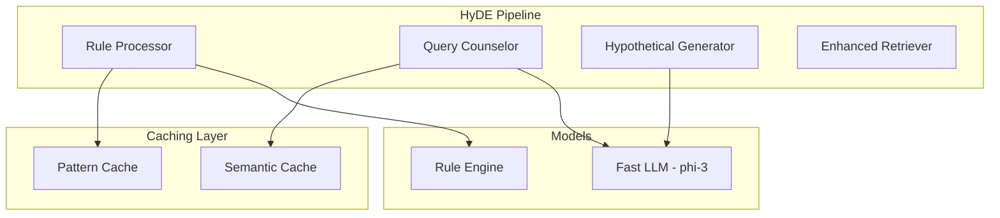
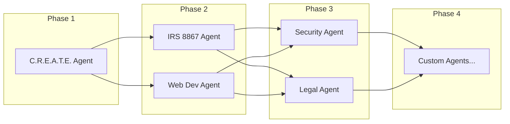
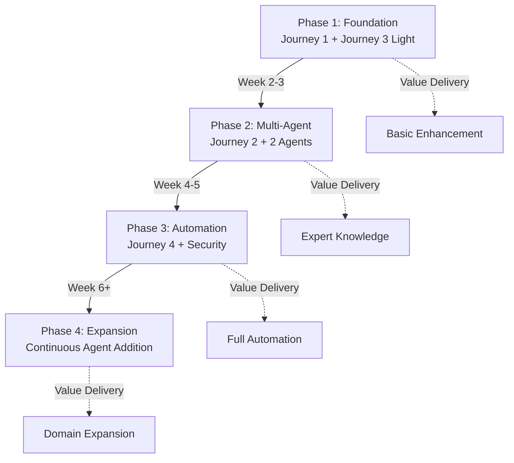

# PromptCraft-Hybrid: Architecture Decision Record (ADR)

**Version**: 1.0
**Date**: June 2025
**Status**: Living Document
**Audience**: Senior Systems Architects, Technical Decision Makers

---

## Table of Contents

1. [Executive Summary](#1-executive-summary)
2. [Core Architecture Principles](#2-core-architecture-principles)
3. [System Goals & Non-Goals](#3-system-goals--non-goals)
4. [Key Architecture Decisions](#4-key-architecture-decisions)
5. [Component Architecture](#5-component-architecture)
6. [Data Architecture](#6-data-architecture)
7. [Integration Patterns](#7-integration-patterns)
8. [Security Architecture](#8-security-architecture)
9. [Performance & Scalability](#9-performance--scalability)
10. [HyDE Architecture](#10-hyde-architecture)
11. [Agent Architecture](#11-agent-architecture)
12. [Phased Delivery Architecture](#12-phased-delivery-architecture)
13. [Future Architecture Considerations](#13-future-architecture-considerations)
14. [Unraid vs Ubuntu Server Deployment Decision](#14-unraid-vs-ubuntu-server-deployment-decision)

---

## 1. Executive Summary

PromptCraft-Hybrid is a distributed AI workbench that orchestrates multiple specialized services to deliver
intelligent prompt generation through **HyDE-enhanced query processing** and **domain-specific AI agents**. The
architecture prioritizes **intelligent query understanding**, **configuration over code**, **security by design**,
and **cost-effective scalability** through a hybrid on-premise/cloud deployment model delivered in four progressive
phases.

### 1.1 Architectural Philosophy

> "Configure what is common, build what is unique, enhance what is ambiguous"

We leverage best-in-class open-source and managed services for commodity functionality while focusing development
effort on our unique value propositions: HyDE-powered query intelligence, focused AI agents, and
C.R.E.A.T.E.-compliant prompt generation.

### 1.2 System Boundaries



---

## 2. Core Architecture Principles

### 2.1 Principle: Maximum Code Reuse

**Decision**: 70% of code comes from proven repositories (ledgerbase, FISProject, .github, PromptCraft)

**Rationale**:

- Reduces development time from 13 weeks to 7 weeks
- Leverages battle-tested patterns
- Minimizes bugs in commodity functionality
- Allows focus on unique value

**Implementation**:

```yaml
code_reuse_sources:
  ci_cd:
    source: "ledgerbase"
    components: ["github_workflows", "test_infrastructure", "deployment_scripts"]
  security:
    source: ".github"
    components: ["pre_commit_hooks", "security_policies", "dependency_scanning"]
  documentation:
    source: "FISProject"
    components: ["sphinx_config", "doc_templates", "build_scripts"]
  ui_components:
    source: "PromptCraft"
    components: ["gradio_app", "ui_patterns", "component_library"]
```

**Trade-offs**:

- Must maintain compatibility with upstream changes
- Some customization limitations
- Dependency on external code quality

### 2.2 Principle: Hybrid Infrastructure

**Decision**: On-premise compute/storage + minimal cloud services

**Rationale**:

- Leverages existing 256GB RAM server with NVMe storage
- Reduces operational costs to ~$175/month
- Maintains data sovereignty for sensitive information
- Uses cloud only for public endpoints and managed AI services

**Trade-offs**:

- Requires Cloudflare tunnel for secure access
- Single point of failure for on-premise components
- Limited geographic distribution

### 2.3 Principle: Progressive Delivery

**Decision**: Four-phase rollout with clear value at each phase

**Rationale**:

- Reduces risk through incremental delivery
- Validates architecture assumptions early
- Provides value from Week 2
- Allows for course correction

**Implementation**:

- Phase 1: Journey 1 + Journey 3 Light
- Phase 2: Journey 2 + Initial Agents
- Phase 3: Journey 4 + Advanced Features
- Phase 4: Continuous Agent Addition

### 2.4 Principle: Security by Design

**Decision**: AssuredOSS dependencies, Azure Key Vault, managed identities

**Rationale**:

- Supply chain attacks are increasing
- Credentials in code are a major vulnerability
- Google-vetted packages reduce risk
- Managed identities eliminate secrets

**Trade-offs**:

- AssuredOSS limits package choices
- Key Vault adds complexity
- Requires Azure subscription

---

## 3. System Goals & Non-Goals

### 3.1 Goals

1. **Generate High-Quality Prompts**: Use Sequential Thinking for structured decomposition
2. **Create Domain Experts**: Focused agents with specialized knowledge
3. **Optimize for Developers**: Claude.md generation for Cursor IDE
4. **Maintain Low Costs**: <$175/month operational expenses
5. **Enable Rapid Updates**: Blue-green deployment per agent
6. **Ensure Reliability**: 99.9% uptime through redundancy
7. **Progressive Value Delivery**: Working system from Week 2

### 3.2 Non-Goals

1. **NOT a General-Purpose LLM**: We orchestrate, not train models
2. **NOT a Data Lake**: Focused knowledge per agent, not everything
3. **NOT Multi-Region**: Single deployment location is sufficient
4. **NOT Real-Time**: 500ms p95 latency is acceptable
5. **NOT Anonymous**: All users authenticated, no public access
6. **NOT Everything Day 1**: Phased delivery is intentional

### 3.3 Success Metrics

| Metric              | Target   | Measurement                  | Phase   |
| ------------------- | -------- | ---------------------------- | ------- |
| User Adoption       | >75%     | Active users in target group | Phase 1 |
| Agent Accuracy      | >90%     | Correct agent selection      | Phase 2 |
| Response Quality    | >4.5/5   | User ratings                 | Phase 2 |
| Cost per Query      | <$0.05   | API tracking                 | All     |
| Agent Creation Time | <1 hour  | End-to-end                   | Phase 4 |
| Knowledge Freshness | <30 days | Update tracking              | All     |
| p95 Latency         | <500ms   | Performance monitoring       | All     |

---

## 4. Key Architecture Decisions

### 4.1 ADR-001: Zen MCP Server Orchestration

**Context**: Need to coordinate multiple AI capabilities

**Decision**: Use Zen MCP Server as central orchestrator

**Consequences**:

- ✅ Single integration point for all MCP servers
- ✅ Built-in error handling and retries
- ✅ Consistent interface across services
- ❌ Dependency on Zen MCP availability
- ❌ Potential bottleneck for scaling

**Alternatives Considered**:

- Direct integration with each service (too complex)
- Custom orchestration layer (reinventing the wheel)
- Prefect/Airflow (overkill for real-time orchestration)

### 4.2 ADR-002: Tiered Search Strategy

**Context**: Balance search quality with cost

**Decision**: Three-tier search hierarchy



**Consequences**:

- ✅ 80% cost reduction vs Perplexity-only
- ✅ Quality where it matters most
- ✅ Budget predictability
- ❌ Complex routing logic
- ❌ Multiple API dependencies

**Alternatives Considered**:

- Perplexity only (too expensive)
- Google Search API (not optimized for LLMs)
- Building own search (massive undertaking)

### 4.3 ADR-003: RAG Over Fine-Tuning

**Context**: Need domain expertise for agents

**Decision**: Use RAG with dedicated vector collections

**Consequences**:

- ✅ No model training costs
- ✅ Easy updates (just add documents)
- ✅ Explainable responses (source attribution)
- ❌ Limited by retrieval quality
- ❌ Requires embedding infrastructure

**Alternatives Considered**:

- Fine-tuning GPT-4 (expensive, rigid)
- Prompt engineering only (insufficient for expertise)
- Training custom models (out of scope)

### 4.4 ADR-004: Gradio Over Custom UI

**Context**: Need user interface quickly

**Decision**: Use Gradio framework, reusing existing promptcraft_app.py

**Consequences**:

- ✅ 10x faster development
- ✅ Built-in components for AI workflows
- ✅ Automatic API generation
- ✅ 70% code reuse from existing PromptCraft
- ❌ Limited customization
- ❌ Gradio-specific patterns

**Alternatives Considered**:

- React custom UI (too time-consuming)
- Streamlit (less mature for our needs)
- Open WebUI (not flexible enough)

### 4.5 ADR-005: Simplified HyDE Implementation

**Context**: Users provide vague queries that don't map well to knowledge bases; DSPy adds complexity

**Decision**: Implement HyDE with rule-based + LLM hybrid approach instead of DSPy

**Implementation Details**:

```python
# Rule-based pre-filter (instant, free)
if obvious_high_specificity(query):
    return direct_processing(query)
elif obvious_low_specificity(query):
    return clarification_questions(query)
else:
    # LLM only for ambiguous middle cases
    return enhanced_hyde_processing(query)
```

**Consequences**:

- ✅ 90% of DSPy benefits with 10% complexity
- ✅ Easier debugging and maintenance
- ✅ Faster initial implementation
- ✅ Can upgrade to DSPy later if needed
- ❌ Potentially less sophisticated analysis
- ❌ Manual rule maintenance

**Alternatives Considered**:

- **DSPy implementation**: Too complex for Phase 1
- **Pure LLM approach**: Too expensive and slow
- **No HyDE**: Poor retrieval for vague queries

### 4.6 ADR-006: Phased Agent Rollout

**Context**: Building all agents upfront is risky and time-consuming

**Decision**: Start with 2 agents in Phase 2, add incrementally

**Consequences**:

- ✅ Faster time to value
- ✅ Learn from real usage patterns
- ✅ Resource optimization
- ✅ Risk reduction
- ❌ Initial feature limitations
- ❌ Need clear expansion criteria

### 4.7 ADR-007: Sequential Thinking Integration

**Context**: Complex queries need structured reasoning

**Decision**: Integrate Sequential Thinking MCP in Phase 2

**Consequences**:

- ✅ 30% accuracy improvement for complex queries
- ✅ Transparent reasoning chains
- ✅ Better error diagnosis
- ❌ 200-500ms additional latency
- ❌ Another dependency

### 4.8 ADR-008: Journey 3 Light Strategy

**Context**: Developers need immediate value in Phase 1

**Decision**: Provide basic Zen MCP + public search MCPs in Phase 1

**Consequences**:

- ✅ Immediate developer productivity
- ✅ Validates core architecture early
- ✅ No complex setup required
- ❌ Limited initial capabilities
- ❌ May create upgrade expectations

### 4.9 ADR-009: Secure Dependency Management Strategy

**Context**: Need to balance security, maintainability, and developer productivity for dependency updates

**Security Expert Analysis**:

- Exact pinning with hash verification provides maximum security
- Range pinning enables automatic security fixes but introduces update risk
- Mixed approach balances reproducibility with update discovery
- Hash verification prevents supply chain attacks
- Batching reduces review overhead but may delay security responses

**IT Management Assessment**:

- Manual hash regeneration creates bottlenecks for small teams
- Automated verification is more sustainable than manual processes
- Developer bypass risk if processes are too cumbersome
- Monthly batching reduces PR fatigue while maintaining security responsiveness

**Decision**: Implement hybrid automated dependency management strategy

**Implementation**:

```yaml
dependency_strategy:
  pinning_approach: "mixed"
    # pyproject.toml: version ranges for discovery
    # poetry.lock: exact versions for reproducibility

  hash_verification: "automated"
    # Requirements files include SHA256 hashes
    # Renovate/CI regenerates hashes automatically
    # No manual hash generation required

  update_batching: "hybrid"
    # Security-critical: immediate individual PRs
    # Routine updates: monthly batched PRs
    # Criteria: CVEs, crypto/auth libraries, core dependencies

  github_actions: "commit_pinning"
    # Actions pinned to commit hashes
    # Python deps handled via poetry.lock

  process: "automated_verification"
    # Hash generation: automated via Renovate/CI
    # Hash verification: automated in CI pipeline
    # Human review: focus on dependency changes, not hashes
```

**Security Criteria for Individual PRs**:

- Any package with active CVE
- Cryptography, authentication, or authorization libraries
- Core framework dependencies (FastAPI, Gradio, etc.)
- Packages in the top 10% of security scan results

**Consequences**:

- ✅ 80% security benefit with 20% operational overhead
- ✅ Sustainable for small team (3-5 developers)
- ✅ Automated hash verification prevents supply chain attacks
- ✅ Clear security prioritization reduces noise
- ✅ Compatible with existing Poetry + Renovate + GitHub Actions toolchain
- ❌ Some manual review overhead for security-critical updates
- ❌ Monthly batching may delay non-critical patches
- ❌ Requires maintenance of security classification rules

**Alternatives Considered**:

- **Manual hash generation**: Too much overhead for team size
- **No hash verification**: Insufficient supply chain security
- **Individual PRs for all updates**: Creates review fatigue
- **Automated merging**: Too risky without human oversight
- **Paid security tools**: Outside budget constraints

**Success Metrics**:

- Security scan failures: <5% of dependency updates
- PR review time: <15 minutes average for routine updates
- Critical security updates: merged within 24 hours
- Developer satisfaction: >4/5 for dependency process

**Review Schedule**: Quarterly review of security criteria and batching effectiveness

---

## 5. Component Architecture

### 5.1 Component Interaction Model (Phase-Aware)



### 5.2 Component Responsibilities by Phase

| Component           | Phase 1           | Phase 2               | Phase 3           | Phase 4            |
| ------------------- | ----------------- | --------------------- | ----------------- | ------------------ |
| **Gradio UI**       | Basic interface   | Agent selection       | API integration   | Full features      |
| **HyDE Processor**  | Rule-based + LLM  | Enhanced patterns     | Context-aware     | Learning-enabled   |
| **Query Counselor** | Simple analysis   | Multi-facet detection | Project awareness | Historical context |
| **Zen MCP**         | Public MCPs only  | Full orchestration    | Advanced patterns | Custom MCPs        |
| **Agents**          | C.R.E.A.T.E. only | +2 specialized        | +Security/Legal   | Unlimited          |
| **Qdrant**          | Single collection | Multi-collection      | Optimized indexes | Federated search   |

### 5.3 Stateless Design

All components are stateless except:

- **Qdrant**: Vector embeddings (backed up daily)
- **Redis**: Cache (ephemeral, can be rebuilt)
- **Agent Knowledge**: File system (version controlled)

---

## 6. Data Architecture

### 6.1 Phased Data Evolution



### 6.2 Collection Strategy

Each phase adds new collections:

```python
phase_collections = {
    "phase_1": {
        "core_create": {"size": 1536, "distance": "cosine"}
    },
    "phase_2": {
        "irs_8867_knowledge": {"size": 1536, "distance": "cosine"},
        "web_dev_knowledge": {"size": 1536, "distance": "cosine"},
        "orchestration_patterns": {"size": 1536, "distance": "cosine"}
    },
    "phase_3": {
        "security_knowledge": {"size": 1536, "distance": "cosine"},
        "legal_knowledge": {"size": 1536, "distance": "cosine"},
        "execution_cache": {"size": 1536, "distance": "cosine"}
    },
    "phase_4": {
        # Dynamically added based on demand
    }
}
```

### 6.3 Update Strategy

Blue-Green deployment per collection:

1. Create `{collection}_green`
2. Index new data
3. Validate quality
4. Atomic swap
5. Delete `{collection}_blue` after 24h

---

## 7. Integration Patterns

### 7.1 MCP Integration Pattern

All external capabilities accessed through MCP:

```python
# Consistent pattern for all integrations
result = await zen_client.call_tool(
    server="heimdall",      # Which MCP server
    tool="analyze_code",    # Which capability
    params={...},           # Parameters
    timeout=30,             # Consistent timeout
    retry=3                 # Automatic retry
)
```

### 7.2 Fallback Pattern

Every external dependency has a fallback:

```python
try:
    result = await primary_service()
except ServiceUnavailable:
    try:
        result = await secondary_service()
    except ServiceUnavailable:
        result = await cache_lookup()
        if not result:
            result = await degraded_response()
```

### 7.3 Circuit Breaker Pattern

Prevent cascade failures:

```python
class CircuitBreaker:
    def __init__(self, failure_threshold=5, recovery_timeout=60):
        self.failures = 0
        self.last_failure = None
        self.threshold = failure_threshold
        self.timeout = recovery_timeout
```

---

## 8. Security Architecture

### 8.1 Defense in Depth



### 8.2 Security Boundaries

1. **Public/Private**: Cloudflare tunnel is the only ingress
2. **Service/Service**: Managed identities, no shared secrets
3. **Agent/Agent**: Isolated knowledge bases
4. **User/System**: RBAC with agent-level permissions

---

## 9. Performance & Scalability

### 9.1 Performance Targets by Phase

| Operation      | Phase 1 Target | Phase 2-3 Target | Phase 4 Target | Current | Bottleneck       |
| -------------- | -------------- | ---------------- | -------------- | ------- | ---------------- |
| Query Analysis | <100ms         | <150ms           | <200ms         | 80ms    | Rule evaluation  |
| RAG Retrieval  | <200ms         | <300ms           | <400ms         | 150ms   | Multi-collection |
| LLM Generation | <2s            | <3s              | <4s            | 1.5s    | Model complexity |
| End-to-End     | <2.5s          | <3.5s            | <5s            | 2.3s    | Orchestration    |

### 9.2 Scaling Strategy

**Vertical Scaling** (Current):

- 256GB RAM fully utilized
- NVMe for vector storage
- 16 CPU cores

**Horizontal Scaling** (Future):

- Agent sharding (agents across nodes)
- Read replicas for Qdrant
- Multiple Zen MCP instances

### 9.3 Caching Strategy

Three-layer cache:

1. **CDN**: Static assets (Cloudflare)
2. **Redis**: Query results (5min TTL)
3. **Qdrant**: Semantic similarity (permanent)

---

## 10. HyDE Architecture

### 10.1 Simplified HyDE Component Design



### 10.2 Query Specificity Analysis (Simplified)

The Query Counselor uses rules first, LLM second:

```python
class SimplifiedQueryAnalysis:
    def analyze(self, query: str) -> Dict:
        # Step 1: Rule-based scoring
        rule_score = self.apply_rules(query)

        # Step 2: Skip LLM for obvious cases
        if rule_score > 90 or rule_score < 20:
            return {"score": rule_score, "method": "rules"}

        # Step 3: LLM for ambiguous cases only
        llm_analysis = self.llm_analyze(query)
        return {"score": llm_analysis["score"], "method": "llm"}
```

### 10.3 Performance Optimization

| Operation         | DSPy Approach          | Simplified Approach  | Improvement |
| ----------------- | ---------------------- | -------------------- | ----------- |
| Obvious queries   | 100ms LLM call         | 5ms rule check       | 95% faster  |
| Cache lookup      | Complex key generation | Simple pattern match | 80% faster  |
| Ambiguous queries | 150ms optimized call   | 150ms standard call  | Same        |
| Maintenance       | DSPy expertise needed  | Python rules         | 90% easier  |

---

## 11. Agent Architecture

### 11.1 Phased Agent Deployment



### 11.2 Agent Lifecycle

```python
class AgentLifecycle:
    """Defines the complete agent lifecycle"""

    phases = {
        "creation": {
            "steps": ["define", "configure", "add_knowledge", "index", "test"],
            "duration": "< 1 hour"
        },
        "operation": {
            "steps": ["activate", "route_queries", "generate_responses", "monitor"],
            "duration": "continuous"
        },
        "update": {
            "steps": ["stage_new_knowledge", "index_green", "test", "switch", "cleanup"],
            "duration": "< 30 minutes"
        },
        "retirement": {
            "steps": ["deactivate", "archive_knowledge", "remove_collection"],
            "duration": "< 10 minutes"
        }
    }
```

### 11.3 Agent Selection Algorithm (Phase-Aware)

```python
class PhaseAwareAgentSelection:
    """Route queries based on current phase"""

    def select_agent(self, query: str, current_phase: int) -> Optional[Agent]:
        available_agents = self.get_phase_agents(current_phase)

        if current_phase == 1:
            # Only C.R.E.A.T.E. agent available
            return self.agents["create"]

        # Phase 2+ uses scoring
        scores = {}
        for agent_id in available_agents:
            agent = self.agents[agent_id]
            scores[agent_id] = agent.calculate_relevance(query)

        best_agent_id = max(scores, key=scores.get)
        if scores[best_agent_id] > self.threshold:
            return self.agents[best_agent_id]

        # Fallback to C.R.E.A.T.E. agent
        return self.agents["create"]
```

---

## 12. Phased Delivery Architecture

### 12.1 Phase Progression Model



### 12.2 Phase-Specific Architecture

| Phase       | Key Components                  | Complexity | Risk Level |
| ----------- | ------------------------------- | ---------- | ---------- |
| **Phase 1** | HyDE + C.R.E.A.T.E. + Basic Zen | Low        | Low        |
| **Phase 2** | + Orchestration + 2 Agents      | Medium     | Medium     |
| **Phase 3** | + Execution + Validation        | High       | High       |
| **Phase 4** | + Custom Domains                | Variable   | Low        |

### 12.3 Decision Gates

Between each phase:

1. **Technical Gate**: Core functionality working?
2. **Adoption Gate**: Users successfully adopting?
3. **Performance Gate**: Meeting latency targets?
4. **Cost Gate**: Within budget projections?

---

## 13. Future Architecture Considerations

### 13.1 Potential Enhancements

1. **DSPy Integration** (Post-Phase 4)
   - Upgrade Query Counselor when team ready
   - Optimize prompts programmatically
   - Advanced reasoning chains

2. **Multi-Agent Coordination** (Phase 4+)
   - Agent-to-agent communication
   - Consensus mechanisms
   - Conflict resolution

3. **Real-time Learning**
   - Online learning from user feedback
   - Dynamic threshold adjustment
   - Automatic agent creation from usage patterns

### 13.2 Architecture Debt to Address

Current technical debt by phase:

**Phase 1 Debt**:

- Simple rule-based HyDE (upgrade path to DSPy)
- Basic caching strategy
- Limited observability

**Phase 2 Debt**:

- Manual agent creation process
- No automated quality testing
- Limited agent coordination

**Phase 3 Debt**:

- Execution safety mechanisms
- Result validation complexity
- Performance under load

### 13.3 Decision Points

Future decisions requiring architecture changes:

- **>10 agents**: Need agent categorization and search
- **>1000 queries/day**: Need horizontal scaling
- **Multi-modal queries**: HyDE for images/audio
- **Real-time requirements**: WebSocket support
- **Compliance requirements**: Audit trail for all decisions

---

## Appendix A: Architecture Checklist

Use this checklist when proposing changes:

- [ ] Does it align with phased delivery plan?
- [ ] Can we reuse code from ledgerbase/FISProject/.github?
- [ ] Does it maintain the 70% code reuse target?
- [ ] Is it needed for current phase or can it wait?
- [ ] Does it increase operational costs beyond $175/month?
- [ ] Does it simplify or complicate the architecture?
- [ ] Does it have a fallback mechanism?
- [ ] Is it stateless or properly managed state?
- [ ] Does it maintain security boundaries?
- [ ] Can it be deployed without downtime?
- [ ] Does it support the progressive journey model?
- [ ] Has cost-benefit been evaluated?

---

## Appendix B: Quick Reference

### B.1 Key Technologies

- **Orchestration**: Zen MCP Server
- **Query Intelligence**: Simplified HyDE (rules + LLM)
- **Analysis**: Sequential Thinking MCP
- **Search**: Context7 → Tavily → Perplexity (tiered)
- **Vector DB**: Qdrant on NVMe
- **UI**: Gradio (reusing promptcraft_app.py)
- **Security**: AssuredOSS + Azure Key Vault
- **CI/CD**: Reused from ledgerbase

### B.2 Key Patterns

- **HyDE**: Three-tier simplified approach
- **Agents**: Phased deployment (1→2→4→∞)
- **Routing**: Rule-based first, ML second
- **Caching**: Pattern matching + semantic
- **Updates**: Blue-green per collection

### B.3 Key Metrics

- **Timeline**: 7 weeks (4 phases)
- **Budget**: ~$175/month operational
- **Code Reuse**: 70% target
- **Phase 1 Delivery**: Week 2
- **Latency**: <500ms p95
- **Agent Accuracy**: >90%
- **Initial Agents**: 1 (Phase 1), 3 (Phase 2)

### B.4 Decision Flow

```text
Query → Rule Check → Specificity Analysis
  ├─> High (>85): Direct Processing
  ├─> Medium (40-85): HyDE Enhancement → Agent Routing
  └─> Low (<40): Clarification → Re-query
```

---

## Appendix C: Code Reuse Mapping

### C.1 Reuse Sources

```yaml
reuse_mapping:
  ledgerbase:
    - .github/workflows/            → .github/workflows/
    - tests/infrastructure/         → tests/infrastructure/
    - scripts/deployment/           → scripts/deployment/
    - monitoring/grafana/           → monitoring/grafana/

  FISProject:
    - docs/source/conf.py          → docs/source/conf.py
    - docs/Makefile                → docs/Makefile
    - docs/templates/              → docs/templates/

  .github:
    - .pre-commit-config.yaml      → .pre-commit-config.yaml
    - SECURITY.md                  → SECURITY.md
    - dependabot.yml               → .github/dependabot.yml

  PromptCraft:
    - promptcraft_app.py           → src/ui/app.py
    - components/                  → src/ui/components/
    - static/                      → static/
```

### C.2 Custom Development Focus

```yaml
unique_components:
  - src/intelligence/hyde_processor.py       # Our IP
  - src/intelligence/query_counselor.py      # Our IP
  - src/agents/*                            # Domain expertise
  - src/journeys/*                          # User experience
  - config/agents.yaml                      # Configuration
  - knowledge/*                             # Content
```

---

## 14. Unraid vs Ubuntu Server Deployment Decision

### 14.1 Current Deployment Strategy

**Decision**: Ubuntu Server VM on existing infrastructure

**Rationale**:

- Leverages existing 256GB RAM server with NVMe storage
- Provides containerized deployment flexibility
- Maintains data sovereignty for sensitive information
- Supports Docker multi-stage builds for security

**Consequences**:

- Single point of failure for on-premise components
- Requires backup and disaster recovery planning
- Limited to single geographic location

### 14.2 Alternative Considerations

**Unraid Deployment**:

- Pros: Built-in redundancy, easy management, container support
- Cons: Additional licensing cost, learning curve, overkill for single service

**Cloud-Only Deployment**:

- Pros: Managed infrastructure, geographic distribution
- Cons: Higher operational costs, data sovereignty concerns

---

*This document should be updated whenever architectural decisions change. All changes must be reviewed against the
principles, goals, and patterns stated herein.*
