# PromptCraft-Hybrid: Critical Path Analysis

This document provides the critical path analysis for all 33 issues across the four project phases, identifying dependencies and bottlenecks that determine project timeline.

## Related Documentation

- **Project Overview**: [Milestones](milestones.md) - All project issues with links
- **Detailed Issues**: [Phase 1](phase-1-issues.md) | [Phase 2](phase-2-issues.md) | [Phase 3](phase-3-issues.md) | [Phase 4](phase-4-issues.md)
- **Technical Specifications**: [Phase 1](ts_1.md) | [Phase 2](ts_2.md) | [Phase 3](ts_3.md) | [Phase 4](ts_4.md)
- **User Journeys**: [Four Journeys](four_journeys.md) - User experience progression

---

## Project Critical Path Sequence

```mermaid
graph TD
    %% Phase 1: Foundation & Journey 1 (Weeks 1-4)
    subgraph "Phase 1: Foundation & Journey 1 (Weeks 1-4)"
        I1["#1: Dev Environment Setup<br/>GPG/SSH Keys, Docker, Poetry"]
        I2["#2: Core Configuration<br/>Settings Management"]
        I3["#3: Docker Environment<br/>Multi-service Setup"]
        I4["#4: C.R.E.A.T.E. Framework<br/>Core Engine"]
        I5["#5: Gradio UI Foundation<br/>Base Interface"]
        I6["#6: Template Library<br/>Journey 1 Templates"]
        I7["#7: Test Framework<br/>Quality Assurance"]
        I8["#8: Journey 1 Validation<br/>End-to-End Testing"]
        I9["#9: Security Implementation<br/>Encryption & Auth"]
        I10["#10: Production Deployment<br/>CI/CD Pipeline"]

        I1 --> I2
        I1 --> I3
        I2 --> I4
        I3 --> I4
        I4 --> I5
        I4 --> I6
        I5 --> I8
        I6 --> I8
        I1 --> I7
        I7 --> I8
        I1 --> I9
        I9 --> I10
        I8 --> I10
    end

    %% Phase 2: Multi-Agent Intelligence (Weeks 5-8)
    subgraph "Phase 2: Multi-Agent Intelligence (Weeks 5-8)"
        I11["#11: Multi-Agent Orchestration<br/>Agent Framework"]
        I12["#12: Security Agent<br/>Heimdall Integration"]
        I13["#13: Web Dev Agent<br/>GitHub/Serena MCP"]
        I14["#14: Tax Agent<br/>IRS 8867 Compliance"]
        I15["#15: Enhanced UI<br/>Multi-Agent Selection"]
        I16["#16: Heimdall MCP<br/>Security Analysis"]
        I17["#17: GitHub MCP<br/>Repository Context"]

        I4 --> I11
        I3 --> I16
        I3 --> I17
        I11 --> I12
        I11 --> I13
        I11 --> I14
        I16 --> I12
        I17 --> I13
        I5 --> I15
        I11 --> I15
    end

    %% Phase 3: End-to-End Execution (Weeks 9-12)
    subgraph "Phase 3: End-to-End Execution (Weeks 9-12)"
        I18["#18: Direct Execution Engine<br/>Code Execution Framework"]
        I19["#19: Code Interpreter MCP<br/>Sandbox Execution"]
        I20["#20: Human-in-Loop MCP<br/>Approval Workflows"]
        I21["#21: State Management<br/>Redis Persistence"]
        I22["#22: API Security<br/>Authentication Layer"]
        I23["#23: FastAPI Gateway<br/>API Orchestration"]
        I24["#24: Workflow Validation<br/>Safety Controls"]
        I25["#25: Journey 4 UI<br/>Execution Interface"]

        I11 --> I18
        I3 --> I19
        I3 --> I20
        I3 --> I21
        I18 --> I19
        I18 --> I20
        I21 --> I18
        I9 --> I22
        I18 --> I23
        I22 --> I23
        I18 --> I24
        I15 --> I25
        I18 --> I25
        I23 --> I25
    end

    %% Phase 4: Enterprise Readiness (Weeks 13-16)
    subgraph "Phase 4: Enterprise Readiness (Weeks 13-16)"
        I26["#26: Agent Creation CLI<br/>Automated Scaffolding"]
        I27["#27: Analytics Engine<br/>PostgreSQL Warehouse"]
        I28["#28: Enterprise SSO<br/>Keycloak Integration"]
        I29["#29: ML Workflow Optimization<br/>MLflow Integration"]
        I30["#30: Custom MCP Registry<br/>Plugin Management"]
        I31["#31: Production Monitoring<br/>Prometheus/Grafana"]
        I32["#32: Compliance Framework<br/>SOC 2/GDPR"]
        I33["#33: Platform Scaling<br/>Performance Optimization"]

        I11 --> I26
        I18 --> I27
        I23 --> I28
        I27 --> I29
        I26 --> I30
        I27 --> I31
        I28 --> I32
        I27 --> I32
        I23 --> I33
        I31 --> I33
    end

    %% Critical Path Highlighting (Longest Path)
    style I1 fill:#ff6b6b,stroke:#333,stroke-width:3px
    style I4 fill:#ff6b6b,stroke:#333,stroke-width:3px
    style I11 fill:#ff6b6b,stroke:#333,stroke-width:3px
    style I18 fill:#ff6b6b,stroke:#333,stroke-width:3px
    style I23 fill:#ff6b6b,stroke:#333,stroke-width:3px
    style I33 fill:#ff6b6b,stroke:#333,stroke-width:3px

    %% High-Risk Dependencies
    style I3 fill:#ffd93d,stroke:#333,stroke-width:2px
    style I9 fill:#ffd93d,stroke:#333,stroke-width:2px
    style I16 fill:#ffd93d,stroke:#333,stroke-width:2px
    style I17 fill:#ffd93d,stroke:#333,stroke-width:2px

    %% Journey Enablement Dependencies
    I6 -.->|Enables Journey 1| I8
    I15 -.->|Enables Journey 2| I25
    I23 -.->|Enables Journey 3| I33
    I25 -.->|Enables Journey 4| I33
```

## Critical Path Analysis

### **Primary Critical Path (Red Nodes)**
The longest dependency chain that determines minimum project duration:

**Issue #1** → **Issue #4** → **Issue #11** → **Issue #18** → **Issue #23** → **Issue #33**

1. **#1: Development Environment Setup** (6h) - Foundation for all development
2. **#4: C.R.E.A.T.E. Framework Engine** (8h) - Core prompt processing logic
3. **#11: Multi-Agent Orchestration Framework** (8h) - Agent coordination system
4. **#18: Direct Execution Engine Framework** (8h) - Code execution capabilities
5. **#23: Enhanced FastAPI Gateway** (6h) - API orchestration layer
6. **#33: Platform Scaling & Performance Optimization** (8h) - Production readiness

**Total Critical Path Duration: 44 hours (5.5 days)**

### **High-Risk Dependencies (Yellow Nodes)**
Issues that block multiple downstream tasks:

- **#3: Docker Development Environment** - Blocks all containerized services
- **#9: Security Implementation** - Required for API security and production
- **#16: Heimdall MCP Integration** - Blocks Security Agent functionality
- **#17: GitHub MCP Integration** - Blocks Web Development Agent functionality

### **Journey Enablement Dependencies**
- **Journey 1**: Depends on #6 Template Library → #8 Validation
- **Journey 2**: Depends on #15 Multi-Agent UI → #25 Journey 4 UI
- **Journey 3**: Depends on #23 FastAPI Gateway → #33 Platform Scaling
- **Journey 4**: Depends on #25 Journey 4 UI → #33 Platform Scaling

---

## Phase-by-Phase Risk Analysis

### Phase 1 Risks (Foundation)
**Highest Risk:**
- **Issue #1**: GPG/SSH key setup complexity may block new developers
- **Issue #3**: Docker multi-service configuration complexity
- **Issue #9**: Security implementation scope creep

**Mitigation Strategies:**
- Provide automated setup scripts for Issue #1
- Use proven Docker patterns from existing projects
- Scope security to MVP requirements initially

### Phase 2 Risks (Multi-Agent)
**Highest Risk:**
- **Issue #11**: Multi-agent orchestration is novel architecture
- **Issue #16/17**: External MCP server dependencies
- **Agent Development**: Three parallel agent implementations

**Mitigation Strategies:**
- Build orchestration incrementally with single agent first
- Have fallback plans for MCP server integration
- Prioritize one agent (Security) as primary, others as secondary

### Phase 3 Risks (Execution)
**Highest Risk:**
- **Issue #18**: Code execution security and isolation
- **Issue #20**: Human-in-loop workflow complexity
- **Issue #23**: API gateway performance under load

**Mitigation Strategies:**
- Use proven containerization patterns for security
- Start with simple approval workflows, enhance iteratively
- Load test API gateway early and often

### Phase 4 Risks (Enterprise)
**Highest Risk:**
- **Issue #28**: Enterprise SSO integration complexity
- **Issue #32**: Compliance framework scope
- **Issue #33**: Performance optimization at scale

**Mitigation Strategies:**
- Use established SSO patterns (Keycloak)
- Phase compliance requirements by priority
- Implement performance monitoring from Phase 1

## Resource Allocation Strategy

### Critical Path Resource Assignment
**Senior Developer**: Assigned to all critical path issues (#1, #4, #11, #18, #23, #33)
**Mid-Level Developer**: Assigned to high-risk dependencies (#3, #9, #16, #17)
**Junior Developer**: Assigned to parallel development (agents, UI enhancements)

### Parallel Work Streams
1. **Core Infrastructure**: Issues #1-3 (can run in parallel after #1)
2. **Agent Development**: Issues #12-14 (can run in parallel after #11)
3. **MCP Integration**: Issues #16-17 (can run in parallel with agent development)
4. **UI Development**: Issues #5, #8, #15, #25 (can run in parallel with backend)
5. **Enterprise Features**: Issues #26-33 (some can run in parallel after prerequisites)

### Timeline Optimization
**Week 1**: Focus entirely on Issues #1-3 (foundation)
**Week 2-4**: Parallel development of Issues #4-10
**Week 5-6**: Focus on Issue #11, then parallel agent development
**Week 7-8**: Complete Phase 2, begin Phase 3 preparation
**Week 9-10**: Focus on Issue #18, then parallel execution development
**Week 11-12**: Complete Phase 3, begin Phase 4 preparation
**Week 13-16**: Parallel enterprise feature development

---

## Success Metrics and Checkpoints

### Phase 1 Success Criteria
- [ ] All developers can complete environment setup in <30 minutes
- [ ] Journey 1 (Smart Templates) fully functional
- [ ] All tests passing with >80% coverage
- [ ] Docker environment runs on first attempt

### Phase 2 Success Criteria
- [ ] At least one specialized agent fully operational
- [ ] Multi-agent coordination demonstrated
- [ ] Journey 2 (Intelligent Search) functional
- [ ] MCP integrations stable and performant

### Phase 3 Success Criteria
- [ ] Code execution sandbox secure and functional
- [ ] Human-in-loop workflows operational
- [ ] Journey 4 (Autonomous Workflows) demonstrated
- [ ] API gateway handles expected load

### Phase 4 Success Criteria
- [ ] Enterprise features ready for production
- [ ] Platform scales to target performance
- [ ] Compliance requirements satisfied
- [ ] All four journeys polished and documented

---
