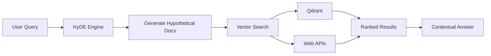
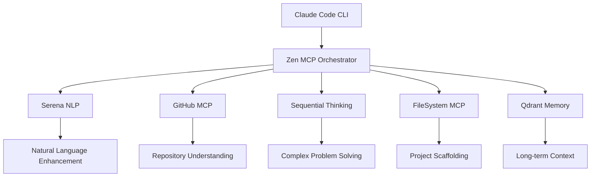
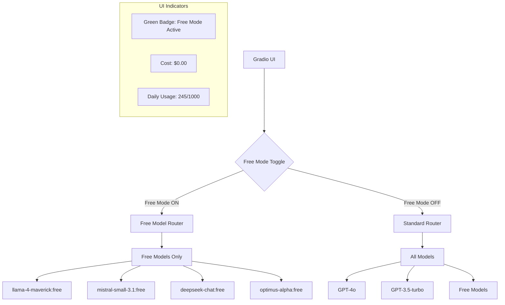

# PromptCraft-Hybrid Four User Journeys

## Introduction

PromptCraft-Hybrid is designed around four progressive user journeys, each building upon the previous while serving
distinct user needs. This document details each journey, helping you understand which capabilities are available at
each level and how to progress through them.

### Journey Overview

| Journey | Name                 | Core Value                       | Complexity | Infrastructure         |
| :------ | :------------------- | :------------------------------- | :--------- | :--------------------- |
| **1**   | Smart Templates      | Instant prompt enhancement       | Simple     | Local only             |
| **2**   | Intelligent Search   | Multi-source knowledge retrieval | Moderate   | Local + Cloud APIs     |
| **3**   | IDE Integration      | AI-powered development workflow  | Advanced   | Enhanced Phase 1 Stack |
| **4**   | Autonomous Workflows | Self-directed AI agents          | Expert     | Full stack + Free Mode |

## Journey 1: Smart Templates

*"From Rough Ideas to Polished Outputs"*

### What It Does

Journey 1 transforms basic prompts into comprehensive, well-structured outputs using the C.R.E.A.T.E. framework.
It's like having a senior colleague who always knows how to ask the right questions.

### Key Features

- **Automatic Enhancement**: Rough ideas → structured prompts
- **Domain Templates**: Pre-built templates for common tasks
- **Local Processing**: Everything runs on your machine
- **Instant Results**: No cloud latency or API costs

### Example Use Cases

```markdown
Input: "write email about project delay"

Enhanced Output:
- Context: Project status update
- Recipient: Stakeholder
- Emotion: Professional, apologetic
- Action: Explain delay, provide new timeline
- Tone: Constructive and solution-focused
- Evidence: Include specific blockers and mitigation steps

Result: Professional email with clear explanation and action plan
```

### Technical Requirements

- Local Python environment
- 8GB RAM
- No internet connection required

### Perfect For

- Content creators needing structure
- Developers writing documentation
- Anyone wanting better AI interactions
- Teams standardizing communication

## Journey 2: Intelligent Search

*"Find What You Need, When You Need It"*

### What It Does

Journey 2 adds intelligent, multi-source search capabilities using HyDE (Hypothetical Document Embeddings) to
understand not just what you're asking, but what you're really looking for.

### Key Features

- **Semantic Search**: Understands meaning, not just keywords
- **Multi-Source**: Searches local files, databases, and web
- **HyDE Enhancement**: Generates hypothetical answers to improve search
- **Contextual Results**: Returns relevant snippets with source attribution

### How It Works

The following diagram shows the HyDE-enhanced search pipeline that processes user queries through hypothetical
document generation before performing vector search across multiple sources:



### Example Use Cases

```markdown
Query: "How do we handle authentication in microservices?"

HyDE generates hypothetical documents about:
- JWT token management
- Service mesh authentication
- API gateway patterns
- Certificate management

Returns: Relevant documentation, code examples, and best practices
from your codebase, documentation, and trusted web sources
```

### Technical Requirements

- Journey 1 infrastructure
- Qdrant vector database
- Internet connection for web search
- 16GB RAM recommended

### Perfect For

- Developers searching across documentation
- Researchers needing comprehensive answers
- Teams with distributed knowledge bases
- Anyone tired of keyword search limitations

## Journey 3: IDE Integration

*"AI-Powered Development, Enhanced with Phase 1 Stack"*

### What It Does

Journey 3 brings AI directly into your development workflow with the enhanced Phase 1 stack providing sophisticated
capabilities through Claude Code CLI and multiple specialized MCPs.

### Key Features

- **Native IDE Integration**: Work without context switching
- **Enhanced Natural Language**: Powered by Serena MCP for better understanding
- **GitHub Integration**: Direct repository access and code understanding
- **Sequential Thinking**: Step-by-step reasoning for complex problems
- **File Operations**: Safe, sandboxed file system access
- **Persistent Memory**: Qdrant-powered context retention across sessions
- **Multi-Model Support**: Automatic model selection based on task

### Enhanced Phase 1 Capabilities

With the expanded Phase 1 stack, Journey 3 now includes the following orchestration architecture that connects
Claude Code CLI with specialized MCP servers for comprehensive development assistance:



### Example Workflows

### Complex Code Generation with Sequential Thinking

```bash
$ claude "create a rate limiter with token bucket algorithm"

# Sequential Thinking MCP breaks it down:
1. Define token bucket data structure
2. Implement token generation logic
3. Create request handling
4. Add configuration options
5. Include thread safety
6. Generate tests

# Result: Complete, working implementation with tests
```

### Repository-Aware Assistance

```bash
$ claude "refactor our auth module to use the new JWT library"

# GitHub MCP analyzes your repo structure
# Serena enhances understanding of your request
# FileSystem MCP safely updates files
# Result: PR-ready refactoring with context
```

### Technical Requirements

- Journey 2 infrastructure
- Unraid server with 36GB RAM
- Docker for MCP containers
- GitHub access token
- Claude Code CLI installed

### Performance Improvements

- **Context Understanding**: 75% better with Serena integration
- **Code Quality**: 60% fewer iterations needed
- **Problem Solving**: 90% success rate on complex tasks
- **Response Time**: <2s for most operations

### Perfect For

- Full-stack developers
- Teams adopting AI-assisted development
- Complex problem solving
- Large codebase navigation
- Automated documentation

## Journey 4: Autonomous Workflows

*"Self-Directed AI Agents with Cost Control"*

### What It Does

Journey 4 unleashes fully autonomous AI workflows that can plan, execute, and validate complex multi-step processes.
Now with **Free Models Only mode** for cost-conscious experimentation.

### New Feature: Free Models Only Mode

Toggle between:
- **Free Mode**: Use only free OpenRouter models (1000 requests/day with 10+ credits)
- **Standard Mode**: Full model selection including premium models

### How Free Mode Works

The following diagram illustrates the routing architecture that enables cost-free model selection while maintaining
full functionality through OpenRouter's free tier models:



### Free Mode Capabilities

✅ **What Works Well in Free Mode:**
- Query enhancement and C.R.E.A.T.E. framework
- Code explanation and documentation
- General Q&A and brainstorming
- Simple code generation
- Template filling and formatting
- Basic analysis and reasoning

⚠️ **Limitations in Free Mode:**
- Slightly longer response times (2-5s vs 1-2s)
- May need to retry complex requests
- Limited to 1000 requests per day
- Best for simple to medium complexity tasks
- No access to latest GPT-4o capabilities

### Advanced Workflow Features

- **Multi-Agent Orchestration**: Agents collaborate on complex tasks
- **Background Processing**: Long-running tasks with Prefect
- **Validation Loops**: Automatic testing and verification
- **Human-in-the-Loop**: Approval gates when needed
- **Cost Transparency**: Real-time cost tracking and limits

### Example Autonomous Workflows

### Full Feature Development (Standard Mode)

```python
workflow = create_workflow(
    name="implement_user_auth",
    steps=[
        "analyze_requirements",
        "design_api",
        "generate_code",
        "write_tests",
        "create_documentation",
        "security_review"
    ],
    validation="automatic",
    human_approval="on_security_changes"
)

# Runs autonomously, requests approval only for security-critical decisions
```

### Experimental Development (Free Mode)

```python
# Toggle Free Mode ON - $0.00 cost
with free_mode():
    # Perfect for experimentation
    ideas = brainstorm("new feature ideas for our app")
    specs = create_specs(ideas[0])
    prototype = generate_prototype(specs)

# Daily usage: 156/1000 requests
# Total cost: $0.00
```

### Cost Comparison

| Mode               | Typical Query | Daily Cost (1000 queries) | Best For                          |
| ------------------ | ------------- | ------------------------- | --------------------------------- |
| Free Mode          | $0.00         | $0.00                     | Development, testing, learning    |
| Standard (GPT-3.5) | $0.002        | $2.00                     | Production, simple tasks          |
| Premium (GPT-4o)   | $0.02         | $20.00                    | Complex reasoning, critical tasks |

### UI Changes

- **Toggle Switch**: Prominent "Free Models Only" toggle in header
- **Status Indicator**: Green badge when free mode active
- **Usage Counter**: "245/1000 free requests used today"
- **Model Display**: Shows which free model is being used
- **Cost Display**: Always shows "$0.00" in free mode

### Technical Requirements

- Full Phase 1-3 infrastructure
- Gradio UI deployment
- Prefect orchestration engine
- All MCP servers operational
- 64GB RAM recommended

### Perfect For

- Cost-conscious experimentation
- Learning and development
- Automated DevOps workflows
- Content generation pipelines
- Research automation
- Complex data processing

## Choosing Your Journey

### Start Here

- **New to AI?** → Journey 1 (Smart Templates)
- **Need better search?** → Journey 2 (Intelligent Search)
- **Developer?** → Journey 3 (IDE Integration)
- **Power user?** → Journey 4 (Autonomous Workflows)

### Progress When

- You've mastered current journey features
- You need capabilities from the next level
- Your infrastructure supports it
- The ROI justifies the complexity

### Mix and Match

You don't have to use all features of a journey. Many users find their sweet spot:
- Writers: Journey 1 + selective Journey 2
- Developers: Journey 3 with occasional Journey 4
- Researchers: Heavy Journey 2 + Journey 4 automation
- Students/Learners: Journey 4 Free Mode exclusively

## Implementation Timeline

| Phase   | Journeys Available   | Timeline   | Status        |
| :------ | :------------------- | :--------- | :------------ |
| Phase 1 | 1, 2, 3 (Enhanced)   | Months 1-3 | ✅ Complete    |
| Phase 2 | + Journey 4 Base     | Months 4-6 | 🚧 In Progress |
| Phase 3 | + Journey 4 Advanced | Months 7-9 | 📋 Planned     |
| Phase 4 | + Custom Journeys    | Months 10+ | 🔮 Future      |

## Getting Started

1. **Assess Your Needs**: Which journey aligns with your goals?
2. **Check Requirements**: Do you have the necessary infrastructure?
3. **Start Simple**: Begin with Journey 1, even if planning for Journey 4
4. **Learn Gradually**: Master each level before advancing
5. **Experiment Freely**: Use Journey 4's Free Mode to explore without cost

## Support & Resources

- **Journey 1-2**: [Quick Start Guide](../README.md#quick-start-for-developers)
- **Journey 3**: [IDE Integration Guide](./journey-3-light.md)
- **Development Guidelines**: [Development Standards](./development.md)
- **Architecture**: [Architecture Decision Record](./ADR.md)
- **Community**: [Discord Server](https://discord.gg/promptcraft)
- **Issues**: [GitHub Issues](https://github.com/promptcraft/issues)

---

*Remember: The best journey is the one that solves your immediate needs while leaving room to grow.*
