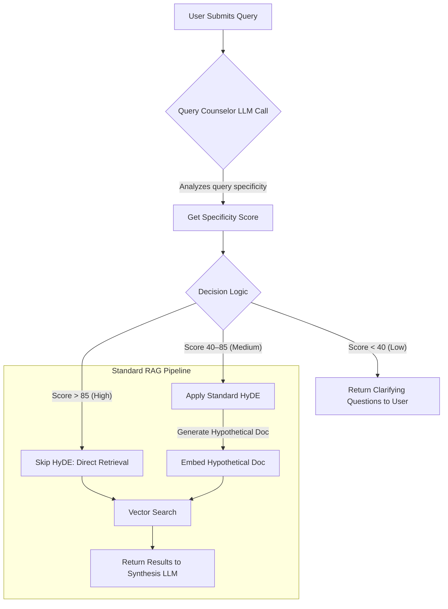

# HyDE Architecture Deep Dive

**Version:** 2.0
**Status:** Draft
**Audience:** AI Engineers, Architects, Developers

---

## 1. Introduction: A Pragmatic Approach to HyDE

This document provides a detailed technical breakdown of the Hypothetical Document Embeddings (HyDE) process. The goal of HyDE is to solve the "impedance mismatch" that occurs when short or ambiguous user queries fail to align with the detailed documents in our vector knowledge base.

*This document expands on **ADR-005**. The implementation is a **Query Counselor** model that analyzes every query to determine if HyDE is needed. This approach prioritizes consistency and leverages a single LLM call for analysis, providing a clear and maintainable design.*

---

## 2. The HyDE Workflow

The HyDE process is a dynamic, conditional first step in our RAG pipeline. Every query is first sent to the Query Counselor. Based on the counselor's analysis, the system either proceeds directly to retrieval or first generates a hypothetical document to enrich the search.



---

## 3. The Query Counselor: Implementation

The Query Counselor is a focused component responsible for assessing every user query. It uses a single, fast LLM call with a structured prompt to get a JSON response indicating specificity and optional guiding questions.

### 3.1. Meta-Prompt for Query Counselor

```
You are a Query Analysis Expert. Assess the clarity and specificity of the following user query on a scale of 0 to 100. If the score is below 40, also generate 1–3 concise guiding questions.

Respond with only a JSON object matching this schema:
{
  "specificity_score": <number>,
  "reasoning": "<brief explanation>",
  "guiding_questions": ["<question1>", ...]
}
```

### 3.2. Tiered Decision Logic

* **High Confidence (score > 85):** Skip HyDE; proceed directly to retrieval with the original query embedding.
* **Medium Confidence (score 40–85):** Apply **Standard HyDE** to enrich the search vector.
* **Low Confidence (score < 40):** Do not retrieve. Return the `guiding_questions` array to prompt the user for clarity.

Error handling: If the Query Counselor call fails, default to medium confidence.

---

## 4. HyDE Application Patterns

### 4.1. Standard HyDE (Phase 1)

* **Process:** Generate one hypothetical document from the user query, embed it, and use that vector for the Qdrant search.
* **Prompt Example (to a fast model):**

  > "Write a passage that could answer the following question: 'How do I implement a reranker cache?'"

### 4.2. Future Enhancements (Phase 3+)

* **Multi-Query HyDE:** Produce separate hypothetical docs for distinct query concepts.
* **Conversational HyDE:** Incorporate dialogue context into hypothetical document generation.

---

## 5. Implementation Verification Checklist

A developer can consider the HyDE component complete when they verify:

* [ ] A `QueryCounselor` module exists that calls the LLM with the specified meta-prompt.
* [ ] JSON responses are parsed for `specificity_score`, `reasoning`, and `guiding_questions`.
* [ ] Tiered Decision Logic is implemented in the main pipeline: high, medium, low confidence paths.
* [ ] For **High**, the HyDE step is skipped.
* [ ] For **Medium**, the Standard HyDE pattern runs and its vector is used for search.
* [ ] For **Low**, `guiding_questions` are returned to the user without retrieval.
* [ ] A fallback to medium confidence exists if the counselor fails.

---
