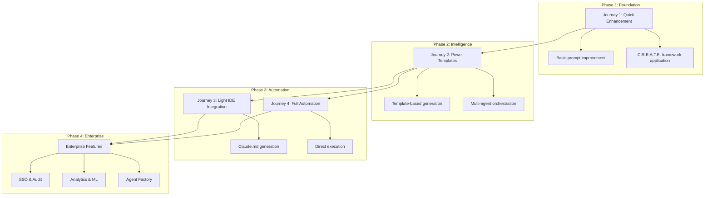
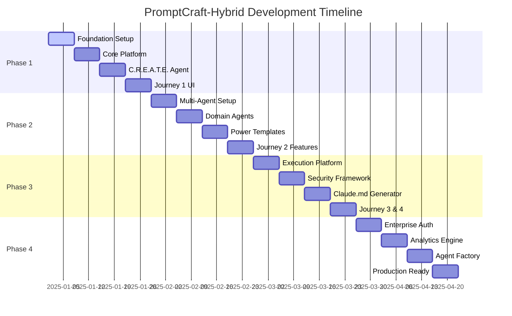
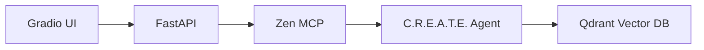
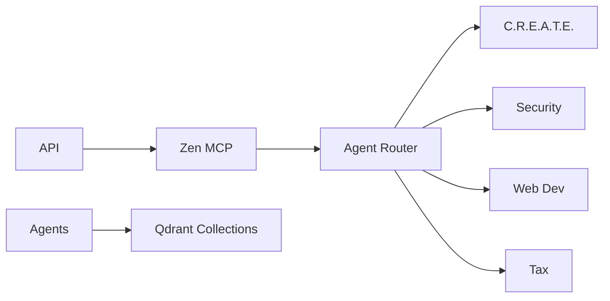
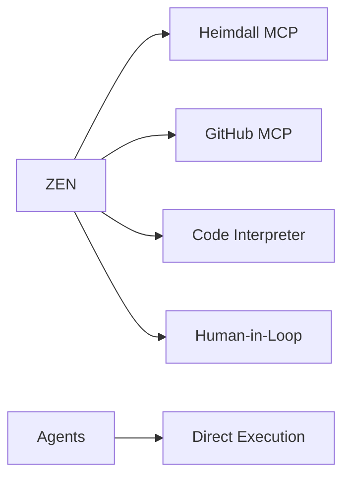
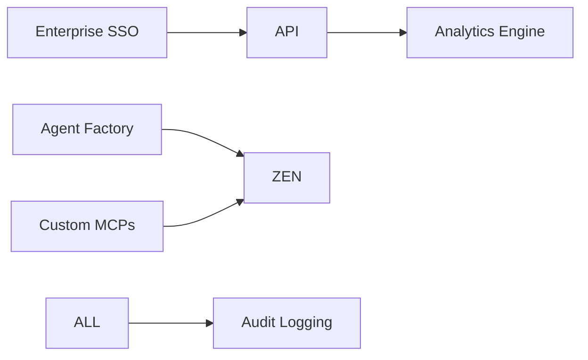
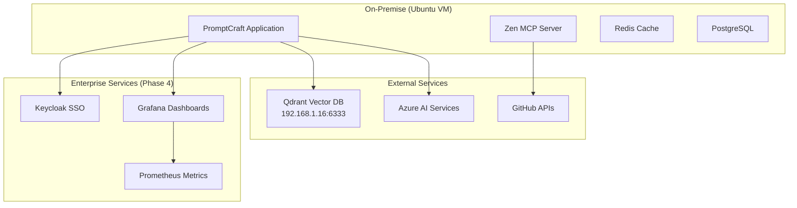
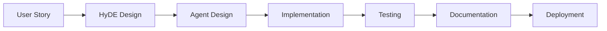
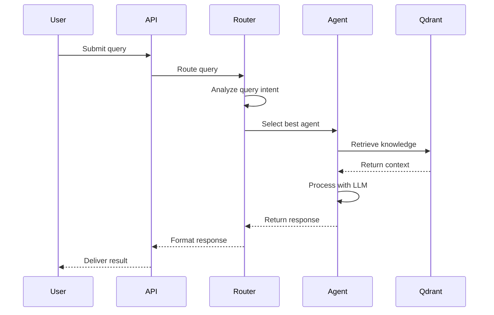
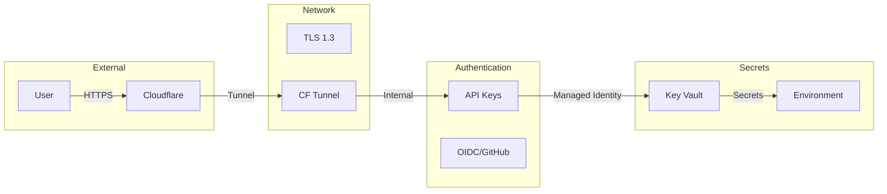

# PromptCraft-Hybrid: Project Charter & Execution Plan v2.0

AI-Powered Prompt Intelligence Platform with Multi-Agent Orchestration

Date: January 2025
Version: 2.0
Project Duration: 16 Weeks (4 Phases)

---

## Table of Contents

<!-- toc -->
- [1. Executive Overview](#1-executive-overview)
- [2. System Architecture](#2-system-architecture)
- [3. Four-Phase Development Strategy](#3-four-phase-development-strategy)
- [4. Milestone & Issue Management](#4-milestone--issue-management)
- [5. Technology Stack & Justification](#5-technology-stack--justification)
- [6. Development Approach](#6-development-approach)
- [7. Phase-by-Phase Implementation](#7-phase-by-phase-implementation)
- [8. Multi-Agent Architecture](#8-multi-agent-architecture)
- [9. Security Architecture](#9-security-architecture)
- [10. API Specifications](#10-api-specifications)
- [11. Deployment Guide](#11-deployment-guide)
- [12. Budget & Resource Management](#12-budget--resource-management)
- [13. Success Criteria & Metrics](#13-success-criteria--metrics)
- [14. Risk Mitigation](#14-risk-mitigation)
- [15. Team Structure & Onboarding](#15-team-structure--onboarding)
<!-- tocstop -->

---

## 1. Executive Overview

### 1.1. Project Vision

PromptCraft-Hybrid is an enterprise-ready AI workbench that transforms queries into accurate, context-aware outputs
through intelligent **multi-agent orchestration** and **hybrid infrastructure**. The platform progressively evolves
through four distinct phases, from foundation to enterprise-ready automation.

### 1.2. Core Value Propositions

1. **Progressive User Journeys**: Four distinct pathways from simple enhancement to full automation
2. **Multi-Agent Intelligence**: Specialized AI agents coordinated through Zen MCP Server
3. **C.R.E.A.T.E. Framework Excellence**: Structured prompt generation following proven methodology
4. **Hybrid Architecture**: On-premise compute with external Qdrant vector database
5. **Enterprise Features**: SSO, audit logging, automated agent creation, and analytics
6. **Dual Orchestration**: Zen MCP Server for real-time + Prefect for background workflows
7. **HyDE Query Enhancement**: Three-tier query analysis for improved retrieval accuracy
8. **Claude.md Excellence**: Generate project-specific configurations for development teams

### 1.3. Key Innovations

1. **Four Progressive Journeys**: Structured pathways for different user maturity levels
2. **Agent-First Design**: Specialized experts with dedicated knowledge bases
3. **Dual-Orchestration Model**: Real-time and background workflow coordination
4. **Automated Agent Factory**: CLI tools and templates for rapid agent deployment
5. **Enterprise Integration**: SSO, audit logging, and compliance features

### 1.4. Target Agent Suite (By Phase)

**Phase 1**: Foundation with C.R.E.A.T.E. agent
**Phase 2**: Security agent, Web development agent, Tax compliance agent (IRS 8867)
**Phase 3**: Execution agents with direct command capabilities
**Phase 4**: Enterprise agents with automated creation and custom MCP integration

---

## 3. Four-Phase Development Strategy

### 3.1. Phase Overview

| Phase | Duration | Focus | Key Deliverables |
|-------|----------|-------|------------------|
| **Phase 1** | Weeks 1-4 | Foundation & Journey 1 | C.R.E.A.T.E. agent, basic UI, prompt enhancement |
| **Phase 2** | Weeks 5-8 | Multi-Agent & Journey 2 | 3 specialized agents, power templates, MCP integration |
| **Phase 3** | Weeks 9-12 | Execution & Journey 3/4 | Direct execution, Claude.md generation, automation |
| **Phase 4** | Weeks 13-16 | Enterprise Features | SSO, analytics, agent factory, enterprise scaling |

### 3.2. Progressive User Journeys



### 3.3. Technical Architecture Evolution

**Phase 1**: Single C.R.E.A.T.E. agent with basic Zen MCP integration
**Phase 2**: Multi-agent orchestration with specialized domain experts
**Phase 3**: Direct execution capabilities with enhanced security
**Phase 4**: Enterprise features with automated scaling and management

---

## 4. Milestone & Issue Management

### 4.1. Documentation Structure

The project is organized with comprehensive documentation for each phase:

- **Planning**: [Overall Milestones & Issues](pc_milestones_issues.md) - Complete work breakdown
- **Phase 1**: [Foundation Issues](phase-1-issues.md) - 12 detailed issues for weeks 1-4
- **Phase 2**: [Multi-Agent Issues](phase-2-issues.md) - Agent orchestration and domain experts
- **Phase 3**: [Execution Issues](phase-3-issues.md) - Direct execution and automation
- **Phase 4**: [Enterprise Issues](phase-4-issues.md) - Enterprise features and scaling

### 4.2. Technical Specifications

Each phase includes three focused technical documents:

#### Phase 1: Foundation & MVP

- **[Strategic Overview](ts-1-overview.md)**: Executive summary and architectural decisions
- **[Implementation Guide](ts-1-implementation.md)**: Code examples and configurations
- **[Testing Strategy](ts-1-testing.md)**: Quality assurance and validation

#### Phase 2: Multi-Agent Orchestration

- **[Strategic Overview](ts-2-overview.md)**: Multi-agent architecture decisions
- **[Implementation Guide](ts-2-implementation.md)**: Agent creation and MCP integration
- **[Testing Strategy](ts-2-testing.md)**: Multi-agent testing and coordination

#### Phase 3: Direct Execution

- **[Strategic Overview](ts-3-overview.md)**: Execution platform architecture
- **[Implementation Guide](ts-3-implementation.md)**: Security and execution frameworks
- **[Testing Strategy](ts-3-testing.md)**: Security validation and execution testing

#### Phase 4: Enterprise Features

- **[Strategic Overview](ts-4-overview.md)**: Enterprise architecture and scaling
- **[Implementation Guide](ts-4-implementation.md)**: SSO, analytics, and automation
- **[Testing Strategy](ts-4-testing.md)**: Enterprise testing and compliance

### 4.3. Milestone Tracking



---

## 2. System Architecture

### 2.1. Multi-Agent Orchestration Architecture

```mermaid
graph TB
    subgraph "User Interface Layer"
        UI[Gradio Web Interface]
        API[FastAPI REST API]
        CLI[Agent Factory CLI]
    end

    subgraph "Orchestration Layer"
        ZEN[Zen MCP Server]
        PREF[Prefect Workflows]
        QC[Query Counselor]
        ROUTER[Agent Router]
    end

    subgraph "MCP Ecosystem"
        H[Heimdall MCP]
        GH[GitHub MCP]
        CI[Code Interpreter MCP]
        HITL[Human-in-Loop MCP]
        CUSTOM[Custom MCP Registry]
    end

    subgraph "Specialized Agents"
        CREATE[C.R.E.A.T.E. Agent]
        SEC[Security Agent]
        WEB[Web Dev Agent]
        TAX[Tax Agent]
        EXEC[Execution Agents]
    end

    subgraph "Data Layer"
        Q[External Qdrant<br/>192.168.1.16:6333]
        R[Redis Cache]
        PG[PostgreSQL Analytics<br/>(Phase 4)]
    end

    subgraph "Enterprise Layer (Phase 4)"
        SSO[Keycloak SSO]
        AF[Agent Factory]
        ANALYTICS[Analytics Engine]
        AUDIT[Audit Logger]
    end

    UI --> API
    API --> ZEN
    ZEN --> QC
    ZEN --> ROUTER
    ROUTER --> Agents
    ZEN --> MCP
    Agents --> Q
    API --> R

    %% Phase 4 connections
    API --> SSO
    AF --> ZEN
    ANALYTICS --> PG
    AUDIT --> PG
```

### 2.2. Progressive Architecture Evolution

#### Phase 1: Foundation



#### Phase 2: Multi-Agent



#### Phase 3: Execution Platform



#### Phase 4: Enterprise Ready



### 2.3. Hybrid Infrastructure Model



---

## 3. Repository Structure

### 3.1. Complete Project Structure

```text
PromptCraft-Hybrid/
├── .github/                     # CI/CD from ledgerbase
│   ├── workflows/
│   ├── ISSUE_TEMPLATE/
│   └── pull_request_template.md
│
├── agents/                      # Agent definitions
│   ├── README.md               # Agent creation guide
│   ├── base/                   # Base agent classes
│   │   ├── __init__.py
│   │   ├── focused_agent.py
│   │   └── agent_manager.py
│   ├── xero/                   # Xero accounting agent
│   │   ├── agent.yaml
│   │   ├── agent.py
│   │   ├── knowledge/
│   │   │   ├── chart_of_accounts.json
│   │   │   └── accounting_rules.md
│   │   ├── prompts/
│   │   │   └── bookkeeping.j2
│   │   └── tests/
│   ├── irs_8867/
│   ├── mtg/
│   ├── create/
│   │   ├── agent.yaml
│   │   ├── agent.py
│   │   ├── knowledge/
│   │   │   ├── 00_Quick-Reference.md
│   │   │   └── hyde_design.pdf
│   │   └── prompts/
│   │       └── create_framework.j2
│   └── _template/
│
├── src/
│   └── promptcraft/
│       ├── agents/             # Agent system
│       │   ├── __init__.py
│       │   ├── base.py
│       │   ├── orchestrator.py
│       │   └── registry.py
│       ├── intelligence/       # HyDE & query processing
│       │   ├── __init__.py
│       │   ├── hyde_processor.py
│       │   ├── query_counselor.py
│       │   └── search_router.py
│       ├── api/               # API endpoints
│       ├── ui/                # Gradio interface
│       ├── generators/        # Claude.md generation
│       ├── journeys/          # User journey implementations
│       │   ├── quick_enhancement.py
│       │   ├── power_templates.py
│       │   ├── claude_code.py
│       │   └── direct_execution.py
│       ├── mcp/              # MCP integrations
│       └── utils/
│
├── config/
│   ├── zen.yaml              # Zen MCP configuration
│   ├── agents.yaml           # Agent registry
│   ├── hyde.yaml             # HyDE configuration
│   └── redis.conf
│
├── scripts/
│   ├── create_agent.py       # Agent creation
│   ├── update_agent.py       # Agent updates
│   ├── test_hyde.py          # HyDE testing
│   └── index_knowledge.py    # Knowledge indexing
│
├── docs/
│   ├── architecture/
│   │   └── ADR.md           # Architecture Decision Record
│   ├── agent_creation_guide.md
│   └── hyde_implementation.md
│
├── docker/
│   ├── Dockerfile
│   └── docker-compose.yml
│
├── tests/
│   ├── unit/
│   ├── integration/
│   └── fixtures/
│       └── hyde_test_queries.json
│
└── pyproject.toml            # AssuredOSS configuration
```

---

## 5. Technology Stack & Justification

### 4.1. Core Technologies with HyDE Support

| Technology | Version | Purpose | HyDE/Agent Role |
|---|---|---|---|
| **Python** | 3.11+ | Primary language | All implementation |
| **Sequential Thinking** | Latest | Query analysis | Specificity scoring |
| **Qdrant** | 1.9 | Vector database | Agent collections + HyDE |
| **Gradio** | 4.36 | UI framework | Journey interfaces |
| **Zen MCP** | Latest | Orchestration | Tool coordination |
| **Redis** | 7.0 | Caching | HyDE results cache |
| **Jinja2** | 3.1 | Templating | Prompt generation |

### 4.2. HyDE-Specific Components

| Component | Purpose | Integration |
|---|---|---|
| **Query Counselor** | Specificity analysis | Via Sequential Thinking |
| **Hypothetical Generator** | Create ideal documents | Via Zen MCP |
| **Enhanced Retriever** | Similarity search | Via Qdrant |
| **Result Merger** | Combine retrievals | Custom logic |

---

## 6. Development Approach

### 5.1. Development Principles with HyDE

1. **Query Intelligence First**: HyDE enhancement before processing
2. **Agent Modularity**: Each agent is completely independent
3. **C.R.E.A.T.E. Compliance**: All prompts follow the framework
4. **Security by Design**: AssuredOSS from day one
5. **Test-Driven**: HyDE patterns thoroughly tested
6. **Documentation**: Clear guides for both HyDE and agents

### 5.2. Development Workflow



---

## 7. Phase-by-Phase Implementation

### 7.1. Phase 1: Foundation & Journey 1 (Weeks 1-4)

**Objective**: Establish core platform with C.R.E.A.T.E. agent and basic prompt enhancement

#### Week 1: Foundation Setup

- [ ] Development environment setup (Issue #1)
- [ ] Repository structure creation (Issue #2)
- [ ] External Qdrant connection (Issue #3)
- [ ] Basic Zen MCP integration (Issue #4)

#### Week 2: Core Platform

- [ ] FastAPI backend framework (Issue #5)
- [ ] Basic Gradio UI (Issue #6)
- [ ] Redis caching layer (Issue #7)
- [ ] Configuration management (Issue #8)

#### Week 3: C.R.E.A.T.E. Agent

- [ ] C.R.E.A.T.E. agent implementation (Issue #9)
- [ ] Knowledge base ingestion (Issue #10)
- [ ] Query processing pipeline (Issue #11)

#### Week 4: Journey 1 Features

- [ ] Journey 1 UI completion (Issue #12)
- [ ] End-to-end testing
- [ ] Documentation and deployment

**Deliverables**: Working prompt enhancement system with C.R.E.A.T.E. framework

### 7.2. Phase 2: Multi-Agent Orchestration (Weeks 5-8)

**Objective**: Deploy specialized agents with intelligent routing and power templates

#### Week 5: Multi-Agent Foundation

- Agent orchestration framework
- Agent router implementation
- Security agent deployment

#### Week 6: Domain Experts

- Web development agent
- Tax compliance agent (IRS 8867)
- Agent coordination testing

#### Week 7: Power Templates

- Template discovery system
- Journey 2 UI development
- Advanced routing logic

#### Week 8: Integration & Polish

- MCP server integration
- Performance optimization
- Cross-agent workflows

**Deliverables**: Multi-agent system with 3 specialized domain experts

### 7.3. Phase 3: Direct Execution (Weeks 9-12)

**Objective**: Enable direct command execution with security and Claude.md generation

#### Week 9: Execution Platform

- Heimdall MCP integration
- GitHub MCP integration
- Security framework implementation

#### Week 10: Code Intelligence

- Code Interpreter MCP
- Human-in-Loop MCP
- Project analysis capabilities

#### Week 11: Claude.md Generation

- Project structure analysis
- Claude.md template system
- Journey 3 implementation

#### Week 12: Automation Features

- Journey 4 direct execution
- Workflow automation
- Security validation

**Deliverables**: Full execution platform with Claude.md generation

### 7.4. Phase 4: Enterprise Features (Weeks 13-16)

**Objective**: Enterprise-ready platform with automated scaling and management

#### Week 13: Enterprise Infrastructure

- Keycloak SSO integration
- PostgreSQL analytics database
- Enterprise monitoring stack

#### Week 14: Analytics & Intelligence

- Usage analytics engine
- ML optimization models
- Grafana dashboards

#### Week 15: Automation Tools

- Agent Factory CLI
- Custom MCP registry
- Automated deployment

#### Week 16: Production Readiness

- Load testing and optimization
- Security audit
- Documentation and training

**Deliverables**: Enterprise-ready platform with full automation capabilities

---

## 8. Multi-Agent Architecture

### 8.1. Agent Design Principles

1. **Domain Specialization**: Each agent focuses on specific expertise areas
2. **Knowledge Isolation**: Dedicated Qdrant collections per agent
3. **Modular Design**: Agents can be developed and deployed independently
4. **Standard Interface**: Common API for orchestrator integration
5. **Extensibility**: Easy addition of new agents through factory pattern

### 8.2. Core Agent Suite

#### C.R.E.A.T.E. Agent (Phase 1)

- **Purpose**: Prompt engineering framework expertise
- **Knowledge**: C.R.E.A.T.E. methodology, examples, best practices
- **Capabilities**: Prompt analysis, framework application, style guidance

#### Security Agent (Phase 2)

- **Purpose**: Code security analysis and recommendations
- **Knowledge**: Security patterns, vulnerability databases, compliance requirements
- **Capabilities**: Security scanning, threat assessment, remediation guidance
- **Integration**: Heimdall MCP for deep analysis

#### Web Development Agent (Phase 2)

- **Purpose**: Modern web development assistance
- **Knowledge**: Frameworks, patterns, best practices, component libraries
- **Capabilities**: Architecture advice, code generation, debugging assistance
- **Integration**: GitHub MCP for repository context

#### Tax Compliance Agent (Phase 2)

- **Purpose**: IRS Form 8867 due diligence compliance
- **Knowledge**: Tax regulations, compliance requirements, form guidance
- **Capabilities**: Compliance checking, form assistance, regulation interpretation

### 8.3. Agent Factory Pattern (Phase 4)

```bash
# Agent creation through CLI
pc-hybrid create-agent \
  --name "finance_agent" \
  --domain "finance" \
  --description "Financial analysis and reporting expert" \
  --knowledge-sources "finance_regulations.md,accounting_principles.json" \
  --capabilities "financial_analysis,report_generation,compliance_checking"
```

### 8.4. Agent Orchestration Flow



---

## 6. Detailed Implementation Plan

### 6.1. Phase 1: Foundation Setup

#### Day 1-2: Infrastructure Setup

```bash
# Morning Day 1
- [ ] Create Azure resource group
- [ ] Deploy Key Vault with AssuredOSS credentials
- [ ] Configure OIDC for GitHub Actions
- [ ] Set up budget alerts ($125/month)

# Afternoon Day 1
- [ ] Clone repository structure from ledgerbase
- [ ] Copy CI/CD workflows
- [ ] Configure branch protection
- [ ] Set up development environment

# Day 2
- [ ] Deploy Qdrant on NVMe storage
- [ ] Configure Cloudflare tunnel
- [ ] Set up Redis cache
- [ ] Deploy docker-compose stack
- [ ] Verify all services healthy
```

#### Day 3: HyDE Foundation Setup 🆕

```bash
# Create HyDE configuration
cat > config/hyde.yaml << EOF
hyde:
  thresholds:
    high_confidence: 85
    medium_confidence: 40
  models:
    hypothetical_generation: "phi-3-mini"
    query_analysis: "gpt-3.5-turbo"
  cache:
    ttl: 3600
    max_size: 1000
EOF

# Set up HyDE test fixtures
mkdir -p tests/fixtures/hyde
cp docs/examples/hyde_queries.json tests/fixtures/hyde/
```

#### Day 4-5: Core Services & Initial Agents

```yaml
# Deploy all MCP servers
services:
  sequential-thinking:
    image: sequential-thinking:latest
    healthcheck:
      test: ["CMD", "curl", "-f", "http://localhost:3001/health"]

  heimdall:
    image: heimdall-mcp:latest

  # ... deploy all 8 MCP servers
```

### 6.2. Week 1: Core Platform + HyDE Integration

#### Key Deliverables

1. **HyDE Processor Implementation**

   ```python
   # src/promptcraft/intelligence/hyde_processor.py
   from typing import Dict, Optional, Tuple
   import asyncio

   class HyDEProcessor:
       """Implements HyDE pattern for query enhancement"""

       def __init__(self, zen_client, redis_cache):
           self.zen = zen_client
           self.cache = redis_cache
           self.thresholds = {
               "high": 85,
               "medium": 40
           }

       async def process_query(self, query: str, target_framework: str = "create") -> Dict:
           """Process query through HyDE pipeline"""
           # Check cache first
           cache_key = f"hyde:{hash(query + target_framework)}"
           cached = await self.cache.get(cache_key)
           if cached:
               return cached

           # Step 1: Analyze query specificity
           analysis = await self._analyze_specificity(query)

           # Step 2: Route based on specificity
           if analysis["specificity_score"] > self.thresholds["high"]:
               result = await self._direct_processing(query, analysis)
           elif analysis["specificity_score"] > self.thresholds["medium"]:
               result = await self._hyde_enhancement(query, analysis, target_framework)
           else:
               result = await self._clarification_needed(query, analysis)

           # Cache result
           await self.cache.set(cache_key, result, ttl=3600)

           return result

       async def _analyze_specificity(self, query: str) -> Dict:
           """Use Query Counselor pattern for analysis"""
           response = await self.zen.call_tool(
               server="sequential-thinking",
               tool="analyze_query",
               params={
                   "query": query,
                   "analysis_prompt": """
                   Assess the clarity and specificity of this query on a scale of 0 to 100.
                   Consider: completeness, ambiguity, technical detail, and actionability.
                   Return JSON: {"specificity_score": <number>, "reasoning": "<explanation>",
                                "guiding_questions": ["<q1>", "<q2>"], "detected_facets": ["<f1>", "<f2>"]}
                   """
               }
           )
           return response

       async def _hyde_enhancement(self, query: str, analysis: Dict, framework: str) -> Dict:
           """Generate hypothetical document for better retrieval"""
           # Check for multi-faceted queries
           if len(analysis.get("detected_facets", [])) > 1:
               return await self._multi_facet_hyde(query, analysis, framework)

           # Standard HyDE
           hypothetical = await self._generate_hypothetical(query, framework)
           enhanced_results = await self._retrieve_with_hypothetical(hypothetical)

           return {
               "method": "hyde_standard",
               "original_query": query,
               "hypothetical": hypothetical,
               "results": enhanced_results,
               "confidence": analysis["specificity_score"]
           }
   ```

2. **Query Counselor Integration**

   ```python
   # src/promptcraft/intelligence/query_counselor.py
   class QueryCounselor:
       """Implements Query Counselor pattern from HyDE design"""

       def __init__(self, zen_client):
           self.zen = zen_client
           self.counselor_prompt = """
           You are a Query Analysis Expert. Assess the clarity and specificity
           of the following user query on a scale of 0 to 100.

           If the score is below 40, generate 1-3 concise guiding questions.
           Identify distinct facets if the query covers multiple topics.

           Respond with JSON only:
           {
               "specificity_score": <number>,
               "reasoning": "<brief explanation>",
               "guiding_questions": ["<question_1>", "<question_2>"],
               "detected_facets": ["<facet_1>", "<facet_2>"],
               "ambiguity_areas": ["<area_1>", "<area_2>"]
           }
           """
   ```

3. **C.R.E.A.T.E. Integration with HyDE**

   ```python
   # src/promptcraft/journeys/quick_enhancement.py
   class QuickEnhancementJourney:
       """Journey 1: Transform basic queries into C.R.E.A.T.E. prompts"""

       def __init__(self, hyde_processor, create_agent):
           self.hyde = hyde_processor
           self.create = create_agent

       async def enhance_prompt(self, user_query: str) -> Dict:
           """Main entry point for prompt enhancement"""
           # Process through HyDE
           hyde_result = await self.hyde.process_query(
               query=user_query,
               target_framework="create"
           )

           if hyde_result["method"] == "clarification_needed":
               return {
                   "status": "needs_clarification",
                   "questions": hyde_result["guiding_questions"],
                   "original_query": user_query
               }

           # Build C.R.E.A.T.E. prompt from HyDE results
           create_prompt = await self._build_create_prompt(hyde_result)

           # Apply stylometry from Quick-Reference.md
           final_prompt = self._apply_stylometry(create_prompt)

           return {
               "status": "success",
               "original_query": user_query,
               "enhanced_prompt": final_prompt,
               "framework": "CREATE",
               "confidence": hyde_result["confidence"]
           }
   ```

### 6.3. Week 2: Intelligence Layer & Agent Knowledge

#### HyDE-Enhanced Agent Routing

```python
# src/promptcraft/agents/orchestrator.py
class AgentOrchestrator:
    """Routes queries to appropriate agents with HyDE enhancement"""

    def __init__(self, hyde_processor):
        self.hyde = hyde_processor
        self.agents = self._load_agents()

    async def route_query(self, query: str, use_hyde: bool = True) -> Dict:
        """Route query with optional HyDE enhancement"""
        # Enhance query if needed
        if use_hyde:
            hyde_result = await self.hyde.process_query(query)
            search_query = hyde_result.get("hypothetical", query)
        else:
            search_query = query

        # Find best matching agent
        best_agent = None
        best_score = 0

        for agent_id, agent in self.agents.items():
            score = await agent.calculate_relevance(search_query)
            if score > best_score:
                best_agent = agent
                best_score = score

        if best_agent and best_score > 0.7:
            response = await best_agent.process(query, {"hyde_enhanced": use_hyde})
            return {
                "agent": best_agent.agent_id,
                "response": response,
                "confidence": best_score,
                "hyde_used": use_hyde
            }

        # No specific agent matched
        return await self._general_response(query)
```

### 6.4. Week 3: User Journeys with HyDE

#### Journey Implementations

1. **Journey 1: Quick Enhancement (HyDE-powered)**

   ```python
   # Full C.R.E.A.T.E. generation with HyDE
   async def generate_create_prompt(query: str) -> str:
       hyde_result = await hyde_processor.process_query(query, "create")

       if hyde_result["method"] == "hyde_standard":
           # Search for C.R.E.A.T.E. components using enhanced query
           components = await search_create_components(hyde_result["hypothetical"])
       else:
           components = await search_create_components(query)

       # Build C.R.E.A.T.E. structure
       prompt = build_create_structure(components)

       # Apply stylometry directives
       return apply_stylometry_rules(prompt)
   ```

2. **Journey 2: Power Templates (HyDE-assisted search)**

   ```python
   # Template discovery with HyDE
   async def find_templates(query: str) -> List[Template]:
       # Use HyDE to better understand template needs
       hyde_result = await hyde_processor.process_query(query, "template")

       # Search template library
       templates = await template_searcher.find(
           query=hyde_result.get("hypothetical", query),
           original_query=query
       )

       return rank_templates(templates, query)
   ```

3. **Journey 3: Claude Code (Project analysis with HyDE)**

   ```python
   # Claude.md generation with context understanding
   async def generate_claude_md(project_path: str, requirements: str) -> str:
       # Use HyDE to understand vague requirements
       hyde_result = await hyde_processor.process_query(requirements, "claude_md")

       # Analyze project with enhanced understanding
       project_analysis = await analyze_project(project_path)

       # Generate Claude.md with both contexts
       return await generate_configuration(
           project_analysis,
           hyde_result,
           requirements
       )
   ```

### 6.5. Week 4: Agent Creation & HyDE Testing

#### New Issue #45: HyDE Test Suite

```markdown
## Description
Create comprehensive test suite for HyDE functionality

## Acceptance Criteria
- [ ] Test fixtures for all specificity levels (0-100)
- [ ] Multi-facet query tests
- [ ] Conversational HyDE tests
- [ ] Performance benchmarks
- [ ] Cache effectiveness tests
- [ ] Integration tests with each journey

## Test Categories
1. **Specificity Scoring**
   - Edge cases (very vague, very specific)
   - Domain-specific queries
   - Multi-language queries

2. **Hypothetical Generation**
   - Quality of generated documents
   - Relevance to original query
   - Framework compliance (C.R.E.A.T.E.)

3. **Retrieval Enhancement**
   - Precision/recall improvements
   - Response time impact
   - Cache hit rates
```

### 6.6. Week 5: Performance & Quality

#### HyDE Performance Optimization

```python
# src/promptcraft/intelligence/hyde_cache.py
class HyDECache:
    """Intelligent caching for HyDE results"""

    def __init__(self, redis_client):
        self.redis = redis_client
        self.ttl_matrix = {
            "high_specificity": 7200,    # 2 hours
            "medium_specificity": 3600,  # 1 hour
            "low_specificity": 900       # 15 minutes
        }

    async def get_or_compute(self, query: str, compute_func):
        # Semantic similarity check for cache
        similar_queries = await self._find_similar_cached(query)

        if similar_queries:
            best_match = similar_queries[0]
            if best_match["similarity"] > 0.95:
                return best_match["result"]

        # Compute and cache
        result = await compute_func(query)
        await self._cache_with_embedding(query, result)

        return result
```

---

## 7. Agent Creation Guide

[Previous content remains the same, with addition of HyDE integration]

### 7.3. HyDE Integration for New Agents

When creating a new agent, configure its HyDE behavior:

```yaml
# agents/my_agent/agent.yaml
hyde_config:
  enabled: true
  specificity_threshold: 0.8  # Higher = more selective
  hypothetical_template: |
    Generate a detailed answer about {domain} that would perfectly
    address this query: {query}
    Include specific terminology and examples from {domain}.
  facet_detection:
    enabled: true
    max_facets: 3
```

---

## 8. HyDE Implementation Strategy

### 8.1. Core HyDE Components

1. **Query Counselor**: Analyzes query specificity (0-100 score)
2. **Hypothetical Generator**: Creates ideal documents for retrieval
3. **Enhanced Retriever**: Uses hypothetical documents for better search
4. **Result Merger**: Combines multiple retrieval strategies

### 8.2. Tiered Processing Logic

```python
# config/hyde.yaml
hyde:
  tiers:
    high_confidence:
      min_score: 85
      action: "direct"
      description: "Query is specific enough for direct processing"

    medium_confidence:
      min_score: 40
      max_score: 85
      action: "enhance"
      description: "Query benefits from HyDE enhancement"
      strategies:
        - "standard_hyde"
        - "multi_facet_hyde"
        - "conversational_hyde"

    low_confidence:
      max_score: 40
      action: "clarify"
      description: "Query too vague, need user clarification"
      max_questions: 3
```

### 8.3. HyDE Patterns

1. **Standard HyDE**: Single hypothetical document generation
2. **Multi-Facet HyDE**: Multiple hypotheticals for complex queries
3. **Conversational HyDE**: Context-aware enhancement using history

### 8.4. Integration Points

- **Journey 1**: Full HyDE pipeline for C.R.E.A.T.E. generation
- **Journey 2**: HyDE for template discovery
- **Journey 3**: HyDE for understanding project requirements
- **Journey 4**: Optional HyDE for direct execution
- **Agent Routing**: HyDE-enhanced query matching

---

## 9. Security Architecture

### 9.1. Security Layers



### 9.2. Security Implementation

```python
# src/promptcraft/security/auth.py
from azure.identity import ManagedIdentityCredential
from azure.keyvault.secrets import SecretClient
import functools

class SecurityManager:
    def __init__(self):
        self.credential = ManagedIdentityCredential()
        self.key_vault = SecretClient(
            vault_url="https://kv-promptcraft.vault.azure.net",
            credential=self.credential
        )

    def get_secret(self, name: str) -> str:
        """Retrieve secret from Key Vault"""
        return self.key_vault.get_secret(name).value

    def require_auth(self, f):
        """Decorator for authenticated endpoints"""
        @functools.wraps(f)
        async def wrapper(request, *args, **kwargs):
            auth_header = request.headers.get("Authorization")
            if not self._validate_token(auth_header):
                raise HTTPException(401, "Unauthorized")
            return await f(request, *args, **kwargs)
        return wrapper
```

### 9.3. API Security

```python
# src/promptcraft/api/security.py
from fastapi import FastAPI, Request
from slowapi import Limiter
from slowapi.util import get_remote_address

# Rate limiting
limiter = Limiter(key_func=get_remote_address)
app = FastAPI()

@app.post("/api/generate")
@limiter.limit("10/minute")  # Expensive operation
async def generate_claude_md(request: Request, data: GenerateRequest):
    # Implementation
    pass

@app.get("/api/search")
@limiter.limit("100/minute")  # Cheaper operation
async def search(request: Request, query: str):
    # Implementation
    pass
```

---

## 10. API Specifications

### 10.1. REST API Endpoints

```yaml
openapi: 3.0.0
info:
  title: PromptCraft-Hybrid API
  version: 1.0.0

paths:
  /api/v1/enhance:
    post:
      summary: Journey 1 - Quick Enhancement
      requestBody:
        content:
          application/json:
            schema:
              type: object
              properties:
                query:
                  type: string
                  description: User's original query
                context:
                  type: object
                  description: Optional context
      responses:
        200:
          content:
            application/json:
              schema:
                type: object
                properties:
                  original:
                    type: string
                  enhanced:
                    type: string
                  confidence:
                    type: number

  /api/v1/claude-md/generate:
    post:
      summary: Journey 3 - Generate Claude.md
      requestBody:
        content:
          application/json:
            schema:
              type: object
              required: [project_path, role]
              properties:
                project_path:
                  type: string
                role:
                  type: string
                  enum: [architect, developer, reviewer]
                preferences:
                  type: object
      responses:
        200:
          content:
            application/json:
              schema:
                type: object
                properties:
                  claude_md:
                    type: string
                  validation:
                    type: object
                  metrics:
                    type: object
```

### 10.2. MCP Integration Patterns

```python
# Standard MCP call pattern
async def call_mcp_tool(server: str, tool: str, params: dict):
    try:
        result = await zen_client.call_tool(
            server=server,
            tool=tool,
            params=params,
            timeout=30  # Standard timeout
        )
        return result
    except TimeoutError:
        # Fallback logic
        return await fallback_handler(server, tool, params)
    except Exception as e:
        logger.error(f"MCP call failed: {server}.{tool}", exc_info=e)
        raise
```

---

## 11. Deployment Guide

### 11.1. Prerequisites

```bash
# System Requirements
- Ubuntu 20.04+ or similar
- Docker 24.0+
- Docker Compose 2.0+
- Python 3.11+
- 16GB+ RAM
- 100GB+ NVMe storage
- Cloudflare account
- Azure subscription
```

### 11.2. Step-by-Step Deployment

```bash
# 1. Clone repository
git clone https://github.com/your-org/promptcraft-hybrid.git
cd promptcraft-hybrid

# 2. Set up environment
cp .env.example .env
# Edit .env with your credentials

# 3. Run setup script
./scripts/setup.sh

# 4. Deploy with Docker Compose
docker-compose up -d

# 5. Initialize Qdrant
docker exec -it promptcraft-qdrant python scripts/init_qdrant.py

# 6. Verify deployment
./scripts/health_check.sh

# 7. Configure Cloudflare tunnel
cloudflared tunnel create promptcraft
cloudflared tunnel route dns promptcraft promptcraft.yourdomain.com
```

### 11.3. Production Configuration

```yaml
# docker-compose.prod.yml
version: '3.8'

services:
  qdrant:
    restart: always
    volumes:
      - /mnt/nvme/qdrant:/qdrant/storage
    deploy:
      resources:
        limits:
          cpus: '4'
          memory: 32G
        reservations:
          cpus: '2'
          memory: 16G

  redis:
    restart: always
    command: >
      redis-server
      --maxmemory 4gb
      --maxmemory-policy allkeys-lru
      --save 900 1
      --save 300 10

  zen-mcp:
    restart: always
    environment:
      - LOG_LEVEL=INFO
      - WORKERS=4
```

---

## 12. Budget & Resource Management

### 12.1. Monthly Cost Breakdown

| Service | Usage | Unit Cost | Monthly Cost |
|---|---|---|---|
| **Azure AI Foundry** | 10,000 calls | $0.003/call | $30 |
| **Tavily Search** | 25,000 searches | $0.0006/search | $15 |
| **Perplexity** | 200 premium searches | $0.30/search | $60 |
| **Azure Infrastructure** | Key Vault, monitoring | - | $20 |
| **Cloudflare** | 1 tunnel | Free tier | $0 |
| **Total** | | | **$125** |

### 12.2. Cost Controls

```python
# src/promptcraft/budget/manager.py
class BudgetManager:
    def __init__(self):
        self.limits = {
            "perplexity": {"daily": 10, "monthly": 200},
            "tavily": {"daily": 1000, "monthly": 30000},
            "azure_ai": {"daily": 400, "monthly": 10000}
        }

    async def check_budget(self, service: str) -> bool:
        usage = await self.get_usage(service)
        limits = self.limits[service]

        return (
            usage["daily"] < limits["daily"] and
            usage["monthly"] < limits["monthly"]
        )

    async def get_remaining_budget(self, service: str) -> dict:
        usage = await self.get_usage(service)
        limits = self.limits[service]

        return {
            "daily_remaining": limits["daily"] - usage["daily"],
            "monthly_remaining": limits["monthly"] - usage["monthly"],
            "percentage_used": (usage["monthly"] / limits["monthly"]) * 100
        }
```

---

## 13. Success Criteria & Metrics

### 13.1. Phase-Based Success Criteria

#### Phase 1: Foundation & Journey 1 (Weeks 1-4)

- [ ] C.R.E.A.T.E. agent operational with >90% accuracy
- [ ] Journey 1 UI functional with basic prompt enhancement
- [ ] External Qdrant connection stable (<50ms latency)
- [ ] System handles 10 concurrent users
- [ ] Basic monitoring and alerting operational

#### Phase 2: Multi-Agent Orchestration (Weeks 5-8)

- [ ] 3 specialized agents deployed and routing correctly
- [ ] Agent selection accuracy >85%
- [ ] Journey 2 power templates operational
- [ ] System handles 50 concurrent users
- [ ] Cross-agent coordination working

#### Phase 3: Direct Execution (Weeks 9-12)

- [ ] Claude.md generation functional for 5+ project types
- [ ] Heimdall and GitHub MCP integration complete
- [ ] Journey 3 and 4 operational
- [ ] Security framework validated
- [ ] System handles 100 concurrent users

#### Phase 4: Enterprise Features (Weeks 13-16)

- [ ] SSO integration with major identity providers
- [ ] Analytics dashboard with ML recommendations
- [ ] Agent Factory CLI operational
- [ ] System handles 1000+ concurrent users
- [ ] Enterprise compliance validated

### 13.2. Technical Metrics by Phase

| Metric | Phase 1 | Phase 2 | Phase 3 | Phase 4 |
|--------|---------|---------|---------|---------|
| **Response Time (p95)** | <1s | <750ms | <500ms | <500ms |
| **Concurrent Users** | 10 | 50 | 100 | 1000+ |
| **Agent Accuracy** | >90% | >85% | >90% | >95% |
| **API Availability** | 99% | 99.5% | 99.9% | 99.9% |
| **Cache Hit Rate** | N/A | >30% | >40% | >50% |

### 13.3. Business Metrics Timeline

| Metric | Phase 1 (Week 4) | Phase 2 (Week 8) | Phase 3 (Week 12) | Phase 4 (Week 16) |
|--------|-------------------|-------------------|-------------------|-------------------|
| **Active Users** | 5 | 20 | 50 | 100+ |
| **Agents Deployed** | 1 | 3 | 5 | 10+ |
| **Claude.md Generated** | 10 | 50 | 200 | 1000+ |
| **User Satisfaction** | 3.5/5 | 4.0/5 | 4.2/5 | 4.5/5 |
| **Monthly Cost per User** | $50 | $25 | $10 | $5 |

### 13.3. Quality Metrics

```python
# src/promptcraft/metrics/quality.py
class QualityMetrics:
    async def evaluate_generation(self, generated: str, expected: str):
        metrics = {
            "syntax_valid": self._validate_syntax(generated),
            "completeness": self._check_completeness(generated),
            "mcp_tools_appropriate": self._validate_mcp_selection(generated),
            "token_efficiency": self._calculate_token_efficiency(generated),
            "user_feedback": await self._get_user_feedback()
        }

        return {
            "score": sum(metrics.values()) / len(metrics),
            "details": metrics
        }
```

---

## 14. Risk Mitigation

### 14.1. Technical Risks

| Risk | Probability | Impact | Mitigation | Contingency |
|---|---|---|---|---|
| **MCP Server Downtime** | Medium | High | Health checks, retries | Fallback to direct API |
| **API Cost Overrun** | Medium | Medium | Budget controls, alerts | Disable expensive features |
| **Qdrant Data Loss** | Low | High | Daily backups to ZFS | Restore from backup |
| **Performance Issues** | Medium | Medium | Caching, optimization | Scale horizontally |
| **Security Breach** | Low | Critical | Defense in depth | Incident response plan |

### 14.2. Mitigation Implementation

```python
# src/promptcraft/resilience/fallbacks.py
class FallbackHandler:
    def __init__(self):
        self.fallback_chains = {
            "search": ["tavily", "context7", "local_cache"],
            "analysis": ["heimdall", "basic_parser"],
            "generation": ["zen_mcp", "direct_api"]
        }

    async def execute_with_fallback(self, operation: str, primary_fn, *args):
        exceptions = []

        for service in self.fallback_chains.get(operation, []):
            try:
                return await primary_fn(service, *args)
            except Exception as e:
                exceptions.append((service, e))
                logger.warning(f"Fallback: {service} failed", exc_info=e)

        raise FallbackExhausted(f"All services failed: {exceptions}")
```

---

## 15. Team Structure & Onboarding

### 15.1. Development Team Structure

#### Core Team (All Phases)

- **Technical Lead**: Architecture decisions, code reviews, technical documentation
- **Backend Developer**: FastAPI, Zen MCP integration, agent implementation
- **Frontend Developer**: Gradio UI, user experience, Journey implementations
- **DevOps Engineer**: Infrastructure, monitoring, deployment automation

#### Phase-Specific Roles

#### Phase 1-2: Foundation & Multi-Agent

- Focus on core platform and agent orchestration
- Heavy emphasis on backend and infrastructure

#### Phase 3: Execution Platform Team

- **Security Engineer**: Security framework, Heimdall integration
- **Integration Specialist**: GitHub MCP, Code Interpreter integration

#### Phase 4: Enterprise

- **Enterprise Architect**: SSO, analytics, enterprise features
- **Data Engineer**: Analytics pipeline, ML optimization models
- **QA Engineer**: Enterprise testing, compliance validation

### 15.2. Phase-Based Onboarding

#### Phase 1 Team Onboarding

```markdown
## Core Platform Setup
- [ ] Development environment (Issue #1 guide)
- [ ] Qdrant connection verification
- [ ] Zen MCP local setup
- [ ] C.R.E.A.T.E. agent deployment

## Daily Focus Areas
1. Is the C.R.E.A.T.E. agent responding accurately?
2. Is the Qdrant connection stable?
3. Are Journey 1 features progressing?
4. Is test coverage maintaining >80%?
```

#### Phase 2 Team Onboarding

```markdown
## Multi-Agent Platform
- [ ] Agent orchestration framework
- [ ] Agent router implementation
- [ ] Domain agent deployment (Security, Web Dev, Tax)
- [ ] Journey 2 power templates

## Daily Focus Areas
1. Are all 3 agents routing correctly?
2. Is agent selection accuracy >85%?
3. Are power templates discoverable?
4. Is multi-agent coordination working?
```

#### Phase 3 Team Onboarding

```markdown
## Execution Platform
- [ ] Heimdall MCP integration
- [ ] GitHub MCP integration
- [ ] Claude.md generation pipeline
- [ ] Security framework validation

## Daily Focus Areas
1. Is Claude.md generation working for target projects?
2. Are security controls preventing unsafe execution?
3. Is project analysis accurate?
4. Are Journey 3 & 4 functional?
```

#### Phase 4 Team Onboarding

```markdown
## Enterprise Platform
- [ ] Keycloak SSO integration
- [ ] Analytics dashboard deployment
- [ ] Agent Factory CLI
- [ ] Production monitoring

## Daily Focus Areas
1. Is SSO working with enterprise identity providers?
2. Are analytics providing actionable insights?
3. Is the Agent Factory creating functional agents?
4. Is the system handling enterprise load?
```

### 15.2. For New Developers

**Development Setup:**

```bash
# 1. Environment setup
git clone https://github.com/your-org/promptcraft-hybrid.git
cd promptcraft-hybrid

# 2. Install dependencies
pip install poetry
poetry install

# 3. Pre-commit hooks
pre-commit install

# 4. Run tests
poetry run pytest

# 5. Start local development
docker-compose -f docker-compose.dev.yml up
```

**Key Concepts to Understand:**

1. **MCP Servers**: Independent services that provide specific capabilities
2. **Zen Orchestration**: Central hub that coordinates all MCP servers
3. **Sequential Thinking**: Breaks complex queries into manageable steps
4. **Claude.md**: Configuration files for Cursor IDE's AI assistant
5. **RAG Pipeline**: Retrieval-Augmented Generation using Qdrant

### 15.3. For Contract Developers

**Specific Tasks Available:**

1. **UI Enhancements** (Week 4-5)
   - Improve Gradio interface styling
   - Add progress indicators
   - Implement file upload for Journey 3

2. **Testing Automation** (Week 5-6)
   - Write integration tests for MCP servers
   - Create performance benchmarks
   - Implement E2E test scenarios

3. **Documentation** (Week 6-7)
   - API documentation with examples
   - Video tutorials for each journey
   - Troubleshooting guide

**Code Standards:**

```python
# All code must:
# 1. Have type hints
def generate_claude_md(project_path: str, role: Role) -> ClaudeMdResult:
    pass

# 2. Include docstrings
def analyze_project(path: str) -> ProjectAnalysis:
    """
    Analyze project structure using Heimdall MCP.

    Args:
        path: Absolute path to project directory

    Returns:
        ProjectAnalysis with dependencies, patterns, and recommendations

    Raises:
        ProjectNotFoundError: If path doesn't exist
        AnalysisTimeoutError: If Heimdall takes >30s
    """
    pass

# 3. Have error handling
try:
    result = await mcp_call()
except TimeoutError:
    result = await fallback()
except Exception as e:
    logger.error(f"Unexpected error: {e}")
    raise

# 4. Include tests
def test_generate_claude_md():
    result = generate_claude_md("/test/project", Role.DEVELOPER)
    assert result.validation.passed
    assert len(result.content) > 1000
```

---

## Appendices

### A. Glossary

- **MCP**: Model Context Protocol - Standard for AI tool integration
- **Claude.md**: Configuration file for Cursor IDE's AI assistant
- **RAG**: Retrieval-Augmented Generation
- **Zen MCP**: Orchestration server that manages multiple MCP servers
- **Sequential Thinking**: MCP server that decomposes complex queries
- **HyDE**: Hypothetical Document Embeddings for enhanced retrieval accuracy
