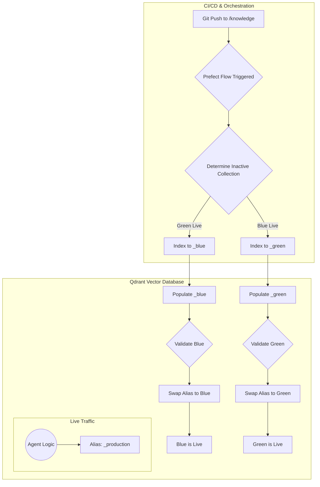

# Runbook: PromptCraft-Hybrid Knowledge Base Management

**Version:** 2.0
**Owner:** IT Operations
**Last Updated:** June 26, 2025

---

## 1. Purpose

Provides Standard Operating Procedures (SOPs) for managing Qdrant vector database collections in the PromptCraft‑Hybrid application. Details the blue‑green deployment strategy orchestrated by Prefect to ensure zero‑downtime updates. Intended for on‑call engineers and developers responsible for the knowledge ingestion pipeline.

---

## 2. Architecture Overview: Blue‑Green Deployments

To avoid service disruptions, maintain two identical collections per agent and an alias pointing to the active one.

### 2.1 Key Components

* **Qdrant Vector Database** (Docker)
* **Collections:**

  * `<agent_id>_blue`
  * `<agent_id>_green`
* **Alias:** `<agent_id>_production`

### 2.2 Process Flow

The Prefect `knowledge_ingestion_flow` automates the blue‑green deployment:



---

## 3. Standard Operating Procedures (SOPs)

### 3.1 SOP‑01: Verifying Automated Deployment

**When to Use:** After a successful Prefect run.

**Steps:**

1. **Check Prefect UI**

   * Confirm `knowledge_ingestion_flow` completed without errors.
   * Note which collection was indexed (e.g., `security_agent_green`).
2. **Verify Qdrant Collection**

   * In Qdrant UI or via client, select the new collection.
   * Ensure `points_count > 0` and run test queries.
3. **Check Alias**

   * Verify `<agent_id>_production` alias points to the new collection.
4. **End‑to‑End Test**

   * Run a query in the live application to confirm updated knowledge is served.

### 3.2 SOP‑02: Manual Rollback

**When to Use:** If deployment introduces errors.

**Prerequisites:** Identify previous live collection and have Qdrant API access.

**Steps:**

1. **Determine Rollback Target** (e.g., `security_agent_blue`).
2. **Swap Alias** via Qdrant API:

```bash
export QDRANT_HOST="192.168.1.16:6333"
export ALIAS_NAME="security_agent_production"
export ROLLBACK_COLLECTION="security_agent_blue"

curl -X POST "http://${QDRANT_HOST}/collections/aliases" \
  -H "Content-Type: application/json" \
  -d '{
    "actions": [
      {
        "swap_alias": {
          "alias": "'${ALIAS_NAME}'",
          "from_collection_name": "security_agent_green",
          "to_collection_name": "'${ROLLBACK_COLLECTION}'"
        }
      }
    ]
  }'
```

3. **Verify Alias Swap** in Qdrant UI and perform end‑to‑end test.
4. **Incident Documentation**

   * Create a GitHub issue for the rollback.
   * Pause `knowledge_ingestion_flow` in Prefect until the root cause is fixed.

### 3.3 SOP‑03: Emergency Hotfix (Point Deletion)

**When to Use:** To remove a single bad document chunk (e.g., exposed PII).

**Warning:** Causes drift from Git source; must be followed by a full CI/CD run.

**Steps:**

1. **Identify Live Collection** via Qdrant UI.
2. **Pause Prefect Flow**.
3. **Delete Point** by UUID:

```bash
curl -X POST "http://192.168.1.16:6333/collections/${COLLECTION}/points/delete" \
  -H "Content-Type: application/json" \
  -d '{ "points": ["<uuid>"] }'
```

4. **Verify Deletion** by querying the collection.
5. **Fix Source** in Git and commit the change.
6. **Re‑enable Prefect** and trigger manual run for a clean state.

---
