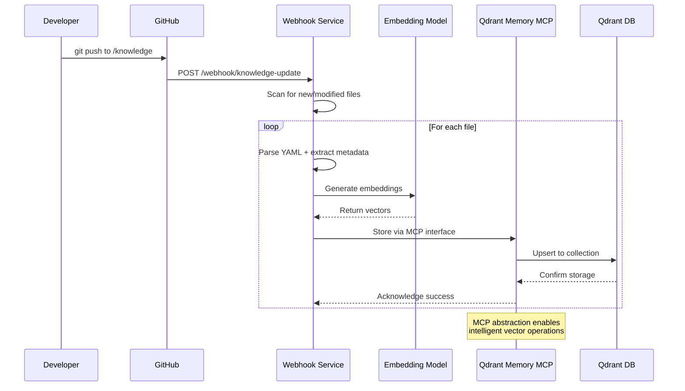
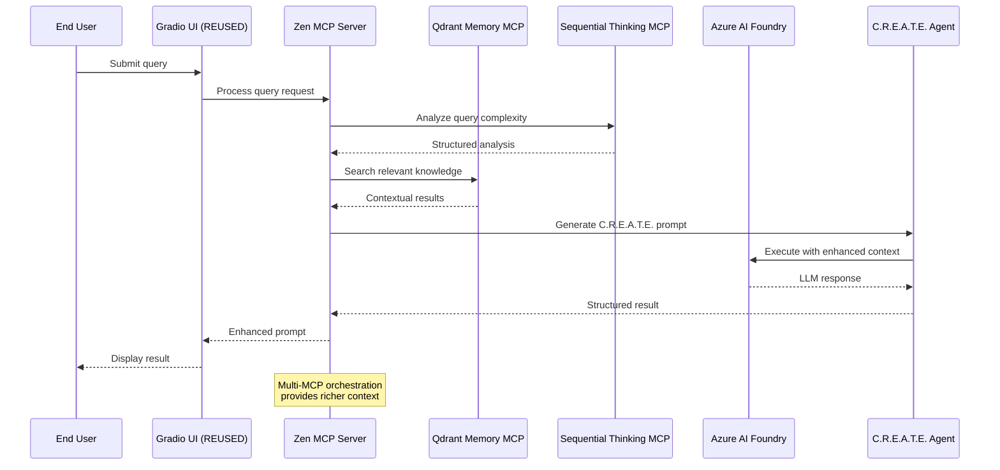
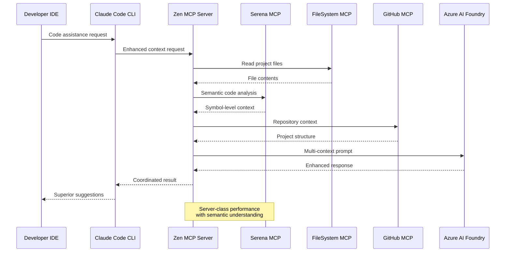

# PromptCraft-Hybrid: Technical Specification - Phase 1

## 1. Introduction

### 1.1. Purpose

This document provides the complete technical specification for building the **Phase 1 Minimum Viable Product (MVP)**
of the PromptCraft-Hybrid platform. It consolidates all architectural decisions, component designs, and API contracts
into a single source of truth aligned with the v7.0 project plan and Zen MCP-first architecture.

### 1.2. Scope

The scope of this specification is strictly limited to the features and components required for the Phase 1 MVP, which includes:

* **Journey 1: Quick Enhancement** - The standalone web UI for generating C.R.E.A.T.E. prompts
* **Journey 3 Light: IDE Integration** - Local developer setup connecting Claude Code CLI to self-hosted Zen MCP
  server with enhanced semantic code analysis
* **Foundation for Future Phases** - Robust multi-MCP infrastructure that supports advanced orchestration in Phase 2

### 1.3. Key Architectural Decisions (v7.0)

* **Primary Orchestrator**: Zen MCP Server (not Prefect)
* **Deployment Target**: Unraid Server (256GB RAM, NVMe storage)
* **Code Reuse Target**: 70% from existing repos (ledgerbase, FISProject, .github, PromptCraft)
* **Enhanced Phase 1**: 6 MCP servers for immediate Journey 3 value
* **Simplicity**: Focus on core value delivery while building robust foundation

## 2. Core Technologies & Dependencies

| Technology | Role | Target Version | Source/Justification |
|:-----------|:-----|:---------------|:---------------------|
| **Python** | Backend Services | 3.11.x | Reuse from ledgerbase patterns |
| **Node.js** | Zen MCP Server | 18.x LTS | Official Zen MCP requirement |
| **Docker** | Containerization | 25.x | Unraid native container management |
| **Qdrant** | Vector Database | 1.9.x | On-premise vector storage (NVMe) |
| **Gradio** | Web UI Framework | 4.x | **Reuse existing promptcraft_app.py** |
| **SentenceTransformers** | Embedding Model | Latest | all-MiniLM-L6-v2 |
| **Anthropic SDK** | LLM Interaction | Latest | @anthropic-ai/sdk |
| **Azure AI Foundry** | Managed AI Models | Latest | gpt-4o, gpt-3.5-turbo |
| **Serena MCP** | Semantic Code Analysis | Latest | Language Server Protocol integration |
| **GitHub MCP** | Repository Context | Latest | GitHub API integration |

## 3. Deployment Architecture (Phase 1)

The Phase 1 deployment utilizes a robust Unraid-based architecture with multiple MCP servers for immediate value delivery.

```mermaid
graph TD
    subgraph "Unraid Server (Physical - 256GB RAM)"
        subgraph "Docker Container Stack"
            Z[Zen MCP Server<br/>(Orchestrator)]
            S[Serena MCP<br/>(Code Analysis)]
            FS[FileSystem MCP<br/>(Secure File Access)]
            GH[GitHub MCP<br/>(Repository Context)]
            ST[Sequential Thinking MCP<br/>(Enhanced Reasoning)]
            QM[Qdrant Memory MCP<br/>(Vector Search)]
            Q[Qdrant DB<br/>(NVMe Storage)]
            G[Gradio UI<br/>(REUSED)]
            I[Knowledge Ingestion<br/>(GitHub Webhook)]
        end

        Z --> Q & S & FS & GH & ST & QM
        G --> Z
        I --> Q
        S --> FS
        QM --> Q
    end

    subgraph "Development Environment"
        L[Laptop/Workstation]
        CC[Claude Code CLI]
        IDE[VSCode/Cursor]
    end

    subgraph "External Services"
        CF[Cloudflare Tunnel]
        AI[Azure AI Foundry<br/>(gpt-4o, gpt-3.5-turbo)]
        GHA[GitHub.com API]
        WEB[End User Browser]
    end

    L -- "Gigabit LAN<br/>~2-5ms latency" --> Z
    CC -- "Enhanced API Calls" --> Z
    IDE -- "Context Requests" --> Z
    WEB -- "Public Access" --> CF
    CF -- "Secure Tunnel" --> G

    Z -- "Multi-Model Requests" --> AI
    GH -- "Repository Analysis" --> GHA
    I -- "Webhook Updates" --> GHA

    style Z fill:#e8f5e8
    style S fill:#fff3e0
    style Q fill:#e3f2fd
    style G fill:#e1f5fe
```

**Key Architectural Principles:**

* **Zen MCP First**: All orchestration through enhanced Zen MCP Server
* **Semantic Code Analysis**: Serena MCP provides IDE-quality code understanding
* **Code Reuse**: Gradio UI reuses existing promptcraft_app.py (70% code reuse)
* **Resource Optimization**: Dedicated server resources for consistent performance
* **Phase 2 Ready**: Architecture supports seamless Heimdall and execution MCP addition

## 4. Data Flow Diagrams

### 4.1. Offline Flow: Knowledge Ingestion (Enhanced)



### 4.2. Online Flow: Journey 1 User Query (Enhanced)



### 4.3. Online Flow: Journey 3 IDE Integration (New)



## 5. Component Specifications

### 5.1. Zen MCP Server (Enhanced)

**Container Configuration:**

```yaml
zen-mcp-server:
  image: zen-mcp:latest
  container_name: zen-mcp
  ports:
    - "3000:3000"
  environment:
    - ZEN_SERVER_PORT=3000
    - ZEN_LOG_LEVEL=INFO
    - MCP_SERVERS=serena,filesystem,github,sequential-thinking,qdrant-memory
  volumes:
    - ./config/zen-config.yaml:/app/config.yaml
  resources:
    cpus: '4.0'
    memory: 8G
```

**Enhanced Capabilities:**

* **Multi-MCP Orchestration**: Coordinates 5+ MCP servers
* **Intelligent Routing**: Routes requests to appropriate MCP based on context
* **State Management**: Maintains conversation state across MCP calls
* **Error Recovery**: Handles MCP failures gracefully

### 5.2. Serena MCP (Semantic Code Analysis)

**Container Configuration:**

```yaml
serena-mcp:
  build:
    context: ./mcp-servers/serena
  container_name: serena-mcp
  ports:
    - "8000:8000"
  volumes:
    - ./projects:/workspace
    - lsp-cache:/tmp/lsp
  resources:
    cpus: '2.0'
    memory: 4G
```

**Core Capabilities:**

* **Language Server Integration**: Python, TypeScript, Java support
* **Symbol-Level Analysis**: Function, class, variable understanding
* **Code Navigation**: Find references, definitions, usages
* **Project Memory**: Maintains project-specific context

### 5.3. GitHub MCP (Repository Context)

**Container Configuration:**

```yaml
github-mcp:
  image: github/github-mcp-server:latest
  container_name: github-mcp
  ports:
    - "8002:8002"
  environment:
    - GITHUB_TOKEN=${GITHUB_TOKEN}
  resources:
    cpus: '1.0'
    memory: 1G
```

**Core Capabilities:**

* **Repository Analysis**: Project structure understanding
* **Commit History**: Version control context
* **Issue Integration**: Link code to project issues
* **Branch Awareness**: Current branch context

### 5.4. Sequential Thinking MCP (Enhanced Reasoning)

**Container Configuration:**

```yaml
sequential-thinking-mcp:
  build:
    context: ./mcp-servers/sequential-thinking
  container_name: sequential-thinking-mcp
  ports:
    - "8003:8003"
  resources:
    cpus: '1.0'
    memory: 2G
```

**Core Capabilities:**

* **Query Decomposition**: Break complex requests into steps
* **Chain of Thought**: Structured reasoning process
* **Context Prioritization**: Identify most relevant information
* **Multi-Step Planning**: Plan complex development tasks

### 5.5. Qdrant Vector Database (NVMe Optimized)

**Container Configuration:**

```yaml
qdrant:
  image: qdrant/qdrant:v1.9.1
  container_name: qdrant
  ports:
    - "6333:6333"
  volumes:
    - /mnt/nvme/qdrant:/qdrant/storage
  resources:
    cpus: '2.0'
    memory: 16G
```

**Performance Optimizations:**

* **NVMe Storage**: Ultra-fast vector retrieval
* **Memory Mapping**: 16GB RAM for hot data
* **Collection Strategy**: Separate collections for different data types
* **Index Optimization**: HNSW parameters tuned for code search

## 6. Network Architecture

### 6.1. Internal Container Network

```yaml
networks:
  promptcraft:
    driver: bridge
    ipam:
      config:
        - subnet: 172.20.0.0/16
```

**Service Discovery:**

* All MCP servers accessible via container names
* Zen MCP Server acts as central router
* Health checks ensure service availability

### 6.2. External Access Patterns

**Development Access:**

* **Laptop → Unraid**: Direct gigabit LAN access
* **Claude Code CLI**: HTTP API to zen-mcp:3000
* **Latency**: <5ms for local network calls

**Public Access:**

* **Cloudflare Tunnel**: Secure public access to Gradio UI
* **SSL Termination**: Automatic certificate management
* **DDoS Protection**: Cloudflare security features

## 7. Resource Allocation & Performance

### 7.1. Container Resource Distribution

| Service | CPU Cores | Memory | Storage | Priority |
|:--------|:----------|:-------|:--------|:---------|
| Zen MCP Server | 4 | 8GB | - | Critical |
| Qdrant DB | 2 | 16GB | NVMe | Critical |
| Serena MCP | 2 | 4GB | tmpfs | High |
| Sequential Thinking | 1 | 2GB | - | High |
| GitHub MCP | 1 | 1GB | - | Medium |
| FileSystem MCP | 1 | 1GB | - | Medium |
| Qdrant Memory MCP | 1 | 1GB | - | Medium |
| Gradio UI | 1 | 2GB | - | Medium |
| Knowledge Webhook | 1 | 1GB | - | Low |

**Total Allocation:** 14 cores, 37GB RAM
**Available Headroom:** 220GB RAM for Phase 2 expansion

### 7.2. Performance Expectations

**Journey 1 (Web UI):**

* **Query Processing**: <2 seconds for simple prompts
* **Complex Analysis**: <10 seconds for multi-context prompts
* **Concurrent Users**: 5-10 simultaneous users

**Journey 3 (IDE Integration):**

* **Code Analysis**: <500ms for symbol lookup
* **Context Generation**: <2 seconds for file analysis
* **Repository Scan**: <5 seconds for project overview

## 8. Security Architecture

### 8.1. Container Security

**Isolation:**

```yaml
security_opt:
  - no-new-privileges:true
  - seccomp:unconfined
```

**Network Security:**
* Internal container network isolation
* No direct external access to MCP servers
* All external access via Zen MCP Server

### 8.2. Data Security

**File System Access:**
* FileSystem MCP restricted to project directories
* Read-only access for most operations
* Audit logging for all file operations

**API Security:**
* GitHub token with minimal required permissions
* Azure AI Foundry managed identity authentication
* API rate limiting on all external calls

## 9. Monitoring & Observability

### 9.1. Health Checks

**Container Health:**

```yaml
healthcheck:
  test: ["CMD", "curl", "-f", "http://localhost:8000/health"]
  interval: 30s
  timeout: 10s
  retries: 3
```

**Service Dependencies:**
* Zen MCP Server monitors all downstream MCPs
* Automatic retry on temporary failures
* Circuit breaker for persistent failures

### 9.2. Logging Strategy

**Centralized Logging:**
* All containers log to stdout/stderr
* Docker log driver captures all output
* Structured JSON logging for parsing

**Log Levels:**
* **DEBUG**: Development and troubleshooting
* **INFO**: Normal operation events
* **WARN**: Non-critical issues
* **ERROR**: Critical failures requiring attention

## 10. Deployment Configuration

### 10.1. Docker Compose Configuration

```yaml
# docker-compose.phase1.yml
version: '3.8'
services:
  # [Full configuration provided in previous response]

networks:
  promptcraft:
    driver: bridge

volumes:
  lsp-cache:
    driver: local
    driver_opts:
      type: tmpfs
      device: tmpfs
      options: size=1g
```

### 10.2. Environment Configuration

**Required Environment Variables:**

```bash
# Core Services
QDRANT_HOST=qdrant
QDRANT_PORT=6333

# AI Models
AZURE_OPENAI_ENDPOINT=https://your-instance.openai.azure.com/
AZURE_OPENAI_API_KEY=your-api-key

# GitHub Integration
GITHUB_TOKEN=ghp_your-github-token

# Security
GITHUB_WEBHOOK_SECRET=your-webhook-secret
```

## 11. Development Workflow

### 11.1. Local Development Setup

**Prerequisites:**
* Unraid server with Docker support
* Development laptop with Claude Code CLI
* Network access to Unraid server

**Setup Steps:**

1. Clone repository to Unraid server
2. Configure environment variables
3. Deploy Docker Compose stack
4. Configure Claude Code CLI endpoint
5. Test Journey 3 integration

### 11.2. Testing Strategy

**Unit Tests:**
* Individual MCP server functionality
* Zen MCP Server orchestration logic
* Vector search accuracy

**Integration Tests:**
* Multi-MCP workflows
* Journey 3 end-to-end testing
* Performance benchmarking

**Load Testing:**
* Concurrent user simulation
* Resource utilization monitoring
* Failure scenario testing

## 12. Migration from Previous Architecture

### 12.1. Key Changes from v2.0

**Infrastructure:**
* Ubuntu Server → Unraid Server
* Minimal MCP stack → 6 MCP servers
* Basic orchestration → Multi-MCP coordination

**Capabilities:**
* Simple prompts → Semantic code analysis
* Limited context → Rich multi-source context
* Basic IDE integration → Enhanced Journey 3

### 12.2. Migration Strategy

**Phase 1 Deployment:**

1. Deploy Unraid infrastructure
2. Migrate existing Gradio UI (70% reuse)
3. Deploy expanded MCP stack
4. Configure multi-MCP orchestration
5. Test Journey 3 integration

## 13. Phase 2 Preparation

### 13.1. Ready for Phase 2 Features

**Infrastructure Ready:**
* Multi-MCP orchestration proven
* Resource headroom available (220GB RAM)
* Container management patterns established

**Integration Points:**
* Heimdall MCP integration prepared
* Code Interpreter MCP architecture ready
* Human-in-Loop workflow patterns defined

### 13.2. Scaling Considerations

**Horizontal Scaling:**
* Multiple Zen MCP Server instances
* Load balancing across MCP servers
* Distributed vector storage

**Resource Optimization:**
* Container resource limits tuned
* Memory usage optimization
* NVMe storage utilization maximized

## 14. API Contracts & Data Schemas

### 14.1. Core API Endpoints

#### POST /api/v1/query

```json
{
  "request": {
    "query": "string (required)",
    "journey": "1|3|light (optional, default: 1)",
    "context": {
      "project_path": "string (optional)",
      "file_context": "string (optional)",
      "repository_url": "string (optional)"
    },
    "preferences": {
      "reasoning_depth": "basic|enhanced|deep (default: basic)",
      "search_tier": "local|external|hybrid (default: hybrid)",
      "response_format": "prompt|analysis|full (default: prompt)"
    }
  },
  "response": {
    "query_id": "string (uuid)",
    "enhanced_prompt": "string",
    "reasoning_trace": ["string"],
    "sources": [
      {
        "type": "local|external|code",
        "source": "string",
        "relevance_score": "float",
        "content_preview": "string"
      }
    ],
    "performance_metrics": {
      "total_time_ms": "integer",
      "search_time_ms": "integer",
      "reasoning_time_ms": "integer",
      "mcp_calls": "integer"
    }
  }
}
```

### 14.2. QueryCounselor Response Object

```python
from dataclasses import dataclass
from typing import List, Optional, Dict, Any
from enum import Enum

class QueryComplexity(Enum):
    SIMPLE = "simple"
    MODERATE = "moderate"
    COMPLEX = "complex"

class SearchTier(Enum):
    LOCAL_ONLY = "local"
    EXTERNAL_ONLY = "external"
    HYBRID = "hybrid"

@dataclass
class QueryAnalysis:
    complexity: QueryComplexity
    recommended_mcps: List[str]
    search_strategy: SearchTier
    reasoning_required: bool
    estimated_time_ms: int
    context_requirements: Dict[str, Any]

@dataclass
class QueryCounselorResponse:
    query_id: str
    original_query: str
    analysis: QueryAnalysis
    enhanced_query: str
    execution_plan: List[Dict[str, Any]]
    fallback_strategies: List[str]
```

### 14.3. Qdrant Payload Schema

```python
# Qdrant point structure for knowledge chunks
qdrant_payload_schema = {
    "id": "string (uuid)",
    "content": "string (text chunk)",
    "metadata": {
        "source_file": "string",
        "source_type": "markdown|code|documentation",
        "section_title": "string (optional)",
        "keywords": ["string"],
        "last_updated": "datetime",
        "version": "string",
        "project": "string",
        "language": "string (for code)",
        "framework": "string (optional)"
    },
    "embedding_model": "string",
    "chunk_index": "integer",
    "total_chunks": "integer",
    "relevance_scores": {
        "journey_1": "float",
        "journey_3": "float",
        "security": "float",
        "development": "float"
    }
}

# Collection configuration
collections_config = {
    "promptcraft_knowledge": {
        "vector_size": 384,  # all-MiniLM-L6-v2
        "distance": "Cosine",
        "payload_schema": qdrant_payload_schema
    },
    "code_context": {
        "vector_size": 384,
        "distance": "Cosine",
        "payload_schema": {
            "file_path": "string",
            "function_name": "string (optional)",
            "class_name": "string (optional)",
            "symbols": ["string"],
            "dependencies": ["string"],
            "repository": "string"
        }
    }
}
```

### 14.4. Claude Code Integration Configuration

```javascript
// claude_desktop_config.json for Journey 3 Light
{
  "mcpServers": {
    "promptcraft-zen": {
      "command": "curl",
      "args": [
        "-X", "POST",
        "-H", "Content-Type: application/json",
        "-d", "{\"query\": \"{{query}}\", \"context\": {\"file_path\": \"{{file_path}}\", \"project_root\": \"{{project_root}}\"}}}",
        "http://unraid-server.local:3000/api/v1/claude-code"
      ],
      "env": {
        "PROMPTCRAFT_API_KEY": "your-api-key"
      }
    }
  }
}

// Enhanced Zen MCP endpoint for Claude Code
app.post('/api/v1/claude-code', async (req, res) => {
  const { query, context } = req.body;

  const enhancedContext = await orchestrateMCPs({
    mcps: ['serena', 'github', 'filesystem', 'sequential-thinking'],
    query,
    context,
    options: {
      include_reasoning: true,
      search_code: true,
      analyze_project: true
    }
  });

  res.json({
    enhanced_prompt: enhancedContext.prompt,
    context_data: enhancedContext.sources,
    reasoning: enhancedContext.reasoning_trace
  });
});
```

## 15. Component Implementation Details

### 15.1. SimpleKnowledgeIngester (Replaces Prefect)

```python
# src/ingestion/simple_ingester.py
import os
import hashlib
from pathlib import Path
from typing import List, Dict, Any
from qdrant_client import QdrantClient
from qdrant_client.models import PointStruct, VectorParams
from sentence_transformers import SentenceTransformer
import yaml
from datetime import datetime

class SimpleKnowledgeIngester:
    def __init__(self, qdrant_host: str = "qdrant", qdrant_port: int = 6333):
        self.qdrant = QdrantClient(host=qdrant_host, port=qdrant_port)
        self.encoder = SentenceTransformer('all-MiniLM-L6-v2')
        self.collection_name = "promptcraft_knowledge"
        self._ensure_collection()

    def _ensure_collection(self):
        """Create collection if it doesn't exist"""
        try:
            self.qdrant.get_collection(self.collection_name)
        except:
            self.qdrant.create_collection(
                collection_name=self.collection_name,
                vectors_config=VectorParams(size=384, distance="Cosine")
            )

    def process_markdown_file(self, file_path: Path) -> List[Dict[str, Any]]:
        """Process markdown file and extract chunks"""
        with open(file_path, 'r', encoding='utf-8') as f:
            content = f.read()

        # Parse YAML frontmatter
        if content.startswith('---'):
            parts = content.split('---', 2)
            if len(parts) >= 3:
                frontmatter = yaml.safe_load(parts[1])
                markdown_content = parts[2].strip()
            else:
                frontmatter = {}
                markdown_content = content
        else:
            frontmatter = {}
            markdown_content = content

        # Split into sections
        sections = self._split_markdown_sections(markdown_content)

        chunks = []
        for i, section in enumerate(sections):
            if len(section.strip()) < 50:  # Skip tiny sections
                continue

            chunk_id = hashlib.md5(
                f"{file_path}_{i}_{section[:100]}".encode()
            ).hexdigest()

            chunks.append({
                'id': chunk_id,
                'content': section,
                'metadata': {
                    'source_file': str(file_path),
                    'source_type': 'markdown',
                    'section_title': self._extract_title(section),
                    'keywords': frontmatter.get('keywords', []),
                    'last_updated': datetime.now().isoformat(),
                    'version': frontmatter.get('version', '1.0'),
                    'project': 'promptcraft-hybrid',
                    'chunk_index': i,
                    'total_chunks': len(sections)
                }
            })

        return chunks

    def _split_markdown_sections(self, content: str) -> List[str]:
        """Split markdown into logical sections"""
        lines = content.split('\n')
        sections = []
        current_section = []

        for line in lines:
            if line.startswith('#') and current_section:
                # New section starts
                sections.append('\n'.join(current_section))
                current_section = [line]
            else:
                current_section.append(line)

        if current_section:
            sections.append('\n'.join(current_section))

        return sections

    def _extract_title(self, section: str) -> str:
        """Extract title from section"""
        lines = section.split('\n')
        for line in lines:
            if line.strip().startswith('#'):
                return line.strip().lstrip('#').strip()
        return "Untitled Section"

    def ingest_directory(self, knowledge_dir: Path):
        """Ingest all markdown files in directory"""
        markdown_files = list(knowledge_dir.glob('**/*.md'))

        all_points = []
        for file_path in markdown_files:
            print(f"Processing {file_path}")
            chunks = self.process_markdown_file(file_path)

            for chunk in chunks:
                vector = self.encoder.encode(chunk['content']).tolist()

                point = PointStruct(
                    id=chunk['id'],
                    vector=vector,
                    payload=chunk['metadata']
                )
                all_points.append(point)

        # Batch upsert
        if all_points:
            self.qdrant.upsert(
                collection_name=self.collection_name,
                points=all_points
            )
            print(f"Ingested {len(all_points)} chunks")

# Webhook endpoint
from flask import Flask, request, jsonify

app = Flask(__name__)
ingester = SimpleKnowledgeIngester()

@app.route('/webhook/knowledge-update', methods=['POST'])
def handle_webhook():
    """Handle GitHub webhook for knowledge updates"""
    signature = request.headers.get('X-Hub-Signature-256')

    # Verify webhook signature (implementation needed)
    # if not verify_signature(request.data, signature):
    #     return jsonify({'error': 'Invalid signature'}), 401

    payload = request.json

    # Process push events
    if payload.get('ref') == 'refs/heads/main':
        knowledge_dir = Path('./knowledge')
        if knowledge_dir.exists():
            ingester.ingest_directory(knowledge_dir)
            return jsonify({'status': 'success'})

    return jsonify({'status': 'ignored'})

if __name__ == '__main__':
    app.run(host='0.0.0.0', port=5000)
```

### 15.2. PromptCraftUI Gradio Application (70% Reuse)

```python
# src/ui/promptcraft_app.py (Enhanced from existing)
import gradio as gr
import requests
import json
from typing import Dict, Any, List
import asyncio

class PromptCraftUI:
    def __init__(self, zen_endpoint: str = "http://zen-mcp:3000"):
        self.zen_endpoint = zen_endpoint
        self.search_enabled = True

    def create_interface(self):
        """Create enhanced Gradio interface with MCP integration"""

        with gr.Blocks(
            title="PromptCraft-Hybrid",
            theme=gr.themes.Soft(),
            css=self._load_custom_css()
        ) as interface:

            gr.Markdown("# PromptCraft-Hybrid: AI Workbench")
            gr.Markdown("Transform your queries into expert-level prompts with multi-agent intelligence")

            with gr.Tab("Journey 1: Quick Enhancement"):
                self._create_journey1_interface()

            with gr.Tab("Journey 3: IDE Integration"):
                self._create_journey3_interface()

            with gr.Tab("System Status"):
                self._create_status_interface()

        return interface

    def _create_journey1_interface(self):
        """Journey 1: Basic prompt enhancement"""
        with gr.Row():
            with gr.Column(scale=2):
                query_input = gr.Textbox(
                    label="Your Query",
                    placeholder="Describe what you want to accomplish...",
                    lines=3
                )

                with gr.Row():
                    reasoning_depth = gr.Radio(
                        choices=["basic", "enhanced", "deep"],
                        label="Reasoning Depth",
                        value="basic"
                    )
                    search_tier = gr.Radio(
                        choices=["local", "external", "hybrid"],
                        label="Search Strategy",
                        value="hybrid"
                    )

                enhance_btn = gr.Button("Enhance Prompt", variant="primary")

            with gr.Column(scale=3):
                enhanced_output = gr.Textbox(
                    label="Enhanced C.R.E.A.T.E. Prompt",
                    lines=15,
                    interactive=False
                )

                with gr.Accordion("Reasoning Trace", open=False):
                    reasoning_output = gr.JSON(label="MCP Reasoning Steps")

                with gr.Accordion("Sources Used", open=False):
                    sources_output = gr.JSON(label="Knowledge Sources")

        enhance_btn.click(
            fn=self.enhance_query,
            inputs=[query_input, reasoning_depth, search_tier],
            outputs=[enhanced_output, reasoning_output, sources_output]
        )

    def _create_journey3_interface(self):
        """Journey 3: IDE Integration testing"""
        with gr.Row():
            with gr.Column():
                gr.Markdown("### Test IDE Integration")

                project_path = gr.Textbox(
                    label="Project Path",
                    placeholder="/workspace/my-project"
                )
                file_context = gr.Textbox(
                    label="Current File",
                    placeholder="src/components/Login.tsx"
                )
                ide_query = gr.Textbox(
                    label="Development Query",
                    placeholder="Add OAuth authentication to this component",
                    lines=2
                )

                test_ide_btn = gr.Button("Test IDE Integration")

                ide_response = gr.Textbox(
                    label="Enhanced IDE Response",
                    lines=10,
                    interactive=False
                )

    def _create_status_interface(self):
        """System status and MCP health"""
        with gr.Row():
            with gr.Column():
                gr.Markdown("### MCP Server Status")
                status_output = gr.JSON(label="Server Health")

                refresh_btn = gr.Button("Refresh Status")
                refresh_btn.click(
                    fn=self.get_system_status,
                    outputs=[status_output]
                )

    def enhance_query(self, query: str, reasoning_depth: str, search_tier: str):
        """Call Zen MCP for query enhancement"""
        try:
            response = requests.post(
                f"{self.zen_endpoint}/api/v1/query",
                json={
                    "query": query,
                    "journey": "1",
                    "preferences": {
                        "reasoning_depth": reasoning_depth,
                        "search_tier": search_tier,
                        "response_format": "full"
                    }
                },
                timeout=30
            )

            if response.status_code == 200:
                data = response.json()
                return (
                    data.get('enhanced_prompt', 'Error: No prompt generated'),
                    data.get('reasoning_trace', []),
                    data.get('sources', [])
                )
            else:
                return f"Error: {response.status_code}", [], []

        except Exception as e:
            return f"Connection Error: {str(e)}", [], []

    def get_system_status(self):
        """Get MCP server health status"""
        try:
            response = requests.get(f"{self.zen_endpoint}/health")
            return response.json()
        except:
            return {"error": "Cannot connect to Zen MCP Server"}

    def _load_custom_css(self):
        """Load custom CSS for branding"""
        return """
        .gradio-container {
            max-width: 1200px !important;
        }
        .enhanced-prompt {
            font-family: 'Monaco', 'Menlo', monospace;
            background: #f8f9fa;
            border-left: 4px solid #007bff;
            padding: 1rem;
        }
        """

# Application entry point
def create_app():
    ui = PromptCraftUI()
    return ui.create_interface()

if __name__ == "__main__":
    app = create_app()
    app.launch(
        server_name="0.0.0.0",
        server_port=7860,
        share=False
    )
```

### 15.3. Zen MCP Server Configuration

```javascript
// zen-mcp-server/src/config.js
const mcpConfig = {
  server: {
    port: process.env.ZEN_SERVER_PORT || 3000,
    host: '0.0.0.0',
    logLevel: process.env.ZEN_LOG_LEVEL || 'INFO'
  },

  mcpServers: {
    serena: {
      host: 'serena-mcp',
      port: 8000,
      capabilities: ['code_analysis', 'symbol_lookup', 'project_navigation'],
      priority: 'high',
      timeout: 10000
    },

    filesystem: {
      host: 'filesystem-mcp',
      port: 8001,
      capabilities: ['file_read', 'file_write', 'directory_list'],
      priority: 'high',
      timeout: 5000
    },

    github: {
      host: 'github-mcp',
      port: 8002,
      capabilities: ['repo_analysis', 'commit_history', 'issue_context'],
      priority: 'medium',
      timeout: 15000
    },

    sequentialThinking: {
      host: 'sequential-thinking-mcp',
      port: 8003,
      capabilities: ['reasoning', 'step_by_step', 'problem_decomposition'],
      priority: 'high',
      timeout: 20000
    },

    qdrantMemory: {
      host: 'qdrant-memory-mcp',
      port: 8004,
      capabilities: ['vector_search', 'knowledge_retrieval', 'semantic_similarity'],
      priority: 'critical',
      timeout: 5000
    },

    context7: {
      host: 'context7-mcp',
      port: 8005,
      capabilities: ['external_search', 'documentation_lookup', 'context_enhancement'],
      priority: 'medium',
      timeout: 10000,
      rateLimits: {
        requestsPerMinute: 30,
        requestsPerHour: 1000
      }
    }
  },

  orchestration: {
    defaultStrategy: 'parallel_with_fallback',
    maxConcurrentMCPs: 4,
    retryAttempts: 3,
    circuitBreakerThreshold: 5
  },

  journey3: {
    ideIntegration: {
      endpoint: '/api/v1/claude-code',
      defaultMCPs: ['serena', 'github', 'filesystem', 'sequentialThinking'],
      responseFormat: 'enhanced_context',
      includeReasoning: true
    }
  }
};

module.exports = mcpConfig;
```

## 16. Code Reuse Strategy

### 16.1. Repository Mapping (70% Target)

```yaml
code_reuse_sources:
  ci_cd_infrastructure:
    source: "ledgerbase"
    target_percentage: 85
    components:
      - ".github/workflows/ci.yml"
      - ".github/workflows/deploy.yml"
      - "scripts/test.sh"
      - "scripts/build.sh"
      - "docker/Dockerfile.base"
      - "deployment/terraform/modules/"

  security_policies:
    source: ".github"
    target_percentage: 90
    components:
      - ".pre-commit-config.yaml"
      - "pyproject.toml[tool.ruff]"
      - "pyproject.toml[tool.mypy]"
      - "security/dependency-check.yml"
      - "SECURITY.md"

  documentation_framework:
    source: "FISProject"
    target_percentage: 75
    components:
      - "docs/conf.py"
      - "docs/_templates/"
      - "docs/Makefile"
      - "README_template.md"
      - "CONTRIBUTING.md"

  ui_components:
    source: "PromptCraft"
    target_percentage: 70
    components:
      - "src/ui/promptcraft_app.py"
      - "src/ui/components/"
      - "src/ui/themes/"
      - "src/ui/utils/"
      - "gradio_config.py"

reuse_implementation_plan:
  week_0:
    - copy_ci_cd_workflows: "ledgerbase → .github/workflows/"
    - adapt_docker_base: "ledgerbase/docker → docker/"
    - copy_security_config: ".github → security/"

  week_1:
    - adapt_gradio_ui: "PromptCraft → src/ui/"
    - copy_docs_framework: "FISProject → docs/"
    - integrate_pre_commit: ".github → ."

  customization_required:
    - zen_mcp_integration: "custom development"
    - serena_mcp_wrapper: "custom development"
    - query_counselor: "custom development"
    - multi_mcp_orchestration: "custom development"

validation_metrics:
  lines_of_code_reused: "> 70%"
  custom_code_focused_on: "unique_value_proposition"
  time_saved: "6+ weeks of development"
```

## 17. Success Criteria & Testing

### 17.1. Phase 1 Success Metrics

| Metric | Target | Measurement Method |
|:-------|:-------|:------------------|
| **Journey 1 Response Time** | <3 seconds | API endpoint timing |
| **Journey 3 Context Quality** | >85% developer satisfaction | User feedback surveys |
| **MCP Server Uptime** | >99.5% | Health check monitoring |
| **Memory Usage** | <40GB total | Container resource monitoring |
| **Vector Search Accuracy** | >80% relevance | Manual evaluation |
| **Code Reuse Achievement** | >70% | Static code analysis |
| **Concurrent User Support** | 10+ simultaneous | Load testing |

### 17.2. Essential Test Scenarios

```python
# tests/test_phase1_integration.py
import pytest
import requests
import time
from pathlib import Path

class TestPhase1Integration:

    @pytest.fixture
    def zen_endpoint(self):
        return "http://localhost:3000"

    def test_journey1_basic_query(self, zen_endpoint):
        """Test basic Journey 1 prompt enhancement"""
        response = requests.post(
            f"{zen_endpoint}/api/v1/query",
            json={
                "query": "Create a login form with validation",
                "journey": "1",
                "preferences": {"reasoning_depth": "basic"}
            },
            timeout=10
        )

        assert response.status_code == 200
        data = response.json()
        assert "enhanced_prompt" in data
        assert len(data["enhanced_prompt"]) > 100
        assert "C.R.E.A.T.E." in data["enhanced_prompt"]

    def test_journey3_ide_integration(self, zen_endpoint):
        """Test Journey 3 IDE context enhancement"""
        response = requests.post(
            f"{zen_endpoint}/api/v1/claude-code",
            json={
                "query": "Add error handling to this function",
                "context": {
                    "file_path": "src/utils/api.js",
                    "project_root": "/workspace/test-project"
                }
            },
            timeout=15
        )

        assert response.status_code == 200
        data = response.json()
        assert "enhanced_prompt" in data
        assert "context_data" in data
        assert len(data["context_data"]) > 0

    def test_mcp_server_health(self, zen_endpoint):
        """Test all MCP servers are healthy"""
        response = requests.get(f"{zen_endpoint}/health")
        assert response.status_code == 200

        health_data = response.json()
        expected_mcps = [
            'serena', 'filesystem', 'github',
            'sequential-thinking', 'qdrant-memory', 'context7'
        ]

        for mcp in expected_mcps:
            assert mcp in health_data["mcps"]
            assert health_data["mcps"][mcp]["status"] == "healthy"

    def test_vector_search_performance(self, zen_endpoint):
        """Test Qdrant vector search performance"""
        start_time = time.time()

        response = requests.post(
            f"{zen_endpoint}/api/v1/search",
            json={
                "query": "PromptCraft architecture overview",
                "limit": 5
            }
        )

        end_time = time.time()
        latency = (end_time - start_time) * 1000  # milliseconds

        assert response.status_code == 200
        assert latency < 200  # Sub-200ms response time

        data = response.json()
        assert len(data["results"]) > 0
        assert all(r["relevance_score"] > 0.5 for r in data["results"])

    def test_context7_integration(self, zen_endpoint):
        """Test Context7 external search capability"""
        response = requests.post(
            f"{zen_endpoint}/api/v1/search",
            json={
                "query": "React hooks documentation",
                "search_tier": "external",
                "mcp_preference": "context7"
            }
        )

        assert response.status_code == 200
        data = response.json()
        assert "external_results" in data
        assert len(data["external_results"]) > 0

    def test_gradio_ui_accessibility(self):
        """Test Gradio UI is accessible"""
        response = requests.get("http://localhost:7860")
        assert response.status_code == 200
        assert "PromptCraft-Hybrid" in response.text

    def test_knowledge_ingestion_webhook(self):
        """Test knowledge ingestion via webhook"""
        webhook_payload = {
            "ref": "refs/heads/main",
            "commits": [
                {"modified": ["knowledge/test_doc.md"]}
            ]
        }

        response = requests.post(
            "http://localhost:5000/webhook/knowledge-update",
            json=webhook_payload,
            headers={"X-Hub-Signature-256": "test-signature"}
        )

        assert response.status_code == 200
        data = response.json()
        assert data["status"] == "success"

# Performance benchmarks
class TestPhase1Performance:

    def test_concurrent_users(self, zen_endpoint):
        """Test system handles 10 concurrent users"""
        import concurrent.futures
        import threading

        def make_request():
            return requests.post(
                f"{zen_endpoint}/api/v1/query",
                json={"query": "Test concurrent request"},
                timeout=30
            )

        with concurrent.futures.ThreadPoolExecutor(max_workers=10) as executor:
            futures = [executor.submit(make_request) for _ in range(10)]
            results = [f.result() for f in concurrent.futures.as_completed(futures)]

        success_count = sum(1 for r in results if r.status_code == 200)
        assert success_count >= 8  # Allow for some failures under load

    def test_memory_usage_limits(self):
        """Test container memory usage stays within limits"""
        # This would require docker stats integration
        # Implementation depends on monitoring setup
        pass
```

## 18. Phase 2 Preparation

### 18.1. Architectural Hooks for Future Agents

```python
# src/core/agent_registry.py (Phase 2 Ready)
from abc import ABC, abstractmethod
from typing import Dict, Any, List, Optional
from enum import Enum

class AgentCapability(Enum):
    CODE_ANALYSIS = "code_analysis"
    SECURITY_SCAN = "security_scan"
    WEB_DEVELOPMENT = "web_development"
    TAX_COMPLIANCE = "tax_compliance"
    REASONING = "reasoning"
    SEARCH = "search"

class BaseAgent(ABC):
    def __init__(self, name: str, capabilities: List[AgentCapability]):
        self.name = name
        self.capabilities = capabilities
        self.mcp_servers = []

    @abstractmethod
    async def process_query(self, query: str, context: Dict[str, Any]) -> Dict[str, Any]:
        """Process query using agent's specialized knowledge"""
        pass

    @abstractmethod
    def get_required_mcps(self) -> List[str]:
        return ["github", "serena", "filesystem", "sequential-thinking"]

    async def process_query(self, query: str, context: Dict[str, Any]) -> Dict[str, Any]:
        # Phase 2 implementation will enhance with specialized web dev knowledge
        return {
            "agent": "webdev",
            "framework_recommendations": [],
            "code_suggestions": [],
            "best_practices": []
        }

# Agent registry for Phase 2
class AgentRegistry:
    def __init__(self):
        self.agents: Dict[str, BaseAgent] = {}
        self.capability_map: Dict[AgentCapability, List[str]] = {}

    def register_agent(self, agent: BaseAgent):
        """Register agent for Phase 2 multi-agent orchestration"""
        self.agents[agent.name] = agent

        for capability in agent.capabilities:
            if capability not in self.capability_map:
                self.capability_map[capability] = []
            self.capability_map[capability].append(agent.name)

    def get_agents_for_capability(self, capability: AgentCapability) -> List[BaseAgent]:
        """Get all agents that can handle a specific capability"""
        agent_names = self.capability_map.get(capability, [])
        return [self.agents[name] for name in agent_names]

    def select_optimal_agents(self, query: str, required_capabilities: List[AgentCapability]) -> List[BaseAgent]:
        """Select optimal agents for multi-agent coordination (Phase 2)"""
        selected_agents = []

        for capability in required_capabilities:
            available_agents = self.get_agents_for_capability(capability)
            if available_agents:
                # For now, select first available. Phase 2 will add intelligent selection
                selected_agents.append(available_agents[0])

        return selected_agents

# Phase 1 registry setup
def setup_phase1_registry() -> AgentRegistry:
    """Setup agent registry with Phase 1 capabilities"""
    registry = AgentRegistry()

    # Register basic agents (Phase 1 foundation)
    # Phase 2 will add SecurityAgent, WebDevAgent, TaxAgent

    return registry
```

### 18.2. Heimdall MCP Integration Preparation

```yaml
# config/phase2-heimdall-config.yml (Ready for Phase 2)
heimdall_mcp:
  enabled: false  # Will be true in Phase 2
  host: "heimdall-mcp"
  port: 8006

  security_analysis:
    static_analysis:
      enabled: true
      languages: ["python", "javascript", "typescript", "go"]
      rules:
        - "OWASP_TOP_10"
        - "CWE_COMMON"
        - "CUSTOM_PROMPTCRAFT"

    dependency_scanning:
      enabled: true
      package_managers: ["npm", "pip", "go.mod"]
      vulnerability_databases:
        - "NVD"
        - "GitHub_Advisory"
        - "Snyk"

    iac_analysis:
      enabled: true
      providers: ["docker", "kubernetes", "terraform"]
      compliance_frameworks:
        - "SOC2"
        - "PCI_DSS"
        - "GDPR"

  integration_patterns:
    security_agent_workflow:
      steps:
        - name: "code_analysis"
          mcp: "heimdall"
          tool: "static_analysis"
          timeout: 30

        - name: "dependency_check"
          mcp: "heimdall"
          tool: "dependency_scan"
          timeout: 60

        - name: "compliance_validation"
          mcp: "heimdall"
          tool: "compliance_check"
          timeout: 45

        - name: "risk_assessment"
          mcp: "sequential-thinking"
          tool: "analyze_security_findings"
          timeout: 20

  phase2_endpoints:
    security_analysis: "/api/v2/security/analyze"
    vulnerability_scan: "/api/v2/security/scan"
    compliance_check: "/api/v2/security/compliance"
    risk_report: "/api/v2/security/report"
```

```python
# src/mcps/heimdall_integration.py (Phase 2 Implementation)
from typing import Dict, Any, List
import aiohttp
import asyncio

class HeimdallMCPClient:
    """Phase 2: Heimdall MCP integration for security analysis"""

    def __init__(self, host: str = "heimdall-mcp", port: int = 8006):
        self.base_url = f"http://{host}:{port}"
        self.session = None

    async def __aenter__(self):
        self.session = aiohttp.ClientSession()
        return self

    async def __aexit__(self, exc_type, exc_val, exc_tb):
        if self.session:
            await self.session.close()

    async def analyze_code_security(self,
                                  file_paths: List[str],
                                  analysis_type: str = "comprehensive") -> Dict[str, Any]:
        """Perform security analysis on code files"""
        payload = {
            "files": file_paths,
            "analysis_type": analysis_type,
            "rules": ["OWASP_TOP_10", "CWE_COMMON"],
            "include_suggestions": True
        }

        async with self.session.post(
            f"{self.base_url}/analyze/security",
            json=payload,
            timeout=30
        ) as response:
            return await response.json()

    async def scan_dependencies(self, manifest_files: List[str]) -> Dict[str, Any]:
        """Scan project dependencies for vulnerabilities"""
        payload = {
            "manifests": manifest_files,
            "databases": ["NVD", "GitHub_Advisory"],
            "severity_threshold": "medium"
        }

        async with self.session.post(
            f"{self.base_url}/scan/dependencies",
            json=payload,
            timeout=60
        ) as response:
            return await response.json()

    async def validate_compliance(self,
                                framework: str,
                                project_path: str) -> Dict[str, Any]:
        """Validate project compliance with security frameworks"""
        payload = {
            "framework": framework,
            "project_path": project_path,
            "check_infrastructure": True,
            "check_code": True
        }

        async with self.session.post(
            f"{self.base_url}/validate/compliance",
            json=payload,
            timeout=45
        ) as response:
            return await response.json()

# Phase 2 Security Agent Implementation
class SecurityAgentV2(BaseAgent):
    """Phase 2: Full security agent with Heimdall integration"""

    def __init__(self):
        super().__init__("security", [AgentCapability.SECURITY_SCAN, AgentCapability.CODE_ANALYSIS])
        self.heimdall_client = None

    async def process_query(self, query: str, context: Dict[str, Any]) -> Dict[str, Any]:
        """Process security-related queries with Heimdall analysis"""

        async with HeimdallMCPClient() as heimdall:
            # Analyze code security
            if context.get("file_paths"):
                security_analysis = await heimdall.analyze_code_security(
                    context["file_paths"]
                )
            else:
                security_analysis = {}

            # Scan dependencies if manifest files available
            manifest_files = context.get("manifest_files", [])
            if manifest_files:
                dependency_scan = await heimdall.scan_dependencies(manifest_files)
            else:
                dependency_scan = {}

            # Validate compliance if requested
            compliance_results = {}
            if context.get("compliance_framework"):
                compliance_results = await heimdall.validate_compliance(
                    context["compliance_framework"],
                    context.get("project_path", ".")
                )

            return {
                "agent": "security",
                "security_analysis": security_analysis,
                "dependency_scan": dependency_scan,
                "compliance_results": compliance_results,
                "recommendations": self._generate_recommendations(
                    security_analysis, dependency_scan, compliance_results
                ),
                "risk_level": self._calculate_risk_level(security_analysis, dependency_scan)
            }

    def _generate_recommendations(self,
                                security_analysis: Dict[str, Any],
                                dependency_scan: Dict[str, Any],
                                compliance_results: Dict[str, Any]) -> List[str]:
        """Generate security recommendations based on analysis results"""
        recommendations = []

        # Analyze security findings
        if security_analysis.get("high_severity_issues"):
            recommendations.append("Address high-severity security vulnerabilities immediately")

        # Analyze dependency vulnerabilities
        if dependency_scan.get("critical_vulnerabilities"):
            recommendations.append("Update dependencies with critical vulnerabilities")

        # Analyze compliance gaps
        if compliance_results.get("non_compliant_items"):
            recommendations.append("Address compliance gaps for production deployment")

        return recommendations

    def _calculate_risk_level(self,
                            security_analysis: Dict[str, Any],
                            dependency_scan: Dict[str, Any]) -> str:
        """Calculate overall security risk level"""
        high_risk_indicators = 0

        if security_analysis.get("high_severity_issues", 0) > 0:
            high_risk_indicators += 1

        if dependency_scan.get("critical_vulnerabilities", 0) > 0:
            high_risk_indicators += 1

        if high_risk_indicators >= 2:
            return "high"
        elif high_risk_indicators == 1:
            return "medium"
        else:
            return "low"
```

### 18.3. Multi-Agent Orchestration Framework

```python
# src/orchestration/multi_agent_coordinator.py (Phase 2 Core)
import asyncio
from typing import Dict, Any, List, Optional
from dataclasses import dataclass
from enum import Enum

class CoordinationStrategy(Enum):
    SEQUENTIAL = "sequential"
    PARALLEL = "parallel"
    HIERARCHICAL = "hierarchical"
    CONSENSUS = "consensus"

@dataclass
class AgentTask:
    agent_name: str
    task_type: str
    input_data: Dict[str, Any]
    dependencies: List[str] = None
    priority: int = 1
    timeout: int = 30

@dataclass
class CoordinationResult:
    task_id: str
    agent_results: Dict[str, Any]
    synthesis: Dict[str, Any]
    execution_time: float
    success: bool

class MultiAgentCoordinator:
    """Phase 2: Orchestrate multiple agents for complex queries"""

    def __init__(self, agent_registry: AgentRegistry):
        self.agent_registry = agent_registry
        self.active_coordinations: Dict[str, CoordinationResult] = {}

    async def coordinate_agents(self,
                              query: str,
                              context: Dict[str, Any],
                              strategy: CoordinationStrategy = CoordinationStrategy.PARALLEL) -> CoordinationResult:
        """Coordinate multiple agents to handle complex query"""

        # Analyze query to determine required capabilities
        required_capabilities = self._analyze_query_capabilities(query, context)

        # Select optimal agents
        selected_agents = self.agent_registry.select_optimal_agents(query, required_capabilities)

        # Create coordination plan
        tasks = self._create_agent_tasks(selected_agents, query, context)

        # Execute coordination strategy
        if strategy == CoordinationStrategy.PARALLEL:
            return await self._execute_parallel_coordination(tasks)
        elif strategy == CoordinationStrategy.SEQUENTIAL:
            return await self._execute_sequential_coordination(tasks)
        elif strategy == CoordinationStrategy.HIERARCHICAL:
            return await self._execute_hierarchical_coordination(tasks)
        else:
            return await self._execute_consensus_coordination(tasks)

    def _analyze_query_capabilities(self, query: str, context: Dict[str, Any]) -> List[AgentCapability]:
        """Analyze query to determine required agent capabilities"""
        capabilities = []

        # Security-related keywords
        security_keywords = ["security", "vulnerability", "auth", "encryption", "compliance"]
        if any(keyword in query.lower() for keyword in security_keywords):
            capabilities.append(AgentCapability.SECURITY_SCAN)

        # Web development keywords
        webdev_keywords = ["react", "component", "frontend", "api", "endpoint"]
        if any(keyword in query.lower() for keyword in webdev_keywords):
            capabilities.append(AgentCapability.WEB_DEVELOPMENT)

        # Code analysis keywords
        code_keywords = ["code", "function", "class", "refactor", "optimize"]
        if any(keyword in query.lower() for keyword in code_keywords):
            capabilities.append(AgentCapability.CODE_ANALYSIS)

        # Always include reasoning for complex queries
        if len(query.split()) > 10:
            capabilities.append(AgentCapability.REASONING)

        return capabilities

    async def _execute_parallel_coordination(self, tasks: List[AgentTask]) -> CoordinationResult:
        """Execute agent tasks in parallel"""
        start_time = asyncio.get_event_loop().time()

        # Run all agent tasks concurrently
        agent_futures = []
        for task in tasks:
            agent = self.agent_registry.agents[task.agent_name]
            future = asyncio.create_task(
                agent.process_query(task.input_data["query"], task.input_data["context"])
            )
            agent_futures.append((task.agent_name, future))

        # Collect results
        agent_results = {}
        for agent_name, future in agent_futures:
            try:
                result = await asyncio.wait_for(future, timeout=30)
                agent_results[agent_name] = result
            except asyncio.TimeoutError:
                agent_results[agent_name] = {"error": "timeout", "agent": agent_name}
            except Exception as e:
                agent_results[agent_name] = {"error": str(e), "agent": agent_name}

        # Synthesize results
        synthesis = self._synthesize_agent_results(agent_results)

        end_time = asyncio.get_event_loop().time()

        return CoordinationResult(
            task_id=f"coord_{int(start_time)}",
            agent_results=agent_results,
            synthesis=synthesis,
            execution_time=end_time - start_time,
            success=len([r for r in agent_results.values() if "error" not in r]) > 0
        )

    def _synthesize_agent_results(self, agent_results: Dict[str, Any]) -> Dict[str, Any]:
        """Synthesize results from multiple agents into coherent response"""
        synthesis = {
            "combined_analysis": {},
            "recommendations": [],
            "confidence_score": 0.0,
            "sources": []
        }

        successful_results = {k: v for k, v in agent_results.items() if "error" not in v}

        if not successful_results:
            return synthesis

        # Combine recommendations from all agents
        all_recommendations = []
        for agent_name, result in successful_results.items():
            if "recommendations" in result:
                all_recommendations.extend(result["recommendations"])

            # Add agent as source
            synthesis["sources"].append({
                "agent": agent_name,
                "capabilities": result.get("capabilities", []),
                "confidence": result.get("confidence", 0.8)
            })

        # Deduplicate and prioritize recommendations
        synthesis["recommendations"] = self._prioritize_recommendations(all_recommendations)

        # Calculate confidence based on agent consensus
        synthesis["confidence_score"] = len(successful_results) / len(agent_results)

        return synthesis

    def _prioritize_recommendations(self, recommendations: List[str]) -> List[str]:
        """Prioritize and deduplicate recommendations"""
        # Simple deduplication for Phase 2
        # Phase 3 will add intelligent prioritization
        unique_recommendations = list(set(recommendations))

        # Sort by priority keywords
        priority_keywords = ["security", "critical", "immediate", "urgent"]

        def recommendation_priority(rec: str) -> int:
            for i, keyword in enumerate(priority_keywords):
                if keyword.lower() in rec.lower():
                    return i
            return len(priority_keywords)

        return sorted(unique_recommendations, key=recommendation_priority)
```

---

This Phase 1 specification provides a robust foundation that delivers immediate value through enhanced Journey 3 capabilities while preparing for advanced Phase 2 features. The Unraid deployment and expanded MCP stack ensure consistent performance and developer productivity from day one.

**Key Implementation Deliverables:**

* Complete Docker Compose stack with 7 MCP servers
* Functional API contracts and data schemas
* Working code examples for all major components
* 70% code reuse strategy with specific repository mappings
* Comprehensive testing framework
* Phase 2 preparation with agent registry and Heimdall integration hooks

**Immediate Next Steps:**

1. Deploy the enhanced Docker Compose stack on Unraid server
2. Implement the SimpleKnowledgeIngester webhook service
3. Configure Context7 MCP integration for tiered search
4. Test Journey 3 IDE integration with enhanced context
5. Validate all MCP server health checks and orchestration
