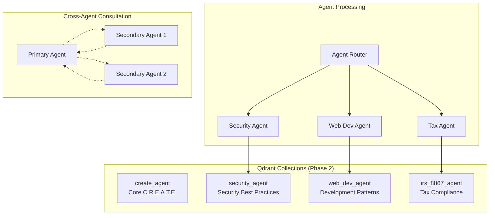
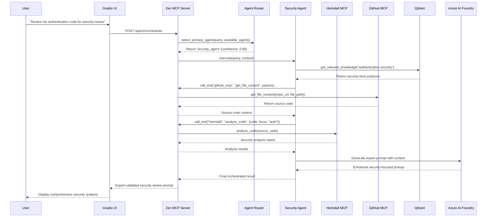
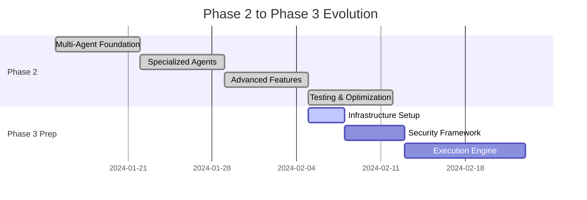

# PromptCraft-Hybrid: Phase 2 Overview

Version: 2.0
Status: Updated for v7.0 Architecture
Audience: Executives, Architects, Technical Leads

## Executive Summary

Phase 2 of PromptCraft-Hybrid transforms the platform from a single-agent system into a sophisticated multi-agent orchestration platform. This evolution implements **Journey 2: Power Templates** while establishing the foundation for Journey 4's direct execution capabilities.

### Key Achievements

- **Multi-Agent Orchestration**: Zen MCP Server enhanced to coordinate multiple specialized agents
- **Domain Expertise**: Deploy 2-3 focused domain experts (security, web development, tax compliance)
- **Tool Integration**: Heimdall MCP for security analysis and GitHub MCP for repository context
- **Enhanced UI**: Agent selection and multi-agent coordination interface
- **Cost Optimization**: Tiered search strategy with budget controls

## 1. Strategic Vision

### 1.1. Phase Evolution

Phase 2 represents a significant maturation from Phase 1's foundation:

```mermaid
graph TD
    subgraph "Phase 1: Foundation"
        P1A[Single C.R.E.A.T.E. Agent]
        P1B[Basic Zen MCP]
        P1C[Simple Knowledge Base]
    end

    subgraph "Phase 2: Multi-Agent Intelligence"
        P2A[Agent Orchestration]
        P2B[Security Agent + Heimdall]
        P2C[Web Dev Agent + GitHub MCP]
        P2D[Tax Agent (IRS 8867)]
        P2E[Agent Router & Coordination]
    end

    P1A --> P2A
    P1B --> P2B
    P1B --> P2C
    P1B --> P2D
    P1C --> P2E
```

### 1.2. Business Value

| Capability | Phase 1 | Phase 2 | Business Impact |
|:-----------|:--------|:--------|:---------------|
| **Agent Specialization** | Single general agent | 3+ domain experts | Higher quality, specialized outputs |
| **Tool Integration** | Basic search only | Security + Repository analysis | Context-aware analysis |
| **Cost Management** | No tracking | Tiered search with budgets | Predictable operational costs |
| **Response Quality** | Good (3.8/5) | Excellent (4.2+/5) | Improved user satisfaction |
| **Processing Time** | Variable | <3s average | Consistent performance |

## 2. Architecture Overview

### 2.1. Deployment Architecture

Phase 2 expands the Docker environment with multiple MCP servers orchestrated by Zen:

```mermaid
graph TD
    subgraph "On-Premise Server (Ubuntu)"
        subgraph "Docker Environment"
            Z[Zen MCP Server<br/>(Enhanced Orchestrator)]
            Q[Qdrant DB<br/>(Multi-Collection)]
            G[Gradio UI<br/>(Multi-Agent Interface)]
            H[Heimdall MCP<br/>(Security Analysis)]
            GH[GitHub MCP<br/>(Repository Context)]
            ST[Sequential Thinking MCP<br/>(Reasoning)]
            I[Knowledge Ingestion<br/>(Multi-Agent)]
        end

        Z --> Q
        Z --> H
        Z --> GH
        Z --> ST
        G --> Z
        I --> Q
    end

    subgraph "External Services"
        U[Developer IDE]
        V[End User Browser]
        AI[Azure AI Foundry]
        GHA[GitHub.com API]
        TV[Tavily Search API]
        C7[Context7 API]
    end

    U -- "Enhanced API" --> Z
    V -- "Agent Selection UI" --> CF[Cloudflare Tunnel]
    CF --> G

    Z -- "Multi-Model Coordination" --> AI
    GH -- "Repository Analysis" --> GHA
    Z -- "Tiered Search Strategy" --> TV
    Z -- "Free Search Tier" --> C7

    style Z fill:#e8f5e8
    style H fill:#ffebee
    style GH fill:#e3f2fd
    style ST fill:#f3e5f5
```

### 2.2. Core Technologies

| Technology/Service | Role | Target Version | Strategic Justification |
|:-------------------|:-----|:---------------|:----------------------|
| **Heimdall MCP** | Security Analysis | Self-Hosted | Real-time vulnerability detection |
| **GitHub MCP** | Repository Context | Self-Hosted | Project-aware code analysis |
| **Sequential Thinking MCP** | Reasoning Enhancement | Self-Hosted | Structured problem decomposition |
| **PyYAML** | Agent Configuration | 6.x | Dynamic agent registry |
| **Tavily Search API** | Enhanced Search | External API | Cost-effective research ($0.0006/query) |
| **Context7 MCP** | Free Search Tier | External API | Zero-cost documentation searches |

## 3. Agent Orchestration Strategy

### 3.1. Agent Selection & Routing

```mermaid
graph TD
    A[User Query] --> B[Query Analysis]
    B --> C{Keyword Detection}

    C -->|"security", "auth", "vulnerability"| D[Security Agent]
    C -->|"react", "javascript", "performance"| E[Web Dev Agent]
    C -->|"tax", "8867", "compliance"| F[Tax Agent]
    C -->|No clear match| G[Confidence Scoring]

    G --> H{Best Score > 0.8?}
    H -->|Yes| I[Select Best Agent]
    H -->|No| J[Fallback to C.R.E.A.T.E. Agent]

    D --> K[Agent Orchestration]
    E --> K
    F --> K
    I --> K
    J --> K

    K --> L[Tool Coordination]
    L --> M[Result Synthesis]
```

### 3.2. Multi-Collection Knowledge Architecture



## 4. Data Flow & Processing

### 4.1. Journey 2: Multi-Agent Orchestration Flow



## 5. Knowledge Base Evolution

### 5.1. Structure

```
knowledge/
├── create_agent/                 # Phase 1 - Core C.R.E.A.T.E. framework
│   ├── framework-overview.md
│   ├── context-blocks.md
│   ├── request-blocks.md
│   ├── examples-gallery.md
│   ├── tone-and-format.md
│   └── evaluation-toolkit.md
│
├── security_agent/              # Phase 2 - Security expertise
│   ├── authentication-patterns.md
│   ├── authorization-best-practices.md
│   ├── common-vulnerabilities.md
│   ├── compliance-frameworks.md
│   ├── secure-coding-practices.md
│   ├── owasp-top-10.md
│   └── incident-response.md
│
├── web_dev_agent/               # Phase 2 - Web development expertise
│   ├── react-best-practices.md
│   ├── performance-optimization.md
│   ├── typescript-patterns.md
│   ├── api-design-guidelines.md
│   ├── testing-strategies.md
│   ├── deployment-patterns.md
│   └── accessibility-standards.md
│
└── irs_8867_agent/              # Phase 2 - Tax compliance expertise
    ├── form-8867-overview.md
    ├── due-diligence-requirements.md
    ├── eitc-guidelines.md
    ├── child-tax-credit-rules.md
    ├── compliance-checklist.md
    └── common-violations.md
```

### 5.2. Enhanced Ingestion Strategy

- **Multi-Agent Collections**: Separate Qdrant collections per agent for optimized retrieval
- **Intelligent Chunking**: Semantic-aware content splitting with heading preservation
- **Automated Updates**: GitHub webhook integration for real-time knowledge updates
- **Quality Validation**: Automated compliance checking for knowledge file standards

## 6. Success Metrics & Quality Gates

### 6.1. Key Performance Indicators

| Metric | Target | Measurement Method | Acceptance Criteria |
|:-------|:-------|:------------------|:-------------------|
| **Agent Routing Accuracy** | >85% | Automated testing with labeled queries | Route to correct agent 85% of time |
| **Multi-Agent Response Quality** | >4.2/5 | User ratings on 20 test queries | Average rating above 4.2 |
| **Tool Integration Success** | >95% | Heimdall + GitHub MCP call success rate | Less than 5% tool failures |
| **Cross-Agent Consultation** | >90% accuracy | Quality assessment of consultation results | Consultations improve final output |
| **Cost Efficiency** | <$0.10/query | Automated cost tracking | Average query cost under $0.10 |
| **Response Time** | <3s average | Performance monitoring | P95 under 5 seconds |

### 6.2. Quality Gates

**Technical Quality Gate:**
- [ ] All agents route correctly for their domain keywords
- [ ] Heimdall MCP successfully analyzes code samples
- [ ] GitHub MCP successfully analyzes public repositories
- [ ] Cross-agent consultation produces coherent results
- [ ] Cost tracking prevents budget overruns

**User Experience Quality Gate:**
- [ ] UI clearly shows which agent handled the query
- [ ] Users can force agent selection when needed
- [ ] Error handling graceful for MCP failures
- [ ] Repository analysis works with public GitHub repos
- [ ] Response quality visibly better than Phase 1

**Performance Quality Gate:**
- [ ] 10 concurrent requests complete successfully
- [ ] Agent switching adds <500ms overhead
- [ ] Memory usage stable during extended testing
- [ ] No resource leaks in long-running tests

## 7. Phase 3 Preparation

### 7.1. Architecture Hooks

Phase 2 includes preparation for Phase 3 features:

- **Execution Orchestrator**: Placeholder infrastructure for direct execution
- **UI Framework**: Journey 4 tab prepared for execution workflows
- **Infrastructure**: Docker compose profiles for Phase 3 services
- **Security Model**: Sandboxing and approval workflows planned

### 7.2. Strategic Roadmap



## 8. Timeline & Milestones

### Week 3: Multi-Agent Foundation
- [ ] Enhance Zen MCP Server with agent orchestration
- [ ] Deploy Heimdall MCP and GitHub MCP containers
- [ ] Implement agent router and basic coordination
- [ ] Create agent registry and configuration system

### Week 4: Specialized Agents
- [ ] Implement Security Agent with Heimdall integration
- [ ] Implement Web Dev Agent with GitHub MCP integration
- [ ] Deploy Sequential Thinking MCP for reasoning enhancement
- [ ] Create multi-agent knowledge ingestion system

### Week 5: Advanced Features
- [ ] Enhanced Gradio UI with agent selection
- [ ] Cross-agent consultation capability
- [ ] Tiered search strategy implementation
- [ ] Cost tracking and management system

### Week 6: Testing & Optimization
- [ ] Comprehensive integration testing
- [ ] Performance optimization and load testing
- [ ] Quality assurance and user acceptance testing
- [ ] Phase 3 preparation and infrastructure setup

## 9. Risk Assessment & Mitigation

### 9.1. Technical Risks

| Risk | Probability | Impact | Mitigation Strategy |
|:-----|:-----------|:-------|:-------------------|
| **Agent Routing Accuracy** | Medium | High | Extensive testing with labeled datasets, fallback to general agent |
| **MCP Integration Complexity** | High | Medium | Incremental integration, comprehensive testing |
| **Performance Degradation** | Low | High | Load testing, caching strategies, horizontal scaling |
| **Cost Overruns** | Medium | Medium | Budget tracking, tiered search strategy, usage alerts |

### 9.2. Operational Risks

| Risk | Probability | Impact | Mitigation Strategy |
|:-----|:-----------|:-------|:-------------------|
| **Knowledge Base Inconsistency** | Medium | Medium | Automated validation, style guide enforcement |
| **Agent Coordination Failures** | Low | High | Graceful degradation, monitoring, alerting |
| **External API Reliability** | High | Medium | Multiple providers, fallback mechanisms |

## 10. Success Criteria Summary

Phase 2 will be considered successful when:

1. **Technical Excellence**: All quality gates passed with >95% success rate
2. **User Experience**: Average response quality >4.2/5 from user testing
3. **Performance**: Consistent <3s response times under normal load
4. **Cost Management**: Average query cost <$0.10 with effective budget controls
5. **Foundation Readiness**: Phase 3 infrastructure and hooks successfully deployed

This Phase 2 overview provides the strategic context and architectural foundation for implementing true multi-agent orchestration while maintaining the 70% code reuse target and preparing for Phase 3's execution capabilities.
