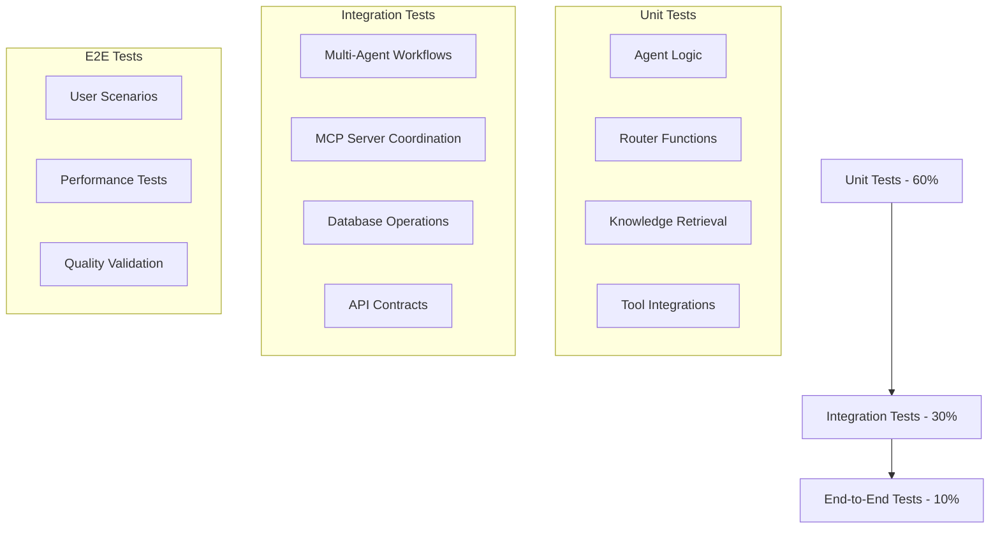

# PromptCraft-Hybrid: Phase 2 Testing Strategy

Version: 2.0
Status: Updated for v7.0 Architecture
Audience: QA Engineers, Development Team, Test Architects

## 1. Testing Overview

### 1.1. Testing Philosophy

Phase 2 testing focuses on multi-agent orchestration reliability, tool integration accuracy, and user experience consistency. The testing strategy emphasizes:

- **Agent Routing Accuracy**: Ensuring queries reach the correct specialized agent
- **Tool Integration Reliability**: Validating MCP server connections and responses
- **Cross-Agent Coordination**: Testing collaborative multi-agent workflows
- **Performance Under Load**: Concurrent request handling and response times
- **Quality Consistency**: Maintaining high prompt quality across all agents

### 1.2. Testing Pyramid



## 2. Comprehensive Test Suites

### 2.1. Integration Test Suite

```python
# tests/test_phase2_orchestration.py
import pytest
import asyncio
from src.orchestration.zen_orchestrator import MultiAgentOrchestrator
from src.agents.security_agent import SecurityAgent
from src.agents.web_dev_agent import WebDevAgent

class TestPhase2Orchestration:
    """Comprehensive Phase 2 testing"""

    @pytest.fixture
    async def orchestrator(self):
        """Setup orchestrator with test configuration"""
        config = {
            "agents": [
                {"agent_id": "security_agent", "class_path": "src.agents.security_agent.SecurityAgent"},
                {"agent_id": "web_dev_agent", "class_path": "src.agents.web_dev_agent.WebDevAgent"}
            ],
            "routing_rules": [
                {"pattern": "security|auth|vulnerability", "primary_agent": "security_agent"},
                {"pattern": "react|javascript|web", "primary_agent": "web_dev_agent"}
            ]
        }
        return MultiAgentOrchestrator(config)

    async def test_agent_routing_accuracy(self, orchestrator):
        """Test agent selection accuracy"""
        test_cases = [
            ("Fix authentication vulnerability in my API", "security_agent", 0.9),
            ("Optimize React component performance", "web_dev_agent", 0.8),
            ("Review security of user login system", "security_agent", 0.85),
            ("Help with JavaScript debugging", "web_dev_agent", 0.7)
        ]

        for query, expected_agent, min_confidence in test_cases:
            routing = await orchestrator.router.route(query)
            assert routing["primary_agent"] == expected_agent
            assert routing["confidence"] >= min_confidence

    async def test_heimdall_integration(self, orchestrator):
        """Test Heimdall MCP integration"""
        test_code = """
        function login(username, password) {
            const query = `SELECT * FROM users WHERE username = '${username}' AND password = '${password}'`;
            return db.execute(query);
        }
        """

        request = {
            "query": "Review this login function for security issues",
            "context": {
                "project_context": {"file_content": test_code}
            }
        }

        result = await orchestrator.processRequest(request)

        # Should detect SQL injection vulnerability
        assert "security_scan" in result.data.get("analysis_results", {})
        assert "sql injection" in result.data["final_prompt"].lower()
        assert result.metadata["agent_used"] == "security_agent"

    async def test_github_mcp_integration(self, orchestrator):
        """Test GitHub MCP integration"""
        request = {
            "query": "Analyze the architecture of this React project",
            "context": {
                "project_context": {
                    "repo_url": "https://github.com/facebook/react"
                }
            }
        }

        result = await orchestrator.processRequest(request)

        assert "repo_analysis" in result.data.get("analysis_results", {})
        assert result.metadata["agent_used"] == "web_dev_agent"
        assert "tools_used" in result.data
        assert "github_mcp" in [tool["tool"] for tool in result.data["reasoning_chain"]]

    async def test_cost_tracking(self, orchestrator):
        """Test cost tracking and limits"""
        # Configure low cost limit for testing
        orchestrator.costTracker.daily_limit = 0.10

        # This should work (low cost)
        result1 = await orchestrator.processRequest({
            "query": "Basic security question",
            "context": {"search_preferences": {"max_cost": 0.05}}
        })

        assert result1.metadata["total_cost"] <= 0.05

        # This should be rejected or use free alternatives
        result2 = await orchestrator.processRequest({
            "query": "Complex research question requiring premium search",
            "context": {"search_preferences": {"max_cost": 1.00}}
        })

        # Should either reject or find free alternative
        assert result2.metadata["total_cost"] <= orchestrator.costTracker.daily_limit

    async def test_cross_agent_consultation(self, orchestrator):
        """Test cross-agent consultation feature"""
        request = {
            "query": "Design a secure user authentication system",
            "context": {},
            "options": {
                "enable_cross_agent_consultation": True,
                "max_agents": 2
            }
        }

        result = await orchestrator.processRequest(request)

        # Should involve both security and web dev agents
        assert result.metadata["cross_agent_consultations"] > 0
        consultations = result.data.get("consultations", {})
        assert len(consultations) >= 1

        # Final prompt should integrate insights from both agents
        prompt = result.data["final_prompt"]
        assert "security" in prompt.lower()
        assert any(term in prompt.lower() for term in ["react", "javascript", "frontend"])

    async def test_knowledge_retrieval_accuracy(self, orchestrator):
        """Test knowledge base retrieval accuracy"""
        # Test security agent knowledge
        security_agent = SecurityAgent()
        security_knowledge = security_agent.get_relevant_knowledge(
            "OWASP Top 10 vulnerabilities",
            tags=["security", "owasp"]
        )

        assert len(security_knowledge) > 0
        assert any("owasp" in chunk["chunk"].lower() for chunk in security_knowledge)

        # Test web dev agent knowledge
        web_agent = WebDevAgent()
        web_knowledge = web_agent.get_relevant_knowledge(
            "React performance optimization",
            tags=["react", "performance"]
        )

        assert len(web_knowledge) > 0
        assert any("react" in chunk["chunk"].lower() for chunk in web_knowledge)
```

### 2.2. Performance Testing Suite

```python
# tests/test_phase2_performance.py
import pytest
import asyncio
import time
from src.orchestration.zen_orchestrator import MultiAgentOrchestrator

class TestPhase2Performance:
    """Performance and load testing for Phase 2"""

    async def test_concurrent_requests(self, orchestrator):
        """Test performance under concurrent load"""

        async def make_request(query_id):
            """Make a single request"""
            start_time = time.time()
            result = await orchestrator.processRequest({
                "query": f"Security review question {query_id}",
                "context": {}
            })
            end_time = time.time()
            return {
                "query_id": query_id,
                "duration": end_time - start_time,
                "success": result.status == "success",
                "agent_used": result.metadata.get("agent_used")
            }

        # Run 10 concurrent requests
        tasks = [make_request(i) for i in range(10)]
        results = await asyncio.gather(*tasks)

        # Verify all requests succeeded
        assert all(r["success"] for r in results)

        # Verify performance targets
        durations = [r["duration"] for r in results]
        avg_duration = sum(durations) / len(durations)
        p95_duration = sorted(durations)[int(0.95 * len(durations))]

        assert avg_duration < 3.0  # Average under 3 seconds
        assert p95_duration < 5.0  # P95 under 5 seconds

        print(f"Concurrent test results:")
        print(f"  Average duration: {avg_duration:.2f}s")
        print(f"  P95 duration: {p95_duration:.2f}s")
        print(f"  Success rate: {sum(r['success'] for r in results) / len(results) * 100:.1f}%")

    async def test_agent_switching_performance(self, orchestrator):
        """Test performance when switching between agents"""
        queries = [
            ("Security vulnerability analysis", "security_agent"),
            ("React component optimization", "web_dev_agent"),
            ("Authentication best practices", "security_agent"),
            ("JavaScript performance tuning", "web_dev_agent"),
            ("OWASP compliance check", "security_agent")
        ]

        results = []
        for query, expected_agent in queries:
            start_time = time.time()
            result = await orchestrator.processRequest({
                "query": query,
                "context": {}
            })
            duration = time.time() - start_time

            results.append({
                "query": query,
                "expected_agent": expected_agent,
                "actual_agent": result.metadata.get("agent_used"),
                "duration": duration,
                "correct_routing": result.metadata.get("agent_used") == expected_agent
            })

        # Verify routing accuracy
        correct_routes = sum(r["correct_routing"] for r in results)
        routing_accuracy = correct_routes / len(results)
        assert routing_accuracy >= 0.8  # 80% minimum accuracy

        # Verify no significant overhead from agent switching
        avg_duration = sum(r["duration"] for r in results) / len(results)
        assert avg_duration < 3.0

        print(f"Agent switching test results:")
        print(f"  Routing accuracy: {routing_accuracy * 100:.1f}%")
        print(f"  Average duration: {avg_duration:.2f}s")

    async def test_memory_usage_stability(self, orchestrator):
        """Test memory usage under extended load"""
        import psutil
        import os

        process = psutil.Process(os.getpid())
        initial_memory = process.memory_info().rss / 1024 / 1024  # MB

        # Run 50 requests to test memory stability
        for i in range(50):
            await orchestrator.processRequest({
                "query": f"Test query {i} for memory usage",
                "context": {}
            })

            if i % 10 == 0:  # Check every 10 requests
                current_memory = process.memory_info().rss / 1024 / 1024
                memory_growth = current_memory - initial_memory

                # Memory should not grow by more than 100MB
                assert memory_growth < 100, f"Memory grew by {memory_growth:.2f}MB after {i+1} requests"

        final_memory = process.memory_info().rss / 1024 / 1024
        total_growth = final_memory - initial_memory

        print(f"Memory usage test results:")
        print(f"  Initial memory: {initial_memory:.2f}MB")
        print(f"  Final memory: {final_memory:.2f}MB")
        print(f"  Total growth: {total_growth:.2f}MB")

        # Should not leak more than 50MB after 50 requests
        assert total_growth < 50

    async def test_tool_integration_latency(self, orchestrator):
        """Test latency of tool integrations"""

        # Test Heimdall integration latency
        heimdall_times = []
        for _ in range(5):
            start_time = time.time()
            await orchestrator.processRequest({
                "query": "Review this code for security issues",
                "context": {
                    "project_context": {
                        "file_content": "function test() { return 'hello'; }"
                    }
                }
            })
            heimdall_times.append(time.time() - start_time)

        avg_heimdall_time = sum(heimdall_times) / len(heimdall_times)
        assert avg_heimdall_time < 5.0  # Should complete within 5 seconds

        # Test GitHub MCP integration latency
        github_times = []
        for _ in range(3):  # Fewer tests due to API rate limits
            start_time = time.time()
            await orchestrator.processRequest({
                "query": "Analyze this React repository structure",
                "context": {
                    "project_context": {
                        "repo_url": "https://github.com/facebook/react"
                    }
                }
            })
            github_times.append(time.time() - start_time)

        avg_github_time = sum(github_times) / len(github_times)
        assert avg_github_time < 10.0  # GitHub analysis may take longer

        print(f"Tool integration latency results:")
        print(f"  Average Heimdall time: {avg_heimdall_time:.2f}s")
        print(f"  Average GitHub time: {avg_github_time:.2f}s")
```

### 2.3. Quality Assurance Tests

```python
# tests/test_phase2_quality.py
import pytest
import asyncio
from src.orchestration.zen_orchestrator import MultiAgentOrchestrator

class TestPhase2Quality:
    """Quality assurance and validation tests"""

    async def test_prompt_quality_consistency(self, orchestrator):
        """Test that generated prompts maintain quality across agents"""
        test_queries = [
            "Review authentication security",
            "Optimize React performance",
            "Implement OAuth2 flow",
            "Secure API endpoints"
        ]

        quality_scores = []

        for query in test_queries:
            result = await orchestrator.processRequest({
                "query": query,
                "context": {}
            })

            prompt = result.data["final_prompt"]

            # Quality checks
            quality_score = self._assess_prompt_quality(prompt)
            quality_scores.append(quality_score)

            # Basic structure checks
            assert "## Context" in prompt or "# Context" in prompt
            assert "## Request" in prompt or "# Request" in prompt
            assert len(prompt) > 200  # Minimum length
            assert len(prompt.split('\n')) > 5  # Multiple lines

        avg_quality = sum(quality_scores) / len(quality_scores)
        assert avg_quality >= 4.0  # Average quality >= 4/5

        print(f"Prompt quality test results:")
        print(f"  Average quality score: {avg_quality:.2f}/5.0")
        print(f"  Quality scores: {quality_scores}")

    def _assess_prompt_quality(self, prompt: str) -> float:
        """Assess prompt quality on a 1-5 scale"""
        score = 1.0

        # Structure checks
        if "## Context" in prompt or "# Context" in prompt:
            score += 0.5
        if "## Request" in prompt or "# Request" in prompt:
            score += 0.5
        if "## Examples" in prompt or "# Examples" in prompt:
            score += 0.5

        # Content depth checks
        if len(prompt) > 500:
            score += 0.5
        if len(prompt) > 1000:
            score += 0.5

        # Technical content checks
        if any(term in prompt.lower() for term in ["specific", "detailed", "comprehensive"]):
            score += 0.5

        # Actionability checks
        if any(term in prompt.lower() for term in ["implement", "create", "analyze", "review"]):
            score += 0.5

        return min(5.0, score)

    async def test_agent_specialization_effectiveness(self, orchestrator):
        """Test that agents provide domain-specific value"""

        # Security agent specialization test
        security_result = await orchestrator.processRequest({
            "query": "Review authentication implementation for vulnerabilities",
            "context": {
                "project_context": {
                    "file_content": """
                    function authenticate(token) {
                        return jwt.verify(token, process.env.SECRET);
                    }
                    """
                }
            }
        })

        security_prompt = security_result.data["final_prompt"]

        # Should include security-specific elements
        assert any(term in security_prompt.lower() for term in [
            "vulnerability", "security", "owasp", "authentication", "jwt"
        ])
        assert "heimdall" in [step.get("tool") for step in security_result.data.get("reasoning_chain", [])]

        # Web dev agent specialization test
        webdev_result = await orchestrator.processRequest({
            "query": "Optimize React component rendering performance",
            "context": {}
        })

        webdev_prompt = webdev_result.data["final_prompt"]

        # Should include web dev-specific elements
        assert any(term in webdev_prompt.lower() for term in [
            "react", "performance", "optimization", "rendering", "component"
        ])

        print("Agent specialization test passed - agents provide domain-specific value")

    async def test_cross_agent_consultation_quality(self, orchestrator):
        """Test quality of cross-agent consultation results"""

        # Test complex query requiring multiple agents
        result = await orchestrator.processRequest({
            "query": "Design a secure user registration system with modern React frontend",
            "options": {
                "enable_cross_agent_consultation": True,
                "max_agents": 2
            }
        })

        prompt = result.data["final_prompt"]
        consultations = result.data.get("consultations", {})

        # Should involve multiple agents
        assert result.metadata["cross_agent_consultations"] > 0
        assert len(consultations) >= 1

        # Should have comprehensive coverage
        assert "security" in prompt.lower()
        assert "react" in prompt.lower()
        assert len(prompt) > 1200  # Should be comprehensive

        # Should mention both security and React concepts
        security_terms = ["authentication", "authorization", "validation", "encryption"]
        react_terms = ["component", "state", "hook", "props"]

        assert any(term in prompt.lower() for term in security_terms)
        assert any(term in prompt.lower() for term in react_terms)

        print("Cross-agent consultation quality test passed")

    async def test_error_handling_graceful_degradation(self, orchestrator):
        """Test graceful error handling and degradation"""

        # Test with invalid repository URL
        result = await orchestrator.processRequest({
            "query": "Analyze this repository",
            "context": {
                "project_context": {
                    "repo_url": "https://github.com/invalid/nonexistent"
                }
            }
        })

        # Should still provide a useful response
        assert result.data["final_prompt"]
        assert len(result.data["final_prompt"]) > 100
        assert result.metadata["agent_used"] in ["web_dev_agent", "create_agent"]

        # Test with malformed code
        result = await orchestrator.processRequest({
            "query": "Review this code for security issues",
            "context": {
                "project_context": {
                    "file_content": "invalid javascript code { } } }"
                }
            }
        })

        # Should still provide security guidance
        assert result.data["final_prompt"]
        assert "security" in result.data["final_prompt"].lower()

        print("Error handling test passed - graceful degradation working")
```

### 2.4. Real-World User Scenarios

```python
# tests/test_phase2_scenarios.py
import pytest
import asyncio

class TestPhase2UserScenarios:
    """Real-world usage scenarios for Phase 2"""

    async def test_security_code_review_scenario(self):
        """Complete security code review workflow"""

        # Scenario: Developer wants security review of authentication code
        request = {
            "query": "Review my authentication middleware for security vulnerabilities",
            "context": {
                "project_context": {
                    "repo_url": "https://github.com/user/test-app",
                    "file_content": """
                    const jwt = require('jsonwebtoken');

                    function authMiddleware(req, res, next) {
                        const token = req.headers.authorization;

                        if (!token) {
                            return res.status(401).json({error: 'No token'});
                        }

                        try {
                            const decoded = jwt.verify(token, 'hardcoded-secret');
                            req.user = decoded;
                            next();
                        } catch (err) {
                            res.status(401).json({error: 'Invalid token'});
                        }
                    }
                    """
                }
            }
        }

        result = await orchestrator.processRequest(request)

        # Verify security agent was selected
        assert result.metadata["agent_used"] == "security_agent"

        # Verify Heimdall analysis detected hardcoded secret
        analysis = result.data.get("analysis_results", {})
        assert "security_scan" in analysis
        assert any("hardcoded" in issue["description"].lower()
                  for issue in analysis["security_scan"].get("issues", []))

        # Verify comprehensive security prompt
        prompt = result.data["final_prompt"]
        assert "hardcoded secret" in prompt.lower()
        assert "environment variable" in prompt.lower()
        assert len(prompt) > 800  # Comprehensive response

    async def test_react_optimization_scenario(self):
        """Complete React optimization workflow"""

        request = {
            "query": "Help optimize this React component for better performance",
            "context": {
                "project_context": {
                    "repo_url": "https://github.com/user/react-app",
                    "file_content": """
                    import React, { useState, useEffect } from 'react';

                    function UserList() {
                        const [users, setUsers] = useState([]);
                        const [filter, setFilter] = useState('');

                        useEffect(() => {
                            fetch('/api/users')
                                .then(res => res.json())
                                .then(setUsers);
                        }, []);

                        const filteredUsers = users.filter(user =>
                            user.name.toLowerCase().includes(filter.toLowerCase())
                        );

                        return (
                            <div>
                                <input
                                    value={filter}
                                    onChange={e => setFilter(e.target.value)}
                                    placeholder="Filter users..."
                                />
                                {filteredUsers.map(user => (
                                    <div key={user.id}>
                                        <h3>{user.name}</h3>
                                        <p>{user.email}</p>
                                    </div>
                                ))}
                            </div>
                        );
                    }
                    """
                }
            }
        }

        result = await orchestrator.processRequest(request)

        # Verify web dev agent was selected
        assert result.metadata["agent_used"] == "web_dev_agent"

        # Verify GitHub MCP analyzed repository
        assert "repo_analysis" in result.data.get("analysis_results", {})

        # Verify performance optimization suggestions
        prompt = result.data["final_prompt"]
        assert any(term in prompt.lower() for term in [
            "usememo", "usecallback", "memo", "optimization"
        ])
        assert "performance" in prompt.lower()

    async def test_cross_agent_consultation_scenario(self):
        """Test cross-agent consultation for complex queries"""

        request = {
            "query": "Design a secure user registration system with modern React frontend",
            "options": {
                "enable_cross_agent_consultation": True,
                "max_agents": 2
            }
        }

        result = await orchestrator.processRequest(request)

        # Should involve both security and web dev agents
        assert result.metadata["cross_agent_consultations"] > 0

        # Should have comprehensive security and React guidance
        prompt = result.data["final_prompt"]
        assert "security" in prompt.lower()
        assert "react" in prompt.lower()
        assert "registration" in prompt.lower()

        # Should be significantly longer and more detailed
        assert len(prompt) > 1200

        # Should mention both security practices and React patterns
        assert any(term in prompt.lower() for term in [
            "password", "validation", "encryption"
        ])
        assert any(term in prompt.lower() for term in [
            "component", "state", "hook"
        ])

    async def test_fallback_agent_scenario(self):
        """Test fallback to general agent for ambiguous queries"""

        request = {
            "query": "Help me write a business plan for my startup",
            "context": {}
        }

        result = await orchestrator.processRequest(request)

        # Should fallback to create_agent for non-technical queries
        assert result.metadata["agent_used"] == "create_agent"

        # Should still provide a structured C.R.E.A.T.E. response
        prompt = result.data["final_prompt"]
        assert "## Context" in prompt or "# Context" in prompt
        assert "business plan" in prompt.lower()
        assert len(prompt) > 300

    async def test_cost_conscious_scenario(self):
        """Test cost-conscious search preferences"""

        request = {
            "query": "Latest security best practices for Node.js applications",
            "context": {
                "search_preferences": {
                    "max_cost": 0.01,
                    "prefer_free": True
                }
            }
        }

        result = await orchestrator.processRequest(request)

        # Should complete within budget
        assert result.metadata["total_cost"] <= 0.01

        # Should still provide valuable security guidance
        prompt = result.data["final_prompt"]
        assert "security" in prompt.lower()
        assert "node.js" in prompt.lower()
        assert len(prompt) > 400
```

## 3. Test Configuration & Infrastructure

### 3.1. Pytest Configuration

```python
# pytest.ini
[tool:pytest]
testpaths = tests
python_files = test_*.py
python_classes = Test*
python_functions = test_*
addopts =
    -v
    --tb=short
    --strict-markers
    --disable-warnings
    --cov=src
    --cov-report=html
    --cov-report=term-missing
    --cov-report=xml
    --cov-fail-under=80
markers =
    unit: Unit tests
    integration: Integration tests
    performance: Performance tests
    scenario: Real-world scenario tests
    slow: Slow tests (skipped by default)
asyncio_mode = auto
```

### 3.2. Test Fixtures

```python
# tests/conftest.py
import pytest
import asyncio
import os
from unittest.mock import Mock, AsyncMock
from src.orchestration.zen_orchestrator import MultiAgentOrchestrator
from src.agents.security_agent import SecurityAgent
from src.agents.web_dev_agent import WebDevAgent

@pytest.fixture(scope="session")
def event_loop():
    """Create an instance of the default event loop for the test session."""
    loop = asyncio.get_event_loop_policy().new_event_loop()
    yield loop
    loop.close()

@pytest.fixture
async def mock_qdrant_client():
    """Mock Qdrant client for testing"""
    mock_client = AsyncMock()
    mock_client.search.return_value = [
        {
            "id": "test_chunk_1",
            "score": 0.95,
            "payload": {
                "text_chunk": "Security best practices for authentication",
                "metadata": {"agent_id": "security_agent", "tags": ["security", "auth"]}
            }
        }
    ]
    return mock_client

@pytest.fixture
async def mock_heimdall_mcp():
    """Mock Heimdall MCP server"""
    mock_heimdall = AsyncMock()
    mock_heimdall.analyze_code.return_value = {
        "overall_score": 65,
        "issues": [
            {
                "severity": "high",
                "category": "security",
                "line": 17,
                "description": "Hardcoded secret detected",
                "recommendation": "Use environment variables for secrets",
                "cwe_id": "CWE-798"
            }
        ],
        "summary": "Code contains security vulnerabilities that should be addressed"
    }
    return mock_heimdall

@pytest.fixture
async def mock_github_mcp():
    """Mock GitHub MCP server"""
    mock_github = AsyncMock()
    mock_github.analyze_repository.return_value = {
        "structure": {
            "framework": "react",
            "languages": ["javascript", "typescript"],
            "dependencies": ["react", "react-dom", "@types/react"]
        },
        "files": [
            {"path": "package.json", "type": "config", "size": 1024},
            {"path": "src/App.tsx", "type": "component", "size": 2048}
        ],
        "insights": {
            "architecture_pattern": "component-based",
            "testing_framework": "jest",
            "deployment_method": "static"
        }
    }
    return mock_github

@pytest.fixture
async def test_orchestrator(mock_qdrant_client, mock_heimdall_mcp, mock_github_mcp):
    """Create orchestrator with mocked dependencies for testing"""
    config = {
        "agents": [
            {"agent_id": "security_agent", "class_path": "src.agents.security_agent.SecurityAgent"},
            {"agent_id": "web_dev_agent", "class_path": "src.agents.web_dev_agent.WebDevAgent"},
            {"agent_id": "create_agent", "class_path": "src.agents.create_agent.CreateAgent"}
        ],
        "routing_rules": [
            {"pattern": "security|auth|vulnerability", "primary_agent": "security_agent"},
            {"pattern": "react|javascript|web", "primary_agent": "web_dev_agent"},
            {"pattern": ".*", "primary_agent": "create_agent"}
        ]
    }

    orchestrator = MultiAgentOrchestrator(config)

    # Inject mocked dependencies
    orchestrator.qdrant_client = mock_qdrant_client
    orchestrator.tools.set("heimdall", mock_heimdall_mcp)
    orchestrator.tools.set("github_mcp", mock_github_mcp)

    return orchestrator

@pytest.fixture
def sample_test_data():
    """Sample test data for various scenarios"""
    return {
        "security_code": """
        function login(username, password) {
            const query = `SELECT * FROM users WHERE username = '${username}' AND password = '${password}'`;
            return db.execute(query);
        }
        """,
        "react_component": """
        import React, { useState, useEffect } from 'react';

        function UserList() {
            const [users, setUsers] = useState([]);
            const [filter, setFilter] = useState('');

            useEffect(() => {
                fetch('/api/users').then(res => res.json()).then(setUsers);
            }, []);

            const filteredUsers = users.filter(user =>
                user.name.toLowerCase().includes(filter.toLowerCase())
            );

            return (
                <div>
                    <input value={filter} onChange={e => setFilter(e.target.value)} />
                    {filteredUsers.map(user => <div key={user.id}>{user.name}</div>)}
                </div>
            );
        }
        """,
        "test_queries": [
            "Review authentication security",
            "Optimize React performance",
            "Implement OAuth2 flow",
            "Secure API endpoints",
            "Debug JavaScript performance issues"
        ]
    }
```

### 3.3. Mock Services

```python
# tests/mocks/mock_services.py
from unittest.mock import AsyncMock, Mock
import json

class MockAzureAI:
    """Mock Azure AI service for testing"""

    def __init__(self):
        self.call_count = 0

    async def complete(self, messages, model="gpt-4o", temperature=0.3):
        self.call_count += 1

        # Generate realistic responses based on input
        user_message = messages[-1]["content"] if messages else ""

        if "security" in user_message.lower():
            response_content = """
            # Security Analysis Prompt

            ## Context
            You are a senior security engineer reviewing authentication code for vulnerabilities.

            ## Request
            Analyze the provided code for security issues and provide remediation steps.

            ## Examples
            - Check for SQL injection vulnerabilities
            - Verify secure credential handling
            - Validate input sanitization
            """
        elif "react" in user_message.lower():
            response_content = """
            # React Performance Optimization

            ## Context
            You are a React performance expert optimizing component rendering.

            ## Request
            Analyze the component for performance bottlenecks and suggest improvements.

            ## Examples
            - Implement useMemo for expensive calculations
            - Add useCallback for event handlers
            - Consider React.memo for component memoization
            """
        else:
            response_content = """
            # General C.R.E.A.T.E. Prompt

            ## Context
            Expert assistant providing structured guidance.

            ## Request
            Address the user's query with comprehensive analysis.
            """

        mock_response = Mock()
        mock_response.content = response_content
        return mock_response

class MockCostTracker:
    """Mock cost tracking service"""

    def __init__(self):
        self.daily_limit = 5.00
        self.session_cost = 0.0

    def canAfford(self, tool_name):
        tool_costs = {
            "heimdall": 0.001,
            "github_mcp": 0.002,
            "tavily_search": 0.0006,
            "context7_search": 0.0
        }
        return self.session_cost + tool_costs.get(tool_name, 0) <= self.daily_limit

    def trackCost(self, tool_name, cost):
        self.session_cost += cost

    def getSessionCost(self):
        return self.session_cost

    def reset(self):
        self.session_cost = 0.0

class MockKeywordMatcher:
    """Mock keyword matching service"""

    def match(self, query):
        query_lower = query.lower()

        if any(term in query_lower for term in ["security", "auth", "vulnerability"]):
            return {"agent": "security_agent", "confidence": 0.95}
        elif any(term in query_lower for term in ["react", "javascript", "web"]):
            return {"agent": "web_dev_agent", "confidence": 0.90}
        elif any(term in query_lower for term in ["tax", "8867", "irs"]):
            return {"agent": "irs_8867_agent", "confidence": 0.95}
        else:
            return {"agent": None, "confidence": 0.0}
```

## 4. Test Execution & Automation

### 4.1. Test Commands

```bash
# Run all tests
pytest

# Run specific test categories
pytest -m unit                    # Unit tests only
pytest -m integration             # Integration tests only
pytest -m performance            # Performance tests only
pytest -m scenario               # User scenario tests only

# Run tests with coverage
pytest --cov=src --cov-report=html

# Run tests for specific components
pytest tests/test_phase2_orchestration.py -v
pytest tests/test_phase2_performance.py -v
pytest tests/test_phase2_quality.py -v

# Run tests excluding slow ones
pytest -m "not slow"

# Run tests with specific Python version (using nox)
nox -s tests -p 3.11
nox -s tests -p 3.12

# Run load tests
pytest tests/test_phase2_performance.py::TestPhase2Performance::test_concurrent_requests -v
```

### 4.2. Continuous Integration

```yaml
# .github/workflows/phase2-testing.yml
name: Phase 2 Testing

on:
  push:
    branches: [ main, knowledgebase_edits ]
  pull_request:
    branches: [ main ]

jobs:
  test:
    runs-on: ubuntu-latest
    strategy:
      matrix:
        python-version: [3.11, 3.12]

    services:
      qdrant:
        image: qdrant/qdrant:v1.9.0
        ports:
          - 6333:6333
        options: >-
          --health-cmd "curl -f http://localhost:6333/health"
          --health-interval 30s
          --health-timeout 10s
          --health-retries 5

    steps:
    - uses: actions/checkout@v4

    - name: Set up Python ${{ matrix.python-version }}
      uses: actions/setup-python@v4
      with:
        python-version: ${{ matrix.python-version }}

    - name: Install Poetry
      uses: snok/install-poetry@v1
      with:
        version: latest
        virtualenvs-create: true
        virtualenvs-in-project: true

    - name: Load cached venv
      id: cached-poetry-dependencies
      uses: actions/cache@v3
      with:
        path: .venv
        key: venv-${{ runner.os }}-${{ matrix.python-version }}-${{ hashFiles('**/poetry.lock') }}

    - name: Install dependencies
      if: steps.cached-poetry-dependencies.outputs.cache-hit != 'true'
      run: poetry install --no-interaction --no-root

    - name: Install project
      run: poetry install --no-interaction

    - name: Run linting
      run: |
        poetry run black --check .
        poetry run ruff check .
        poetry run mypy src

    - name: Run unit tests
      run: poetry run pytest tests/ -m unit --cov=src --cov-report=xml

    - name: Run integration tests
      run: poetry run pytest tests/ -m integration --cov=src --cov-append --cov-report=xml
      env:
        QDRANT_HOST: localhost
        QDRANT_PORT: 6333

    - name: Run scenario tests
      run: poetry run pytest tests/ -m scenario --cov=src --cov-append --cov-report=xml

    - name: Upload coverage to Codecov
      uses: codecov/codecov-action@v3
      with:
        file: ./coverage.xml
        flags: unittests
        name: codecov-umbrella
        fail_ci_if_error: false

  performance:
    runs-on: ubuntu-latest
    needs: test

    steps:
    - uses: actions/checkout@v4

    - name: Set up Python 3.11
      uses: actions/setup-python@v4
      with:
        python-version: 3.11

    - name: Install Poetry
      uses: snok/install-poetry@v1

    - name: Install dependencies
      run: poetry install --no-interaction

    - name: Run performance tests
      run: poetry run pytest tests/ -m performance --timeout=300
      env:
        PERFORMANCE_TEST_MODE: true

    - name: Generate performance report
      run: |
        echo "Performance test results:" > performance_report.txt
        poetry run pytest tests/ -m performance --tb=no -q >> performance_report.txt

    - name: Upload performance results
      uses: actions/upload-artifact@v3
      with:
        name: performance-results
        path: performance_report.txt
```

## 5. Quality Gates & Success Criteria

### 5.1. Phase 2 Success Metrics

| Metric | Target | Measurement Method | Acceptance Criteria |
|:-------|:-------|:------------------|:-------------------|
| **Agent Routing Accuracy** | >85% | Automated testing with labeled queries | Route to correct agent 85% of time |
| **Multi-Agent Response Quality** | >4.2/5 | User ratings on 20 test queries | Average rating above 4.2 |
| **Tool Integration Success** | >95% | Heimdall + GitHub MCP call success rate | Less than 5% tool failures |
| **Cross-Agent Consultation** | >90% accuracy | Quality assessment of consultation results | Consultations improve final output |
| **Cost Efficiency** | <$0.10/query | Automated cost tracking | Average query cost under $0.10 |
| **Response Time** | <3s average | Performance monitoring | P95 under 5 seconds |

### 5.2. Quality Gates

**Technical Quality Gate:**
- [ ] All agents route correctly for their domain keywords
- [ ] Heimdall MCP successfully analyzes code samples
- [ ] GitHub MCP successfully analyzes public repositories
- [ ] Cross-agent consultation produces coherent results
- [ ] Cost tracking prevents budget overruns

**User Experience Quality Gate:**
- [ ] UI clearly shows which agent handled the query
- [ ] Users can force agent selection when needed
- [ ] Error handling graceful for MCP failures
- [ ] Repository analysis works with public GitHub repos
- [ ] Response quality visibly better than Phase 1

**Performance Quality Gate:**
- [ ] 10 concurrent requests complete successfully
- [ ] Agent switching adds <500ms overhead
- [ ] Memory usage stable during extended testing
- [ ] No resource leaks in long-running tests

### 5.3. Test Coverage Requirements

```python
# Minimum coverage requirements
COVERAGE_REQUIREMENTS = {
    "src/orchestration/": 90,    # Core orchestration logic
    "src/agents/": 85,           # Agent implementations
    "src/ui/": 75,               # User interface components
    "src/ingestion/": 80,        # Knowledge ingestion
    "src/utils/": 85,            # Utility functions
    "overall": 80                # Overall project coverage
}
```

## 6. Test Data Management

### 6.1. Test Datasets

```python
# tests/data/test_datasets.py
SECURITY_TEST_CASES = [
    {
        "query": "Review authentication middleware for vulnerabilities",
        "code": """
        function authMiddleware(req, res, next) {
            const token = req.headers.authorization;
            if (!token) return res.status(401).json({error: 'No token'});
            try {
                const decoded = jwt.verify(token, 'hardcoded-secret');
                req.user = decoded;
                next();
            } catch (err) {
                res.status(401).json({error: 'Invalid token'});
            }
        }
        """,
        "expected_agent": "security_agent",
        "expected_issues": ["hardcoded secret", "credential exposure"]
    },
    {
        "query": "Check SQL injection vulnerabilities",
        "code": """
        function getUser(userId) {
            const query = `SELECT * FROM users WHERE id = ${userId}`;
            return database.query(query);
        }
        """,
        "expected_agent": "security_agent",
        "expected_issues": ["sql injection", "parameter injection"]
    }
]

REACT_TEST_CASES = [
    {
        "query": "Optimize React component performance",
        "code": """
        function UserList({ users }) {
            const [filter, setFilter] = useState('');
            const filteredUsers = users.filter(user =>
                user.name.toLowerCase().includes(filter.toLowerCase())
            );
            return (
                <div>
                    <input onChange={e => setFilter(e.target.value)} />
                    {filteredUsers.map(user => <div key={user.id}>{user.name}</div>)}
                </div>
            );
        }
        """,
        "expected_agent": "web_dev_agent",
        "expected_optimizations": ["useMemo", "useCallback", "React.memo"]
    },
    {
        "query": "Fix React rendering performance issues",
        "code": """
        function ExpensiveComponent({ data }) {
            const processedData = data.map(item => ({
                ...item,
                computed: expensiveCalculation(item)
            }));
            return <div>{processedData.map(item => <Item key={item.id} data={item} />)}</div>;
        }
        """,
        "expected_agent": "web_dev_agent",
        "expected_optimizations": ["memoization", "virtualization", "lazy loading"]
    }
]

CROSS_AGENT_TEST_CASES = [
    {
        "query": "Design secure user registration with React frontend",
        "expected_agents": ["security_agent", "web_dev_agent"],
        "expected_topics": ["password validation", "form security", "react components", "state management"]
    },
    {
        "query": "Build authenticated API with React dashboard",
        "expected_agents": ["security_agent", "web_dev_agent"],
        "expected_topics": ["jwt tokens", "api security", "react routing", "authentication flow"]
    }
]
```

This comprehensive testing strategy ensures Phase 2 delivers reliable multi-agent orchestration with high quality, performance, and user experience. The test suite covers all critical functionality while providing automated validation of success criteria.
