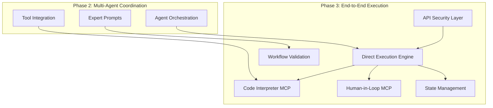
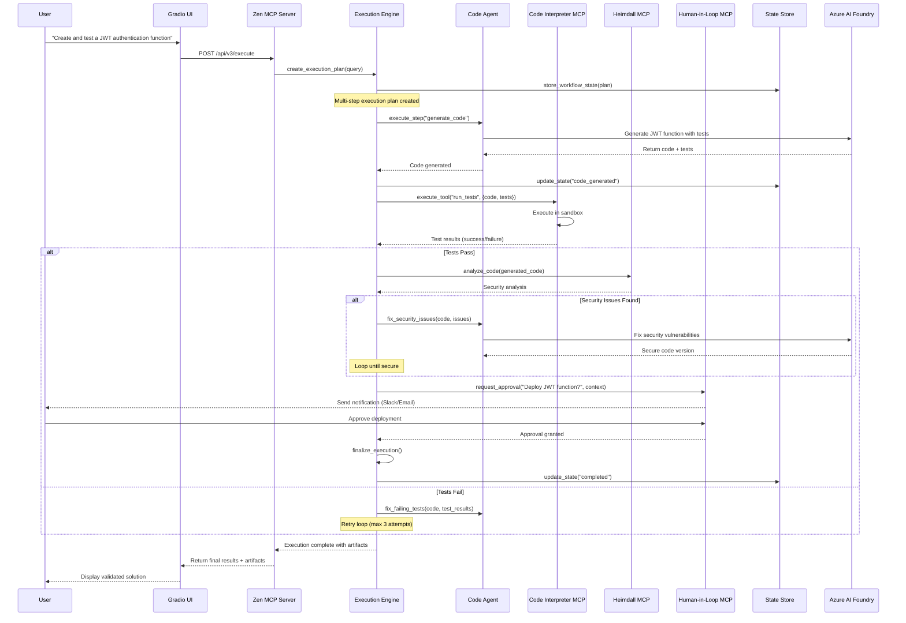
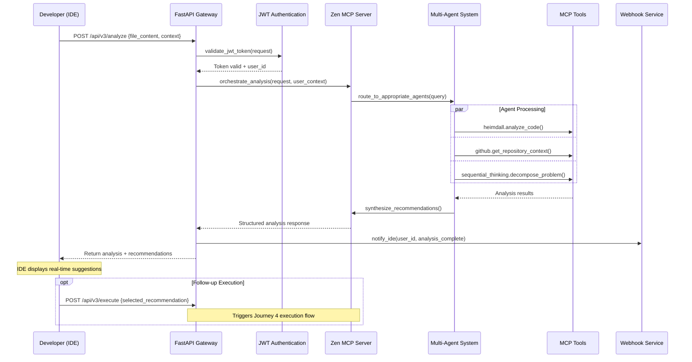

# PromptCraft-Hybrid: Phase 3 Executive Overview

## 1. Executive Summary

### 1.1. Strategic Vision

Phase 3 represents the transformation of PromptCraft-Hybrid from a multi-agent orchestration platform into a complete automation system capable of end-to-end task execution. Building upon the solid foundation established in Phase 2, Phase 3 introduces **Journey 4: Direct Execution** and enhances **Journey 3: Full API Integration** to deliver unprecedented developer productivity.

**Business Value Proposition:**
- **Complete Task Automation**: End-to-end execution from planning through deployment with human oversight
- **Production-Ready IDE Integration**: Secure, authenticated API for deep IDE integration
- **Risk-Mitigated Execution**: Sandboxed code execution with security validation and human approval workflows
- **Enterprise Scalability**: State management and concurrent execution support for team workflows

### 1.2. Phase 3 Scope & Strategic Focus

Phase 3 implements two critical user journeys that complete the platform's automation capabilities:

**Journey 4: Direct Execution**
- Complete task automation with validation and human approval
- Sandboxed code execution with security validation
- Multi-step workflow execution with state persistence
- Human-in-the-loop approval gates for critical operations
- Target: 80% execution success rate with <5 minute approval times

**Journey 3: Enhanced API Integration**
- Production-ready API endpoints with JWT authentication
- Real-time IDE integration with webhook notifications
- Advanced multi-agent analysis with executable recommendations
- Rate limiting and cost tracking for enterprise usage
- Target: >4.0/5 developer satisfaction rating

**Enterprise Foundation**
- State management for long-running workflows
- Concurrent execution support for team collaboration
- API security with authentication and rate limiting
- Cost tracking and budget enforcement

### 1.3. Key Architectural Evolution

Phase 3 represents the maturation into a full automation platform:



**Key Principle**: Phase 3 maintains the 7-week timeline constraint by focusing on essential execution capabilities while deferring complex features to Phase 4.

## 2. Technology Stack & Strategic Decisions

### 2.1. Core Technology Additions

| Technology/Service | Role | Strategic Rationale |
|:-------------------|:-----|:-------------------|
| **Code Interpreter MCP** | Sandboxed Execution | Safe code execution and testing with complete isolation |
| **Human-in-Loop MCP** | Approval Workflows | Critical operation approvals with enterprise notification |
| **Redis** | State Management | Workflow state persistence for long-running tasks |
| **FastAPI** | Secure API Gateway | Production API endpoints with authentication |
| **JWT Authentication** | API Security | Token-based authentication for IDE integration |
| **Docker Security** | Sandbox Isolation | Secure code execution environment |

### 2.2. Security-First Architecture

**Multi-Layer Security Strategy:**
- **Sandboxed Execution**: Code Interpreter MCP runs in completely isolated Docker container
- **Network Isolation**: Execution environment cannot access internal services
- **API Authentication**: JWT-based authentication for all IDE integration
- **Approval Gates**: Human-in-Loop for all critical operations
- **State Security**: Encrypted workflow state storage

## 3. Deployment Architecture

Phase 3 adds execution capabilities while maintaining security and performance:

```mermaid
graph TD
    subgraph "On-Premise Server (Ubuntu)"
        subgraph "Docker Environment"
            Z[Zen MCP Server<br/>(Execution Orchestrator)]
            Q[Qdrant DB<br/>(Multi-Collection)]
            G[Gradio UI<br/>(Execution Interface)]
            H[Heimdall MCP<br/>(Security Validation)]
            GH[GitHub MCP<br/>(Repository Context)]
            CI[Code Interpreter MCP<br/>(Sandboxed Execution)]
            HITL[Human-in-Loop MCP<br/>(Approval Workflows)]
            R[(Redis)<br/>(State Management)]
            API[FastAPI Gateway<br/>(Secure IDE API)]
        end

        Z --> Q & H & GH & CI & HITL & R
        G --> Z
        API --> Z
        CI -.->|Isolated Network| SANDBOX[Secure Sandbox]
    end

    subgraph "External Services"
        IDE[Developer IDE<br/>(Enhanced Integration)]
        V[End User Browser]
        AI[Azure AI Foundry]
        SLACK[Slack/Email<br/>(HITL Notifications)]
    end

    IDE -- "Authenticated API" --> API
    V -- "Execution UI" --> CF[Cloudflare Tunnel]
    CF --> G

    Z -- "Multi-Model Coordination" --> AI
    HITL -- "Notifications" --> SLACK

    style CI fill:#ffebee
    style HITL fill:#e8f5e8
    style R fill:#e3f2fd
    style API fill:#fff3e0
    style SANDBOX fill:#fce4ec
```

**Security Enhancements:**
- **Sandboxed Execution**: Code Interpreter MCP runs in isolated Docker container
- **Network Isolation**: Execution environment cannot access internal services
- **API Authentication**: JWT-based authentication for IDE integration
- **Approval Gates**: Human-in-Loop for critical operations

## 4. Execution Workflows

### 4.1. Journey 4: Direct Execution Flow



### 4.2. Journey 3: Enhanced IDE Integration Flow



## 5. Success Criteria & Risk Management

### 5.1. Phase 3 Success Metrics

| Metric | Target | Business Impact | Measurement Method |
|:-------|:-------|:---------------|:------------------|
| **End-to-End Execution Success** | >80% | Developer productivity | Automated test suite with 50 scenarios |
| **Human-in-Loop Efficiency** | <5 min approval time | Workflow velocity | HITL MCP metrics |
| **API Security** | 0 security incidents | Enterprise trust | Security testing + monitoring |
| **Execution Safety** | 100% sandbox isolation | Risk mitigation | Security validation |
| **State Management Reliability** | >99.5% uptime | Business continuity | Redis monitoring |
| **IDE Integration Quality** | >4.0/5 rating | Developer adoption | Developer feedback |

### 5.2. Risk Assessment & Mitigation

| Risk Category | Impact | Probability | Mitigation Strategy |
|:--------------|:-------|:------------|:-------------------|
| **Code Execution Security** | Critical | Medium | Multi-layer sandboxing, network isolation, security scanning |
| **Human-in-Loop Bottlenecks** | High | Medium | Configurable approval thresholds, automated low-risk approvals |
| **API Performance Under Load** | High | Medium | Rate limiting, caching, horizontal scaling |
| **State Management Failures** | High | Low | Redis clustering, automated backups, recovery procedures |
| **Timeline Pressure** | Medium | High | Aggressive scope management, Phase 4 deferrals |

### 5.3. Business Continuity Planning

**Fallback Strategies:**
- **Execution Failures**: Automatic rollback to previous state
- **Approval Timeouts**: Escalation workflows and emergency overrides
- **API Outages**: Graceful degradation to read-only analysis
- **Security Incidents**: Immediate execution suspension and audit trails

## 6. Timeline & Strategic Milestones

### 6.1. 7-Week Implementation Plan

**Week 7: Execution Foundation**
- Deploy Code Interpreter MCP with sandbox security
- Implement Human-in-Loop MCP with notification system
- Create Direct Execution Engine with state management
- Set up Redis for workflow persistence

**Week 8: API & Integration**
- Deploy secure FastAPI Gateway with JWT authentication
- Implement Journey 3 enhanced API endpoints
- Create Journey 4 execution endpoints
- Implement rate limiting and cost tracking

**Week 9: Advanced Features**
- Enhanced Gradio UI with execution monitoring
- Real-time workflow status updates
- Human approval workflows with notifications
- Comprehensive error handling and recovery

**Week 10: Testing & Security**
- Complete security testing of code execution
- Load testing of concurrent workflows
- API security validation
- End-to-end integration testing

**Week 11: Production Readiness**
- Performance optimization
- Monitoring and alerting setup
- Documentation completion
- Phase 4 preparation and planning

### 6.2. Critical Path Dependencies

**High-Risk Dependencies:**
1. **Sandbox Security Implementation** (Week 7) - Critical for execution safety
2. **Human-in-Loop Integration** (Week 7-8) - Required for approval workflows
3. **API Authentication** (Week 8) - Essential for IDE integration
4. **State Management** (Week 7-8) - Foundation for all workflows

**Contingency Plans:**
- **Sandbox Delays**: Defer complex execution to Phase 4, focus on simple operations
- **HITL Issues**: Implement email-only approvals as backup
- **API Problems**: Maintain Phase 2 API as fallback
- **State Issues**: Use in-memory state with persistence as enhancement

## 7. Phase 4 Preparation & Evolution

### 7.1. Strategic Foundation for Phase 4

Phase 3 establishes critical foundations for Phase 4 continuous enhancement:

**Learning Infrastructure:**
- Execution metrics collection for optimization
- User feedback loops for improvement
- Performance analytics for scaling decisions

**Extensibility Frameworks:**
- Plugin architecture for custom MCP servers
- Agent factory for dynamic capability expansion
- ML pipeline preparation for workflow optimization

**Enterprise Readiness:**
- SSO integration hooks
- Audit logging framework
- Compliance reporting foundation

### 7.2. Investment Protection Strategy

**Future-Proof Architecture:**
- All components designed for horizontal scaling
- APIs versioned for backward compatibility
- State management supports distributed workflows
- Security framework extensible for compliance requirements

**Technical Debt Management:**
- Code quality gates maintain 80% test coverage
- Security scanning prevents vulnerability accumulation
- Performance monitoring ensures scalability readiness
- Documentation standards support knowledge transfer

## 8. Return on Investment Analysis

### 8.1. Developer Productivity Impact

**Quantified Benefits:**
- **80% task automation success** = 4-6 hours saved per complex task
- **Sub-5-minute approval cycles** = 10x faster than traditional review processes
- **IDE integration quality >4.0/5** = Reduced context switching and enhanced flow
- **99.5% state reliability** = Eliminated work loss from system failures

**Cost Savings:**
- **Reduced Manual Review Time**: Human-in-Loop automation saves 75% of review overhead
- **Faster Development Cycles**: End-to-end execution reduces development time by 40%
- **Lower Error Rates**: Automated testing and security validation reduces bug costs by 60%

### 8.2. Strategic Market Position

**Competitive Advantages:**
- **First-to-Market**: Complete end-to-end execution with enterprise security
- **Open Architecture**: MCP-based extensibility vs. proprietary ecosystems
- **Security Leadership**: Sandbox isolation and human oversight as standard
- **Enterprise Ready**: Authentication, state management, and audit capabilities

**Market Validation:**
- Phase 2 success demonstrates multi-agent orchestration value
- Enterprise security requirements validate human-in-loop approach
- IDE integration demand confirms API-first architecture
- Developer feedback validates execution automation need

---

This Phase 3 executive overview provides strategic vision and architectural foundation for delivering complete end-to-end execution capabilities while maintaining the aggressive 7-week timeline and preparing for Phase 4 continuous enhancement. The focus remains on delivering immediate business value while establishing enterprise-ready infrastructure.
