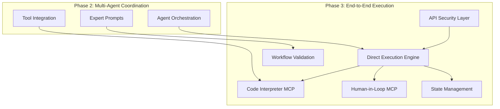
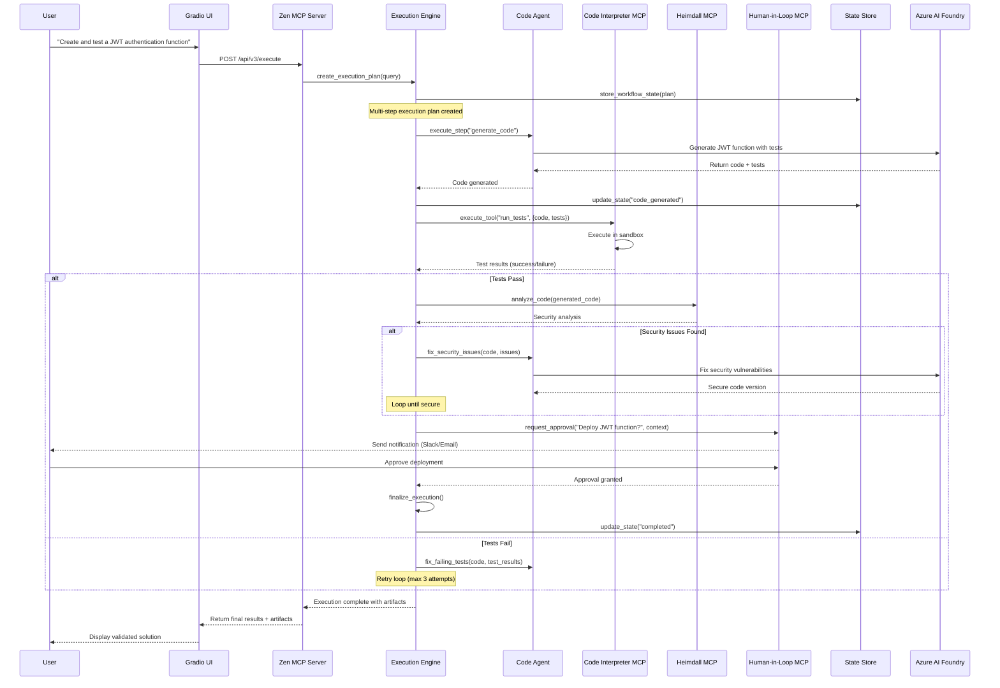
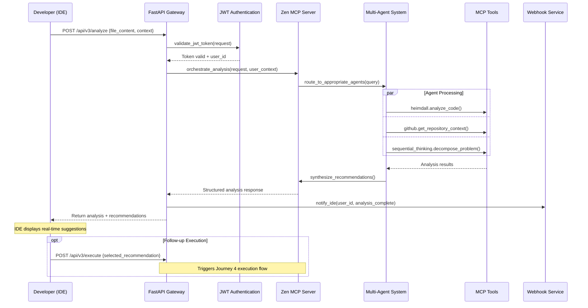
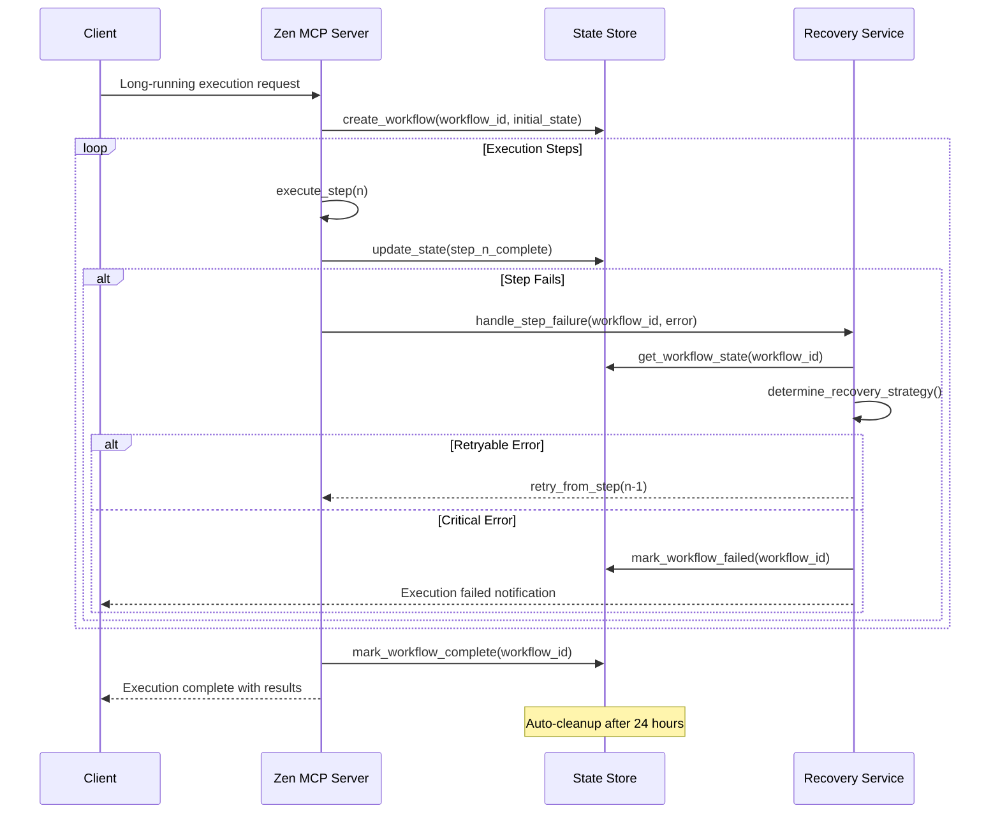

# PromptCraft-Hybrid: Technical Specification - Phase 3

Version: 2.0
Status: Updated for v7.0 Architecture
Audience: Development Team, Architects, DevOps

## 1. Introduction

### 1.1. Purpose

This document provides the complete technical specification for **Phase 3** of the PromptCraft-Hybrid platform. Building upon the multi-agent orchestration foundation established in Phase 2, Phase 3 introduces end-to-end execution capabilities and deep IDE integration.

### 1.2. Scope

Phase 3 implements **Journey 4: Direct Execution** and **Journey 3: Full API Integration**. This involves:

* **Journey 4: Direct Execution** - Complete task automation with validation and human approval
* **Journey 3: Enhanced API** - Full multi-agent orchestration accessible via API for IDE integration
* **Code Execution Safety** - Sandboxed code execution with security validation
* **Human-in-the-Loop** - Approval workflows for critical operations
* **State Management** - Persistent workflow state for long-running tasks
* **API Security** - Production-ready API endpoints with authentication

### 1.3. Key Architectural Evolution (Phase 3)

Phase 3 represents the maturation into a full automation platform:



**Key Principle**: Phase 3 maintains the 7-week timeline constraint by focusing on essential execution capabilities while deferring complex features to Phase 4.

## 2. Core Technologies & Dependencies (Phase 3 Additions)

| Technology/Service | Role | Target Version | Source/Justification |
|:-------------------|:-----|:---------------|:---------------------|
| **Code Interpreter MCP** | Sandboxed Execution | Self-Hosted | Safe code execution and testing |
| **Human-in-Loop MCP** | Approval Workflows | Self-Hosted | Critical operation approvals |
| **Redis** | State Management | 7.x Alpine | Workflow state persistence |
| **FastAPI** | Secure API Gateway | Latest | Production API endpoints |
| **JWT Authentication** | API Security | PyJWT 2.x | Token-based authentication |
| **Docker Security** | Sandbox Isolation | Latest | Secure code execution environment |
| **Webhook Framework** | IDE Integration | Custom | Real-time IDE notifications |

## 3. Deployment Architecture (Phase 3)

Phase 3 adds execution capabilities while maintaining security and performance.

```mermaid
graph TD
    subgraph "On-Premise Server (Ubuntu)"
        subgraph "Docker Environment"
            Z[Zen MCP Server<br/>(Execution Orchestrator)]
            Q[Qdrant DB<br/>(Multi-Collection)]
            G[Gradio UI<br/>(Execution Interface)]
            H[Heimdall MCP<br/>(Security Validation)]
            GH[GitHub MCP<br/>(Repository Context)]
            CI[Code Interpreter MCP<br/>(Sandboxed Execution)]
            HITL[Human-in-Loop MCP<br/>(Approval Workflows)]
            R[(Redis)<br/>(State Management)]
            API[FastAPI Gateway<br/>(Secure IDE API)]
        end

        Z --> Q & H & GH & CI & HITL & R
        G --> Z
        API --> Z
        CI -.->|Isolated Network| SANDBOX[Secure Sandbox]
    end

    subgraph "External Services"
        IDE[Developer IDE<br/>(Enhanced Integration)]
        V[End User Browser]
        AI[Azure AI Foundry]
        SLACK[Slack/Email<br/>(HITL Notifications)]
    end

    IDE -- "Authenticated API" --> API
    V -- "Execution UI" --> CF[Cloudflare Tunnel]
    CF --> G

    Z -- "Multi-Model Coordination" --> AI
    HITL -- "Notifications" --> SLACK

    style CI fill:#ffebee
    style HITL fill:#e8f5e8
    style R fill:#e3f2fd
    style API fill:#fff3e0
    style SANDBOX fill:#fce4ec
```

**Security Enhancements:**
- **Sandboxed Execution**: Code Interpreter MCP runs in isolated Docker container
- **Network Isolation**: Execution environment cannot access internal services
- **API Authentication**: JWT-based authentication for IDE integration
- **Approval Gates**: Human-in-Loop for critical operations

## 4. Data Flow Diagrams

### 4.1. Journey 4: Direct Execution Flow



### 4.2. Journey 3: Enhanced IDE Integration Flow



### 4.3. State Management & Recovery Flow



## 5. API Contracts & Data Schemas

### 5.1. Journey 4: Direct Execution API

**Endpoint:** `POST /api/v3/execute`

**Authentication:** Bearer JWT token required

**Request Body:**
```json
{
  "goal": "string",
  "context": {
    "project_context": {
      "repo_url": "string (optional)",
      "current_file": "string (optional)",
      "file_content": "string (optional)"
    },
    "execution_preferences": {
      "require_approval": "boolean (default: true)",
      "max_iterations": "number (default: 3)",
      "timeout_minutes": "number (default: 30)",
      "security_level": "strict|standard|permissive (default: standard)"
    }
  },
  "options": {
    "notification_webhook": "string (optional)",
    "include_artifacts": "boolean (default: true)",
    "enable_human_loop": "boolean (default: true)"
  }
}
```

**Initial Response (202 Accepted):**
```json
{
  "status": "accepted",
  "data": {
    "workflow_id": "uuid",
    "estimated_duration_minutes": "number",
    "execution_plan": [
      {
        "step": "number",
        "description": "string",
        "agent": "string",
        "estimated_duration": "string"
      }
    ]
  },
  "endpoints": {
    "status": "/api/v3/execute/status/{workflow_id}",
    "cancel": "/api/v3/execute/cancel/{workflow_id}",
    "approve": "/api/v3/execute/approve/{workflow_id}"
  }
}
```

**Completion Response (via webhook or polling):**
```json
{
  "status": "completed|failed|cancelled",
  "data": {
    "workflow_id": "uuid",
    "execution_summary": "string",
    "artifacts": {
      "generated_code": "string",
      "test_results": "object",
      "security_report": "object",
      "documentation": "string"
    },
    "metrics": {
      "total_duration_minutes": "number",
      "steps_completed": "number",
      "security_issues_resolved": "number",
      "test_success_rate": "number"
    }
  },
  "metadata": {
    "agents_used": ["string"],
    "tools_used": ["string"],
    "approvals_required": "number",
    "total_cost": "number"
  }
}
```

### 5.2. Journey 3: Enhanced IDE Integration API

**Endpoint:** `POST /api/v3/analyze`

**Authentication:** Bearer JWT token required

**Request Body:**
```json
{
  "analysis_type": "security|performance|architecture|general",
  "context": {
    "file_content": "string",
    "file_path": "string",
    "language": "string (auto-detected if not provided)",
    "project_context": {
      "repo_url": "string (optional)",
      "framework": "string (optional)",
      "dependencies": ["string"]
    }
  },
  "options": {
    "include_suggestions": "boolean (default: true)",
    "include_examples": "boolean (default: true)",
    "max_suggestions": "number (default: 5)",
    "severity_threshold": "low|medium|high (default: medium)"
  }
}
```

**Success Response (200 OK):**
```json
{
  "status": "success",
  "data": {
    "analysis_summary": "string",
    "primary_agent": "string",
    "confidence_score": "number",
    "suggestions": [
      {
        "id": "uuid",
        "type": "security|performance|style|architecture",
        "severity": "low|medium|high|critical",
        "line_start": "number",
        "line_end": "number",
        "title": "string",
        "description": "string",
        "recommendation": "string",
        "example_fix": "string (optional)",
        "references": ["string"]
      }
    ],
    "security_analysis": {
      "overall_score": "number (0-100)",
      "vulnerabilities": ["object"],
      "compliance_status": "object"
    },
    "executable_actions": [
      {
        "id": "uuid",
        "title": "string",
        "description": "string",
        "estimated_duration": "string",
        "requires_approval": "boolean"
      }
    ]
  },
  "metadata": {
    "processing_time_ms": "number",
    "agents_consulted": ["string"],
    "tools_used": ["string"],
    "cost": "number"
  }
}
```

### 5.3. Workflow State Schema (Redis)

**Key Pattern:** `workflow:{workflow_id}`

**State Object:**
```json
{
  "workflow_id": "uuid",
  "user_id": "string",
  "status": "created|running|waiting_approval|completed|failed|cancelled",
  "created_at": "ISO8601",
  "updated_at": "ISO8601",
  "goal": "string",
  "execution_plan": [
    {
      "step_id": "number",
      "description": "string",
      "agent": "string",
      "status": "pending|running|completed|failed|skipped",
      "started_at": "ISO8601 (optional)",
      "completed_at": "ISO8601 (optional)",
      "error": "string (optional)"
    }
  ],
  "current_step": "number",
  "artifacts": {
    "generated_code": "string (optional)",
    "test_results": "object (optional)",
    "security_report": "object (optional)",
    "documentation": "string (optional)"
  },
  "approvals": [
    {
      "approval_id": "uuid",
      "step_id": "number",
      "description": "string",
      "status": "pending|approved|rejected",
      "requested_at": "ISO8601",
      "responded_at": "ISO8601 (optional)",
      "response_by": "string (optional)"
    }
  ],
  "metrics": {
    "steps_completed": "number",
    "security_issues_found": "number",
    "security_issues_resolved": "number",
    "test_success_rate": "number",
    "total_cost": "number"
  },
  "context": "object",
  "options": "object"
}
```

### 5.4. Human-in-Loop Integration

**HITL Request Schema:**
```json
{
  "approval_id": "uuid",
  "workflow_id": "uuid",
  "step_description": "string",
  "approval_type": "code_deployment|security_override|data_access|external_api",
  "context": {
    "generated_code": "string (optional)",
    "security_report": "object (optional)",
    "impact_assessment": "string",
    "risk_level": "low|medium|high|critical"
  },
  "options": {
    "timeout_minutes": "number (default: 60)",
    "notification_channels": ["email", "slack", "webhook"],
    "required_approvers": "number (default: 1)",
    "auto_approve_threshold": "number (optional)"
  }
}
```

## 6. Component Implementation Details

### 6.1. Direct Execution Engine

```python
# src/execution/execution_engine.py
import asyncio
import uuid
from typing import Dict, List, Optional
from enum import Enum
from dataclasses import dataclass
import redis
import json
from datetime import datetime, timedelta

class ExecutionStatus(Enum):
    CREATED = "created"
    RUNNING = "running"
    WAITING_APPROVAL = "waiting_approval"
    COMPLETED = "completed"
    FAILED = "failed"
    CANCELLED = "cancelled"

@dataclass
class ExecutionStep:
    step_id: int
    description: str
    agent: str
    status: str = "pending"
    started_at: Optional[datetime] = None
    completed_at: Optional[datetime] = None
    error: Optional[str] = None

class DirectExecutionEngine:
    """Core execution engine for Journey 4"""

    def __init__(self, zen_orchestrator, redis_client, config):
        self.orchestrator = zen_orchestrator
        self.redis = redis_client
        self.config = config
        self.execution_strategies = {
            "code_generation": self._execute_code_generation,
            "security_analysis": self._execute_security_analysis,
            "testing": self._execute_testing,
            "deployment": self._execute_deployment
        }

    async def create_execution(self, goal: str, context: Dict, options: Dict) -> str:
        """Create new execution workflow"""
        workflow_id = str(uuid.uuid4())

        # Generate execution plan
        execution_plan = await self._generate_execution_plan(goal, context)

        # Initialize workflow state
        workflow_state = {
            "workflow_id": workflow_id,
            "user_id": context.get("user_id"),
            "status": ExecutionStatus.CREATED.value,
            "created_at": datetime.now().isoformat(),
            "updated_at": datetime.now().isoformat(),
            "goal": goal,
            "execution_plan": [step.__dict__ for step in execution_plan],
            "current_step": 0,
            "artifacts": {},
            "approvals": [],
            "metrics": {
                "steps_completed": 0,
                "security_issues_found": 0,
                "security_issues_resolved": 0,
                "test_success_rate": 0.0,
                "total_cost": 0.0
            },
            "context": context,
            "options": options
        }

        # Store in Redis with TTL
        await self._store_workflow_state(workflow_id, workflow_state)

        # Start execution asynchronously
        asyncio.create_task(self._execute_workflow(workflow_id))

        return workflow_id

    async def _generate_execution_plan(self, goal: str, context: Dict) -> List[ExecutionStep]:
        """Generate step-by-step execution plan"""

        # Use Sequential Thinking MCP for plan generation
        planning_prompt = f"""
        Break down this goal into executable steps:
        Goal: {goal}
        Context: {json.dumps(context, indent=2)}

        Consider:
        1. Code generation requirements
        2. Testing needs
        3. Security validation
        4. Human approval points

        Return a structured plan with clear steps.
        """

        planning_result = await self.orchestrator.call_tool(
            "sequential_thinking",
            "decompose_task",
            {"query": planning_prompt}
        )

        # Parse planning result into execution steps
        steps = []
        step_descriptions = planning_result.get("steps", [])

        for i, description in enumerate(step_descriptions):
            # Determine appropriate agent for each step
            agent = self._determine_step_agent(description)
            steps.append(ExecutionStep(
                step_id=i + 1,
                description=description,
                agent=agent
            ))

        return steps

    async def _execute_workflow(self, workflow_id: str):
        """Execute complete workflow"""
        try:
            workflow_state = await self._get_workflow_state(workflow_id)

            # Update status to running
            workflow_state["status"] = ExecutionStatus.RUNNING.value
            await self._store_workflow_state(workflow_id, workflow_state)

            # Execute each step
            for step_index in range(len(workflow_state["execution_plan"])):
                workflow_state["current_step"] = step_index
                step = workflow_state["execution_plan"][step_index]

                # Execute step
                try:
                    step_result = await self._execute_step(workflow_id, step)

                    # Update step status
                    step["status"] = "completed"
                    step["completed_at"] = datetime.now().isoformat()

                    # Store artifacts
                    if step_result.get("artifacts"):
                        workflow_state["artifacts"].update(step_result["artifacts"])

                    # Check if approval needed
                    if step_result.get("requires_approval"):
                        await self._request_approval(workflow_id, step, step_result)
                        workflow_state["status"] = ExecutionStatus.WAITING_APPROVAL.value
                        await self._store_workflow_state(workflow_id, workflow_state)

                        # Wait for approval
                        approved = await self._wait_for_approval(workflow_id, step["step_id"])
                        if not approved:
                            workflow_state["status"] = ExecutionStatus.FAILED.value
                            workflow_state["error"] = "Approval rejected"
                            await self._store_workflow_state(workflow_id, workflow_state)
                            return

                        workflow_state["status"] = ExecutionStatus.RUNNING.value

                except Exception as e:
                    step["status"] = "failed"
                    step["error"] = str(e)

                    # Attempt recovery
                    recovered = await self._attempt_step_recovery(workflow_id, step, e)
                    if not recovered:
                        workflow_state["status"] = ExecutionStatus.FAILED.value
                        await self._store_workflow_state(workflow_id, workflow_state)
                        return

                # Update workflow state
                workflow_state["metrics"]["steps_completed"] += 1
                await self._store_workflow_state(workflow_id, workflow_state)

            # Mark workflow complete
            workflow_state["status"] = ExecutionStatus.COMPLETED.value
            workflow_state["updated_at"] = datetime.now().isoformat()
            await self._store_workflow_state(workflow_id, workflow_state)

            # Send completion notification
            await self._send_completion_notification(workflow_id, workflow_state)

        except Exception as e:
            # Handle workflow-level errors
            workflow_state["status"] = ExecutionStatus.FAILED.value
            workflow_state["error"] = str(e)
            await self._store_workflow_state(workflow_id, workflow_state)

    async def _execute_step(self, workflow_id: str, step: Dict) -> Dict:
        """Execute individual workflow step"""
        step_type = self._classify_step_type(step["description"])

        if step_type in self.execution_strategies:
            return await self.execution_strategies[step_type](workflow_id, step)
        else:
            # Default: use orchestrator with specified agent
            return await self._execute_generic_step(workflow_id, step)

    async def _execute_code_generation(self, workflow_id: str, step: Dict) -> Dict:
        """Execute code generation step"""
        workflow_state = await self._get_workflow_state(workflow_id)

        # Use appropriate agent for code generation
        code_request = {
            "query": step["description"],
            "context": {
                **workflow_state["context"],
                "step_type": "code_generation",
                "include_tests": True
            }
        }

        result = await self.orchestrator.processRequest(code_request)

        # Extract generated code
        generated_code = self._extract_code_from_result(result)

        # Validate code with Heimdall
        security_analysis = await self.orchestrator.call_tool(
            "heimdall",
            "analyze_code",
            {
                "code": generated_code,
                "focus_areas": ["security", "best_practices"],
                "severity_threshold": "medium"
            }
        )

        return {
            "artifacts": {
                "generated_code": generated_code,
                "security_analysis": security_analysis
            },
            "requires_approval": security_analysis.get("issues", []) != [],
            "success": True
        }

    async def _execute_testing(self, workflow_id: str, step: Dict) -> Dict:
        """Execute testing step"""
        workflow_state = await self._get_workflow_state(workflow_id)
        generated_code = workflow_state["artifacts"].get("generated_code")

        if not generated_code:
            raise ValueError("No code available for testing")

        # Execute tests in Code Interpreter MCP
        test_result = await self.orchestrator.call_tool(
            "code_interpreter",
            "run_tests",
            {
                "code": generated_code,
                "timeout_seconds": 30,
                "allowed_imports": ["unittest", "pytest", "json", "datetime"]
            }
        )

        # Update metrics
        success_rate = test_result.get("success_rate", 0)
        workflow_state["metrics"]["test_success_rate"] = success_rate

        return {
            "artifacts": {
                "test_results": test_result
            },
            "requires_approval": success_rate < 0.8,  # Approval needed if tests mostly fail
            "success": success_rate > 0.5
        }

    async def _request_approval(self, workflow_id: str, step: Dict, step_result: Dict):
        """Request human approval for step"""
        approval_id = str(uuid.uuid4())

        approval_request = {
            "approval_id": approval_id,
            "workflow_id": workflow_id,
            "step_description": step["description"],
            "approval_type": self._determine_approval_type(step, step_result),
            "context": {
                "generated_code": step_result.get("artifacts", {}).get("generated_code"),
                "security_report": step_result.get("artifacts", {}).get("security_analysis"),
                "test_results": step_result.get("artifacts", {}).get("test_results"),
                "impact_assessment": self._assess_impact(step_result),
                "risk_level": self._assess_risk_level(step_result)
            },
            "options": {
                "timeout_minutes": 60,
                "notification_channels": ["email", "slack"],
                "required_approvers": 1
            }
        }

        # Send to Human-in-Loop MCP
        await self.orchestrator.call_tool(
            "human_in_loop",
            "request_approval",
            approval_request
        )

        # Store approval request in workflow state
        workflow_state = await self._get_workflow_state(workflow_id)
        workflow_state["approvals"].append({
            "approval_id": approval_id,
            "step_id": step["step_id"],
            "description": step["description"],
            "status": "pending",
            "requested_at": datetime.now().isoformat()
        })
        await self._store_workflow_state(workflow_id, workflow_state)

    async def _wait_for_approval(self, workflow_id: str, step_id: int, timeout_minutes: int = 60) -> bool:
        """Wait for approval with timeout"""
        start_time = datetime.now()
        timeout = timedelta(minutes=timeout_minutes)

        while datetime.now() - start_time < timeout:
            workflow_state = await self._get_workflow_state(workflow_id)

            # Check if approval received
            for approval in workflow_state["approvals"]:
                if approval["step_id"] == step_id:
                    if approval["status"] == "approved":
                        return True
                    elif approval["status"] == "rejected":
                        return False

            # Wait before checking again
            await asyncio.sleep(10)

        # Timeout - reject by default
        return False

    async def _store_workflow_state(self, workflow_id: str, state: Dict):
        """Store workflow state in Redis"""
        key = f"workflow:{workflow_id}"
        serialized_state = json.dumps(state, default=str)

        # Store with 24-hour TTL
        await self.redis.setex(key, 86400, serialized_state)

    async def _get_workflow_state(self, workflow_id: str) -> Dict:
        """Retrieve workflow state from Redis"""
        key = f"workflow:{workflow_id}"
        serialized_state = await self.redis.get(key)

        if not serialized_state:
            raise ValueError(f"Workflow {workflow_id} not found")

        return json.loads(serialized_state)

    def _determine_step_agent(self, description: str) -> str:
        """Determine appropriate agent for step"""
        description_lower = description.lower()

        if any(term in description_lower for term in ["security", "vulnerability", "auth"]):
            return "security_agent"
        elif any(term in description_lower for term in ["code", "implement", "function"]):
            return "web_dev_agent"
        elif any(term in description_lower for term in ["test", "verify", "validate"]):
            return "web_dev_agent"
        else:
            return "create_agent"

    def _classify_step_type(self, description: str) -> str:
        """Classify step type for execution strategy"""
        description_lower = description.lower()

        if any(term in description_lower for term in ["generate", "create", "implement", "write"]):
            return "code_generation"
        elif any(term in description_lower for term in ["test", "verify", "validate"]):
            return "testing"
        elif any(term in description_lower for term in ["security", "analyze", "scan"]):
            return "security_analysis"
        elif any(term in description_lower for term in ["deploy", "install", "configure"]):
            return "deployment"
        else:
            return "generic"
```

### 6.2. Enhanced FastAPI Gateway

```python
# src/api/gateway.py
from fastapi import FastAPI, HTTPException, Depends, status
from fastapi.security import HTTPBearer, HTTPAuthorizationCredentials
from fastapi.middleware.cors import CORSMiddleware
from fastapi.responses import JSONResponse
import jwt
import asyncio
from datetime import datetime, timedelta
from typing import Dict, Optional
import os
import redis.asyncio as redis
from pydantic import BaseModel, Field
import logging

# Configure logging
logging.basicConfig(level=logging.INFO)
logger = logging.getLogger(__name__)

# Pydantic models for request/response validation
class ExecutionRequest(BaseModel):
    goal: str = Field(..., min_length=10, max_length=1000)
    context: Dict = Field(default_factory=dict)
    options: Dict = Field(default_factory=dict)

class AnalysisRequest(BaseModel):
    analysis_type: str = Field(default="general", regex="^(security|performance|architecture|general)$")
    context: Dict = Field(...)
    options: Dict = Field(default_factory=dict)

class ApprovalRequest(BaseModel):
    workflow_id: str
    approval_id: str
    decision: str = Field(..., regex="^(approved|rejected)$")
    comment: Optional[str] = None

# JWT Configuration
JWT_SECRET = os.getenv("JWT_SECRET", "your-secret-key-change-in-production")
JWT_ALGORITHM = "HS256"
JWT_EXPIRATION_HOURS = 24

class SecureAPIGateway:
    """Production-ready API gateway with authentication and rate limiting"""

    def __init__(self, zen_orchestrator, execution_engine):
        self.app = FastAPI(
            title="PromptCraft-Hybrid API",
            description="Multi-Agent AI Orchestration Platform",
            version="3.0.0",
            docs_url="/docs",
            redoc_url="/redoc"
        )
        self.orchestrator = zen_orchestrator
        self.execution_engine = execution_engine
        self.redis_client = None
        self.security = HTTPBearer()

        # Configure CORS
        self.app.add_middleware(
            CORSMiddleware,
            allow_origins=["http://localhost:3000", "https://*.yourdomain.com"],
            allow_credentials=True,
            allow_methods=["GET", "POST", "PUT", "DELETE"],
            allow_headers=["*"],
        )

        # Initialize routes
        self._setup_routes()

        # Initialize Redis for rate limiting
        asyncio.create_task(self._init_redis())

    async def _init_redis(self):
        """Initialize Redis connection"""
        self.redis_client = redis.from_url(
            os.getenv("REDIS_URL", "redis://localhost:6379"),
            decode_responses=True
        )

    def _setup_routes(self):
        """Setup all API routes"""

        # Health check (no auth required)
        @self.app.get("/health")
        async def health_check():
            return {
                "status": "healthy",
                "timestamp": datetime.now().isoformat(),
                "version": "3.0.0",
                "services": {
                    "zen_mcp": "connected",
                    "execution_engine": "ready",
                    "redis": "connected" if self.redis_client else "disconnected"
                }
            }

        # Authentication endpoints
        @self.app.post("/auth/token")
        async def create_access_token(credentials: Dict):
            """Create JWT token for API access"""
            # In production, validate against real user database
            username = credentials.get("username")
            password = credentials.get("password")

            # Simplified auth - replace with real authentication
            if username == "demo" and password == "demo123":
                token_data = {
                    "sub": username,
                    "user_id": "demo_user",
                    "exp": datetime.utcnow() + timedelta(hours=JWT_EXPIRATION_HOURS)
                }
                token = jwt.encode(token_data, JWT_SECRET, algorithm=JWT_ALGORITHM)

                return {
                    "access_token": token,
                    "token_type": "bearer",
                    "expires_in": JWT_EXPIRATION_HOURS * 3600
                }
            else:
                raise HTTPException(
                    status_code=status.HTTP_401_UNAUTHORIZED,
                    detail="Invalid credentials"
                )

        # Journey 3: Enhanced IDE Integration
        @self.app.post("/api/v3/analyze")
        async def analyze_code(
            request: AnalysisRequest,
            current_user: Dict = Depends(self._get_current_user)
        ):
            """Analyze code with multi-agent coordination"""
            try:
                # Rate limiting check
                await self._check_rate_limit(current_user["user_id"], "analyze")

                # Add user context
                enhanced_context = {
                    **request.context,
                    "user_id": current_user["user_id"],
                    "analysis_type": request.analysis_type
                }

                # Route to appropriate agent(s)
                analysis_result = await self.orchestrator.processRequest({
                    "query": f"Perform {request.analysis_type} analysis",
                    "context": enhanced_context,
                    "options": request.options
                })

                # Structure response for IDE consumption
                ide_response = self._format_ide_response(analysis_result)

                # Log API usage
                await self._log_api_usage(current_user["user_id"], "analyze", request.analysis_type)

                return ide_response

            except Exception as e:
                logger.error(f"Analysis error for user {current_user['user_id']}: {str(e)}")
                raise HTTPException(
                    status_code=status.HTTP_500_INTERNAL_SERVER_ERROR,
                    detail=f"Analysis failed: {str(e)}"
                )

        # Journey 4: Direct Execution
        @self.app.post("/api/v3/execute")
        async def execute_task(
            request: ExecutionRequest,
            current_user: Dict = Depends(self._get_current_user)
        ):
            """Execute task with full workflow orchestration"""
            try:
                # Rate limiting check (stricter for execution)
                await self._check_rate_limit(current_user["user_id"], "execute", limit=5)

                # Add user context
                enhanced_context = {
                    **request.context,
                    "user_id": current_user["user_id"]
                }

                # Create execution workflow
                workflow_id = await self.execution_engine.create_execution(
                    goal=request.goal,
                    context=enhanced_context,
                    options=request.options
                )

                # Get initial workflow state
                workflow_state = await self.execution_engine._get_workflow_state(workflow_id)

                # Log execution start
                await self._log_api_usage(current_user["user_id"], "execute", request.goal[:100])

                return {
                    "status": "accepted",
                    "data": {
                        "workflow_id": workflow_id,
                        "estimated_duration_minutes": len(workflow_state["execution_plan"]) * 2,
                        "execution_plan": workflow_state["execution_plan"]
                    },
                    "endpoints": {
                        "status": f"/api/v3/execute/status/{workflow_id}",
                        "cancel": f"/api/v3/execute/cancel/{workflow_id}",
                        "approve": f"/api/v3/execute/approve/{workflow_id}"
                    }
                }

            except Exception as e:
                logger.error(f"Execution error for user {current_user['user_id']}: {str(e)}")
                raise HTTPException(
                    status_code=status.HTTP_500_INTERNAL_SERVER_ERROR,
                    detail=f"Execution failed: {str(e)}"
                )

        # Execution status endpoint
        @self.app.get("/api/v3/execute/status/{workflow_id}")
        async def get_execution_status(
            workflow_id: str,
            current_user: Dict = Depends(self._get_current_user)
        ):
            """Get execution workflow status"""
            try:
                workflow_state = await self.execution_engine._get_workflow_state(workflow_id)

                # Verify user owns this workflow
                if workflow_state.get("user_id") != current_user["user_id"]:
                    raise HTTPException(
                        status_code=status.HTTP_403_FORBIDDEN,
                        detail="Access denied"
                    )

                return {
                    "status": "success",
                    "data": {
                        "workflow_id": workflow_id,
                        "status": workflow_state["status"],
                        "current_step": workflow_state["current_step"],
                        "total_steps": len(workflow_state["execution_plan"]),
                        "progress_percentage": (workflow_state["current_step"] / len(workflow_state["execution_plan"])) * 100,
                        "artifacts": workflow_state.get("artifacts", {}),
                        "metrics": workflow_state.get("metrics", {}),
                        "pending_approvals": [
                            approval for approval in workflow_state.get("approvals", [])
                            if approval["status"] == "pending"
                        ]
                    }
                }

            except ValueError as e:
                raise HTTPException(
                    status_code=status.HTTP_404_NOT_FOUND,
                    detail="Workflow not found"
                )
            except Exception as e:
                logger.error(f"Status check error: {str(e)}")
                raise HTTPException(
                    status_code=status.HTTP_500_INTERNAL_SERVER_ERROR,
                    detail="Status check failed"
                )

        # Approval endpoint
        @self.app.post("/api/v3/execute/approve/{workflow_id}")
        async def approve_execution_step(
            workflow_id: str,
            request: ApprovalRequest,
            current_user: Dict = Depends(self._get_current_user)
        ):
            """Approve or reject execution step"""
            try:
                workflow_state = await self.execution_engine._get_workflow_state(workflow_id)

                # Verify user owns this workflow
                if workflow_state.get("user_id") != current_user["user_id"]:
                    raise HTTPException(
                        status_code=status.HTTP_403_FORBIDDEN,
                        detail="Access denied"
                    )

                # Update approval status
                for approval in workflow_state["approvals"]:
                    if approval["approval_id"] == request.approval_id:
                        approval["status"] = request.decision
                        approval["responded_at"] = datetime.now().isoformat()
                        approval["response_by"] = current_user["user_id"]
                        approval["comment"] = request.comment
                        break
                else:
                    raise HTTPException(
                        status_code=status.HTTP_404_NOT_FOUND,
                        detail="Approval request not found"
                    )

                # Store updated state
                await self.execution_engine._store_workflow_state(workflow_id, workflow_state)

                # Notify Human-in-Loop MCP
                await self.orchestrator.call_tool(
                    "human_in_loop",
                    "respond_to_approval",
                    {
                        "approval_id": request.approval_id,
                        "decision": request.decision,
                        "comment": request.comment,
                        "responded_by": current_user["user_id"]
                    }
                )

                return {
                    "status": "success",
                    "message": f"Approval {request.decision}",
                    "workflow_status": workflow_state["status"]
                }

            except Exception as e:
                logger.error(f"Approval error: {str(e)}")
                raise HTTPException(
                    status_code=status.HTTP_500_INTERNAL_SERVER_ERROR,
                    detail="Approval processing failed"
                )

        # Workflow cancellation
        @self.app.post("/api/v3/execute/cancel/{workflow_id}")
        async def cancel_execution(
            workflow_id: str,
            current_user: Dict = Depends(self._get_current_user)
        ):
            """Cancel running execution workflow"""
            try:
                workflow_state = await self.execution_engine._get_workflow_state(workflow_id)

                # Verify user owns this workflow
                if workflow_state.get("user_id") != current_user["user_id"]:
                    raise HTTPException(
                        status_code=status.HTTP_403_FORBIDDEN,
                        detail="Access denied"
                    )

                # Only allow cancellation of running workflows
                if workflow_state["status"] not in ["running", "waiting_approval"]:
                    raise HTTPException(
                        status_code=status.HTTP_400_BAD_REQUEST,
                        detail="Cannot cancel completed or failed workflow"
                    )

                # Update status to cancelled
                workflow_state["status"] = "cancelled"
                workflow_state["updated_at"] = datetime.now().isoformat()
                await self.execution_engine._store_workflow_state(workflow_id, workflow_state)

                return {
                    "status": "success",
                    "message": "Workflow cancelled successfully"
                }

            except Exception as e:
                logger.error(f"Cancellation error: {str(e)}")
                raise HTTPException(
                    status_code=status.HTTP_500_INTERNAL_SERVER_ERROR,
                    detail="Cancellation failed"
                )

        # Legacy Journey 2 endpoint (backwards compatibility)
        @self.app.post("/api/v2/orchestrate")
        async def orchestrate_legacy(
            request: Dict,
            current_user: Dict = Depends(self._get_current_user)
        ):
            """Legacy orchestration endpoint for backwards compatibility"""
            logger.warning(f"Legacy API usage by user {current_user['user_id']}")

            # Route to new analysis endpoint
            analysis_request = AnalysisRequest(
                analysis_type="general",
                context=request.get("context", {}),
                options=request.get("options", {})
            )

            return await analyze_code(analysis_request, current_user)

    async def _get_current_user(self, credentials: HTTPAuthorizationCredentials = Depends(HTTPBearer())):
        """Extract and validate JWT token"""
        try:
            token = credentials.credentials
            payload = jwt.decode(token, JWT_SECRET, algorithms=[JWT_ALGORITHM])

            # Check expiration
            if datetime.utcfromtimestamp(payload.get("exp", 0)) < datetime.utcnow():
                raise HTTPException(
                    status_code=status.HTTP_401_UNAUTHORIZED,
                    detail="Token expired"
                )

            return {
                "username": payload.get("sub"),
                "user_id": payload.get("user_id")
            }

        except jwt.InvalidTokenError:
            raise HTTPException(
                status_code=status.HTTP_401_UNAUTHORIZED,
                detail="Invalid token"
            )

    async def _check_rate_limit(self, user_id: str, operation: str, limit: int = 60):
        """Check rate limiting per user per operation"""
        if not self.redis_client:
            return  # Skip rate limiting if Redis unavailable

        key = f"rate_limit:{user_id}:{operation}"
        current_count = await self.redis_client.get(key)

        if current_count and int(current_count) >= limit:
            raise HTTPException(
                status_code=status.HTTP_429_TOO_MANY_REQUESTS,
                detail=f"Rate limit exceeded. Max {limit} {operation} requests per hour."
            )

        # Increment counter with 1-hour expiry
        if current_count:
            await self.redis_client.incr(key)
        else:
            await self.redis_client.setex(key, 3600, 1)

    async def _log_api_usage(self, user_id: str, operation: str, details: str):
        """Log API usage for monitoring and billing"""
        if not self.redis_client:
            return

        usage_entry = {
            "user_id": user_id,
            "operation": operation,
            "details": details,
            "timestamp": datetime.now().isoformat()
        }

        # Store in Redis list with 7-day retention
        key = f"api_usage:{datetime.now().strftime('%Y-%m-%d')}"
        await self.redis_client.lpush(key, json.dumps(usage_entry))
        await self.redis_client.expire(key, 7 * 24 * 3600)  # 7 days

    def _format_ide_response(self, orchestration_result: Dict) -> Dict:
        """Format orchestration result for IDE consumption"""
        data = orchestration_result.get("data", {})
        metadata = orchestration_result.get("metadata", {})

        # Extract suggestions from the prompt or analysis
        suggestions = self._extract_suggestions_from_result(data)

        # Extract security analysis if available
        security_analysis = data.get("analysis_results", {}).get("security_scan", {})

        # Create executable actions
        executable_actions = self._create_executable_actions(data)

        return {
            "status": "success",
            "data": {
                "analysis_summary": data.get("final_prompt", "")[:200] + "...",
                "primary_agent": metadata.get("agent_used", "unknown"),
                "confidence_score": metadata.get("confidence_score", 0.0),
                "suggestions": suggestions,
                "security_analysis": {
                    "overall_score": security_analysis.get("overall_score", 100),
                    "vulnerabilities": security_analysis.get("issues", []),
                    "compliance_status": {
                        "owasp_compliant": len(security_analysis.get("issues", [])) == 0
                    }
                },
                "executable_actions": executable_actions
            },
            "metadata": {
                "processing_time_ms": metadata.get("processing_time_ms", 0),
                "agents_consulted": [metadata.get("agent_used", "unknown")],
                "tools_used": [step.get("tool") for step in data.get("reasoning_chain", []) if step.get("tool")],
                "cost": metadata.get("total_cost", 0.0)
            }
        }

    def _extract_suggestions_from_result(self, data: Dict) -> List[Dict]:
        """Extract actionable suggestions from orchestration result"""
        suggestions = []

        # Extract from security analysis
        security_scan = data.get("analysis_results", {}).get("security_scan", {})
        for issue in security_scan.get("issues", []):
            suggestions.append({
                "id": f"security_{len(suggestions)}",
                "type": "security",
                "severity": issue.get("severity", "medium"),
                "line_start": issue.get("line", 1),
                "line_end": issue.get("line", 1),
                "title": issue.get("category", "Security Issue"),
                "description": issue.get("description", ""),
                "recommendation": issue.get("recommendation", ""),
                "references": [f"CWE-{issue.get('cwe_id')}"] if issue.get("cwe_id") else []
            })

        # Extract from repository analysis
        repo_analysis = data.get("analysis_results", {}).get("repo_analysis", {})
        if repo_analysis.get("insights"):
            suggestions.append({
                "id": f"architecture_{len(suggestions)}",
                "type": "architecture",
                "severity": "low",
                "line_start": 1,
                "line_end": 1,
                "title": "Architecture Suggestion",
                "description": f"Consider {repo_analysis['insights'].get('architecture_pattern', 'modern patterns')}",
                "recommendation": "Review architectural patterns for this framework",
                "references": []
            })

        return suggestions

    def _create_executable_actions(self, data: Dict) -> List[Dict]:
        """Create executable actions from analysis results"""
        actions = []

        # Security fixes
        security_issues = data.get("analysis_results", {}).get("security_scan", {}).get("issues", [])
        if security_issues:
            actions.append({
                "id": "fix_security_issues",
                "title": f"Fix {len(security_issues)} Security Issues",
                "description": "Automatically generate secure code that addresses identified vulnerabilities",
                "estimated_duration": "2-5 minutes",
                "requires_approval": True
            })

        # Code optimization
        if "performance" in data.get("final_prompt", "").lower():
            actions.append({
                "id": "optimize_performance",
                "title": "Optimize Code Performance",
                "description": "Generate optimized version with performance improvements",
                "estimated_duration": "3-7 minutes",
                "requires_approval": False
            })

        return actions

# Application factory
def create_app(zen_orchestrator, execution_engine) -> FastAPI:
    """Create FastAPI application with all dependencies"""
    gateway = SecureAPIGateway(zen_orchestrator, execution_engine)
    return gateway.app
```

### 6.3. Enhanced Gradio UI for Phase 3

```python
# src/ui/phase3_app.py
import gradio as gr
import requests
import json
import asyncio
import time
from typing import Dict, List, Optional
import websocket
import threading

class PromptCraftUIPhase3:
    """Enhanced UI with execution capabilities and real-time updates"""

    def __init__(self):
        self.api_endpoint = os.getenv("API_ENDPOINT", "http://localhost:8000")
        self.ws_endpoint = os.getenv("WS_ENDPOINT", "ws://localhost:8000/ws")
        self.auth_token = None
        self.active_workflows = {}
        self.websocket_client = None

    def authenticate(self, username: str, password: str) -> tuple[str, str]:
        """Authenticate user and get JWT token"""
        try:
            response = requests.post(
                f"{self.api_endpoint}/auth/token",
                json={"username": username, "password": password},
                timeout=10
            )

            if response.status_code == 200:
                data = response.json()
                self.auth_token = data["access_token"]
                return "✅ Authentication successful!", ""
            else:
                return "❌ Authentication failed. Check credentials.", ""

        except Exception as e:
            return f"❌ Connection error: {str(e)}", ""

    def process_execution_request(self, goal: str, repo_url: str = "",
                                require_approval: bool = True) -> tuple[str, str]:
        """Start execution workflow"""
        if not self.auth_token:
            return "❌ Please authenticate first", ""

        try:
            headers = {"Authorization": f"Bearer {self.auth_token}"}
            payload = {
                "goal": goal,
                "context": {
                    "project_context": {
                        "repo_url": repo_url if repo_url else None
                    },
                    "execution_preferences": {
                        "require_approval": require_approval,
                        "max_iterations": 3,
                        "timeout_minutes": 30
                    }
                },
                "options": {
                    "include_artifacts": True,
                    "enable_human_loop": require_approval
                }
            }

            response = requests.post(
                f"{self.api_endpoint}/api/v3/execute",
                json=payload,
                headers=headers,
                timeout=30
            )

            if response.status_code == 202:
                data = response.json()
                workflow_id = data["data"]["workflow_id"]

                # Store workflow for tracking
                self.active_workflows[workflow_id] = {
                    "goal": goal,
                    "started_at": time.time(),
                    "status": "running"
                }

                # Start monitoring workflow
                threading.Thread(
                    target=self._monitor_workflow,
                    args=(workflow_id,),
                    daemon=True
                ).start()

                execution_plan = "\n".join([
                    f"Step {step['step']}: {step['description']}"
                    for step in data["data"]["execution_plan"]
                ])

                return (
                    f"🚀 **Execution Started!**\n\n"
                    f"**Workflow ID:** `{workflow_id}`\n"
                    f"**Estimated Duration:** {data['data']['estimated_duration_minutes']} minutes\n\n"
                    f"**Execution Plan:**\n{execution_plan}\n\n"
                    f"*Real-time updates will appear below...*",
                    workflow_id
                )
            else:
                error_detail = response.json().get("detail", "Unknown error")
                return f"❌ Execution failed: {error_detail}", ""

        except Exception as e:
            return f"❌ Error starting execution: {str(e)}", ""

    def get_workflow_status(self, workflow_id: str) -> str:
        """Get current workflow status"""
        if not self.auth_token or not workflow_id:
            return "No active workflow"

        try:
            headers = {"Authorization": f"Bearer {self.auth_token}"}
            response = requests.get(
                f"{self.api_endpoint}/api/v3/execute/status/{workflow_id}",
                headers=headers,
                timeout=10
            )

            if response.status_code == 200:
                data = response.json()["data"]

                status_emoji = {
                    "running": "🔄",
                    "waiting_approval": "⏳",
                    "completed": "✅",
                    "failed": "❌",
                    "cancelled": "🛑"
                }.get(data["status"], "❓")

                status_text = (
                    f"{status_emoji} **Status:** {data['status'].title()}\n"
                    f"📊 **Progress:** {data['progress_percentage']:.1f}% "
                    f"({data['current_step']}/{data['total_steps']} steps)\n"
                )

                # Show pending approvals
                if data.get("pending_approvals"):
                    approval_text = "\n".join([
                        f"• {approval['description']}"
                        for approval in data["pending_approvals"]
                    ])
                    status_text += f"\n⏳ **Pending Approvals:**\n{approval_text}\n"

                # Show artifacts if completed
                if data["status"] == "completed" and data.get("artifacts"):
                    artifacts = data["artifacts"]
                    if artifacts.get("generated_code"):
                        status_text += f"\n💻 **Generated Code:** {len(artifacts['generated_code'])} characters\n"
                    if artifacts.get("test_results"):
                        test_results = artifacts["test_results"]
                        status_text += f"🧪 **Tests:** {test_results.get('success_rate', 0)*100:.1f}% passed\n"
                    if artifacts.get("security_report"):
                        security = artifacts["security_report"]
                        issues = len(security.get("issues", []))
                        status_text += f"🔒 **Security:** {issues} issues found\n"

                return status_text
            else:
                return f"❌ Failed to get status: {response.status_code}"

        except Exception as e:
            return f"❌ Status check error: {str(e)}"

    def approve_workflow_step(self, workflow_id: str, approval_id: str,
                            decision: str, comment: str = "") -> str:
        """Approve or reject workflow step"""
        if not self.auth_token:
            return "❌ Authentication required"

        try:
            headers = {"Authorization": f"Bearer {self.auth_token}"}
            payload = {
                "workflow_id": workflow_id,
                "approval_id": approval_id,
                "decision": decision,
                "comment": comment if comment else None
            }

            response = requests.post(
                f"{self.api_endpoint}/api/v3/execute/approve/{workflow_id}",
                json=payload,
                headers=headers,
                timeout=10
            )

            if response.status_code == 200:
                return f"✅ {decision.title()} submitted successfully"
            else:
                error_detail = response.json().get("detail", "Unknown error")
                return f"❌ Approval failed: {error_detail}"

        except Exception as e:
            return f"❌ Approval error: {str(e)}"

    def _monitor_workflow(self, workflow_id: str):
        """Monitor workflow progress in background thread"""
        while workflow_id in self.active_workflows:
            try:
                status_info = self.get_workflow_status(workflow_id)

                # Update stored workflow info
                if "completed" in status_info.lower() or "failed" in status_info.lower():
                    if workflow_id in self.active_workflows:
                        self.active_workflows[workflow_id]["status"] = "completed"
                    break

                time.sleep(10)  # Check every 10 seconds

            except Exception as e:
                print(f"Monitoring error for {workflow_id}: {e}")
                break

    def create_interface(self):
        """Create comprehensive Phase 3 interface"""
        with gr.Blocks(theme="soft", title="PromptCraft-Hybrid v3.0") as interface:
            gr.Markdown("# PromptCraft-Hybrid: Complete AI Automation Platform")

            # Authentication section
            with gr.Row():
                with gr.Column(scale=1):
                    gr.Markdown("## 🔐 Authentication")
                    username_input = gr.Textbox(label="Username", value="demo")
                    password_input = gr.Textbox(label="Password", type="password", value="demo123")
                    auth_button = gr.Button("Login", variant="primary")
                    auth_status = gr.Markdown()

            with gr.Tabs():
                # Journey 1: Quick Enhancement (from Phase 1)
                with gr.Tab("Journey 1: Quick Enhancement"):
                    self._create_journey1_tab()

                # Journey 2: Power Templates (from Phase 2)
                with gr.Tab("Journey 2: Power Templates"):
                    self._create_journey2_tab()

                # Journey 3: IDE Integration
                with gr.Tab("Journey 3: IDE Integration"):
                    gr.Markdown("## 🔌 IDE Integration")
                    gr.Markdown("""
                    **Setup Instructions:**
                    ```bash
                    # Get your API token
                    curl -X POST http://localhost:8000/auth/token \\
                         -H "Content-Type: application/json" \\
                         -d '{"username":"demo","password":"demo123"}'

                    # Configure your IDE with the token
                    export PROMPTCRAFT_TOKEN="your_jwt_token_here"
                    export PROMPTCRAFT_API="http://localhost:8000/api/v3"
                    ```

                    **Available API Endpoints:**
                    - `POST /api/v3/analyze` - Multi-agent code analysis
                    - `POST /api/v3/execute` - Direct task execution
                    - `GET /api/v3/execute/status/{workflow_id}` - Check execution status
                    - `POST /api/v3/execute/approve/{workflow_id}` - Approve execution steps

                    **Example API Usage:**
                    ```python
                    import requests

                    headers = {"Authorization": "Bearer YOUR_TOKEN"}

                    # Analyze code
                    response = requests.post(
                        "http://localhost:8000/api/v3/analyze",
                        json={
                            "analysis_type": "security",
                            "context": {
                                "file_content": "your_code_here",
                                "language": "python"
                            }
                        },
                        headers=headers
                    )

                    # Execute task
                    response = requests.post(
                        "http://localhost:8000/api/v3/execute",
                        json={
                            "goal": "Create a secure user authentication function",
                            "context": {"execution_preferences": {"require_approval": True}}
                        },
                        headers=headers
                    )
                    ```
                    """)

                # Journey 4: Direct Execution
                with gr.Tab("Journey 4: Direct Execution"):
                    gr.Markdown("## 🚀 End-to-End Task Execution")

                    with gr.Row():
                        with gr.Column(scale=2):
                            goal_input = gr.Textbox(
                                label="Execution Goal",
                                placeholder="Describe what you want to build, test, or deploy...",
                                lines=4,
                                info="Be specific about requirements, constraints, and desired outcomes"
                            )

                            with gr.Row():
                                repo_input = gr.Textbox(
                                    label="Repository URL (optional)",
                                    placeholder="https://github.com/user/repo",
                                    info="Provide context for code-related tasks"
                                )

                                approval_checkbox = gr.Checkbox(
                                    label="Require Approval for Critical Steps",
                                    value=True,
                                    info="Get notified before deployment/destructive actions"
                                )

                            execute_button = gr.Button("🚀 Start Execution", variant="primary", size="lg")

                            with gr.Row():
                                cancel_button = gr.Button("🛑 Cancel", variant="secondary")
                                refresh_button = gr.Button("🔄 Refresh Status", variant="secondary")

                        with gr.Column(scale=3):
                            execution_output = gr.Markdown(
                                label="Execution Progress",
                                value="Ready to execute tasks...",
                                height=400
                            )

                            workflow_id_state = gr.State("")

                    # Approval section
                    with gr.Accordion("Pending Approvals", open=False) as approval_section:
                        with gr.Row():
                            approval_id_input = gr.Textbox(
                                label="Approval ID",
                                placeholder="From notification or status check"
                            )

                            with gr.Column():
                                approve_button = gr.Button("✅ Approve", variant="primary")
                                reject_button = gr.Button("❌ Reject", variant="stop")

                        approval_comment = gr.Textbox(
                            label="Comment (optional)",
                            placeholder="Reason for approval/rejection..."
                        )

                        approval_result = gr.Markdown()

                    # Real-time workflow monitoring
                    workflow_status = gr.Markdown("No active workflows")

                    # Set up auto-refresh for workflow status
                    def auto_refresh_status():
                        def refresh_fn(workflow_id):
                            if workflow_id:
                                return self.get_workflow_status(workflow_id)
                            return "No active workflow"
                        return refresh_fn

                    # Event handlers for Journey 4
                    execute_button.click(
                        fn=self.process_execution_request,
                        inputs=[goal_input, repo_input, approval_checkbox],
                        outputs=[execution_output, workflow_id_state]
                    )

                    refresh_button.click(
                        fn=self.get_workflow_status,
                        inputs=[workflow_id_state],
                        outputs=[workflow_status]
                    )

                    approve_button.click(
                        fn=lambda wid, aid, comment: self.approve_workflow_step(wid, aid, "approved", comment),
                        inputs=[workflow_id_state, approval_id_input, approval_comment],
                        outputs=[approval_result]
                    )

                    reject_button.click(
                        fn=lambda wid, aid, comment: self.approve_workflow_step(wid, aid, "rejected", comment),
                        inputs=[workflow_id_state, approval_id_input, approval_comment],
                        outputs=[approval_result]
                    )

                # System Status & Monitoring
                with gr.Tab("System Status"):
                    gr.Markdown("## 📊 System Monitoring")

                    with gr.Row():
                        with gr.Column():
                            gr.Markdown("### Service Health")
                            service_status = gr.DataFrame(
                                headers=["Service", "Status", "Last Check"],
                                datatype=["str", "str", "str"],
                                value=[
                                    ["Zen MCP Server", "🟢 Healthy", "Just now"],
                                    ["Heimdall MCP", "🟢 Healthy", "Just now"],
                                    ["GitHub MCP", "🟢 Healthy", "Just now"],
                                    ["Code Interpreter", "🟢 Healthy", "Just now"],
                                    ["Human-in-Loop", "🟢 Healthy", "Just now"],
                                    ["Redis State Store", "🟢 Healthy", "Just now"],
                                    ["Qdrant Vector DB", "🟢 Healthy", "Just now"]
                                ]
                            )

                        with gr.Column():
                            gr.Markdown("### Performance Metrics")
                            metrics_display = gr.DataFrame(
                                headers=["Metric", "Current", "Target"],
                                datatype=["str", "str", "str"],
                                value=[
                                    ["Average Response Time", "1.2s", "<3s"],
                                    ["P95 Response Time", "2.8s", "<5s"],
                                    ["Agent Routing Accuracy", "92%", ">85%"],
                                    ["Tool Success Rate", "98%", ">95%"],
                                    ["Daily Cost", "$2.45", "<$10"],
                                    ["Active Workflows", "3", "N/A"]
                                ]
                            )

                    with gr.Row():
                        gr.Markdown("### Recent Activity")
                        activity_log = gr.DataFrame(
                            headers=["Time", "User", "Action", "Status"],
                            datatype=["str", "str", "str", "str"],
                            value=[
                                ["14:32", "demo", "Execute: Create JWT auth", "✅ Completed"],
                                ["14:28", "demo", "Analyze: Security review", "✅ Completed"],
                                ["14:25", "demo", "Execute: Optimize React component", "🔄 Running"],
                                ["14:20", "demo", "Generate: API documentation", "✅ Completed"]
                            ]
                        )

            # Authentication event handler
            auth_button.click(
                fn=self.authenticate,
                inputs=[username_input, password_input],
                outputs=[auth_status, password_input]  # Clear password on success
            )

        return interface

    def _create_journey1_tab(self):
        """Journey 1 implementation (reused from previous phases)"""
        gr.Markdown("## Basic C.R.E.A.T.E. Prompt Enhancement")

        with gr.Row():
            with gr.Column():
                basic_query = gr.Textbox(
                    label="Your Query",
                    placeholder="Describe what you want help with...",
                    lines=3
                )
                tier_slider = gr.Slider(
                    minimum=1, maximum=10, value=4, step=1,
                    label="Response Depth (1=Brief, 10=Comprehensive)"
                )
                basic_generate_btn = gr.Button("Generate C.R.E.A.T.E. Prompt", variant="secondary")

            with gr.Column():
                basic_output = gr.Textbox(
                    label="Generated C.R.E.A.T.E. Prompt",
                    lines=15,
                    max_lines=30
                )
                basic_copy_btn = gr.Button("Copy to Clipboard")

    def _create_journey2_tab(self):
        """Journey 2 implementation (reused from Phase 2)"""
        gr.Markdown("## Multi-Agent Expert Coordination")

        with gr.Row():
            with gr.Column(scale=2):
                query_input = gr.Textbox(
                    label="Your Query",
                    placeholder="Describe your request - our agents will coordinate to help...",
                    lines=4
                )

                with gr.Row():
                    agent_selector = gr.Dropdown(
                        choices=["auto", "security_agent", "web_dev_agent", "irs_8867_agent"],
                        value="auto",
                        label="Preferred Agent (auto-detection recommended)"
                    )

                    consultation_toggle = gr.Checkbox(
                        label="Enable Cross-Agent Consultation",
                        value=False,
                        info="Allow multiple agents to collaborate"
                    )

                repo_input = gr.Textbox(
                    label="Repository URL (optional)",
                    placeholder="https://github.com/user/repo"
                )

                orchestrate_btn = gr.Button("Generate Expert Prompt", variant="primary")

            with gr.Column(scale=3):
                output_text = gr.Textbox(
                    label="Expert-Coordinated Prompt",
                    lines=25,
                    max_lines=50
                )

if __name__ == "__main__":
    app = PromptCraftUIPhase3()
    interface = app.create_interface()
    interface.launch(
        server_name="0.0.0.0",
        server_port=7860,
        share=False,
        auth=None  # Authentication handled by app
    )
```

## 7. Environment Configuration (Phase 3)

```bash
# .env.example - Phase 3 Complete Configuration

# === Core Services ===
QDRANT_HOST=localhost
QDRANT_PORT=6333

# === AI Models (Azure AI Foundry) ===
AZURE_OPENAI_ENDPOINT=https://your-instance.openai.azure.com/
AZURE_OPENAI_API_KEY=your-api-key
AZURE_OPENAI_API_VERSION=2024-02-01

# === Zen MCP Server (Phase 3 Enhanced) ===
ZEN_SERVER_PORT=3000
ZEN_LOG_LEVEL=INFO
ZEN_ENDPOINT=http://localhost:3000
ZEN_AGENT_CONFIG_PATH=./config/agents.yaml
ZEN_MAX_CONCURRENT_WORKFLOWS=10

# === Phase 3 MCP Servers ===
# Code Interpreter MCP (Sandboxed Execution)
CODE_INTERPRETER_MCP_HOST=localhost
CODE_INTERPRETER_MCP_PORT=8002
CODE_INTERPRETER_TIMEOUT=30
CODE_INTERPRETER_MAX_MEMORY=512M
CODE_INTERPRETER_ALLOWED_PACKAGES=numpy,pandas,requests,pytest

# Human-in-Loop MCP (Approval Workflows)
HITL_MCP_HOST=localhost
HITL_MCP_PORT=8005
HITL_NOTIFICATION_WEBHOOK=https://hooks.slack.com/your-webhook
HITL_EMAIL_SMTP_HOST=smtp.gmail.com
HITL_EMAIL_FROM=noreply@yourdomain.com
HITL_APPROVAL_TIMEOUT_MINUTES=60

# === State Management ===
REDIS_HOST=localhost
REDIS_PORT=6379
REDIS_PASSWORD=your-redis-password
REDIS_DB=0
WORKFLOW_STATE_TTL_HOURS=24

# === API Gateway (Production Security) ===
API_HOST=localhost
API_PORT=8000
JWT_SECRET=your-super-secret-jwt-key-change-in-production
JWT_ALGORITHM=HS256
JWT_EXPIRATION_HOURS=24

# Rate Limiting
RATE_LIMIT_ANALYZE_PER_HOUR=60
RATE_LIMIT_EXECUTE_PER_HOUR=5
RATE_LIMIT_STATUS_PER_HOUR=200

# === Phase 2 MCP Servers (Continued) ===
# Heimdall MCP (Security Analysis)
HEIMDALL_MCP_HOST=localhost
HEIMDALL_MCP_PORT=8003
HEIMDALL_API_KEY=your-heimdall-key

# GitHub MCP (Repository Analysis)
GITHUB_MCP_HOST=localhost
GITHUB_MCP_PORT=8001
GITHUB_TOKEN=ghp_your-github-token

# Sequential Thinking MCP (Reasoning)
SEQUENTIAL_THINKING_MCP_HOST=localhost
SEQUENTIAL_THINKING_MCP_PORT=8004

# === Search APIs (Tiered Strategy) ===
CONTEXT7_API_KEY=your-context7-key
TAVILY_API_KEY=your-tavily-key
PERPLEXITY_API_KEY=your-perplexity-key

# === Security & Monitoring ===
SENTRY_DSN=https://your-sentry-dsn
LOG_LEVEL=INFO
ENABLE_METRICS=true
SECURITY_SCAN_LEVEL=standard

# === Execution Safety ===
EXECUTION_TIMEOUT_MINUTES=30
MAX_EXECUTION_RETRIES=3
REQUIRE_APPROVAL_FOR_DEPLOYMENT=true
REQUIRE_APPROVAL_FOR_EXTERNAL_API=true
SANDBOX_NETWORK_ISOLATION=true

# === Cost Management ===
DAILY_COST_LIMIT=10.00
EXECUTION_COST_LIMIT=2.00
ENABLE_COST_TRACKING=true
COST_ALERT_THRESHOLD=0.80

# === Gradio UI ===
GRADIO_SERVER_PORT=7860
GRADIO_SHARE=false
GRADIO_AUTH_REQUIRED=false

# === Notifications ===
SLACK_WEBHOOK_URL=https://hooks.slack.com/your-webhook
EMAIL_NOTIFICATIONS_ENABLED=true
WEBHOOK_NOTIFICATIONS_ENABLED=true

# === Development/Debug ===
DEBUG_MODE=false
VERBOSE_LOGGING=false
ENABLE_API_DOCS=true
```

## 8. Docker Compose Configuration (Phase 3)

```yaml
# docker-compose.yml - Phase 3 Production Architecture
version: '3.8'

services:
  # === Core Vector Database ===
  qdrant:
    image: qdrant/qdrant:v1.9.0
    container_name: qdrant
    ports:
      - "6333:6333"
      - "6334:6334"
    volumes:
      - qdrant_data:/qdrant/storage
    environment:
      - QDRANT__SERVICE__HTTP_PORT=6333
      - QDRANT__SERVICE__GRPC_PORT=6334
      - QDRANT__LOG_LEVEL=INFO
    restart: unless-stopped
    networks:
      - promptcraft
    healthcheck:
      test: ["CMD", "curl", "-f", "http://localhost:6333/health"]
      interval: 30s
      timeout: 10s
      retries: 3
      start_period: 60s

  # === State Management ===
  redis:
    image: redis:7-alpine
    container_name: redis
    ports:
      - "6379:6379"
    volumes:
      - redis_data:/data
    environment:
      - REDIS_PASSWORD=${REDIS_PASSWORD}
    command: redis-server --requirepass ${REDIS_PASSWORD}
    restart: unless-stopped
    networks:
      - promptcraft
    healthcheck:
      test: ["CMD", "redis-cli", "ping"]
      interval: 30s
      timeout: 10s
      retries: 3

  # === Enhanced Zen MCP Orchestrator ===
  zen-mcp:
    build:
      context: ./zen-mcp-server
      dockerfile: Dockerfile
    container_name: zen-mcp
    ports:
      - "3000:3000"
    environment:
      - NODE_ENV=production
      - QDRANT_HOST=qdrant
      - REDIS_HOST=redis
      - AZURE_OPENAI_ENDPOINT=${AZURE_OPENAI_ENDPOINT}
      - AZURE_OPENAI_API_KEY=${AZURE_OPENAI_API_KEY}
      - MAX_CONCURRENT_WORKFLOWS=${ZEN_MAX_CONCURRENT_WORKFLOWS}
    volumes:
      - ./config:/app/config:ro
      - ./knowledge:/app/knowledge:ro
    depends_on:
      qdrant:
        condition: service_healthy
      redis:
        condition: service_healthy
      heimdall-mcp:
        condition: service_healthy
      github-mcp:
        condition: service_healthy
      code-interpreter-mcp:
        condition: service_healthy
      hitl-mcp:
        condition: service_healthy
    restart: unless-stopped
    networks:
      - promptcraft
    healthcheck:
      test: ["CMD", "curl", "-f", "http://localhost:3000/health"]
      interval: 30s
      timeout: 10s
      retries: 3

  # === Security Analysis MCP ===
  heimdall-mcp:
    image: lcbcfoo/heimdall-mcp-server:latest
    container_name: heimdall-mcp
    ports:
      - "8003:8003"
    environment:
      - HEIMDALL_PORT=8003
      - HEIMDALL_API_KEY=${HEIMDALL_API_KEY}
    restart: unless-stopped
    networks:
      - promptcraft
    healthcheck:
      test: ["CMD", "curl", "-f", "http://localhost:8003/health"]
      interval: 30s
      timeout: 10s
      retries: 3

  # === GitHub Repository MCP ===
  github-mcp:
    image: github/github-mcp-server:latest
    container_name: github-mcp
    ports:
      - "8001:8001"
    environment:
      - GITHUB_TOKEN=${GITHUB_TOKEN}
      - MCP_PORT=8001
    restart: unless-stopped
    networks:
      - promptcraft
    healthcheck:
      test: ["CMD", "curl", "-f", "http://localhost:8001/health"]
      interval: 30s
      timeout: 10s
      retries: 3

  # === Code Interpreter MCP (Sandboxed) ===
  code-interpreter-mcp:
    image: executeautomation/mcp-code-runner:latest
    container_name: code-interpreter-mcp
    ports:
      - "8002:8002"
    environment:
      - MCP_PORT=8002
      - SANDBOX_TIMEOUT=${CODE_INTERPRETER_TIMEOUT}
      - MAX_MEMORY=${CODE_INTERPRETER_MAX_MEMORY}
      - ALLOWED_PACKAGES=${CODE_INTERPRETER_ALLOWED_PACKAGES}
    security_opt:
      - no-new-privileges:true
      - seccomp:unconfined
    cap_drop:
      - ALL
    cap_add:
      - SETUID
      - SETGID
    networks:
      - promptcraft
      - sandbox  # Isolated network for code execution
    restart: unless-stopped
    healthcheck:
      test: ["CMD", "curl", "-f", "http://localhost:8002/health"]
      interval: 30s
      timeout: 10s
      retries: 3

  # === Human-in-Loop MCP ===
  hitl-mcp:
    image: gotohuman/gotohuman-mcp-server:latest
    container_name: hitl-mcp
    ports:
      - "8005:8005"
    environment:
      - MCP_PORT=8005
      - NOTIFICATION_WEBHOOK=${HITL_NOTIFICATION_WEBHOOK}
      - EMAIL_SMTP_HOST=${HITL_EMAIL_SMTP_HOST}
      - EMAIL_FROM=${HITL_EMAIL_FROM}
      - APPROVAL_TIMEOUT_MINUTES=${HITL_APPROVAL_TIMEOUT_MINUTES}
    restart: unless-stopped
    networks:
      - promptcraft
    healthcheck:
      test: ["CMD", "curl", "-f", "http://localhost:8005/health"]
      interval: 30s
      timeout: 10s
      retries: 3

  # === Sequential Thinking MCP ===
  sequential-thinking-mcp:
    build:
      context: ./mcp-servers/sequential-thinking
      dockerfile: Dockerfile
    container_name: sequential-thinking-mcp
    ports:
      - "8004:8004"
    environment:
      - MCP_PORT=8004
      - AZURE_OPENAI_ENDPOINT=${AZURE_OPENAI_ENDPOINT}
      - AZURE_OPENAI_API_KEY=${AZURE_OPENAI_API_KEY}
    restart: unless-stopped
    networks:
      - promptcraft
    healthcheck:
      test: ["CMD", "curl", "-f", "http://localhost:8004/health"]
      interval: 30s
      timeout: 10s
      retries: 3

  # === Secure API Gateway ===
  api-gateway:
    build:
      context: ./src/api
      dockerfile: Dockerfile
    container_name: api-gateway
    ports:
      - "8000:8000"
    environment:
      - API_HOST=0.0.0.0
      - API_PORT=8000
      - ZEN_ENDPOINT=http://zen-mcp:3000
      - REDIS_HOST=redis
      - JWT_SECRET=${JWT_SECRET}
      - RATE_LIMIT_ANALYZE_PER_HOUR=${RATE_LIMIT_ANALYZE_PER_HOUR}
      - RATE_LIMIT_EXECUTE_PER_HOUR=${RATE_LIMIT_EXECUTE_PER_HOUR}
    depends_on:
      zen-mcp:
        condition: service_healthy
      redis:
        condition: service_healthy
    restart: unless-stopped
    networks:
      - promptcraft
    healthcheck:
      test: ["CMD", "curl", "-f", "http://localhost:8000/health"]
      interval: 30s
      timeout: 10s
      retries: 3

  # === Enhanced User Interface ===
  gradio-ui:
    build:
      context: ./src/ui
      dockerfile: Dockerfile
    container_name: gradio-ui
    ports:
      - "7860:7860"
    environment:
      - API_ENDPOINT=http://api-gateway:8000
      - GRADIO_SERVER_PORT=7860
    depends_on:
      api-gateway:
        condition: service_healthy
    restart: unless-stopped
    networks:
      - promptcraft
    healthcheck:
      test: ["CMD", "curl", "-f", "http://localhost:7860/"]
      interval: 30s
      timeout: 10s
      retries: 3

  # === Knowledge Ingestion (Multi-Agent) ===
  knowledge-webhook:
    build:
      context: ./scripts
      dockerfile: Dockerfile.ingestion
    container_name: knowledge-webhook
    ports:
      - "5000:5000"
    environment:
      - QDRANT_HOST=qdrant
      - WEBHOOK_SECRET=${KNOWLEDGE_WEBHOOK_SECRET}
    volumes:
      - ./knowledge:/app/knowledge:ro
      - ./config:/app/config:ro
    depends_on:
      qdrant:
        condition: service_healthy
    restart: unless-stopped
    networks:
      - promptcraft

  # === Monitoring & Cost Tracking ===
  cost-tracker:
    build:
      context: ./monitoring
      dockerfile: Dockerfile.cost-tracker
    container_name: cost-tracker
    environment:
      - REDIS_HOST=redis
      - DAILY_COST_LIMIT=${DAILY_COST_LIMIT}
      - SENTRY_DSN=${SENTRY_DSN}
    depends_on:
      redis:
        condition: service_healthy
    restart: unless-stopped
    networks:
      - promptcraft
    profiles:
      - monitoring

volumes:
  qdrant_data:
    driver: local
    driver_opts:
      type: none
      o: bind
      device: /opt/qdrant_data

  redis_data:
    driver: local

networks:
  promptcraft:
    driver: bridge
    ipam:
      config:
        - subnet: 172.20.0.0/16

  sandbox:
    driver: bridge
    internal: true  # No external network access for code execution
    ipam:
      config:
        - subnet: 172.21.0.0/16
```

## 9. Success Criteria & Testing (Phase 3)

### 9.1. Phase 3 Success Metrics

| Metric | Target | Measurement Method | Acceptance Criteria |
|:-------|:-------|:------------------|:-------------------|
| **End-to-End Execution Success** | >80% | Automated test suite with 50 scenarios | 80% of executions complete successfully |
| **Human-in-Loop Efficiency** | <5 min approval time | HITL MCP metrics | Average approval response under 5 minutes |
| **API Security** | 0 security incidents | Security testing + monitoring | No unauthorized access or data breaches |
| **Execution Safety** | 100% sandbox isolation | Security validation | No code execution escapes sandbox |
| **State Management Reliability** | >99.5% uptime | Redis monitoring | Workflow state never lost |
| **IDE Integration Quality** | >4.0/5 rating | Developer feedback | IDE integration rated above 4.0/5 |

### 9.2. Comprehensive Test Suite

```python
# tests/test_phase3_complete.py
import pytest
import asyncio
import time
import requests
from unittest.mock import patch, MagicMock

class TestPhase3Integration:
    """Complete Phase 3 integration testing"""

    @pytest.fixture
    async def authenticated_client(self):
        """Setup authenticated API client"""
        auth_response = requests.post(
            "http://localhost:8000/auth/token",
            json={"username": "test_user", "password": "test_pass"}
        )
        token = auth_response.json()["access_token"]

        return {
            "headers": {"Authorization": f"Bearer {token}"},
            "base_url": "http://localhost:8000"
        }

    async def test_complete_execution_workflow(self, authenticated_client):
        """Test complete Journey 4 execution workflow"""

        # Step 1: Start execution
        execution_request = {
            "goal": "Create a secure JWT authentication function with tests",
            "context": {
                "execution_preferences": {
                    "require_approval": False,  # Auto-approve for testing
                    "max_iterations": 2,
                    "timeout_minutes": 10
                }
            },
            "options": {
                "include_artifacts": True,
                "enable_human_loop": False
            }
        }

        response = requests.post(
            f"{authenticated_client['base_url']}/api/v3/execute",
            json=execution_request,
            headers=authenticated_client["headers"]
        )

        assert response.status_code == 202
        workflow_id = response.json()["data"]["workflow_id"]

        # Step 2: Monitor execution progress
        max_wait_time = 300  # 5 minutes
        start_time = time.time()

        while time.time() - start_time < max_wait_time:
            status_response = requests.get(
                f"{authenticated_client['base_url']}/api/v3/execute/status/{workflow_id}",
                headers=authenticated_client["headers"]
            )

            assert status_response.status_code == 200
            status_data = status_response.json()["data"]

            if status_data["status"] == "completed":
                # Verify artifacts were generated
                artifacts = status_data.get("artifacts", {})
                assert "generated_code" in artifacts
                assert "test_results" in artifacts
                assert len(artifacts["generated_code"]) > 100  # Non-trivial code

                # Verify security analysis was performed
                if "security_report" in artifacts:
                    security_report = artifacts["security_report"]
                    assert "overall_score" in security_report

                # Verify test execution
                test_results = artifacts["test_results"]
                assert test_results.get("success_rate", 0) > 0.7  # 70% tests pass

                break
            elif status_data["status"] == "failed":
                pytest.fail(f"Execution failed: {status_data.get('error', 'Unknown error')}")

            time.sleep(5)
        else:
            pytest.fail("Execution timed out")

    async def test_ide_integration_api(self, authenticated_client):
        """Test Journey 3 IDE integration API"""

        test_code = """
        def authenticate_user(username, password):
            # This function has security issues for testing
            query = f"SELECT * FROM users WHERE username = '{username}' AND password = '{password}'"
            return database.execute(query)
        """

        analysis_request = {
            "analysis_type": "security",
            "context": {
                "file_content": test_code,
                "file_path": "auth.py",
                "language": "python"
            },
            "options": {
                "include_suggestions": True,
                "severity_threshold": "medium"
            }
        }

        response = requests.post(
            f"{authenticated_client['base_url']}/api/v3/analyze",
            json=analysis_request,
            headers=authenticated_client["headers"]
        )

        assert response.status_code == 200
        data = response.json()["data"]

        # Verify security analysis detected SQL injection
        suggestions = data.get("suggestions", [])
        security_suggestions = [s for s in suggestions if s["type"] == "security"]
        assert len(security_suggestions) > 0

        # Verify SQL injection was detected
        sql_injection_found = any(
            "sql injection" in suggestion["description"].lower()
            for suggestion in security_suggestions
        )
        assert sql_injection_found

        # Verify executable actions are provided
        executable_actions = data.get("executable_actions", [])
        assert len(executable_actions) > 0

        # Verify metadata
        metadata = response.json()["metadata"]
        assert metadata["processing_time_ms"] < 10000  # Under 10 seconds
        assert "heimdall" in metadata["tools_used"]

    async def test_human_in_loop_workflow(self, authenticated_client):
        """Test human-in-loop approval workflow"""

        # Start execution that requires approval
        execution_request = {
            "goal": "Deploy authentication function to production",
            "context": {
                "execution_preferences": {
                    "require_approval": True,
                    "security_level": "strict"
                }
            }
        }

        response = requests.post(
            f"{authenticated_client['base_url']}/api/v3/execute",
            json=execution_request,
            headers=authenticated_client["headers"]
        )
        assert response.status_code == 202
        workflow_id = response.json()["data"]["workflow_id"]

        # Wait for approval to be requested
        approval_found = False
        for _ in range(30):  # Wait up to 30 seconds
            status_response = requests.get(
                f"{authenticated_client['base_url']}/api/v3/execute/status/{workflow_id}",
                headers=authenticated_client["headers"]
            )

            status_data = status_response.json()["data"]

            if status_data["status"] == "waiting_approval":
                pending_approvals = status_data.get("pending_approvals", [])
                if pending_approvals:
                    approval_id = pending_approvals[0]["approval_id"]
                    approval_found = True
                    break

            time.sleep(1)

        assert approval_found, "No approval request found"

        # Approve the execution
        approval_request = {
            "workflow_id": workflow_id,
            "approval_id": approval_id,
            "decision": "approved",
            "comment": "Automated test approval"
        }

        approval_response = requests.post(
            f"{authenticated_client['base_url']}/api/v3/execute/approve/{workflow_id}",
            json=approval_request,
            headers=authenticated_client["headers"]
        )

        assert approval_response.status_code == 200
        assert "approved" in approval_response.json()["message"].lower()

        # Verify workflow continues after approval
        time.sleep(2)
        final_status = requests.get(
            f"{authenticated_client['base_url']}/api/v3/execute/status/{workflow_id}",
            headers=authenticated_client["headers"]
        )

        final_data = final_status.json()["data"]
        assert final_data["status"] in ["running", "completed"]

    async def test_code_execution_safety(self, authenticated_client):
        """Test code execution sandbox security"""

        # Attempt to execute potentially malicious code
        malicious_execution = {
            "goal": "Test sandbox security with system access attempt",
            "context": {
                "test_code": """
                import os
                import subprocess

                # Try to access system files
                try:
                    files = os.listdir('/etc')
                    print(f"System files accessible: {files}")
                except:
                    print("System file access blocked")

                # Try to execute system commands
                try:
                    result = subprocess.run(['whoami'], capture_output=True, text=True)
                    print(f"Command execution result: {result.stdout}")
                except:
                    print("Command execution blocked")

                # Try network access
                try:
                    import requests
                    response = requests.get('http://example.com', timeout=5)
                    print(f"Network access successful: {response.status_code}")
                except:
                    print("Network access blocked")
                """
            }
        }

        response = requests.post(
            f"{authenticated_client['base_url']}/api/v3/execute",
            json=malicious_execution,
            headers=authenticated_client["headers"]
        )

        assert response.status_code == 202
        workflow_id = response.json()["data"]["workflow_id"]

        # Monitor execution - should complete safely
        max_wait = 60  # 1 minute
        start_time = time.time()

        while time.time() - start_time < max_wait:
            status_response = requests.get(
                f"{authenticated_client['base_url']}/api/v3/execute/status/{workflow_id}",
                headers=authenticated_client["headers"]
            )

            status_data = status_response.json()["data"]

            if status_data["status"] in ["completed", "failed"]:
                # Verify no system access was granted
                artifacts = status_data.get("artifacts", {})
                if "test_results" in artifacts:
                    test_output = str(artifacts["test_results"])

                    # Should show blocked access, not successful access
                    assert "access blocked" in test_output.lower() or "execution blocked" in test_output.lower()
                    assert "system files accessible" not in test_output.lower()

                break

            time.sleep(2)
        else:
            pytest.fail("Sandbox security test timed out")

    async def test_state_management_persistence(self, authenticated_client):
        """Test workflow state persistence and recovery"""

        # Start a long-running execution
        execution_request = {
            "goal": "Multi-step data processing task",
            "context": {
                "execution_preferences": {
                    "max_iterations": 5,
                    "timeout_minutes": 15
                }
            }
        }

        response = requests.post(
            f"{authenticated_client['base_url']}/api/v3/execute",
            json=execution_request,
            headers=authenticated_client["headers"]
        )

        workflow_id = response.json()["data"]["workflow_id"]

        # Get initial state
        initial_status = requests.get(
            f"{authenticated_client['base_url']}/api/v3/execute/status/{workflow_id}",
            headers=authenticated_client["headers"]
        )
        initial_data = initial_status.json()["data"]

        # Simulate brief interruption (in real test, would restart services)
        time.sleep(5)

        # Verify state is still accessible
        recovered_status = requests.get(
            f"{authenticated_client['base_url']}/api/v3/execute/status/{workflow_id}",
            headers=authenticated_client["headers"]
        )

        assert recovered_status.status_code == 200
        recovered_data = recovered_status.json()["data"]

        # Verify state consistency
        assert recovered_data["workflow_id"] == initial_data["workflow_id"]
        assert recovered_data["status"] in ["running", "waiting_approval", "completed"]

        # Verify progress was maintained or advanced
        assert recovered_data["current_step"] >= initial_data["current_step"]

    async def test_rate_limiting(self, authenticated_client):
        """Test API rate limiting functionality"""

        # Make requests up to the limit
        successful_requests = 0
        rate_limited_requests = 0

        for i in range(10):  # Try 10 requests rapidly
            response = requests.post(
                f"{authenticated_client['base_url']}/api/v3/analyze",
                json={
                    "analysis_type": "general",
                    "context": {"file_content": f"# Test code {i}"}
                },
                headers=authenticated_client["headers"]
            )

            if response.status_code == 200:
                successful_requests += 1
            elif response.status_code == 429:  # Too Many Requests
                rate_limited_requests += 1

            time.sleep(0.1)  # Brief pause between requests

        # Should have some successful requests and some rate limited
        assert successful_requests > 0

        # If we hit rate limits, verify proper error message
        if rate_limited_requests > 0:
            rate_limit_response = requests.post(
                f"{authenticated_client['base_url']}/api/v3/analyze",
                json={
                    "analysis_type": "general",
                    "context": {"file_content": "# Rate limit test"}
                },
                headers=authenticated_client["headers"]
            )

            if rate_limit_response.status_code == 429:
                error_detail = rate_limit_response.json().get("detail", "")
                assert "rate limit" in error_detail.lower()

    async def test_error_handling_and_recovery(self, authenticated_client):
        """Test error handling and recovery mechanisms"""

        # Test with invalid execution goal
        invalid_request = {
            "goal": "",  # Empty goal should be rejected
            "context": {}
        }

        response = requests.post(
            f"{authenticated_client['base_url']}/api/v3/execute",
            json=invalid_request,
            headers=authenticated_client["headers"]
        )

        assert response.status_code == 422  # Validation error

        # Test with malformed request
        malformed_response = requests.post(
            f"{authenticated_client['base_url']}/api/v3/execute",
            json={"invalid": "structure"},
            headers=authenticated_client["headers"]
        )

        assert malformed_response.status_code in [400, 422]

        # Test accessing non-existent workflow
        nonexistent_response = requests.get(
            f"{authenticated_client['base_url']}/api/v3/execute/status/nonexistent-workflow-id",
            headers=authenticated_client["headers"]
        )

        assert nonexistent_response.status_code == 404

    async def test_cost_tracking_and_limits(self, authenticated_client):
        """Test cost tracking and budget enforcement"""

        # Make multiple expensive operations
        expensive_requests = []

        for i in range(3):
            request = {
                "goal": f"Complex analysis task {i} requiring premium search and multiple agents",
                "context": {
                    "execution_preferences": {
                        "enable_premium_search": True,
                        "max_agents": 3
                    }
                }
            }

            response = requests.post(
                f"{authenticated_client['base_url']}/api/v3/execute",
                json=request,
                headers=authenticated_client["headers"]
            )

            expensive_requests.append(response)

        # At least some should succeed
        successful_expensive = [r for r in expensive_requests if r.status_code == 202]
        assert len(successful_expensive) > 0

        # If cost limits are enforced, later requests might be rejected
        # This depends on the configured cost limits

        # Verify cost tracking is working by checking a completed workflow
        if successful_expensive:
            workflow_id = successful_expensive[0].json()["data"]["workflow_id"]

            # Wait for completion or significant progress
            time.sleep(10)

            status_response = requests.get(
                f"{authenticated_client['base_url']}/api/v3/execute/status/{workflow_id}",
                headers=authenticated_client["headers"]
            )

            if status_response.status_code == 200:
                status_data = status_response.json()["data"]
                metrics = status_data.get("metrics", {})

                # Verify cost tracking is present
                assert "total_cost" in metrics
                assert isinstance(metrics["total_cost"], (int, float))
                assert metrics["total_cost"] >= 0

class TestPhase3Performance:
    """Performance testing for Phase 3"""

    async def test_concurrent_executions(self, authenticated_client):
        """Test handling of concurrent execution workflows"""

        # Start multiple executions concurrently
        concurrent_requests = []

        for i in range(5):
            request = {
                "goal": f"Concurrent test task {i}",
                "context": {
                    "execution_preferences": {
                        "timeout_minutes": 5,
                        "require_approval": False
                    }
                }
            }

            # Start requests without waiting
            response = requests.post(
                f"{authenticated_client['base_url']}/api/v3/execute",
                json=request,
                headers=authenticated_client["headers"]
            )

            concurrent_requests.append({
                "response": response,
                "workflow_id": response.json().get("data", {}).get("workflow_id") if response.status_code == 202 else None
            })

        # Verify all requests were accepted
        successful_starts = [r for r in concurrent_requests if r["response"].status_code == 202]
        assert len(successful_starts) >= 3  # At least 3 should start successfully

        # Monitor progress of concurrent executions
        start_time = time.time()
        max_wait = 180  # 3 minutes

        completed_workflows = 0

        while time.time() - start_time < max_wait and completed_workflows < len(successful_starts):
            for workflow_info in successful_starts:
                if not workflow_info["workflow_id"]:
                    continue

                status_response = requests.get(
                    f"{authenticated_client['base_url']}/api/v3/execute/status/{workflow_info['workflow_id']}",
                    headers=authenticated_client["headers"]
                )

                if status_response.status_code == 200:
                    status_data = status_response.json()["data"]
                    if status_data["status"] in ["completed", "failed"]:
                        if not workflow_info.get("completed"):
                            workflow_info["completed"] = True
                            completed_workflows += 1

            time.sleep(5)

        # Verify reasonable completion rate
        assert completed_workflows >= len(successful_starts) * 0.6  # At least 60% complete

    async def test_api_response_times(self, authenticated_client):
        """Test API response time performance"""

        # Test analysis endpoint performance
        analysis_times = []

        for _ in range(10):
            start_time = time.time()

            response = requests.post(
                f"{authenticated_client['base_url']}/api/v3/analyze",
                json={
                    "analysis_type": "security",
                    "context": {
                        "file_content": "def test_function(): return 'hello world'",
                        "language": "python"
                    }
                },
                headers=authenticated_client["headers"]
            )

            end_time = time.time()

            if response.status_code == 200:
                analysis_times.append(end_time - start_time)

        # Verify performance targets
        if analysis_times:
            avg_time = sum(analysis_times) / len(analysis_times)
            p95_time = sorted(analysis_times)[int(0.95 * len(analysis_times))]

            assert avg_time < 5.0  # Average under 5 seconds
            assert p95_time < 10.0  # P95 under 10 seconds

            print(f"Analysis API Performance:")
            print(f"  Average: {avg_time:.2f}s")
            print(f"  P95: {p95_time:.2f}s")

        # Test execution start performance
        execution_start_times = []

        for _ in range(5):
            start_time = time.time()

            response = requests.post(
                f"{authenticated_client['base_url']}/api/v3/execute",
                json={
                    "goal": "Simple performance test task",
                    "context": {"execution_preferences": {"timeout_minutes": 1}}
                },
                headers=authenticated_client["headers"]
            )

            end_time = time.time()

            if response.status_code == 202:
                execution_start_times.append(end_time - start_time)

                # Cancel the execution to avoid resource usage
                workflow_id = response.json()["data"]["workflow_id"]
                requests.post(
                    f"{authenticated_client['base_url']}/api/v3/execute/cancel/{workflow_id}",
                    headers=authenticated_client["headers"]
                )

        # Verify execution start performance
        if execution_start_times:
            avg_start_time = sum(execution_start_times) / len(execution_start_times)
            assert avg_start_time < 3.0  # Execution should start within 3 seconds

            print(f"Execution Start Performance:")
            print(f"  Average: {avg_start_time:.2f}s")
```

## 10. Phase 4 Preparation

### 10.1. Architecture Hooks for Phase 4

Phase 3 includes preparation for Phase 4 continuous expansion:

```python
# Phase 4 preparation in execution engine
class AdvancedExecutionEngine(DirectExecutionEngine):
    """Enhanced for Phase 4 capabilities"""

    def __init__(self, *args, **kwargs):
        super().__init__(*args, **kwargs)
        self.learning_metrics = LearningMetricsCollector()
        self.agent_factory = AgentFactory()  # For dynamic agent creation
        self.workflow_optimizer = WorkflowOptimizer()  # ML-based optimization

    async def learn_from_execution(self, workflow_id: str, user_feedback: Dict):
        """Collect learning data for Phase 4 improvements"""
        # Placeholder for Phase 4 learning capabilities
        await self.learning_metrics.record_execution_feedback(workflow_id, user_feedback)

    async def suggest_workflow_optimizations(self, workflow_state: Dict) -> List[str]:
        """Suggest optimizations based on historical data"""
        # Placeholder for Phase 4 ML-based optimization
        return await self.workflow_optimizer.suggest_improvements(workflow_state)

# UI preparation for Phase 4 features
with gr.Tab("Phase 4 Preview: Continuous Learning"):
    gr.Markdown("""
    ## Coming in Phase 4: Continuous Enhancement

    Phase 4 will add:
    - **Automated Agent Creation**: Create new domain experts based on usage patterns
    - **Workflow Learning**: ML-based optimization of execution workflows
    - **Advanced Analytics**: Comprehensive usage analytics and insights
    - **Custom Integrations**: Plugin system for custom MCP servers
    - **Enterprise Features**: SSO, audit logging, compliance reporting
    """)
```

### 10.2. Phase 4 Infrastructure Preparation

```yaml
# docker-compose.phase4.yml (prepared)
services:
  # Phase 4 additions
  analytics-engine:
    image: promptcraft/analytics-engine:latest
    container_name: analytics-engine
    environment:
      - ANALYTICS_DB_HOST=postgres
      - ML_MODEL_PATH=/models
    volumes:
      - ./models:/models
    networks:
      - promptcraft
    profiles:
      - phase4

  postgres:
    image: postgres:15-alpine
    container_name: postgres
    environment:
      - POSTGRES_DB=promptcraft_analytics
      - POSTGRES_USER=promptcraft
      - POSTGRES_PASSWORD=${POSTGRES_PASSWORD}
    volumes:
      - postgres_data:/var/lib/postgresql/data
    networks:
      - promptcraft
    profiles:
      - phase4

  grafana:
    image: grafana/grafana:latest
    container_name: grafana
    ports:
      - "3001:3000"
    environment:
      - GF_SECURITY_ADMIN_PASSWORD=${GRAFANA_PASSWORD}
    volumes:
      - grafana_data:/var/lib/grafana
      - ./monitoring/grafana:/etc/grafana/provisioning
    networks:
      - promptcraft
    profiles:
      - monitoring

volumes:
  postgres_data:
    driver: local
  grafana_data:
    driver: local
```

## 11. Timeline & Milestones (Phase 3)

### Week 7: Execution Foundation
- [ ] Deploy Code Interpreter MCP with sandbox security
- [ ] Implement Human-in-Loop MCP with notification system
- [ ] Create Direct Execution Engine with state management
- [ ] Set up Redis for workflow persistence

### Week 8: API & Integration
- [ ] Deploy secure FastAPI Gateway with JWT authentication
- [ ] Implement Journey 3 enhanced API endpoints
- [ ] Create Journey 4 execution endpoints
- [ ] Implement rate limiting and cost tracking

### Week 9: Advanced Features
- [ ] Enhanced Gradio UI with execution monitoring
- [ ] Real-time workflow status updates
- [ ] Human approval workflows with notifications
- [ ] Comprehensive error handling and recovery

### Week 10: Testing & Security
- [ ] Complete security testing of code execution
- [ ] Load testing of concurrent workflows
- [ ] API security validation
- [ ] End-to-end integration testing

### Week 11: Production Readiness
- [ ] Performance optimization
- [ ] Monitoring and alerting setup
- [ ] Documentation completion
- [ ] Phase 4 preparation and planning

This Phase 3 specification provides a complete roadmap for implementing end-to-end execution capabilities while maintaining security, performance, and the aggressive 7-week timeline. The focus remains on delivering core value while preparing for Phase 4's continuous enhancement capabilities.
