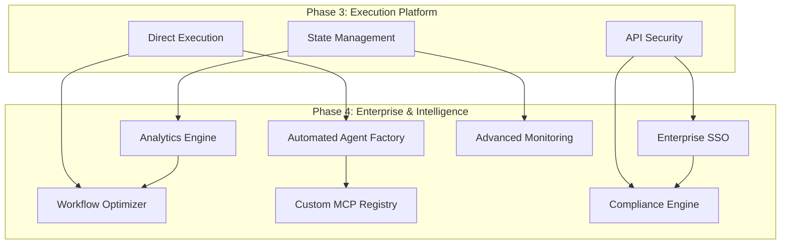

# PromptCraft-Hybrid: Phase 4 Overview

Version: 2.0
Status: Updated for v7.0 Architecture
Audience: Executives, Architects, Technical Leads

## Executive Summary

Phase 4 of PromptCraft-Hybrid represents the continuous expansion and maturation phase, transforming the platform into an enterprise-ready, self-improving system. This phase focuses on scalability, observability, automated agent creation, and enterprise-grade features while maintaining the 7-week delivery constraint.

### Key Achievements

- **Automated Agent Creation** - CLI tools and templates for rapid agent deployment
- **Advanced Analytics** - Comprehensive usage analytics and performance insights
- **Enterprise Security** - SSO integration, audit logging, compliance reporting
- **Workflow Optimization** - ML-based workflow improvement suggestions
- **Custom Integrations** - Plugin system for organization-specific MCP servers
- **Production Monitoring** - Advanced observability with Grafana and alerting

## 1. Strategic Vision

### 1.1. Phase Evolution

Phase 4 implements **Continuous Enhancement and Enterprise Readiness**. This involves:

* **Automated Agent Creation** - CLI tools and templates for rapid agent deployment
* **Advanced Analytics** - Comprehensive usage analytics and performance insights
* **Enterprise Security** - SSO integration, audit logging, compliance reporting
* **Workflow Optimization** - ML-based workflow improvement suggestions
* **Custom Integrations** - Plugin system for organization-specific MCP servers
* **Production Monitoring** - Advanced observability with Grafana and alerting

### 1.2. Key Architectural Evolution (Phase 4)

Phase 4 transforms the platform into an enterprise-ready, self-improving system:



**Key Principle**: Phase 4 focuses on automation, intelligence, and enterprise needs while maintaining the rapid delivery approach established in previous phases.

## 2. Core Technologies & Dependencies (Phase 4 Additions)

| Technology/Service | Role | Target Version | Source/Justification |
|:-------------------|:-----|:---------------|:---------------------|
| **PostgreSQL** | Analytics Database | 15-alpine | Structured data for analytics and audit logs |
| **Grafana** | Monitoring Dashboard | Latest | Visual monitoring and alerting |
| **Prometheus** | Metrics Collection | Latest | Time-series metrics for observability |
| **Keycloak** | Enterprise SSO | Latest | SAML/OAuth2 identity provider integration |
| **MLflow** | ML Model Management | Latest | Workflow optimization model tracking |
| **Typer** | CLI Framework | Latest | Agent creation and management CLI |
| **Alembic** | Database Migrations | Latest | Schema evolution for analytics DB |
| **Celery** | Background Tasks | Latest | Async processing for analytics |
| **Nginx** | Load Balancer | Latest | Production load balancing and SSL termination |

## 3. Deployment Architecture (Phase 4)

Phase 4 adds enterprise infrastructure while maintaining performance and security.

```mermaid
graph TD
    subgraph "Production Infrastructure"
        subgraph "Load Balancing Layer"
            LB[Nginx Load Balancer<br/>(SSL Termination)]
            CF[Cloudflare CDN/Security]
        end

        subgraph "Application Layer"
            API[FastAPI Gateway<br/>(Multi-Instance)]
            UI[Gradio UI<br/>(Multi-Instance)]
            Z[Zen MCP Server<br/>(Multi-Instance)]
        end

        subgraph "MCP Ecosystem"
            H[Heimdall MCP]
            GH[GitHub MCP]
            CI[Code Interpreter MCP]
            HITL[Human-in-Loop MCP]
            CUSTOM[Custom MCP Registry]
        end

        subgraph "Data Layer"
            Q[Qdrant Vector DB]
            R[Redis Cluster]
            PG[PostgreSQL<br/>(Analytics)]
            ML[MLflow Server]
        end

        subgraph "Security & Auth"
            KC[Keycloak SSO]
            VAULT[HashiCorp Vault]
            AUTH[Auth Proxy]
        end

        subgraph "Monitoring & Observability"
            PROM[Prometheus]
            GRAF[Grafana]
            JAEGER[Jaeger Tracing]
            LOG[Centralized Logging]
        end
    end

    CF --> LB
    LB --> API & UI
    API --> Z & H & GH & CI & HITL & CUSTOM
    Z --> Q & R & PG
    API --> KC & VAULT

    %% Monitoring connections
    API --> PROM
    UI --> PROM
    Z --> PROM
    PROM --> GRAF
    API --> JAEGER
    Z --> JAEGER
```

### 3.1. Enterprise Infrastructure Components

**Load Balancing & Security**:
- Nginx for SSL termination and load balancing
- Cloudflare for CDN and DDoS protection
- Multiple application instances for high availability

**Authentication & Authorization**:
- Keycloak for enterprise SSO (SAML/OAuth2)
- HashiCorp Vault for secrets management
- Authentication proxy for unified security

**Monitoring & Observability**:
- Prometheus for metrics collection
- Grafana for visualization and alerting
- Jaeger for distributed tracing
- Centralized logging with structured logs

**Data & Analytics**:
- PostgreSQL for analytics and audit data
- MLflow for ML model management
- Enhanced Redis clustering for performance

## 4. Success Metrics & Quality Gates

### 4.1. Phase 4 Success Metrics

**Automation Metrics**:
- Agent creation time: < 5 minutes (from template to deployment)
- CLI adoption rate: 80% of development teams using agent factory CLI
- Template effectiveness: 95% of generated agents pass validation without modification

**Analytics & Intelligence**:
- Dashboard adoption: 100% of users accessing analytics within 30 days
- Workflow optimization: 20% improvement in average task completion time
- ML model accuracy: 85% accuracy in workflow optimization suggestions

**Enterprise Integration**:
- SSO adoption: 100% enterprise users using SSO within 48 hours
- Audit compliance: 100% of actions logged with complete audit trail
- Custom MCP integration: Support for 5+ organization-specific MCP servers

**Performance & Reliability**:
- System availability: 99.9% uptime (8.76 hours downtime/year maximum)
- Response time: p95 < 2s for all API endpoints
- Concurrent users: Support 1000+ concurrent enterprise users

### 4.2. Enterprise Quality Gates

**Security Requirements**:
- [ ] All components pass OWASP ZAP security scan
- [ ] SOC2 compliance requirements validated
- [ ] Penetration testing completed with no critical findings
- [ ] All secrets managed through HashiCorp Vault

**Performance Requirements**:
- [ ] Load testing validates 1000 concurrent users
- [ ] Database performance optimized for analytics queries
- [ ] Monitoring alerts configured for all critical thresholds
- [ ] Disaster recovery tested with < 4 hour RTO

**Integration Requirements**:
- [ ] SSO integration tested with major identity providers
- [ ] Custom MCP plugin system documented and tested
- [ ] Analytics dashboard accessible to all user roles
- [ ] CLI tools documented with complete usage examples

## 5. Timeline & Milestones (Phase 4)

### Week 12: Enterprise Infrastructure
- Deploy Nginx load balancer with SSL termination
- Set up Keycloak for enterprise SSO integration
- Implement HashiCorp Vault for secrets management
- Configure Prometheus and Grafana monitoring

### Week 13: Analytics & Intelligence
- Deploy PostgreSQL analytics database
- Implement comprehensive usage analytics
- Set up MLflow for workflow optimization models
- Create analytics dashboard in Grafana

### Week 14: Automation Tools
- Develop agent factory CLI with Typer
- Create agent templates and scaffolding
- Implement custom MCP registry system
- Test automated agent deployment pipeline

### Week 15: Enterprise Features
- Complete SSO integration with audit logging
- Implement compliance reporting and data export
- Deploy custom MCP plugin system
- Performance optimization and load testing

### Week 16: Production Readiness
- Final security audit and penetration testing
- Complete disaster recovery testing
- Documentation and training materials
- Go-live preparation and production deployment

## 6. Risk Assessment

### 6.1. Technical Risks

**High Priority**:
- **SSO Integration Complexity**: Enterprise identity providers vary significantly
- **Analytics Database Performance**: Large-scale analytics queries may impact performance
- **Custom MCP Security**: Third-party MCP servers introduce security vectors

**Medium Priority**:
- **CLI Tool Adoption**: Development teams may prefer existing tools
- **ML Model Training**: Workflow optimization requires sufficient training data
- **Load Balancer Configuration**: Complex routing rules for multi-service architecture

**Mitigation Strategies**:
- Early prototype testing with major identity providers
- Database sharding and read replicas for analytics workload
- Comprehensive security review process for custom MCP servers
- Gradual rollout with feature flags and monitoring

### 6.2. Business Risks

**Timeline Constraints**:
- 5-week delivery window remains challenging for enterprise features
- Dependency on external services (Keycloak, HashiCorp Vault)
- Integration testing with enterprise systems requires coordination

**User Adoption**:
- Enterprise users may resist new authentication flows
- CLI tools require training and documentation
- Analytics dashboards need to provide clear business value

**Mitigation Strategies**:
- Parallel development streams to maximize efficiency
- Early user feedback sessions with enterprise stakeholders
- Comprehensive training and support documentation
- Gradual feature rollout with opt-in capabilities

## 7. Future Evolution

Phase 4 establishes the foundation for continuous platform evolution:

**Immediate Next Steps** (Post-Phase 4):
- Advanced AI model fine-tuning based on usage patterns
- Mobile application for on-the-go prompt crafting
- Advanced compliance features (GDPR, HIPAA, etc.)

**Long-term Vision**:
- Self-healing infrastructure with automated incident response
- Marketplace for community-contributed agents and templates
- Integration with additional enterprise tools (ServiceNow, Jira, etc.)

The enterprise-ready platform positions PromptCraft-Hybrid as a scalable, intelligent solution for organization-wide AI workflow automation.
