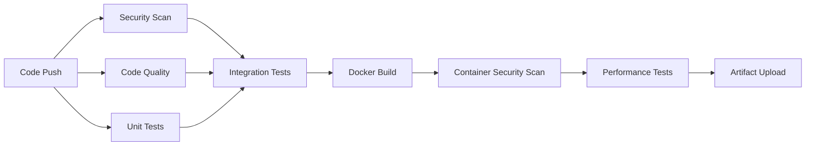
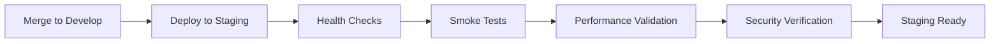
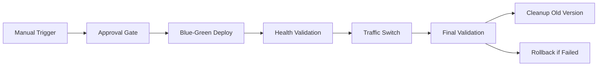

# Updated CI/CD Pipeline Design

Version: 3.0
Status: Proposed
Date: 2025-07-04

## Executive Summary

This document proposes an enhanced CI/CD pipeline that builds upon our current security-focused approach while adding comprehensive staging and production deployment capabilities, performance testing, and automated rollback mechanisms.

## Current State vs. Proposed State

### Current Limitations
- ❌ No staging deployment workflow
- ❌ No production deployment workflow  
- ❌ Limited to unit testing only
- ❌ Docker builds but never deploys
- ❌ No performance/load testing
- ❌ No automated rollback capability
- ❌ No environment-specific configuration management

### Proposed Enhancements
- ✅ Multi-environment deployment (dev/staging/prod)
- ✅ Integration and E2E testing pipeline
- ✅ Performance testing with thresholds
- ✅ Automated deployment with health checks
- ✅ Blue-green deployment strategy
- ✅ Automated rollback on failure
- ✅ Environment-specific secrets management
- ✅ Comprehensive monitoring integration

## Pipeline Architecture

### Stage 1: Continuous Integration (Enhanced)
**Triggers:** PR to main, develop, or release branches

#### New Jobs Added:
1. **Integration Testing**
   - Database integration tests
   - External API mocking tests
   - MCP server integration tests
   - Qdrant vector store tests

2. **Performance Testing**
   - Load testing with configurable thresholds
   - Memory usage profiling
   - Response time validation
   - Resource consumption monitoring

3. **Enhanced Container Security**
   - Multi-stage vulnerability scanning
   - SBOM (Software Bill of Materials) generation
   - License compliance checking
   - Container hardening validation

### Stage 2: Staging Deployment (New)
**Triggers:** Merge to develop branch

#### Features:
- **Automated deployment** to staging environment
- **Database migrations** with rollback capability
- **Environment-specific configuration** injection
- **Comprehensive health checks** across all services
- **Automated smoke testing** of critical user journeys
- **Performance baseline** validation

### Stage 3: Production Deployment (Enhanced)
**Triggers:** Manual workflow_dispatch with approval gates

#### Features:
- **Blue-green deployment** strategy for zero-downtime
- **Multi-stage approval** gates with designated approvers
- **Automated health checks** with configurable thresholds
- **Gradual traffic switching** (10% → 50% → 100%)
- **Automatic rollback** on failure detection
- **Real-time monitoring** integration

## Implementation Plan

### Phase 1: Foundation (Week 1)
- [ ] Create environment-specific workflow files
- [ ] Set up staging environment configuration
- [ ] Implement enhanced health check endpoints
- [ ] Add integration test framework

### Phase 2: Testing Enhancement (Week 2)
- [ ] Add performance testing pipeline
- [ ] Implement comprehensive integration tests
- [ ] Add container security scanning
- [ ] Set up test data management

### Phase 3: Deployment Automation (Week 3)
- [ ] Implement blue-green deployment workflow
- [ ] Add automated rollback mechanisms
- [ ] Set up environment-specific secrets
- [ ] Configure monitoring integration

### Phase 4: Production Readiness (Week 4)
- [ ] Add production deployment workflow
- [ ] Implement approval gates and notifications
- [ ] Set up alerting and monitoring
- [ ] Create operational runbooks

## Security Enhancements

### Enhanced SAST/DAST
- **Static Application Security Testing** with multiple tools
- **Dynamic Application Security Testing** on staging
- **API security testing** with automated penetration testing
- **Dependency vulnerability tracking** with SLA requirements

### Secrets Management
- **Environment-specific secrets** with rotation policies
- **Least-privilege access** for deployment workflows
- **Audit logging** for all secret access
- **Automated secret scanning** in all environments

### Compliance & Governance
- **Change approval workflows** with audit trails
- **Deployment rollback** testing and validation
- **Security baseline** enforcement across environments
- **Compliance reporting** for SOC2/PCI requirements

## Monitoring & Observability

### Application Monitoring
- **Real-time performance metrics** (response times, throughput)
- **Error rate tracking** with alerting thresholds
- **Resource utilization** monitoring (CPU, memory, disk)
- **Custom business metrics** (user engagement, AI model performance)

### Infrastructure Monitoring
- **Container health** and resource consumption
- **Network performance** and latency tracking
- **Database performance** and query optimization
- **External dependency** health monitoring

### Alerting Strategy
- **Tiered alerting** (Info → Warning → Critical → Emergency)
- **Smart routing** to on-call teams based on severity
- **Automated escalation** for unacknowledged alerts
- **Integration** with Slack, PagerDuty, and email

## Environment Strategy

### Development Environment
- **Feature branch** deployments for testing
- **Automated provisioning** and teardown
- **Isolated testing** with mock external dependencies
- **Developer self-service** deployment capabilities

### Staging Environment
- **Production-like** configuration and data
- **Automated testing** against real external services
- **Performance validation** with production-scale data
- **Security testing** with realistic attack scenarios

### Production Environment
- **High availability** with multiple availability zones
- **Automated scaling** based on demand
- **Disaster recovery** with automated failover
- **Zero-downtime deployments** with health validation

## Rollback Strategy

### Automated Rollback Triggers
- **Health check failures** (HTTP 5xx rates > 5%)
- **Performance degradation** (response time > 2x baseline)
- **Error rate spikes** (error rate > 1% for 5 minutes)
- **Resource exhaustion** (memory/CPU > 90% for 10 minutes)

### Rollback Process
1. **Immediate traffic redirect** to previous healthy version
2. **Database rollback** to last known good state (if applicable)
3. **Configuration restoration** from backup
4. **Automated notification** to development team
5. **Post-incident analysis** triggered automatically

## Success Metrics

### Deployment Metrics
- **Deployment frequency**: Target 10+ deployments/week
- **Lead time**: From commit to production < 4 hours
- **Mean time to recovery**: < 30 minutes for rollbacks
- **Change failure rate**: < 5% of deployments require rollback

### Quality Metrics  
- **Test coverage**: Maintain > 80% across all modules
- **Security scan pass rate**: 100% for critical/high findings
- **Performance regression**: 0 deployments with >20% slowdown
- **Availability**: 99.9% uptime across all environments

## Risk Mitigation

### Technical Risks
- **Database migration failures**: Automated backup and rollback
- **External service dependencies**: Circuit breakers and fallbacks
- **Container registry failures**: Multi-region replication
- **Network partitions**: Health check redundancy

### Operational Risks
- **Human error in deployments**: Automation and approval gates
- **Insufficient testing coverage**: Comprehensive test requirements
- **Security vulnerabilities**: Multi-layer scanning and validation
- **Performance regressions**: Automated performance testing

## Next Steps

1. **Review and approval** of this design document
2. **Environment setup** for staging and production
3. **Workflow implementation** following the phased approach
4. **Team training** on new deployment processes
5. **Gradual rollout** with careful monitoring and validation

---

*This design prioritizes security, reliability, and developer experience while maintaining our commitment to high-quality, automated deployments.*