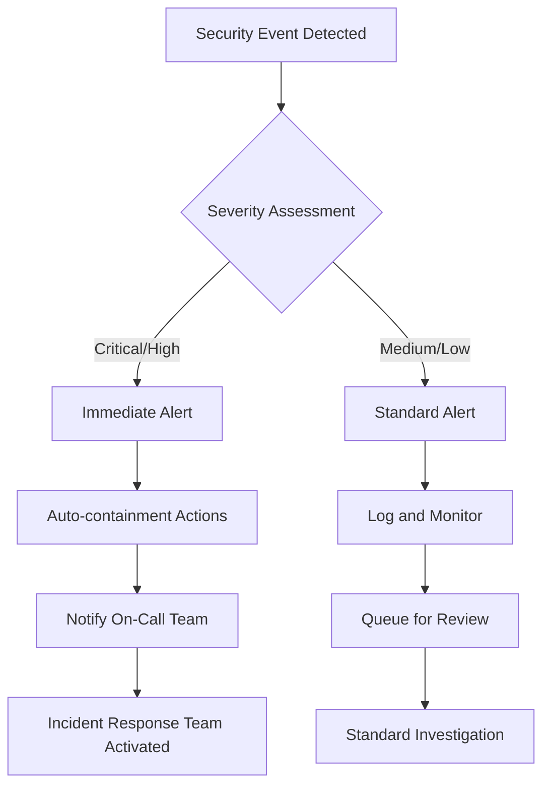

# Security Incident Response Procedures

## Overview

This document outlines comprehensive procedures for responding to security incidents in the PromptCraft Hybrid system. It provides structured workflows for incident detection, classification, containment, eradication, and recovery.

## Incident Classification System

### Severity Levels

#### **Critical (P0)**
- **Response Time**: Immediate (< 15 minutes)
- **Examples**: Data breach, system compromise, service unavailable
- **Escalation**: Immediately notify all stakeholders

#### **High (P1)**
- **Response Time**: < 1 hour
- **Examples**: Authentication bypass, privilege escalation, significant data exposure
- **Escalation**: Notify security team and management within 30 minutes

#### **Medium (P2)**
- **Response Time**: < 4 hours
- **Examples**: Failed login attempts, suspicious activity patterns, minor data exposure
- **Escalation**: Log incident and notify security team

#### **Low (P3)**
- **Response Time**: < 24 hours
- **Examples**: Policy violations, configuration drift, informational alerts
- **Escalation**: Standard logging and review process

### Incident Types

1. **Authentication Incidents**
   - Brute force attacks
   - Account takeover attempts
   - Failed authentication spikes
   - Service token compromise

2. **Access Control Incidents**
   - Privilege escalation attempts
   - Unauthorized resource access
   - Permission bypass attempts
   - Role manipulation

3. **Data Security Incidents**
   - Data exfiltration attempts
   - Unauthorized data access
   - Data integrity violations
   - Privacy breaches

4. **System Security Incidents**
   - Malware detection
   - System compromise
   - Configuration tampering
   - Service disruption

## Automated Response Workflows

### 1. Detection and Initial Response



### 2. Containment Actions by Incident Type

#### Authentication Incidents
- **Account Lockout**: Automatically lock compromised accounts
- **IP Blocking**: Block suspicious IP addresses for 1-24 hours
- **Rate Limiting**: Apply aggressive rate limiting to affected endpoints
- **Session Termination**: Invalidate all sessions for compromised accounts

#### Access Control Incidents
- **Permission Revocation**: Remove elevated permissions immediately
- **Role Suspension**: Temporarily suspend affected user roles
- **Resource Isolation**: Isolate accessed resources from network
- **Audit Trail Lock**: Secure audit logs for forensic analysis

#### Data Security Incidents
- **Data Classification**: Immediately classify exposed data sensitivity
- **Access Monitoring**: Enhanced monitoring of data access patterns
- **Backup Isolation**: Isolate backups to prevent lateral movement
- **Legal Notification**: Trigger legal/compliance notification workflow

## Manual Escalation Procedures

### Security Team Contact Tree

```
Primary Contact: Security Lead
├── Email: security@company.com
├── Phone: [REDACTED]
├── Slack: #security-incidents
└── Backup: Deputy Security Lead

Management Escalation:
├── CTO (for P0/P1 incidents)
├── CEO (for data breaches)
├── Legal (for compliance issues)
└── PR/Communications (for external impact)
```

### Escalation Decision Matrix

| Incident Type | Severity | Auto-Escalate | Manual Review | Management |
|---------------|----------|---------------|---------------|------------|
| Authentication | P0/P1 | ✅ Immediate | - | Within 1hr |
| Authentication | P2/P3 | - | ✅ Within 4hrs | Daily digest |
| Access Control | P0/P1 | ✅ Immediate | - | Within 30min |
| Access Control | P2/P3 | - | ✅ Within 4hrs | Daily digest |
| Data Security | Any | ✅ Immediate | - | Within 15min |
| System Security | P0/P1 | ✅ Immediate | - | Within 1hr |
| System Security | P2/P3 | ✅ Within 1hr | - | Daily digest |

## Response Team Roles and Responsibilities

### Incident Commander (IC)
- **Primary Role**: Overall incident coordination and decision-making
- **Responsibilities**:
  - Assess incident severity and classify appropriately
  - Coordinate response team activities
  - Authorize containment and recovery actions
  - Communicate with stakeholders and management
  - Ensure proper documentation and post-incident review

### Security Analyst
- **Primary Role**: Technical investigation and analysis
- **Responsibilities**:
  - Analyze security events and logs
  - Identify attack vectors and indicators of compromise
  - Perform forensic analysis of affected systems
  - Document technical findings and evidence

### System Administrator
- **Primary Role**: System containment and recovery actions
- **Responsibilities**:
  - Execute containment procedures (blocking IPs, isolating systems)
  - Perform system recovery and hardening
  - Coordinate with infrastructure teams
  - Validate system integrity post-incident

### Communication Lead
- **Primary Role**: Internal and external communication coordination
- **Responsibilities**:
  - Manage stakeholder communications
  - Coordinate with legal/compliance teams
  - Handle customer/user notifications if required
  - Manage public relations aspects if incident is public

## Integration Points with Existing Systems

### Security Event Logging Integration
- **System**: PromptCraft Security Logger (`SecurityLogger`)
- **Integration**: All incident response actions logged as security events
- **Event Types**:
  - `INCIDENT_DETECTED`
  - `INCIDENT_ESCALATED`
  - `CONTAINMENT_ACTION_TAKEN`
  - `INCIDENT_RESOLVED`

### Alert Engine Integration
- **System**: Security Alert Engine (`AlertEngine`)
- **Integration**: Incident responses trigger appropriate alerts
- **Notification Channels**:
  - Slack: `#security-incidents` channel
  - Email: Security team distribution list
  - Webhook: External SIEM/SOAR platform integration

### Monitoring Dashboard Integration
- **System**: Security Dashboard (`SecurityDashboard`)
- **Integration**: Real-time incident status display
- **Features**:
  - Active incidents counter
  - Response time metrics
  - Team assignment status
  - Resolution timeline

### Audit Service Integration
- **System**: Audit Service (`AuditService`)
- **Integration**: Incident actions included in compliance reports
- **Reporting**: Monthly incident summary reports for compliance

## Standard Operating Procedures (SOPs)

### SOP 1: Brute Force Attack Response

1. **Detection**: Failed login threshold exceeded (>50 attempts/hour)
2. **Immediate Actions**:
   - Lock affected account(s)
   - Block source IP address
   - Log incident with severity P2
3. **Investigation**:
   - Analyze attack patterns and source
   - Check for successful authentications
   - Review associated user activity
4. **Communication**:
   - Notify affected user via secure channel
   - Document findings in incident report
5. **Resolution**:
   - Implement additional monitoring
   - Update blocking rules if needed
   - Schedule follow-up review in 24 hours

### SOP 2: Suspicious Data Access Response

1. **Detection**: Unusual data access patterns or volumes
2. **Immediate Actions**:
   - Tag session for enhanced monitoring
   - Log incident with severity P1
   - Notify security team immediately
3. **Investigation**:
   - Analyze access patterns and timing
   - Verify user identity and authorization
   - Check for data exfiltration indicators
4. **Containment** (if confirmed):
   - Revoke user session and permissions
   - Block further data access
   - Isolate affected data stores
5. **Communication**:
   - Escalate to management within 30 minutes
   - Prepare legal notification if required
   - Document all actions taken

### SOP 3: Account Takeover Response

1. **Detection**: Account takeover indicators detected
2. **Immediate Actions**:
   - Lock account immediately
   - Terminate all active sessions
   - Block associated IP addresses
   - Log incident with severity P0
3. **Investigation**:
   - Forensic analysis of account activity
   - Identify compromise vector
   - Assess scope of unauthorized access
4. **Communication**:
   - Immediate notification to user via alternate channel
   - Escalate to management within 15 minutes
   - Prepare customer communication if needed
5. **Recovery**:
   - Coordinate with user for account recovery
   - Implement additional security measures
   - Monitor for follow-up attacks

## Response Time Requirements

### Initial Response Times
- **P0 (Critical)**: 15 minutes maximum
- **P1 (High)**: 1 hour maximum
- **P2 (Medium)**: 4 hours maximum
- **P3 (Low)**: 24 hours maximum

### Containment Time Requirements
- **Active Attacks**: 30 minutes maximum for initial containment
- **Account Compromise**: 15 minutes maximum for account lockout
- **Data Exposure**: 1 hour maximum for access restriction
- **System Compromise**: 2 hours maximum for isolation

### Resolution Time Targets
- **P0 Incidents**: 4 hours for full resolution
- **P1 Incidents**: 24 hours for full resolution
- **P2 Incidents**: 72 hours for full resolution
- **P3 Incidents**: 7 days for full resolution

## Post-Incident Activities

### Immediate Post-Incident (Within 2 hours)
1. **Incident Status Update**: Confirm incident containment
2. **Stakeholder Notification**: Update all relevant parties
3. **Evidence Preservation**: Secure all logs and forensic data
4. **Initial Assessment**: Preliminary impact and root cause analysis

### Short-term Post-Incident (Within 24 hours)
1. **Detailed Investigation**: Complete forensic analysis
2. **Impact Assessment**: Full scope of incident impact
3. **Preliminary Report**: Initial findings and actions taken
4. **System Hardening**: Implement immediate security improvements

### Long-term Post-Incident (Within 7 days)
1. **Post-Incident Review**: Team retrospective and lessons learned
2. **Final Report**: Comprehensive incident documentation
3. **Process Improvements**: Update procedures based on findings
4. **Training Updates**: Revise training materials if needed

## Compliance and Regulatory Considerations

### Data Breach Notification Requirements
- **GDPR**: 72 hours to regulatory authority, without undue delay to data subjects
- **CCPA**: Without unreasonable delay after discovery
- **Industry Standards**: Follow sector-specific requirements
- **Internal Policy**: 24 hours maximum for internal reporting

### Documentation Requirements
- **Incident Timeline**: Complete chronological record
- **Actions Taken**: All containment and recovery actions
- **Evidence Chain**: Proper forensic evidence handling
- **Communication Log**: All internal and external communications
- **Lessons Learned**: Process improvements and recommendations

### Audit Trail Requirements
- **System Logs**: Preserve all relevant system and security logs
- **Access Logs**: Document all system and data access during incident
- **Communication Records**: Archive all incident-related communications
- **Decision Records**: Document all major decisions and rationale

## Training and Preparedness

### Regular Training Requirements
- **Monthly**: Security incident simulation exercises
- **Quarterly**: Response procedure review and updates
- **Annually**: Comprehensive tabletop exercises
- **Ad-hoc**: Training after significant incidents or process changes

### Skills and Certification Requirements
- **Incident Commander**: SANS incident response certification recommended
- **Security Analyst**: Digital forensics and malware analysis training
- **System Administrator**: System hardening and recovery procedures
- **Communication Lead**: Crisis communication and stakeholder management

### Testing and Validation
- **Response Time Testing**: Monthly automated response time validation
- **Communication Testing**: Quarterly contact tree verification
- **System Testing**: Semi-annual disaster recovery and continuity testing
- **Process Testing**: Annual full-scale incident response simulation

## Contact Information and Resources

### Internal Contacts
- **Security Operations Center**: [INTERNAL_ONLY]
- **IT Infrastructure Team**: [INTERNAL_ONLY]
- **Legal Department**: [INTERNAL_ONLY]
- **Executive Team**: [INTERNAL_ONLY]

### External Resources
- **Law Enforcement**: FBI Internet Crime Complaint Center (IC3)
- **CERT Coordination Center**: US-CERT incident reporting
- **Industry Sharing**: Relevant ISAC organizations
- **Legal Counsel**: External cybersecurity legal specialists

### Emergency Vendors
- **Incident Response**: Pre-contracted IR specialist firm
- **Digital Forensics**: Certified forensics investigation service
- **Legal Services**: Cybersecurity legal advisory firm
- **Public Relations**: Crisis communication specialists

---

## Document Control

- **Version**: 1.0
- **Effective Date**: [DATE]
- **Review Schedule**: Quarterly
- **Owner**: Security Team Lead
- **Approved By**: Chief Information Security Officer

This document is classified as **Internal Use** and should not be shared outside the organization without proper authorization.
