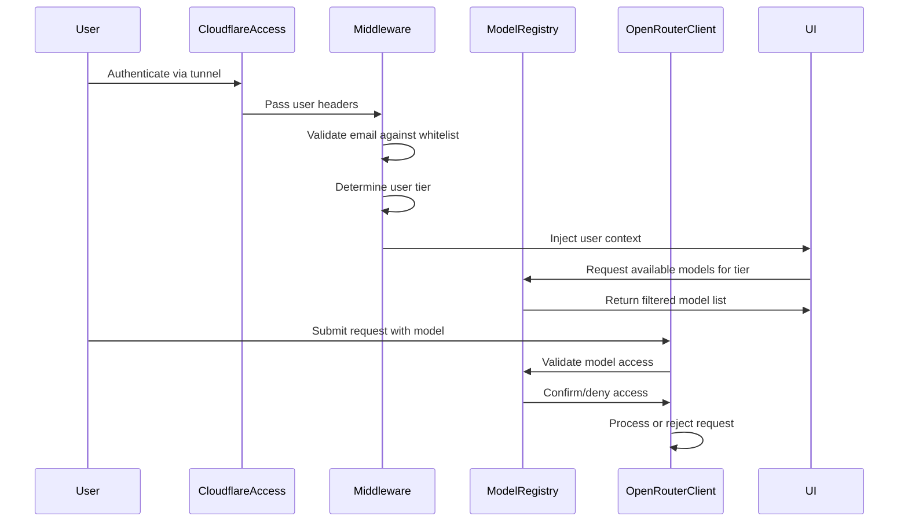

# User Tier System

The PromptCraft-Hybrid application implements a three-tier user access system that controls access to AI models and features based on user classifications. This system integrates with Cloudflare Access authentication to provide secure, role-based access control.

## User Tier Overview

### 🔒 Limited Tier

- **Access Level**: Free models only
- **Available Models**: DeepSeek V3, Gemini 2.0 Flash, Qwen 3 32B, and other free OpenRouter models
- **Use Case**: Basic users, trial accounts, or cost-sensitive environments
- **UI Indicators**: Gray tier badge, restricted model selection options

### ⭐ Full Tier

- **Access Level**: All models (free and premium)
- **Available Models**: All free models plus Claude, GPT-4, GPT-5, premium reasoning models
- **Use Case**: Standard users with full feature access
- **UI Indicators**: Blue tier badge, complete model selection

### 👑 Admin Tier

- **Access Level**: Full administrative access
- **Available Models**: All models plus admin override capabilities
- **Use Case**: System administrators, account managers
- **UI Indicators**: Red tier badge, admin-specific features visible

## Configuration

### Environment Variables

Add these variables to your `.env` file:

```bash
# Authentication Configuration
PROMPTCRAFT_AUTH_ENABLED=true
PROMPTCRAFT_AUTH_MODE=cloudflare_simple

# Email whitelist (required for all users)
PROMPTCRAFT_EMAIL_WHITELIST=user1@example.com,user2@company.com,@trusted-domain.com

# Admin Users (comma-separated)
PROMPTCRAFT_ADMIN_EMAILS=byronawilliams@gmail.com

# Full Users (comma-separated)
PROMPTCRAFT_FULL_USERS=fulluser@example.com,premium@company.com

# Limited Users (comma-separated)
PROMPTCRAFT_LIMITED_USERS=limited@example.com,trial@company.com

# Session Configuration
PROMPTCRAFT_SESSION_TIMEOUT=3600
PROMPTCRAFT_ENABLE_SESSION_COOKIES=true
PROMPTCRAFT_SESSION_COOKIE_SECURE=true
```

### Tier Assignment Logic

1. **Admin Tier**: Explicitly listed in `PROMPTCRAFT_ADMIN_EMAILS`
2. **Full Tier**: Explicitly listed in `PROMPTCRAFT_FULL_USERS`
3. **Limited Tier**: Explicitly listed in `PROMPTCRAFT_LIMITED_USERS` OR default for authorized users not in other tiers

### Email/Domain Patterns

- **Individual emails**: `user@example.com`
- **Domain wildcards**: `@company.com` (allows all emails from that domain)
- **Mixed patterns**: `user1@example.com,@company.com,user2@other.com`

## Technical Implementation

### Architecture Components

1. **Authentication Middleware** (`src/auth_simple/middleware.py`)
   - Validates Cloudflare Access headers
   - Determines user tier from whitelist configuration
   - Injects tier information into request state

2. **Model Registry** (`src/mcp_integration/model_registry.py`)
   - Filters available models based on user tier
   - Provides tier-aware model selection methods
   - Enforces access restrictions

3. **OpenRouter Client** (`src/mcp_integration/openrouter_client.py`)
   - Validates model access before API calls
   - Enforces tier restrictions at the service level
   - Provides fallback logic for unauthorized models

4. **UI Components** (`src/ui/multi_journey_interface.py`)
   - Displays user tier status
   - Shows tier-appropriate model options
   - Provides informational messages about access levels

### Request Flow



## Model Categories

### Free Models (Limited Tier Access)

- `deepseek/deepseek-chat-v3-0324:free` - DeepSeek V3
- `google/gemini-2.0-flash-exp:free` - Gemini 2.0 Flash
- `qwen/qwen3-32b:free` - Qwen 3 32B
- Additional free models from OpenRouter

### Premium Models (Full/Admin Tier Only)

- `anthropic/claude-3-opus` - Claude 3 Opus
- `anthropic/claude-3-sonnet` - Claude 3 Sonnet
- `openai/gpt-4` - GPT-4
- `openai/gpt-5` - GPT-5 (when available)
- Specialized reasoning and analysis models

## Usage Examples

### Adding a New Admin User

1. Add email to `PROMPTCRAFT_ADMIN_EMAILS`:

   ```bash
   PROMPTCRAFT_ADMIN_EMAILS=existing-admin@example.com,new-admin@company.com
   ```

2. Ensure email is also in the general whitelist:

   ```bash
   PROMPTCRAFT_EMAIL_WHITELIST=existing-users@example.com,new-admin@company.com
   ```

3. Restart the application to apply changes

### Bulk User Management with Domain Wildcards

```bash
# Allow all users from company domain as full users
PROMPTCRAFT_EMAIL_WHITELIST=@company.com
PROMPTCRAFT_FULL_USERS=@company.com

# Specific admin from that domain
PROMPTCRAFT_ADMIN_EMAILS=admin@company.com
```

### Testing Tier Access

Use different email addresses in your Cloudflare Access configuration to test each tier:

1. Configure test emails in respective tier environment variables
2. Update Cloudflare Access policy to include test emails
3. Access application with different authenticated emails
4. Verify tier display and model availability in UI

## Security Considerations

### Best Practices

1. **Principle of Least Privilege**: Default users to limited tier
2. **Regular Audit**: Review tier assignments periodically
3. **Secure Configuration**: Use environment variables, never hardcode emails
4. **Session Security**: Enable secure session cookies in production
5. **Monitoring**: Log tier-based access attempts and model usage

### Production Deployment

```bash
# Production security settings
PROMPTCRAFT_SESSION_COOKIE_SECURE=true
PROMPTCRAFT_DEV_MODE=false
PROMPTCRAFT_AUTH_ENABLED=true

# Restrict admin access
PROMPTCRAFT_ADMIN_EMAILS=primary-admin@company.com
```

### Validation

The system includes built-in validation:

- **Email Format**: Validates email addresses and domain patterns
- **Tier Conflicts**: Warns if users are assigned to multiple tiers
- **Whitelist Coverage**: Ensures tier users are in the main whitelist
- **Model Access**: Real-time validation of model requests against user tier

## Troubleshooting

### Common Issues

1. **User Shows as Limited Despite Full Access Configuration**
   - Verify email is correctly spelled in `PROMPTCRAFT_FULL_USERS`
   - Check that email is also in `PROMPTCRAFT_EMAIL_WHITELIST`
   - Confirm Cloudflare Access is passing correct email headers

2. **Premium Models Not Available for Full Users**
   - Check OpenRouter API key configuration
   - Verify model IDs match registry configuration
   - Review application logs for model registry errors

3. **Authentication Failures**
   - Confirm Cloudflare Access is properly configured
   - Check `PROMPTCRAFT_AUTH_ENABLED=true` is set
   - Verify trusted proxy settings if behind load balancer

### Debug Mode

Enable debug logging to troubleshoot tier issues:

```bash
PROMPTCRAFT_LOG_LEVEL=DEBUG
PROMPTCRAFT_DEV_MODE=true  # For development only
```

This will provide detailed logs about:

- Email whitelist validation
- Tier assignment decisions
- Model access checks
- Request processing flow

## Migration from Previous Versions

If migrating from a system without user tiers:

1. **Backup Configuration**: Save current `.env` file
2. **Add Tier Variables**: Update with new tier configuration variables
3. **Classify Existing Users**: Assign existing users to appropriate tiers
4. **Test Thoroughly**: Verify all users maintain expected access levels
5. **Monitor Initially**: Watch logs for unexpected access patterns

The system is designed to be backward compatible - users not explicitly assigned to tiers will default to limited access, ensuring security by default.
